+++
title = "12 طريقة لحماية الملفات والمجلدات"
date = "2014-08-10"
description = "كثير منا يحتاج في بعض الأحيان أو إلى حماية الملفات أو المجلدات سواء كانت شخصية أو سرية أو أي ملفات أخرى، وطبعا تتعدد الطرق والوسائل لفعل هذا منها ما هو ببرامج ومنها بدون برامج. أقدم لكم اليوم 12 طريقة لحماية الملفات والمجلدات حيث تعتبر هذه الطرق من أبسط وأسهل الطرق التي لا تحتاج خبره عالية لتطبيقها."

categories = ["ويندوز",]

tags = ["افهم تكنولوجيا"]

images = ["images/Main.png"]

+++

كثير منا يحتاج في بعض الأحيان إلى حماية الملفات أو المجلدات سواء كانت شخصية أو سرية أو أي ملفات أخرى، وطبعا تتعدد الطرق والوسائل لفعل هذا منها ما هو ببرامج ومنها بدون برامج. أقدم لكم اليوم 12 طريقة لحماية الملفات والمجلدات حيث تعتبر هذه الطرق من أبسط وأسهل الطرق التي لا تحتاج خبره عالية لتطبيقها.

## الطريقة الأولى: كتابة اسم طويل للملف:

يتيح الويندوز كتابة أسماء الملفات بحد أقصى 255 حرف تكمن فائدة هذه الطريقة فى منع الكتابة على الملف بسبب اسمه الطويل وكذلك صعوبة العثور عليه فى برامج البحث.

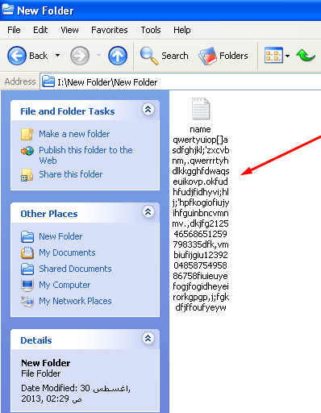

## الطريقة الثانية: تعديل خصائص الملف بحيث يصبح مخفي:

1- أنقر بزر الفأرة الأيمن واختر خصائص Properties.

2- من أمام Attributes قم باختيار Hidden.

3-  اضغط Ok.

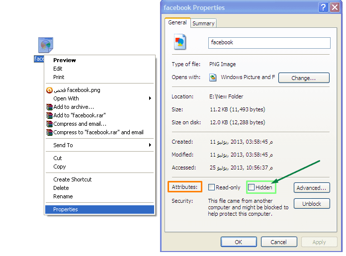

## الطريقة الثالثة:إخفاء اسم الملف:

1- حدد الملف ثم اضغط F2.

2- اضغط Alt+255 ثم Enter.

3- سيتم إخفاء اسم الملف.

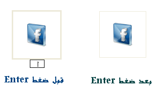

## الطريقة الرابعة:إخفاء ايقونة المجلد:

1- أنقر بزر الفأرة الأيمن واختر خصائص Properties.

2- اختر التبويب Customize.

3- اختر Change Icon.

4- اختر المربع الأبيض الخالي كما في الصورة.

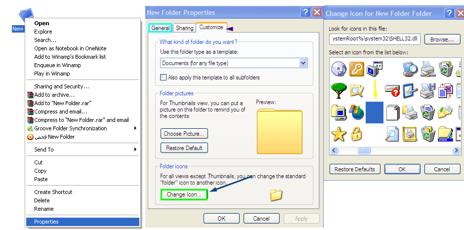

## الطريقة الخامسة: إخفاء ايقونة الملف (برنامج مثلا):

1- أنقر بزر الفأرة الأيمن واختر خصائص Properties.

2- اختر Change Icon.

3- في المربع Look for icons in this file قم بكتابة هذا المسار C:/WINDOWS/System32/Shell32.dll

4- بعد ذلك قم باختيار المربع الأبيض الخالي كما في الطريقة السابقة.

**ملحوظة:بالنسبة للملفات مثل البرامج التي تريد إخفاء ايقونتها يجب أن تكون Shortcut.**

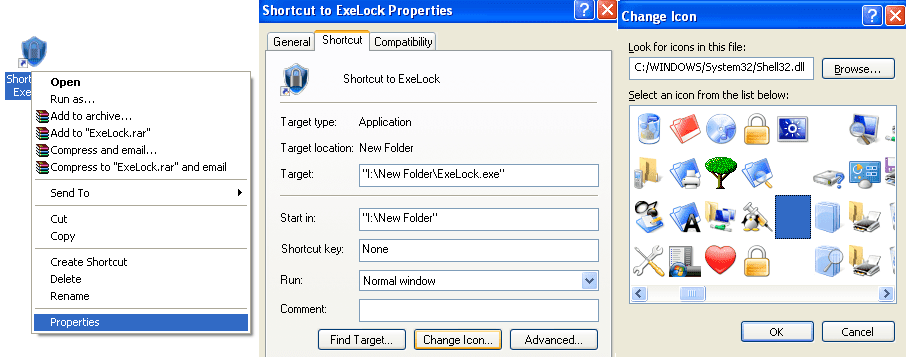

## الطريقة السادسة:تعمية برامج البحث:

يمكن للمستخدم تعمية برامج البحث وذلك عن طريق وضع الملف/المجلد المراد حمايته في مجلد من مجلدات النظام المخفية مثل System Volume Information أو RECYCLER.

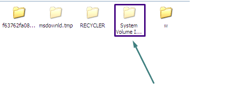

## الطريقة السابعة:إعطاء الملف المراد حمايته امتداد غير امتداده الأصلي:

مثلا أنا أريد حماية صورة ذات امتداد .Png يمكن كتابة امتدادها .dll

ولكن يجب تذكر الامتداد الأصلي للملف لفتحه مرة أخرى.

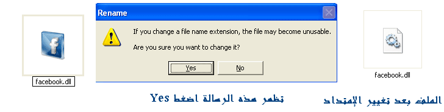

**ملحوظة:قد لا يظهر الامتداد الخاص بالملف وفى هذه الحالة يجب إتباع الخطوات الآتية:**

1- قم بفتح أي نافذة أو مجلد.

2- من قائمة Tools قم باختيار Folder Options.

3- اختر التبويب View.

4- من  Advanced Settings قم بإزالة التحديد عن Hide extensions for known file typesثم اضغط Ok.

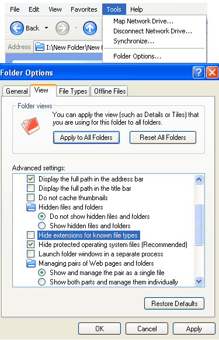

## الطريقة الثامنة:إعطاء الملفات أسماء وهمية:

يمكن إعطاء الملف المراد حمايته اسم وهمي مثل Windows – Book.

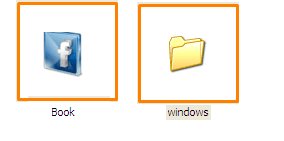

## الطريقة التاسعة:وضع الملفات المهمة على CD/DVD.

طريقة بسيطة وفعالة ولا تحتاج لشرح :)

## الطريقة العاشرة:استخدام أداة Exe Lock لإغلاق الملفات بكلمة سر:

[ExeLock](http://www.kakasoft.com/files/ExeLock.exe) 5.0 هي أداة حجمها 1.45MB وتستطيع من خلالها إغلاق كافة الملفات التنفيذية وملفات الأوفيس و حتى الملفات المضغوطة.

بعد تحميل الأداة قم بتشغيلها ثم اضغط على Select  لتحدد الملف الذي تريد إغلاقه بكلمة سر ثم اكتب كلمة المرور ثم التأكيد واضغط Lock.

لإلغاء كلمة السر من الملف قم بنفس الخطوات السابقة واضغط Unlock.

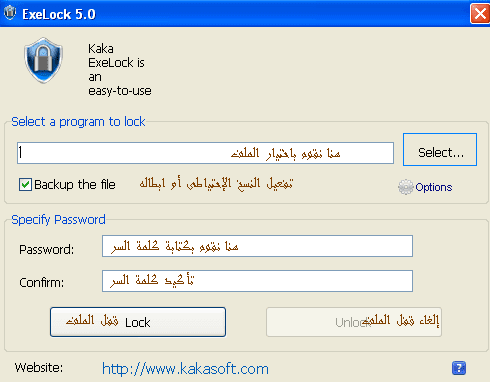

## الطريقة الحادية عشر:استخدام خدمات التخزين السحابي.

 أيضًا لا تحتاج لشرح.

## الطريقة الثانية عشر: إخفاء أقسام القرص الصلب(بدون برامج):

1. قم بفتح Run (Win+R).

2. اكتب gpedit.msc.

3. من الاختيار User Configuration اختر Windows Components.

4. قم باختيار Windows Explorer.

5. اضغط بزر الفأرة الأيسر على Hide these specified drives in my compute.

6. قم بجعل الاختيار Enable ثم اضغط Ok.

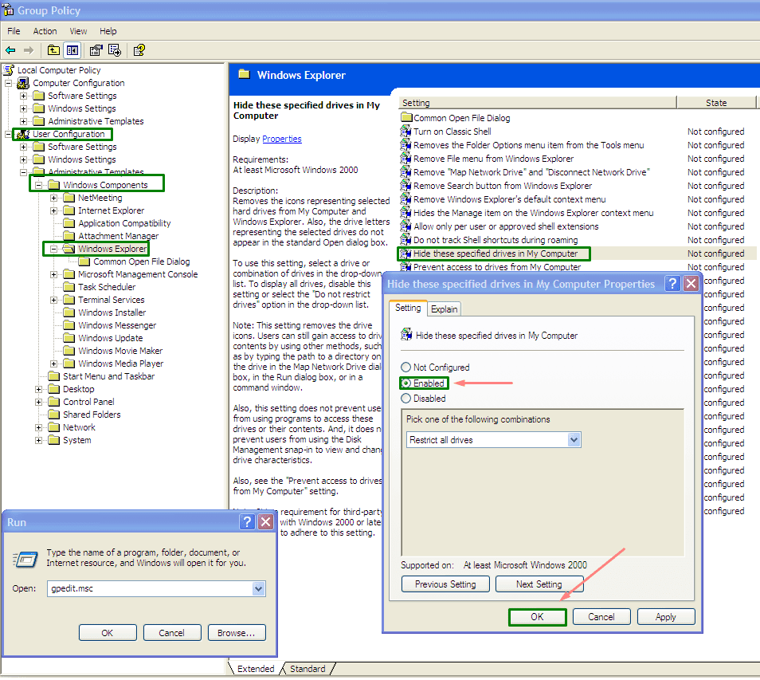

---

هذا المقال نشر باﻷصل على مدونة افهم تكنولوجيا ويمكن الإطلاع عليه [هنا](https://efhamtechnology.blogspot.com/2014/08/protect-files-and-folders.html).

