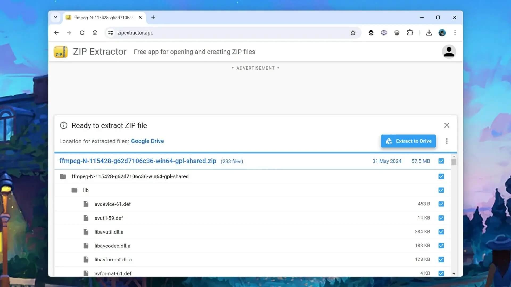

+++
title = "14 أداة مجانية ومفيدة لإنجاز المهام أونلاين"
date = "2024-07-14"
description = "هناك العديد من تطبيقات الويب التي تقدم خدمات متعددة مجانية في جودة برامج سطح المكتب، ويظهر ذلك بشكل واضح مع تقدم متصفحات الويب وتقنياتها مقارنة بالأوقات الماضية حينما كانت المتصفحات محدودة، فيمكن للمستخدم الآن عمل أمور كثيرة ببساطة دون الحاجة إلى تحميل وتثبيت برامج إضافية مثل تحويل ملفات وورد إلى PDF، وتعديل الصور وضغطها وحذف الخلفية منها، والتحويل بين الوحدات، وغيرها. ونرشح لك في السطور القادمة 14 أداة لتجربتها توفر وقتك وجهدك وتساعدك في إنجاز المهام دون الحاجة لبرامج إضافية."
categories = ["مهارات رقمية",]
tags = ["مجلة لغة العصر"]

+++

هناك العديد من تطبيقات الويب التي تقدم خدمات متعددة مجانية في جودة برامج سطح المكتب، ويظهر ذلك بشكل واضح مع تقدم متصفحات الويب وتقنياتها مقارنة بالأوقات الماضية حينما كانت المتصفحات محدودة، فيمكن للمستخدم الآن عمل أمور كثيرة ببساطة دون الحاجة إلى تحميل وتثبيت برامج إضافية مثل تحويل ملفات وورد إلى PDF، وتعديل الصور وضغطها وحذف الخلفية منها، والتحويل بين الوحدات، وغيرها. ونرشح لك في السطور القادمة 14 أداة لتجربتها توفر وقتك وجهدك وتساعدك في إنجاز المهام دون الحاجة لبرامج إضافية.

## 1. تحويل ملفات وورد إلى PDF

من أكثر الأدوات المفيدة الموجودة على الإنترنت أدوات تحويل أنواع وصيغ الملفات مثل تحويل Word إلى PDF، فإذا لم يكن لديك على جهازك لعمل ذلك يمكنك استخدام موقع ILovePDF المميز وسهل الاستخدام، حيث يوفر واجهة سهلة ولا يتطلب أي إعداد، ويمكن من خلاله التعامل مع ملفات PDF وتعديلها وتحويلها من وإلى الأنواع المختلفة.

<https://ilovepdf.com>

## 2. إنشاء الصور المتحركة

هناك أوقات تحتاج فيها إلى إنشاء صورة GIF، ولعمل ذلك بسهولة دون الحاجة إلى أي برنامج خاص يمكنك الاعتماد على موقع Giphy ورفع ملف صورة أو فيديو من جهازك لتحويله أو استخدام رابط وسائط من الإنترنت.

<https://giphy.com/create/gifmaker>

## 3. ضغط الصور

كلما كان حجم الصور أصغر سهل مشاركتها واستخدامها على الإنترنت في البرامج المختلفة مثل تطبيقات التواصل والبريد الإلكتروني، وإذا كنت من مستخدمي الكمبيوتر القدامي فستذكر كيف كان من الصعب ضغط الصور سابقًا، لكن الآن هناك العديد من الأدوات المجانية لضغط الصور بضغطة صور مثل Image Compressor وTinyPNG.

<https://imageresizer.com/image-compressor>  
<https://tinypng.com>

## 4. تعديل ملفات PDF

مرة أخرى مع ملفات PDF لكن هذه المرة نرشح أداة SmallPDF لتعديل الـ PDF من داخل المتصفح وعمل أمور مثل تظليل النص وكتابة التعليقات ورسم الخربشات والأشكال وإضافة الصور والتوقيعات الرقمية.

<https://smallpdf.com>

## 5. فك الملفات المضغوطة

من المهام السهل عملها عبر المتصفح استخراج الملفات المضغوطة. يمكن استخدام أداة extractify.zip التي تعمل على الملفات دون الحاجة لرفعها إلى أي خوادم، أو ZIP Extractor الذي يدعم التعامل مع الملفات المحلية والملفات على تخزين جوجل السحابي كذلك إذا لزم الأمر.

<https://extractify.zip>  
<https://zipextractor.app>

## 6. إنشاء رموز الوصول السريع QR

تُستخدم رموز QR الآن بشكل أكبر من السابق بكثير، وهناك العديد من المواقع التي تساعد على إنشاء رموز QR مثل QRCodeMonkey الذي يوفر واجهة سهلة ومجموعة كبيرة من خيارات تخصيص الرمز.

<https://www.qrcode-monkey.com>

## 7. التحويل بين الوحدات

سابقًا كان هناك العديد من البرامج لتحويل الوحدات على ويندوز وماك وغيرهما، لكن الآن يمكن عمل ذلك عبر أدوات الويب مثل UnitConverters بسهولة عبر واجهة بسيطة ونظيفة.

<https://www.unitconverters.net>

## 8. إضافة علامة مائية إلى الصور

إذا كان لديك مجموعة من الصور التي تحتاج إلى وضع علامات مائية عليها، فأداة iLoveIMG في خدمتك. فقط تحتاج فتح الموقع واختيار الصور التي تريد تعديلها، ثم كتابة النص أو اختيار الصورة التي ترغب في تطبيقها كعلامة مائية، وسيقوم التطبيق بالباقي.

<https://www.iloveimg.com/watermark-image>

## 9. حذف الخلفية من الصور

أحيانا عندما تعمل على شيء تحتاج حذف الخلفية من الصور، وهناك العديد من الأدوات التي تستطيع مساعدتك في ذلك مثل remove.bg، أو تطبيق Canva لتحرير الصور باحترافية وكل ذلك من خلال المتصفح دون الحاجة إلى برامج إضافية.

<https://www.remove.bg>  
<https://www.canva.com>

## 10. استخراج النصوص من الصور

من المهام الشائعة التي نحتاج إليها استخراج النص من الصور، وأداة Image to Text Converter تتيح لك عمل ذلك بسهولة وفي وقت قليل. فقط تحتاج رفع الصورة وانتظار انتهاء التحويل ثم حفظ النص إلى الجهاز أو نسخه إلى الحافظة.

<https://www.imagetotext.info>

## 11. قص الصوتيات

كثيرًا ما نحتاج قص بداية أو نهاية مقطع صوتي، ومع أن هناك العديد من البرامج التي تساعد في عمل ذلك فيظل استخدام أداة عبر المتصفح أسهل بكثير، حيث يمكنك رفع الملف وتحديد الجزء المطلوب وقصه ثم تحميل الملف المعدل.

<https://clideo.com/cut-audio>

## 12. انتقاء الألوان

إذا كنت بحاجة إلى معرفة ما اللون المستخدم في صورة ما بالضبط فأداة RedKetchup Color Picker تساعدك في عمل ذلك بسهولة. يمكنك رفع صورة من جهازك، أو لصق صورة من الحافظة، أو سحب صورة وإسقاطها في نافذة المتصفح، ليتم تحديد اللون المستخدم في أي بيكسل من الصورة.

<https://redketchup.io/color-picker>

## 13. ترجمة النصوص والمستندات

لا بد أنك سمعت يومًا بأداة ترجمة جوجل واستخدمتها، ومع ذلك فهي تستحق أن نذكرها مرة أخرى لنشيد بها وننبه على ميزة ترجمة الصور والمستندات والمواقع الموجودة بها التي لا يعرفها كل مستخدمي الموقع.

<https://translate.google.com>

## 14. العمليات الحسابية

إذا كنت بحاجة إلى إجراء عمليات حسابية من أي نوع فإن موقع Calculator.net يوفر لك جميع ما تحتاج من أدوات مثل الآلة الحاسبة العلمية المتقدمة والحاسبة المالية وحساب السعرات الحرارية والوزن والعديد من الأمور الأخرى.

<https://www.calculator.net>

---

هذا الموضوع نُشر باﻷصل في مجلة لغة العصر العدد 357 شهر 07-2024 ويمكن الإطلاع عليه [هنا](https://drive.google.com/file/d/1BeMUMplG41kj6nVfgkvU4mQHoueNEKVC/view?usp=drive_link).

