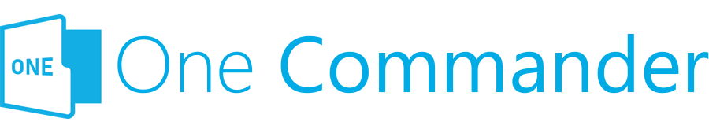
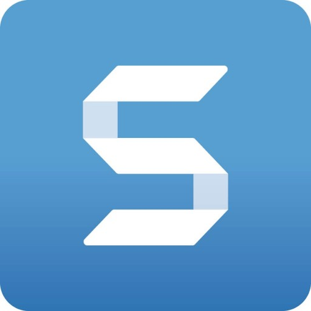
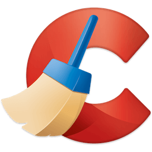
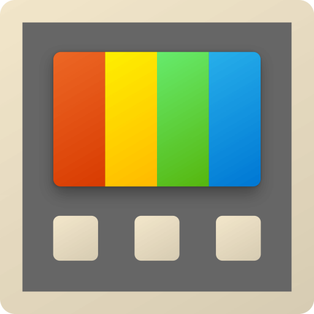
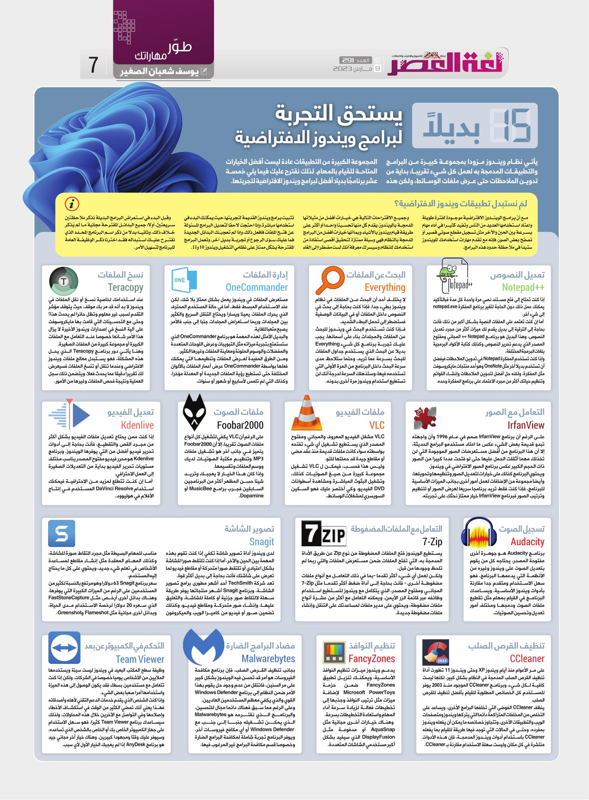

+++
title = "15 بديلًا يستحق التجربة لبرامج ويندوز الافتراضية"
date = "2023-03-13"
description = "يأتي نظام ويندوز مزودًا بمجموعة كبيرة من البرامج والتطبيقات المدمجة به لعمل كل شيء تقريبًا، بداية من تدوين الملاحظات حتى عرض ملفات الوسائط، ولكن هذه المجموعة الكبيرة من التطبيقات عادة ليست أفضل الخيارات المتاحة للقيام بالمهام. لذلك نقترح عليك فيما يلي خمسة عشر برنامَجًا بديلًا أفضل لبرامج ويندوز الافتراضية لتجربتها."
categories = ["مهارات رقمية", "ويندوز"]
tags = ["مجلة لغة العصر"]

+++

يأتي نظام ويندوز مزودًا بمجموعة كبيرة من البرامج والتطبيقات المدمجة به لعمل كل شيء تقريبًا، بداية من تدوين الملاحظات حتى عرض ملفات الوسائط، ولكن هذه المجموعة الكبيرة من التطبيقات عادة ليست أفضل الخيارات المتاحة للقيام بالمهام. لذلك نقترح عليك فيما يلي خمسة عشر برنامَجًا بديلًا أفضل لبرامج ويندوز الافتراضية لتجربتها.

## لم نستبدل تطبيقات ويندوز الافتراضية؟

مع أنّ برامج الويندوز الافتراضية موجودة لفترة طويلة واعتاد استخدامها العديد من الناس وتفيد كثيرًا في أداء مهام بسرعة بين الحين والآخر مثل تسجيل مقطع صوتي قصير أو تصفح بعض الصور، فإنه مع تقدم مهارات استخدامك للويندوز ستبدأ في ملاحظة حدود هذه البرامج.

وجميع الاقتراح التالية هي خيارات أفضل من مثيلاتها المدمجة بالويندوز، يقدم كل منها تحسينًا واحدًا أو أكثر على طريقة قيام ويندوز بالأشياء. وبما أنها خيارت أفضل من البرامج المدمجة بالنظام فهي وسيلة ممتازة لتحقيق أقصى استفادة من استخدامك للنظام، وسيسرك معرفة أنك لست مضطرًا إلى إلغاء تثبيت برامج ويندوز القديمة لتجربتها، حيث يمكنك البدء في استخدامها مباشر وإذا احتجت لاحقًا لتعديل البرامج المسؤولة عن فتح الملفات فافعل ذلك، وإذا لم تعجبك البدائل الجديدة فما عليك سوى الرجوع أو تجربة بديل آخر. وتعمل البرامج المقترحة بشكل ممتاز على نظامي التشغيل ويندوز 10 و11.

وقبل البدء في استعراض البرامج البديلة نذكر ملاحظتين سريعتين. أولاً: جميع البدائل المقترحة مجانية ما لم يُذكر خلاف ذلك. وثانيًا: بدلاً من ذكر اسم البرنامَج المحدد الذي نقترح عليك استبداله فقد اخترنا ذكر الوظيفة العامة للبرنامَج لتسهيل اﻷمر.

## تعديل النصوص: Notepad++

إذا كنت تحتاج إلى فتح مستند نصي مرة واحدة كل مدة فبالتأكيد يمكنك عمل ذلك دون الحاجة لتغير برنامَج المفكرة notepad.exe إلى شيء آخر. 

 أما إن كنت تعتمد على الملفات النصية بشكل أكبر من ذلك فأنت بحاجة إلى الترقية إلى بديل يقدم لك ميزات أكثر من مجرد تعديل النصوص، وهذا البديل هو برنامَج Notepad ++ المجاني ومفتوح المصدر الذي يدعم تحرير النصوص وكذلك كتابة الأكواد البرمجية بلغات البرمجة المختلفة. 

وإذا كنت تستخدم المفكرة Notepad في تدوين الملاحظات فيفضل أن تستخدم بديل آخر مثل OneNote وهو أحد منتجات مايكروسوفت مثل المفكرة، ولكنه حل أفضل لتدوين الملاحظات وإنشاء القوائم وتنظيم حياتك أكثر من مجرد الاعتماد على برنامَج المفكرة وحده.

## البحث عن الملفات: Everything

لا يختلف أحد أن البحث عن الملفات في نظام ويندوز بطيء جدًا، فإذا كنت بحاجة إلى بحث في النصوص داخل الملفات أو في البيانات الوصفية فستضطر إلى تحمل البطء الشديد. 

فإذا كنت تستخدم البحث في ويندوز للبحث عن الملفات والمجلدات بناءً على أسمائها، يجب عليك تجربة برنامَج كل شيء Everything بديل البحث الذي يستخدم جداول الملفات للبحث بسرعة عما تريد، وحتما ستلاحظ مدى سرعة البحث داخل البرنامَج من المرة الأولى التي تستخدمه فيها، وستذهلك السرعة لدرجة أنك لن تستطيع استخدام ويندوز مرة أخرى بدونه.

## إدارة الملفات: OneCommander

مستعرض الملفات في ويندوز يعمل بشكل ممتاز بلا شك، لكن عند الاستخدام المبسط فقط، أما في حالة المستخدم المحترف الذي يحرك الملفات يمينًا ويسارًا ويحتاج التنقل السريع والكثير بين المجلدات وربما استعراض المجلدات جنبًا إلى جنب فاﻷمر يصبح متعبًا للغاية. 

والبديل اﻷمثل لهذه المهمة هو برنامَج OneCommander الذي ستستمتع بتجربة ميزاته مثل التبويبات وعرض اللوحات المتعددة والمفضلات والوسوم الملونة ومعاينة الملفات وغيرها الكثير. 

ومن الطرق المفيدة لعرض الملفات وتنظيمها التي يمكنك فعلها بواسطة OneCommander عرض أعمار الملفات بالألوان المختلفة حتى تستطيع رؤية الملفات الجديدة أو المعدلة مؤخرًا وكذلك التي لم تلمس لأسابيع أو شهور أو سنوات.

## نسخ الملفات: Teracopy

عند استخدامك لخاصية نسخ أو نقل الملفات في ويندوز لا بد أنه قد مر بك موقف حيث يتوقف مؤشر التقدم لسبب غير معلوم وتظل حائرًا لم يحدث هذا؟ وحتى مع التحسينات التي قامت بها مايكروسوفت على آلية النسخ في إصدارات ويندوز الأخيرة لا يزال هذا الأمر شائعا خصوصًا عند التعامل مع الملفات الكبيرة أو مجموعة كبيرة من الملفات الصغيرة. 

وهنا يأتي دور برنامَج Teracopy الذي يحل هذه المشكلة، فهو يستبدل معالج ملفات ويندوز الافتراضي وعندما تنقل أو تنسخ الملفات فسيعرض لك تقريرًا دقيقًا عما يحدث فعلًا ويتضمن ذلك سجل العملية ونتيجة فحص الملفات وغيرها من الأمور.

## التعامل مع الصور: IrfanView

على الرغم أن برنامَج IrfanView صمم في عام 1996 وأن واجهته تبدو قديمة بعض الشيء عكس ما اعتاد مستخدمو البرامج الحديثة، إلا أن هذا البرنامَج من أفضل مستعرضات الصور الموجودة التي لن تخذلك مهما أثقلت الحمل عليها حتى لو فتحت عددًا كبيرة من الصور ذات الحجم الكبير عكس برنامَج الصور الافتراضي في ويندوز.

ويحتوي البرنامَج كذلك على خيارات لتعديل الصور وتنظيمها وتحويلها، وأيضًا مجموعة من الإضافات لعمل بأمور أخرى بجانب الميزات الأساسية للبرنامَج، فإذا كنت فقط تريد برنامَج سريع لعرض الصور أو لتنظيم وترتيب الصور فبرنامَج IrfanView خِيار ممتاز نحثك على تجربته.

## ملفات الفيديو: VLC

VLC مشغل الفيديو المعروف والمجاني ومفتوح المصدر الذي يستطيع تشغيل أي شيء تفتحه بواسطته سواء كانت ملفات قديمة منذ عقد مضى أو مقاطع جيدة قد حملتها للتو.

وليس هذا فحسب، فيمكن ل VLC تشغيل مجموعة كبيرة من صيغ الصوتيات كذلك، وتشغيل البثوث المباشرة ومشاهدة أسطوانات DVD الفيديو، وكي أختصر عليك فهو السكين السويسري لمشغلات الوسائط.

## ملفات الصوت: Foobar2000

على الرغم أن VLC يكفي لتشغيل كل أنواع ملفات الصوت تقريبًا، إلا أن Foobar2000 يتميز في جانب آخر هو تشغيل ملفات MP3 وتنظيم مكتبة الصوتيات لديك ووسم الملفات وتقسيمها.

وإذا كان هذا الخِيار لا يعجبك وتريد شيئًا حسن المظهر أكثر من البرنامَجين السابقين فجرب برامج MusicBee أو Dopamine.

## تعديل الفيديو: Kdenlive

إذا كنت ممن يحتاج تعديل ملفات الفيديو بشكل أكثر من مجرد القص والتقطيع، فأنت بحاجة إلى أدوات تحرير فيديو أفضل مما يوفره الويندوز. وبرنامَج Kdenlive هو محرر فيديو مفتوح المصدر يناسب مختلف مستويات تحرير الفيديو بداية من التعديلات الصغيرة إلى العمل الاحترافي.

أما إن كنت تتطلع لمزيد من الاحترافية فيمكنك استخدام DaVinci Resolve المستخدم في إنتاج اﻷفلام في هوليوود.

## تسجيل الصوت: Audacity

برنامَج Audacity هو جوهرة أخرى مفتوحة المصدر، يحتاجه كل من يقوم بتعديل الصوت على ويندوز وغيره من اﻷنظمة التي يدعمها البرنامَج، فهو سهل الاستخدام ومتقدم جدا مقارنة بأدوات ويندوز اﻷساسية. ويساعدك البرنامَج القيام بمهام مثل تقطيع ملفات الصوت ودمجها ومختلف أمور تعديل وتحسين الصوتيات.

## التعامل مع الملفات المضغوطة: 7-Zip

يستطيع الويندوز فتح الملفات المضغوطة من نوع Zip عن طريق الأداة المدمجة به، التي تفتح الملفات ضمن مستعرض الملفات والتي ربما لم تلحظ وجودها من قبل. 

ولكن لعمل أي شيء أكثر تقدمًا - بما في ذلك التعامل مع أنواع ملفات مضغوطة أخرى - فأنت بحاجة إلى أداة ضغط أكثر تقدمًا مثل 7-Zip المجاني ومفتوح المصدر، والذي يتكامل مع صدفة ويندوز لتستطيع استخدام وظائفه عبر قائمة الزر الأيمن، ويمكنه التعامل مع أكثر من عشرة أنواع ملفات مضغوطة، ويحتوي على مدير ملفات لمساعدتك على التنقل وإنشاء ملفات مضغوطة جديدة.

## تصوير الشاشة: Snagit

لدى ويندوز أداة تصوير شاشة تكفي إذا كنت تقوم بهذه المهمة بين الحين والآخر، أما إذا كنت تلتقط صور للشاشة بشكل اعتيادي أو تلتقط صورًا متحركة أو مقاطع فيديو لما تعرض على شاشتك فأنت بحاجة إلى بديل أكثر قوة. 

تعد شركة TechSmith أحد أشهر مطورى برامج تصوير الشاشة، وبرنامَج Snagit أشهر منتجاتها يوفر طريقة سهلة لالتقاط صور جزئية أو كاملة للشاشة، والتعليق عليها، وإنشاء صور متحركة ومقاطع فيديو، وكذلك تضمين صور أو فيديو من كاميرا الويب والميكروفون مناسب للمهام البسيطة مثل مجرد التقاط صورة للشاشة وكذلك المهام المعقدة مثل إنشاء مقاطع لمساعدة الأشخاص في تعلم شيء جديد، ويحتوي كل ما يحتاج المستخدم. 

سعر برنامَج Snagit 63 دولار وهو مرتفع بالنسبة لكثير من المستخدمين على الرغم من الميزات الكبيرة التي يوفرها. وهناك بدائل أخرى أرخص مثل FastStoneCapture الذي سعره 20 دولار لرخصة الاستخدام مدى الحياة، وبدائل أخرى مجانية مثل Flameshot وGreenshot.

## تنظيف القرص الصلب: CCleaner

على مر الأعوام منذ أيام ويندوز XP وحتى ويندوز 11 تطورت أداة تنظيف القرص الصلب المدمجة في النظام بشكل كبير، لكنها ليست كافية لكل شيء، وبرنامَج CCleaner الموجود منذ 2003 يوفر للمستخدم كل الخصائص المطلوبة للقيام بأفضل تنظيف للقرص الصلب. 

ينظف CCleaner الفوضى التي تخلفها البرامج الأخرى، ويساعد على التخلص من المخلفات المتراكمة دائمًا التي يتركها ويندوز ومتصفحات الويب والتطبيقات الأخرى، وتتجاوز خصائصه ما يمكن أن يفعله ويندوز بمفرده، وحتى في الحالات التي توجد فيها طريقة للقيام بما يفعله CCleaner باستخدام أدوات ويندوز المدمجة، فإن هذه الأدوات منتشرة في كل مكان وليست سهلة الاستخدام مقارنة ب CCleaner.

## تنظيم النوافذ: FancyZones

يدعم ويندوز ميزات تنظيم النوافذ الأساسية، ويمكنك تنزيل تطبيق FancyZones ضمن حزمة Microsoft PowerToys لإضافة ميزات مثل ترتيب النوافذ وجذبها إلى تخطيطات فعالة لزيادة سرعة أداء المهام واستعادة التخطيطات بسرعة. 

وهناك خيارات أخرى مجانية مثل AquaSnap أو مدفوعة مثل DisplayFusion الذي سيفيد بشكل أكبر مستخدمي الشاشات المتعددة.

## مضاد البرامج الضارة: Malwarebytes

بجانب تنظيف القرص الصلب، فإن برنامَج مكافحة الفيروسات هو أمر قد تحسن فيه الويندوز بشكل كبير على مر السنين، فانتقل من عدم وجود حل يقوم بهذا اﻷمر ضمن النظام إلى برنامَج Windows Defender القوي والذي يكفي معظم المستخدمين العاديين. 

وعلى الرغم مما سبق فهناك دائمًا مجال للتحسين، والبرنامَج الذي نقترحه هو Malwarebytes الذي يمكن تشغيله جنبًا إلى جنب مع Windows Defender أو أي مكافح فيروسات آخر. ويوفر البرنامَج تجربة شاملة لمكافحة البرامج الضارة وخصوصًا قسم مكافحة البرامج غير المرغوب فيها.

## التحكم في الكمبيوتر عن بعد: Team Viewer

وظيفة سطح المكتب البعيد في ويندوز ليست سيئة ويستخدمها الملايين من الأشخاص يوميًا خصوصًا في الشركات. ولكن إذا كنت تتعامل مع مستخدمين بسطاء فقد يكون الوصول إلى هذه الميزة واستخدامها أمرًا صعبًا بعض الشيء. 

وإذا كنت الشخص الذي يقدم خدمات الدعم التقني لأهله وأصدقاءه فهذا يعني أنك تمضي الكثير من الوقت في استكشاف الأخطاء وإصلاحها وفي التواصل مع الآخرين خلال هذه المحاولات، ولذلك سيساعدك برنامَج Team Viewer كثيرًا، فهو سهل الاستخدام على جهاز الكمبيوتر الخاص بك أو الخاص بالشخص الذي تساعده، وسيوفر عليك وقتًا ومجهودًا كبيرين. وهناك خيار آخر مجاني جيد هو برنامَج AnyDesk إذا لم يعجبك الخيار الأول لأي سبب.

---

هذا الموضوع نُشر باﻷصل في مجلة لغة العصر العدد 291 شهر 03-2023 ويمكن الإطلاع عليه [هنا](https://drive.google.com/file/d/1rUXZCyGWeM53ZnB1L3KbVJFn9lbz2qra/view?usp=share_link).

