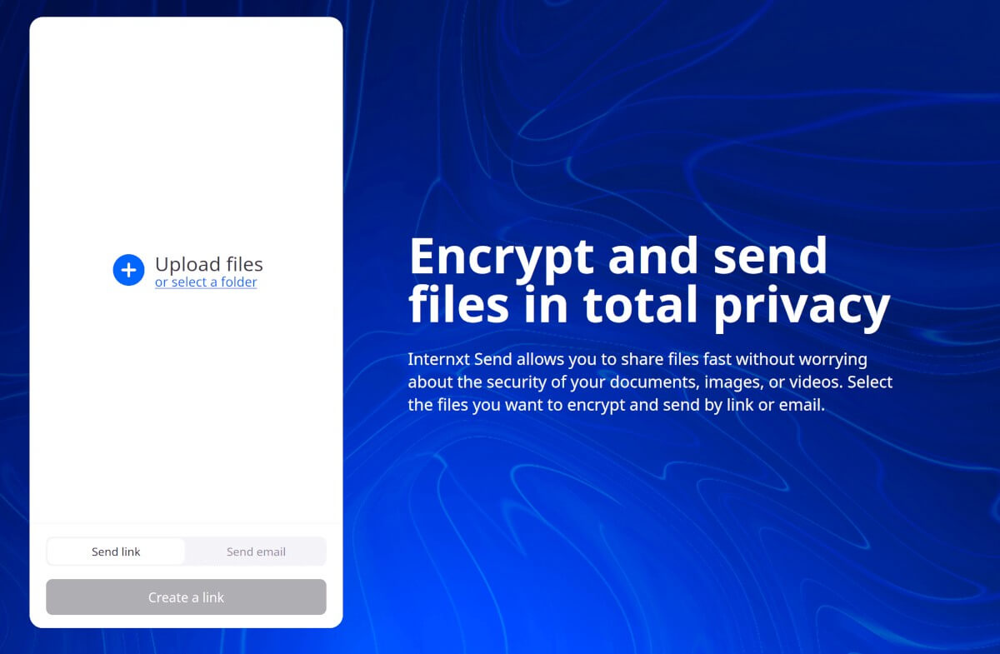
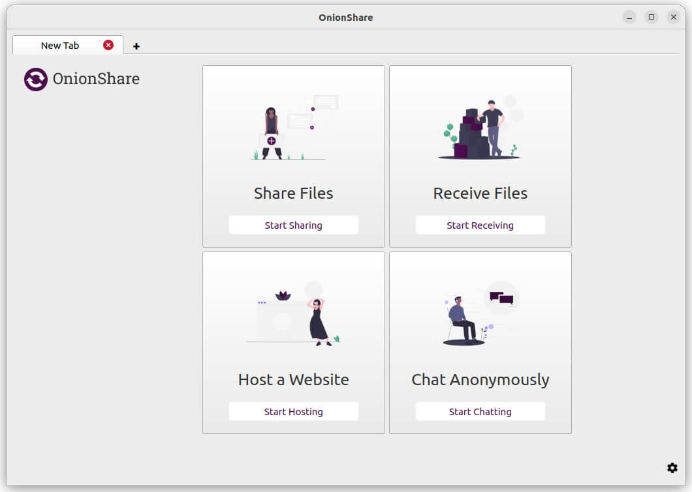
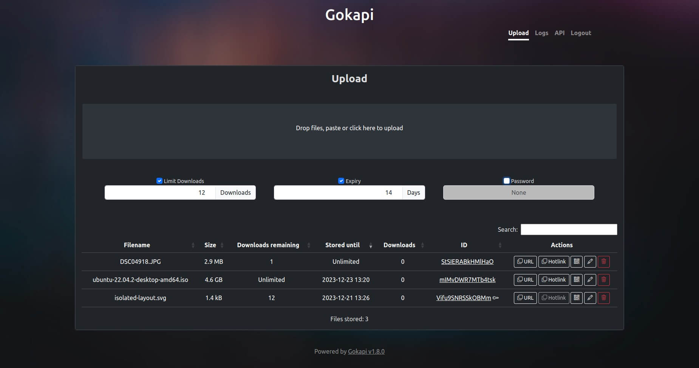
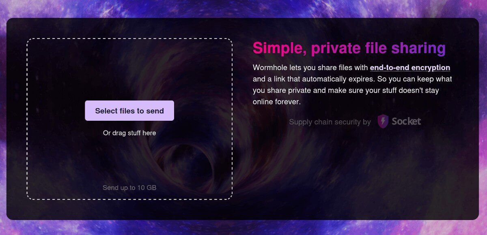
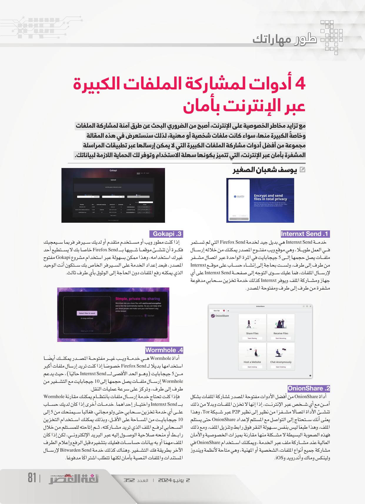

+++
title = "4 أدوات لمشاركة الملفات الكبيرة عبر الإنترنت بأمان"
date = "2024-06-02"
description = "مع تزايد مخاطر الخصوصية على الإنترنت، أصبح من الضروري البحث عن طرق آمنة لمشاركة الملفات وخاصةً الكبيرة منها، سواء كانت ملفات شخصية أو مهنية، لذلك سنستعرض في هذه المقالة مجموعة من أفضل أدوات مشاركة الملفات الكبيرة التي لا يمكن إرسالها عبر تطبيقات المراسلة المشفرة بأمان عبر الإنترنت، التي تتميز بكونها سهلة الاستخدام وتوفر لك الحماية اللازمة لبياناتك."
categories = ["مهارات رقمية",]
tags = ["مجلة لغة العصر"]

+++

مع تزايد مخاطر الخصوصية على الإنترنت، أصبح من الضروري البحث عن طرق آمنة لمشاركة الملفات وخاصةً الكبيرة منها، سواء كانت ملفات شخصية أو مهنية، لذلك سنستعرض في هذه المقالة مجموعة من أفضل أدوات مشاركة الملفات الكبيرة التي لا يمكن إرسالها عبر تطبيقات المراسلة المشفرة بأمان عبر الإنترنت، التي تتميز بكونها سهلة الاستخدام وتوفر لك الحماية اللازمة لبياناتك.

## 1. Internxt Send

خدمة Internxt Send هي بديل جيد لخدمة Firefox Send التي لم تستمر في العمل طويلًا، وهي موقع ويب مفتوح المصدر يمكنك من خلاله إرسال ملفات يصل حجمها إلى 5 جيجابايت في المرة الواحدة عبر اتصال مشفر من طرف إلى طرف. ولست بحاجة إلى إنشاء حساب على موقع Internxt لإرسال الملفات، فمَا عليك سوى التوجه إلى صفحة Internxt Send على أي جهاز ومشاركة الملف. ويوفر Internxt كذلك خدمة تخزين سحابي مدفوعة مشفرة من طرف إلى طرف ومفتوحة المصدر.

### 2. OnionShare

أداة OnionShare من أفضل الأدوات مفتوحة المصدر لمشاركة الملفات بشكل آمن مع أي شخص عبر الإنترنت، إذا إنها لا تخزن الملفات وبدلا من ذلك تنشيء الأداة اتصالًا مشفرًا من نظير إلى نظير P2P عبر شبكة Tor، وهذا يعنى أنك ستحتاج إلى التواصل مع المستلم لإعداد OnionShare حتى يستلم الملف وهذا طبعًا ليس بنفس سهولة النقر فوق رابط وتنزيل الملف، ومع ذلك فهذه الصعوبة البسيطة لا مشكلة منها مقارنة بميزات الخصوصية والأمان العالية عند مشاركة ملف عبر الخدمة، ويمكنك استخدام OnionShare في مشاركة جميع أنواع الملفات،الشخصية أو المهنية، وهي متاحة لأنظمة ويندوز ولينكس وماك وأندرويد وiOS.

## 3. Gokapi

إذا كنت مطور ويب أو مستخدم متقدم أو لديك سيرفر فربما سيعجبك فكرة أن تنشيء موقع شبيه ب Firefox Send خاص بك لا يستطيع أحد غيرك استخدامه، وهذا ممكن بسهولة عبر استخدام مشروع Gokapi مفتوح المصدر. فبعد إعداد الخدمة على السيرفر الخاص بك ستكون أنت الوحيد الذي يمكنه رفع الملفات دون الحاجة إلى الوثوق بأي طرف ثالث.

## 4. Wormhole

أداة Wormhole هي خدمة ويب غير مفتوحة المصدر يمكنك أيضًا استخدامها بديلًا لـ Firefox Send خصوصًا إذا كنت تريد إرسال ملفات أكبر من 5 جيجابايت (وهو الحد الأقصى لـ Internxt Send حاليًا)، حيث يدعم Wormhole إرسال ملفات يصل حجمها إلى 10 جيجابايت مع التشفير من طرف إلى طرف، وتركز على سرعة عمليات النقل. فإذا كنت تحتاج خدمة إرسال ملفات بانتظام يمكنك مقارنة Wormhole بـ Internxt Send واختيار إحداهما.

## خدمات أخرى

إذا كان لديك حساب على أي خدمة تخزين سحابي حتى ولو مجاني، فغالبا سيمنحك من 5 إلى 10 جيجابايت من المساحة على الأقل، وبذلك يمكنك استخدام التخزين السحابي لرفع الملف الذي تريد مشاركته، ثم إتاحته للمستلم من خلال رابط أو منحه صلاحية الوصول إليه عبر البريد الإلكتروني، لكن إذا كان الملف مهمًا أو به بيانات حساسات فعليك بتشفيره قبل الرفع وإعلام الطرف الآخر بطريقة فك التشفير.

وهناك كذلك خدمة Bitwarden Send لإرسال المستندات والملفات النصية بأمان لكنها تتطلب اشتراكًا مدفوعًا.

---

هذا الموضوع نُشر باﻷصل في مجلة لغة العصر العدد 352 شهر 06-2024 ويمكن الإطلاع عليه [هنا](https://drive.google.com/file/d/1KVM6MlqWIazHEr6JN0uU4AsvK3LsteXu/view?usp=drive_link).

