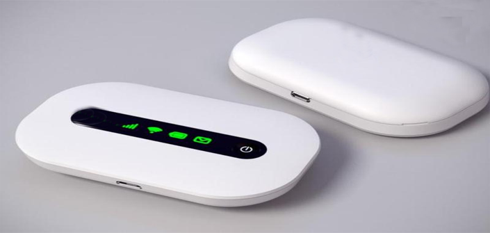
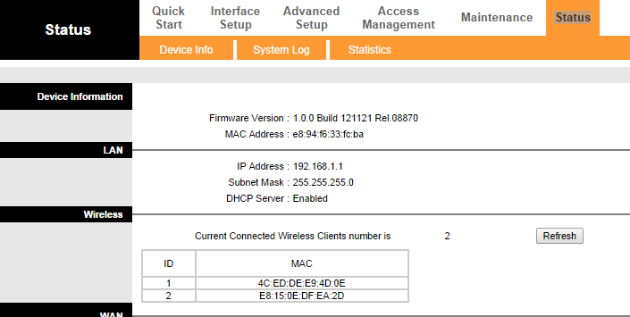
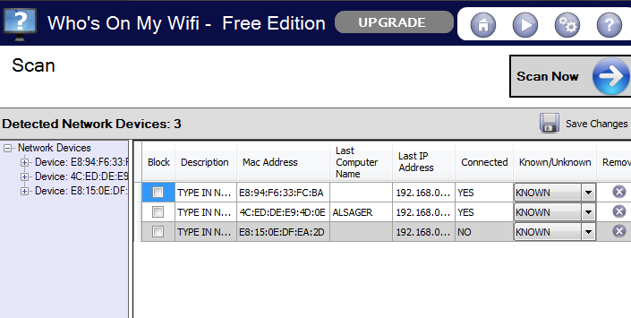
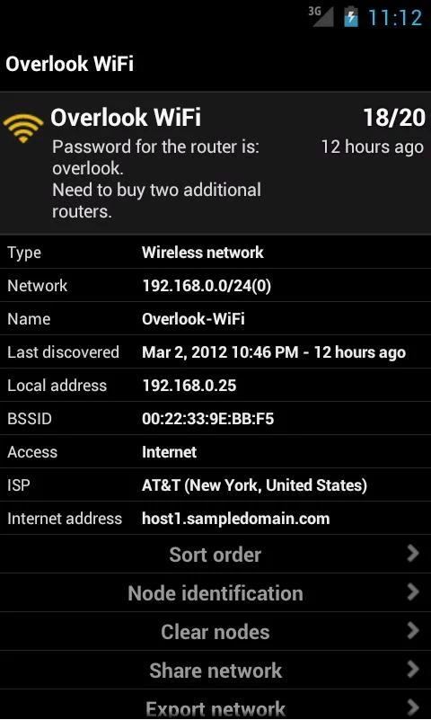

+++
title = "4 طرق لمعرفة إذا كان الراوتر الخاص بك مخترقًا أم لا؟"
date = "2014-10-31"
description = "مع انتشار استخدام الشبكات اللاسلكية بالمنازل تزداد المخاطر التي تكمن في معرفة كلمة السر أو اختراق هذه الشبكات مما قد يؤدى الى تحميل تكاليف إضافية."
categories = ["اﻷمن الرقمي",]
tags = ["موقع لغة العصر"]
images = ["images/2.png"]

+++

مع انتشار استخدام الشبكات اللاسلكية بالمنازل تزداد المخاطر التي تكمن في معرفة كلمة السر أو اختراق هذه الشبكات مما قد يؤدى إلى تحميل تكاليف إضافية للإنترنت وخصوصا المشتركين في الأنظمة محدودة التحميل ولذلك نقدم لك 4 طرق لمعرفة إذا كان الراوتر الواى فاى الخاص بك مخترق أم لا.

## **الطريقة الأولى**

يوجد عزيزي القارئ عدة لمبات إضاءة بالراوتر احداها هي الخاصة بالواى فاى فإذا لاحظت أن الإضاءة تظهر وتختفي في الوقت الذي لا يكون الإنترنت فيه مستخدما من أي جهاز بالمنزل (هاتف ذكي – لاب توب – حاسب شخصي) فقد تكون هذه إشارة إلى أن هناك أحدا غيرك يستخدم الإنترنت الخاص بك.

## **الطريقة الثانية**

عن طريق الدخول الى صفحة اعدادات الراوتر والتي غالبا ما تكون 192.168.1.1 (تجدها مكتوبة على علبة الراوتر)

بعد الدخول الى الصفحة وكتابة اسم المستخدم وكلمة السر قم بالانتقال الى التبويب Status ستجد في القسم Wireless عدد الأجهزة المتصلة بالواى فاى وعناوين MAC Address الخاصة بهم.

## **الطريقة الثالثة**

عن طريق برنامج Who Is On My WiFi وهو برنامج مجاني حجمه 4 ميجا يقوم بالكشف عن جميع المتصلين بالراوتر الخاص بك، يتميز هذا البرنامج بأنه يقوم بعرض الأجهزة المتصلة مع عنواني الاى بي والماك، ثم يقوم بعرض وقت وتاريخ اتصال الجهاز وإذا كان متصلا حاليا أم لا، ليس هذا فحسب بل انه يمكنك من تحديد الأجهزة الخاصة بك كأجهزة معروفة وحينها سيقوم بإعطائك تنبيه إذا قام جهاز غير معروف بالاتصال بالشبكة.

رابط تحميل البرنامج: [من هنا](http://www.whoisonmywifi.com/windows/)

## **الطريقة الرابعة**

باستخدام برنامج Fing -Network Tools للهواتف العاملة بنظام أندرويد:

هذالبرنامَجمج شبيه ببرنامج Who Is On My WiFi ولكنه يختلف عنه في أنه يستطيع جلب أسماء الهواتف المتصلة بالراوتر ويحددها تحديدا دقيقا.

لتحميالبرنامَجمج من [جوجل بلاي](https://play.google.com/store/apps/details?id=com.overlook.android.fing)

## ماذا بعد معرفة إن كان راوتر الواى فاى مخترقا أم لا؟

طبعا عزيزي القارئ الحل الأفضل في هذه الحال هو تغيير كلمة السر في الحال مع تغيير نوعها إلى WPA2 وإغلاق WPS.

**نصائح لعمل كلمة سر قوية**

1. أن تكون كلمة سر مكونة من 8 حروف فأكثر.

2. يمكنك جعل كلمة المرور عبارة مرور "جملة طويلة" إذا كان نظام الراوتر يدعم ذلك.

3. استخدام الرموز الخاصة في لوحة المفاتيح.

4. لا تستخدم كلمات مستخرجة من قاموس لغوي.

5. لا تستخدم أرقام أو حروف متكررة.

---

هذا الموضوع نٌشر باﻷصل على موقع مجلة لغة العصر.

http://aitmag.ahram.org.eg/News/1829.aspx