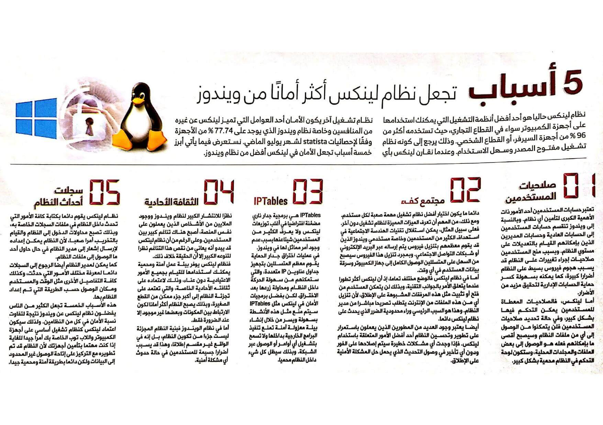

+++
title = "5 أسباب تجعل نظام لينكس أكثر أمانًا من ويندوز"
date = "2022-07-01"
description = "نظام لينكس حاليا هو أحد أفضل أنظمة التشغيل التي يمكنك استخدامها على أجهزة الكمبيوتر سواء في القطاع التجاري، حيث تستخدمه أكثر من 96% من أجهزة السيرفر، أو القطاع الشخصي. وذلك يرجع إلى كونه نظام تشغيل مفتوح المصدر وسهل الاستخدام. وعندما نقارن لينكس بأي نظام تشغيل آخر يكون الأمان أحد العوامل التي تميز لينكس عن غيره من المنافسين ولا سيما نظام ويندوز الذي يوجد على 73% من الأجهزة وفقًا لإحصائيات Statista لشهر ديسمبر 2021. نستعرض فيما يأتي أبرز خمس أسباب تجعل الأمان في لينكس أفضل من نظام ويندوز."
categories = ["اﻷمن الرقمي", "لينكس"]
tags = ["مجلة لغة العصر"]

+++

## مقدمة

نظام لينكس حاليا هو أحد أفضل أنظمة التشغيل التي يمكنك استخدامها على أجهزة الكمبيوتر سواء في القطاع التجاري، حيث تستخدمه أكثر من 96% من أجهزة السيرفر، أو القطاع الشخصي. وذلك يرجع إلى كونه نظام تشغيل مفتوح المصدر وسهل الاستخدام. وعندما نقارن لينكس بأي نظام تشغيل آخر يكون الأمان أحد العوامل التي تميز لينكس عن غيره من المنافسين ولا سيما نظام ويندوز الذي يوجد على 73% من الأجهزة وفقًا لإحصائيات Statista لشهر ديسمبر 2021. نستعرض فيما يأتي أبرز خمس أسباب تجعل الأمان في لينكس أفضل من نظام ويندوز.

## 1- صلاحيات المستخدمين

تعد حسابات المستخدمين أحد الأمور ذات الأهمية الكبرى لتأمين أي نظام. وبالنسبة إلى ويندوز تنقسم حسابات المستخدمين إلى الحسابات العادية وحسابات المُديرين الذين بإمكانهم التعديل على مستوي النظام. وبسبب منح المستخدمين صلاحيات إجراء تغييرات على النظام قد يسبب هجوم فيروس بسيط على النظام أضرارًا كبيرة، كما يمكنه بسهولة كسر حماية الحسابات الإدارية لتحقيق مزيد من الأضرار.

أما لينكس، فالصلاحيات المعطاة للمستخدمين يمكن التحكم فيها بشكل كبير. وفي حالة تحديد صلاحيات المستخدمين فلن يتمكنوا من الوصول إلى أي من ملفات النظام وسيصبح أقصى ما بإمكانهم فعله هو الوصول إلى بعض الملفات والمجلدات المحلية، وستكون لوحة التحكم في النظام محمية بشكل كبير.

## 2- مجتمع كفء

دائمًا ما يكون اختيار أفضل نظام تشغيل مهمة صعبة لكل مستخدم. ومع ذلك، من المهم أن تعرف الميزات المميزة لنظام تشغيل دون آخر. فعلى سبيل المثال، يمكن استغلال تقنيات الهندسة الاجتماعية في استهداف الكثير من المستخدمين ولا سيما مستخدمي ويندوز الذين قد يقوم معظمهم بتنزيل فيروس يتم إرساله عبر البريد الإلكتروني أو شبكات التواصل الاجتماعي. وبمجرد تنزيل هذا الفيروس، سيصبح من السهل على المتسللين الوصول الكامل إلى جهاز الكمبيوتر وسرقة بيانات المستخدم في أي وقت.

أما في نظام لينكس فالوضع مختلف تمامًا، إذ إن لينكس أكثر تطورًا عندما يتعلق الأمر بالجوانب التقنية، وبذلك لن يتمكن المستخدم من فتح أو تثبيت مثل هذه المرفقات المشبوهة على الإطلاق، لأن تنزيل أي من هذه الملفات من الإنترنت يتطلب تصريحًا مباشرًا من مدير النظام. وهذا هو السبب الرئيس وراء محدودية الضرر الذي يحدث على نظام لينكس دائمًا.

أيضًا يعد وجود العديد من المطورين الذين يعملون باستمرار على تطوير وتحسين النظام أحد أفضل الأمور المتعلقة باستخدام لينكس. فإذا وجدت أي مشكلات خطيرة سيتم إصلاحها على الفور ودون أي تأخير في وصول التحديث الذي يحمل حل المشكلة الأمنية على الإطلاق.

## 3- IPTables

IPTables هي برمجية جدار ناري مضمَّنة افتراضيًا في أغلب توزيعات لينكس ولا يعرف الكثير من المستخدمين شيئًا عنها بسبب عدم وجود أمر مماثل لها في ويندوز.

في عمليات اختراق جدار الحماية يقوم معظم المتسللين بتجهيز جداول عناوين IP متعددة التي ستمكنهم من سهولة الحركة داخل النظام ومحاولة زرعها بعد الاختراق. لكن بفضل برمجيات الأمان في لينكس مثل IPTables سيتم منع مثل هذه الأنشطة بسهولة ويسر بواسطة إنشاء بيئة معزولة آمنة تمنع تنفيذ البرامج الخارجية بداخلها ولا تسمح بتشغيل أي أوامر أو الوصول عبر الشبكة. وبذلك سيظل كل شيء داخل النظام محميًا.

## 4- الثقافة الأحادية

نظرًا للانتشار الكبير لنظام ويندوز ووجود الملايين من الأشخاص الذين يعملون على نفس المنصة أصبح هناك تناغم كبير بين المستخدمين. وعلى الرغم من أن نظام لينكس قد يبدو أنه يعاني نقص هذا التناغم نظرًا لتنوعه الكبير إلا أن الحقيقة خلاف ذلك.

فنظام لينكس يوفر بيئة عمل آمنة ومحمية يمكنك استخدامها للقيام بجميع الأمور الاعتيادية دون عناء وذلك لاعتماده على ثقافته الأحادية الخاصة، التي تعتمد على تجزئة النظام إلى أكبر جزء ممكن من القطع الصغيرة وبذلك يصبح النظام أكثر أمانًا لكون الارتباط بين المكونات وبعضها غير موجودًا إلا عند الضرورة فقط.

أما في نظام الويندوز فبنية النظام المجزئة ليست جزءًا من تكوين النظام، بل إنه في الواقع غير مقسم إطلاقًا وهذا قد يسبب أضرارًا جسيمة للمستخدمين في حالة حدوث أي مشكلة أمنية.

## 5- سجلات أحداث النظام

نظام لينكس يقوم دائما بكتابة كافة الأمور التي تحدث داخل النظام في ملفات السجلات الخاصة به، وبذلك تصبح محاولات الدخول إلى النظام والتخريب أمرًا صعبًا، لأن النظام يمكن إعداده لإرسال إشعار إلى مدير النظام في حال حاول أحد ما الوصول إلى ملفات النظام.

كما يمكن لمدير النظام أيضًا الرجوع إلى السجلات دائما لمعرفة مختلف الأمور التي حدثت وكذلك كافة التفاصيل الأخرى مثل الوقت والمستخدم ومكان الوصول حسب الطريقة التي تم إعداد النظام بها.

## خاتمة

هذه الأسباب الخمسة تجعل الكثير من الناس يفضلون نظام لينكس عن ويندوز نتيجة لتفاوت نسبة الأمان في كل من النظامين. ولذلك، سيكون اعتماد لينكس كنظام تشغيل أساسي على أجهزة الكمبيوتر واللاب توب الخاصة بك أمرًا جيدًا للغاية إذا كنت مهتمًا بتأمين أجهزتك لأن النظام قد تم تطويره مع التركيز على إتاحة الوصول غير المحدود إلى البيانات ولكن دائمًا بطريقة آمنة ومحمية جيدًا.

---

هذا الموضوع نُشر باﻷصل في مجلة لغة العصر العدد 256 شهر 07-2022 ويمكن الإطلاع عليه [هنا](https://drive.google.com/file/d/1H8vnWtVPhFX_-bVvq6YhitiEMlkxHHfc/view?usp=sharing).

