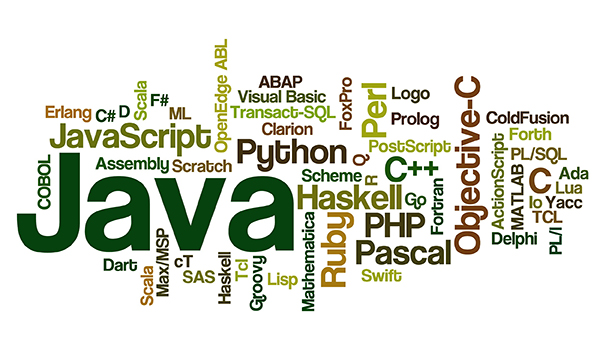

+++
title = "6 أسباب تدفعك لتعلم البرمجة"
date = "2019-03-01"
description = "في الآونة الأخيرة ازدادت أهمية البرمجة وزاد الطلب على المبرمجين على مستوي العالم، إلى جانب ارتفاع رواتب المبرمجين وسهولة الحصول على وظيفة، تجد أنه من الجيد التفكير في تعلم البرمجة، سواء للعمل في هذا المجال، أو كهواية، أو لبدء مشروعك الخاص. فما يميز البرمجة عن العديد من المجالات هو سهولة البدء في تعلمها دون الحاجة لمؤهل معين أو متطلبات محددة، فمصادر تعلم البرمجة متاحة على الإنترنت، العديد منها مجاني وهناك دورات مدفوعة أيضا، كما ستجد المئات من المصادر باللغة العربية إذا كنت تواجه صعوبات مع اللغة الإنجليزية. إليك مجموعة من الأسباب المقنعة التي ستدفعك لتعلم البرمجة."
categories = ["مهارات رقمية", "برمجة",]
tags = ["مجلة لغة العصر"]
images = ["images/0.jpg"]

+++
في الآونة الأخيرة ازدادت أهمية البرمجة وزاد الطلب على المبرمجين على مستوي العالم، إلى جانب ارتفاع رواتب المبرمجين وسهولة الحصول على وظيفة، تجد أنه من الجيد التفكير في تعلم البرمجة، سواء للعمل في هذا المجال، أو كهواية، أو لبدء مشروعك الخاص. فما يميز البرمجة عن العديد من المجالات هو سهولة البدء في تعلمها دون الحاجة لمؤهل معين أو متطلبات محددة، فمصادر تعلم البرمجة متاحة على الإنترنت، العديد منها مجاني وهناك دورات مدفوعة أيضا، كما ستجد المئات من المصادر باللغة العربية إذا كنت تواجه صعوبات مع اللغة الإنجليزية. إليك مجموعة من الأسباب المقنعة التي ستدفعك لتعلم البرمجة.

## 1- يمكنك عمل أي شيء تريده تقريبا!

تمكنك البرمجة من "رقمنة" أفكارك، تخيل أن تكون قادرا على تنفيذ أي فكرة تريدها وتحويلها إلى برنامج يستطيع الملايين من البشر استخدامه بمجرد نشره. ففي كثير من الأحيان، نجد أناس لديهم فكرة لبرنامج أو تطبيق ما يستطيع أن يخلق تغييرا أو يحل مشكلة معينة، لكن بسبب ارتفاع تكلفة البرمجة، وصعوبة تنفيذ الفكرة بنسبة 100% كما يريد صاحبها من قبل المبرمج، لا تري هذه الأفكار النور في نهاية الأمر.
فهل تظن أن مارك زكربيرج مؤسس الفيس بوك كان سينتهي الوضع بفكرته بنفس النجاح الحالي إذا لم يكن قادرا على البرمجة واستعان بمطورين لتنفيذ الفكرة؟ ستكون الإجابة في أغلب الظروف "لا"، وهذا سبب جيد لتعلم البرمجة.
ومن الأشياء المميزة في البرمجة أنه يمكنك عمل "شيء" من "لا شيء" فأنت لا تحتاج إلى مواد وآلات بناء وأماكن للتخزين لتحويل فكرتك إلى مشروع، كل ما تحتاج إليه هو جهاز كمبيوتر وبعض البرامج وكتابة الكود.

## 2- البرمجة ستعلمك الكثير

البرمجة ليست مهمة سهلة كما يتصور البعض، فالتجربة والخطأ والتفكير في حلول للمشكلات يستهلك وقت وجهد كبيرين. لكن ستتعلم من الأخطاء التي ترتكبها، ويصبح تفكيرك أكثر عمقا، ستتعلم أن المبرمج لا يعمل على جزيرة معزولة، فيمكنك دائما طلب المساعدة من المجتمع. لا حاجة للخوف من الفشل في البرمجة، فحقيقة الأمر أن الجميع يفشل لمرات لا حصر لها، ومع كل فشل يكتسب مزيدا من الخبرة، فعن طريق البرمجة ستكتسب طريقة تحليل المشاكل والأخطاء وكيفية حلها.

## 3- البرمجة تجعلك أكثر إبداعا

يفكر المبرمجون بطريقة منظمة جدا، عوضا عن النظر إلى الصورة الكبيرة مباشرة وتجاهل التفاصيل الصغيرة. فعندما يواجه المبرمج مشكلة يجب عليها حلها، فإنه لا يبدأ في كتابة الكود مباشرة، بل يقوم بتجزئة المشكلة إلى وحدات صغيرة، ثم البدء في العمل.
عندما تبدأ بتعلم البرمجة ستقوم بتطوير هذه العادة، فتعمل بطريقة منظمة، وتدريجا ستجد أن عقلك قد أصبح قادرا على تفكيك أي مشكلة إلى أجزاء صغيرة وفهمها بشكل أفضل، ثم ستبدأ في التفكير بطريقة منطقية مما يمكنك من إيجاد حلول أكثر إبداعا من قبل.

## 4- البرمجة تجعل الأشياء أسهل

قبل اختراع الكمبيوتر كانت الحياة أسهل، لكن المهام كانت تتم ببطء شديد، فمثلا في العمل ستجد مجموعة من المهام المملة التي يجب عليك عملها على الكمبيوتر بشكل دوري، عن طريق البرمجة يمكنك "أتمتة" هذه المهمات، والجيد في الأمر أنك لن تحتاج لتعلم عشرات الساعات لعمل برنامج ينفذ هذه المهام البسيطة، لكن كلما زاد التعقيد كلما زادت الحاجة للتعمق أكثر.

## 5- البرمجة تضمن لك فرص عمل

إذا كنت ترغب في الانتقال إلى مسار مهني آخر يجب عليك أن تضع البرمجة في الحسبان، فالطلب على المبرمجين في تزايد شديد. البرمجة ليست مجرد طريق واحد كما هو الحال في أغلب المجالات، يمكنك اختيار مسارك الخاص من عشرات المسارات المختلفة التي تتضمن برمجة الويب وتطبيقات الهاتف وبرامج سطح المكتب والمساعدات الرقمية والذكاء الاصطناعي. وبسبب تعدد المسارات تتوفر الآلاف من الوظائف في العديد من الشركات في كل مكان حول العالم، كما يمكنك العمل من المنزل كمبرمج حر عن طريق عشرات المواقع المتاحة على الإنترنت.

## 6- الربح عن طريق البرمجة ليس وهما

يتمتع المبرمجون بمتوسط مرتبات مرتفع وخاصة في الشركات العالمية، حيث تصل في بعض الأحيان إلى 47 دولار في الساعة! وحتى إذا كنت تتعلم البرمجة لعمل مشروعك الخاص يمكنك تحقيق دخل مادي عن طريقه بخطوات بسيطة حسب طبيعة مشروعك، فيمكنك إضافة الإعلانات أو عمل اشتراك شهري أو نسخ مدفوعة من برنامجك. والسوق العربي به نماذج مشجعة مثل مطور تطبيق "المصمم" على أندرويد وiOS الذي استطاع تحقيق ربع مليون دولار في سنتين فقط.
ولكن الربح لن يأتي بالسهولة التي تتخيلها، فعليك إيجاد فكرة مميزة تقوم بحل أحد المشاكل ويمكنها استقطاب عدد كبير من المستخدمين، وستبدأ حينها بتحقيق النجاح.

## ما اللغة البرمجية التي يجب عليك تعلمها؟

هناك المئات من لغات البرمجة الحية المستخدمة في العديد من المجالات، واختيار لغة البرمجة الأولى يكون دائما قرار صعب للمبتدئين، فيما يلي قائمة بأهم لغات البرمجة الموجودة حاليا ومجالات استخدامها

### Python

بايثون هي لغة برمجة مفتوحة المصدر عالية المستوي، وسهلة التعلم حيث أن طريقة كتابتها مشابهة للإنجليزية بشكل كبير، وتدعم البرمجة كائنية التوجه. تتميز بايثون بالمجتمع الكبير للمطورين وتوفر العديد من المكتبات التي تسهل عملية التطوير.
تعمل بايثون على أغلب المنصات مثل ويندوز ولينكس وماك والعديد من أنظمة التشغيل الأخرى. ويكثر استخدامها في برمجة تطبيقات سطح المكتب وتطوير الويب وأمن المعلومات وال Big Data.
تحتل بايثون حاليا المركز الأول في قائمة لغات البرمجة الأكثر شعبية على موقع GitHub، والمركز الثالث في قائمة موقع TIOBE.

### Java

تعد جافا واحدة من أكثر لغات البرمجة استخداما حول العالم، فستجدها في كل مكان، على أنظمة التشغيل المكتبية وتطبيقات المحمول وبرمجيات الويب. فتتميز بأنها لغة محمولة داعمة للبرمجة كائنية التوجه، يمكنها العمل مع المشاريع الكبيرة بكل سهولة. وتستخدم في برمجة العديد من الأشياء بدءا من البرامج وتطبيقات Android وحتى الألعاب والشبكات.
جافا هي اللغة المتصدرة لقائمة موقع TIOBE، بينما تتواجد في المركز الثاني في قائمة موقع GitHub.

#### JavaScript

جافا سكريبت هي لغة برمجة عالية المستوى تستخدم في متصفحات الويب لإنشاء صفحات أكثر تفاعلية، كما تعمل خارج المتصفحات عن طريق برمجيات مثل Node.js. وهي لغة مستقلة بذاتها ولا علاقة لها بلغة جافا على الرغم من تشابه الاسم.
يمكن عن طريقها عمل أشياء أكثر تعقيدا في صفحات الويب، بدلا من مجرد عرض معلومات بسيطة ساكنة، مثل عرض تغييرات وتحديثات للصفحة، وعمل خرائط تفاعلية ورسومات ثنائية أو ثلاثية الابعاد والتفاعل معها.
تعلم جافا سكريبت هو أمر ضروري لأي مطور ويب بعد إتقان HTML وCSS، كما أنها مطلوبة بشدة في سوق العمل، وهي ثالث أكثر لغة شعبية على موقع GitHub وتحتل المركز السادس في قائمة موقع TIOBE.

إذن تعلم البرمجة يمكنه أن يفتح لك أفاقا جديدة، ويقدم العديد من الميزات التي قد لا تجدها عند تعلم أي مجال آخر. قرر أي المجالات تود أن تتعلم وستجد بنفسك الفائدة التي تعود عليك من تعلم البرمجة. وإذا كنت ترغب في معرفة المزيد عن ترتيب لغات البرمجة الأكثر استخداما لتتيقن من اختيارك يمكنك الرجوع إلى
موقع GitHub http://pypl.github.io/PYPL.html
قائمة موقع TIOBE https://www.tiobe.com/tiobe-index/

---

هذا الموضوع نُشر باﻷصل في مجلة لغة العصر العدد 219 شهر 03-2019 ويمكن الإطلاع عليه [هنا](https//drive.google.com/file/d/1vMolIId6r-lHf8Qi86Bdto_aRde37y8x/view?usp=sharing).

