+++
title = "6 طرق فعالة لخفض درجة حرارة أجهزة الكمبيوتر المحمولة"
date = "2023-11-20"
description = "بخلاف أجهزة الكمبيوتر المكتبية، لا تحتوي أجهزة الكمبيوتر المحمولة دومًا على حلول تبريد متطورة للحفاظ على درجات حرارة وحدة المعالجة المركزية ووحدة معالجة الرسوميات ضمن أفضل حد مقبول للحفاظ على سلامة المكونات، وذلك راجع إلى أسباب أهمها ضيق المساحة المتوفرة نتيجة صغر حجم الجهاز، مما يجعل الحفاظ على برودة أجهزة الكمبيوتر المحمولة أمرًا صعبًا، خاصة وقت أداء المهام الثقيلة. فإذا كنت من مستخدمي الكمبيوتر المحمول وتكافح من أجل خفض درجات المعالج والجهاز عمومًا إليك بعض النصائح التي يمكنك القيام بها لرؤية نتائج فورية وتحسن سريع في درجات حرارة الجهاز."
categories = ["مهارات رقمية",]
tags = ["مجلة لغة العصر"]

+++

بخلاف أجهزة الكمبيوتر المكتبية، لا تحتوي أجهزة الكمبيوتر المحمولة دومًا على حلول تبريد متطورة للحفاظ على درجات حرارة وحدة المعالجة المركزية ووحدة معالجة الرسوميات ضمن أفضل حد مقبول للحفاظ على سلامة المكونات، وذلك راجع إلى أسباب أهمها ضيق المساحة المتوفرة نتيجة صغر حجم الجهاز، مما يجعل الحفاظ على برودة أجهزة الكمبيوتر المحمولة أمرًا صعبًا، خاصة وقت أداء المهام الثقيلة. فإذا كنت من مستخدمي الكمبيوتر المحمول وتكافح من أجل خفض درجات المعالج والجهاز عمومًا إليك بعض النصائح التي يمكنك القيام بها لرؤية نتائج فورية وتحسن سريع في درجات حرارة الجهاز.

## 1. رفع الجهاز عن السطح الموضوع عليه

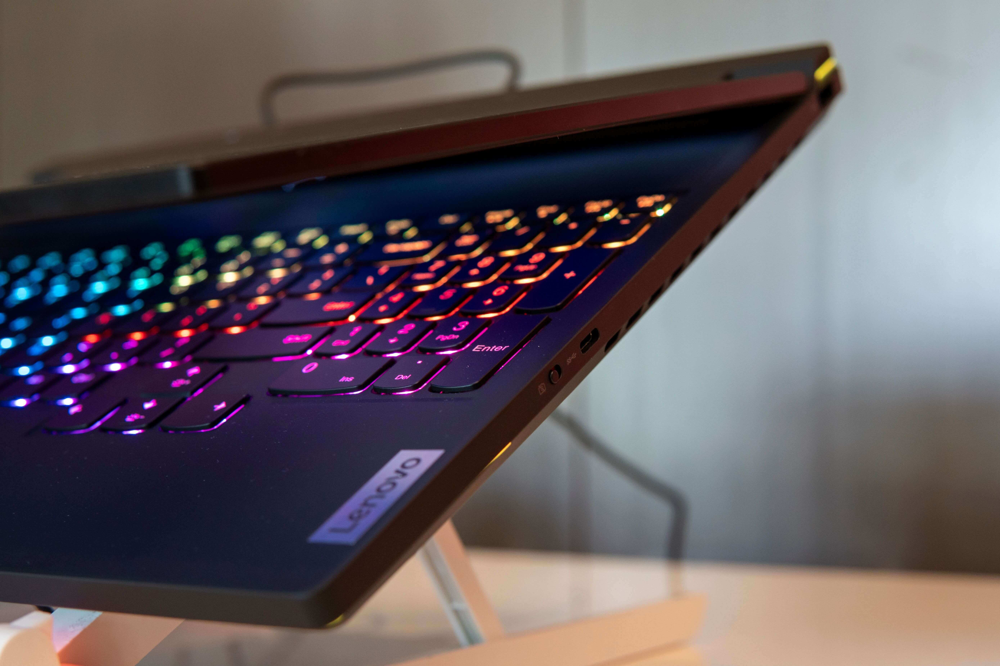

من أهم نصائح خفض حرارة الجهاز التي تأتي في المقام اﻷول رفعه عن الطاولة أو السطح الذي تستخدمه عليه. وبالرغم من أن هذا الأمر بسيط جدًا إلا أن غالب مستخدمي الكمبيوتر المحمول يتجاهلونه خصوصًا عند وضع الجهاز على السرير أو الجسم. فهذا الحل البسيط سيمنح نتائج فورية خاصة إذا كانت تهوية الجهاز موجودة في الأسفل.

ومع أن غالب أجهزة الكمبيوتر المحمولة تحتوي على أقدام مطاطية في الجزء السفلي لرفع القاعدة عن السطح وتوفير مساحة لتدفق الهواء لكن هذه المساحة ليست كافية لتدفق الهواء بكمية كافية تمنح تبريدًا جيدًا. ولذلك سيؤدي رفعك للجهازك إلى إتاحة مساحة أكبر في الأسفل تؤثر بشكل كبير في حرارة الجهاز، خاصة إذا كان لديك جهاز كمبيوتر محمول قديم نسبيًا بأقدام مهترئة أو إذا كنت تستخدم الجهاز على السرير أو موضوعًا على جسمك لفترة طويلة.

ويمكنك شراء حامل كمبيوتر محمول بسيط مناسب لاستخدامك أو حتى استخدام مجموعة كتب لضبط وضع الجهاز بزاوية مائلة تسمح بالتبريد. وإذا كنت تعتقد أن الجهاز ما زال يحتاج إلى تبريد إضافي فيمكنك الاستثمار في شراء لوحة تبريد.

## 2. وضع الجهاز على لوحة تبريد

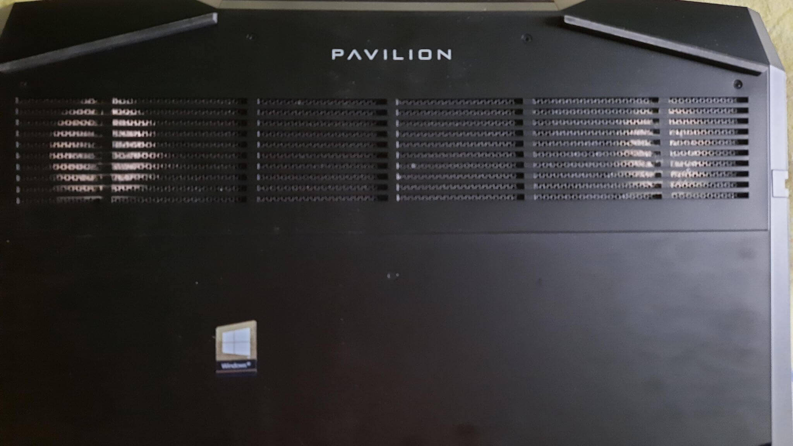

إذا كنت تعتقد أن مراوح التبريد المدمجة في جهازك لا تبرد المكونات الداخلية كفاية ففكر في شراء لوح تبريد خارجي مع أنّها أعلى تكلفة من الحوامل العادية، حيث توفر أمرين هما رفع الكمبيوتر المحمول عن السطح، وإدخال الهواء البارد عبر الفتحات الموجودة أسفل الجهاز. وتعد ألواح التبريد وسيلة فعالة لتقليل درجة حرارة الجهاز حتى لو لم تكن به فتحات تهوية في الجزء السفلي، حيث توجد داخل الجهاز مراوح التبريد مباشرة أسفل سطح المعالج ووحدة الرسوميات، مما يدخل الهواء البارد إليها عند وضع الجهاز على لوح التبريد.

## 3. تنظيف الجهاز

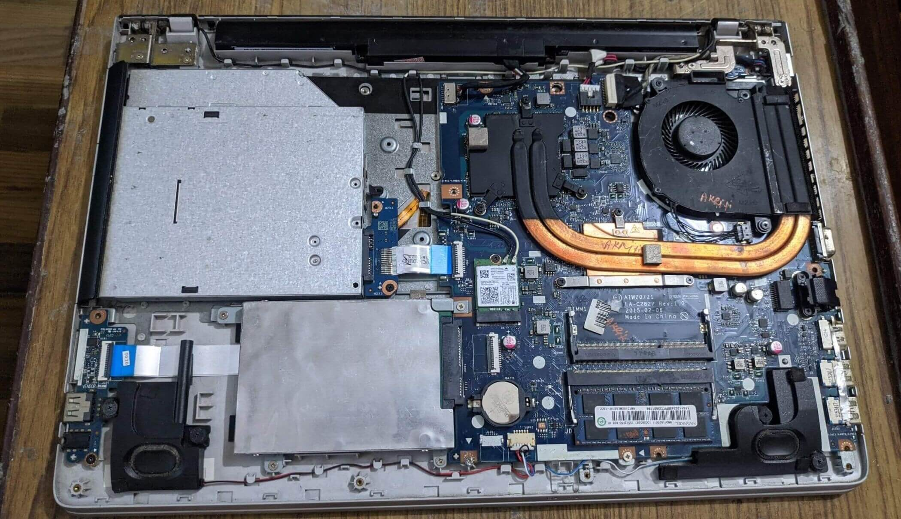

عند الحديث عن خفض درجة حرارة الأجهزة فالتأكد من عدم تغطية الغبار للمكونات هو خطوة أساسية لا تحتاج إلى تفكير. فإذا كنت تستخدم جهاز مضى على شرائه زمنًا ولم ينظف منذ مدّة فعليك بتخصيص بعض الوقت لإجراء صيانة سريعة عبر فتح الغطاء الخلفي للجهاز ثم تنظيف الأجزاء الداخلية باستخدام مضخة هواء أو منظفات مخصصة، وبذلك تضمن عدم وجود غبار أو وبر أو أي شيء آخر يغطي منظمات الحرارة والمكونات الداخلية للجهاز.

وإذا كنت لا تعرف كيفية فتح غطاء الجهاز، أو كنت قلقًا بشأن خسارة ضمان الجهاز عند فتحه، فيمكنك استخدام مضخة الهواء لدفع الهواء داخل فتحات تهوية الجهاز على دفعات قصيرة، وبالرغم من أن هذه الطريقة قد لا تكون فعالة مثل التنظيف الشامل للأجزاء الداخلية إلا إنها ستزيل الغبار والجزيئات الأخرى التي تسد المكونات أو المراوح.

## 4. استبدال المعجون والوسائد الحرارية

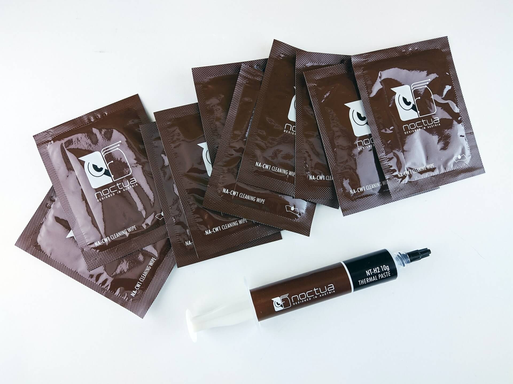

إذا كنت قد فتحت الجهاز فعلًا لعمل تنظيف كامل فيجدر بك التفكير كذلك في استبدال المعجون والوسادات الحرارية لضمان حصول الجهاز على أفضل أداء للتبريد، وستساعد هذه الخطوة حتمًا في حالة اﻷجهزة القديمة، أما الأجهزة الحديثة فتستفيد كذلك من تغيير المعجون الحراري إلى واحد جديد لأن معظم الشركات المصنعة تميل إلى استخدام أرخص خِيار متاح.

ستحتاج لعمل هذه الخطوة إلى فك بعض الأجزاء الداخلية، فإذا كنت لست ذو خبرة بهذه الأمور فيمكنك دائمًا الاستعانة بخبير صيانة لينوب عنك في وضع المعجون الحراري الجديد واستبدال الوسائد الحرارية إن كان هناك حاجة لذلك.

## 5. خفض الجهد الكهربائي

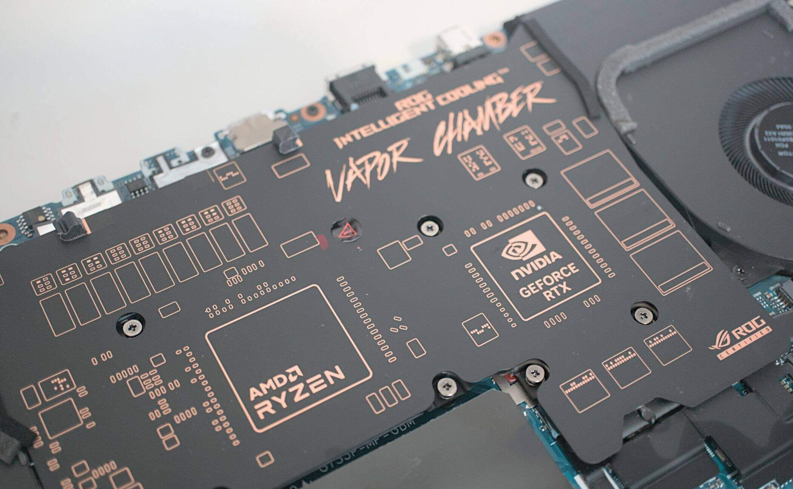

خفض الجهد الكهربي أو Undervolting هي طريقة مجربة ومختبرة لخفض الحرارة عبر تقليل الجهد الداخل إلى المعالج، فهي حل سريع وسهل لخفض درجات حرارة وحدة المعالجة المركزية إذا كنت لا ترغب في فتح الجهاز للتنظيف واستبدال المعجون الحراري.

يمكن لمستخدمي الأجهزة التي تعمل بمعالجات إنتل Intel استخدام أداة Intel Extreme Tuning Utility للتحكم في الجهد، أما مستخدمي معالجات AMD Ryzen فيمكنهم استخدام أداة AMD Ryzen Master، وينصح بالتقليل بنسبة صغيرة أولًا قبل عمل تغييرات كبيرة لتجنب حدوث أعطال أو مشكلات الشاشة الزرقاء.

## 6. استعادة النظام إلى حالة مستقرة

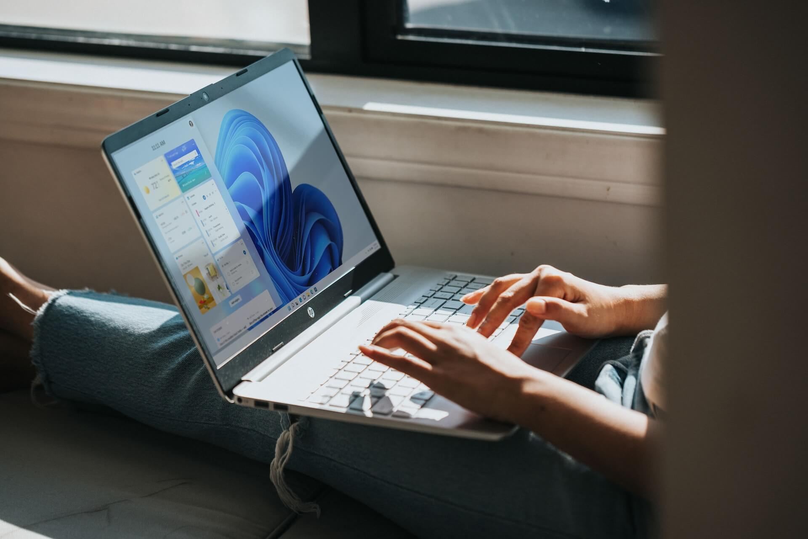

إذا لاحظت ارتفاع في حرارة المعالج وتشك في أن ذلك بسبب شيء قمت به مؤخرًا فيمكن أن تساعدك استعادة النظام في إصلاحه. وتوفر أداة استعادة النظام في نظام ويندوز طريقة سهلة لاستعادة الجهاز إلى الحالة التي كان يعمل فيها بسلاسة بشرط أن تكون قد أنشأت نقطة استعادة مسبقًا. ولاستعادة الجهاز إلى نقطة استعادة تم إنشاؤها مسبقًا قم بما يلي:

- افتح لوحة التحكم Control Panel.

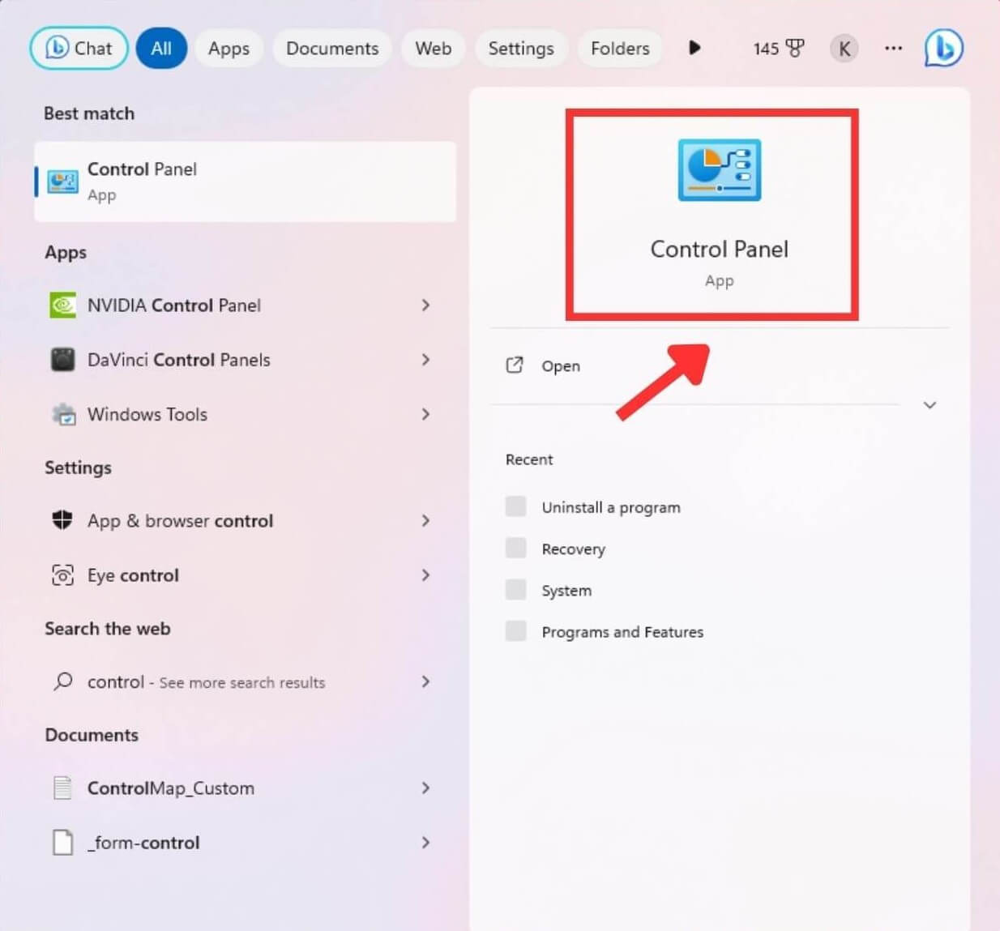

- اختر Recovery ثم Open System Restore.

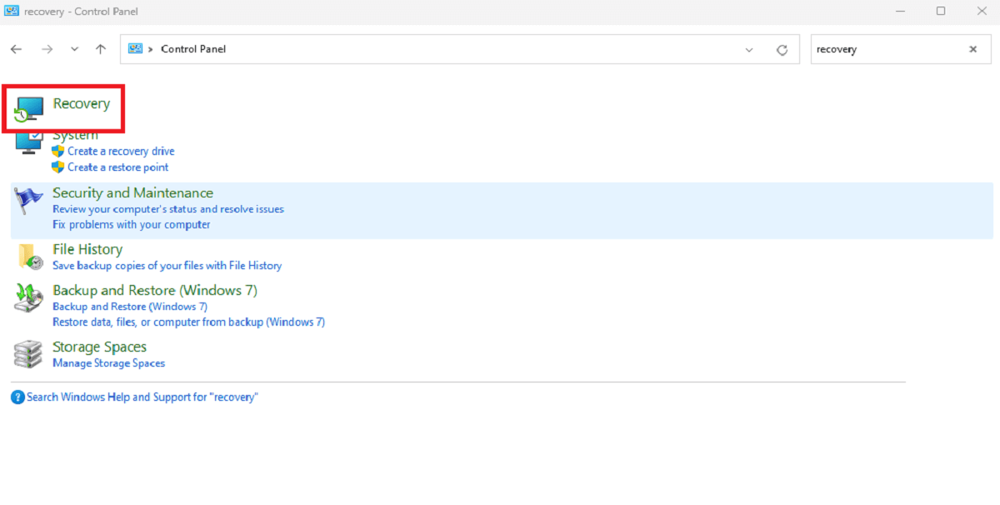

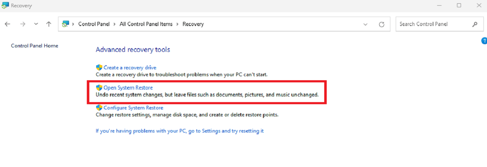

- اضغط التالي Next في قسم Recover System Files and Settings واختر النقطة التي تريد استعادتها.

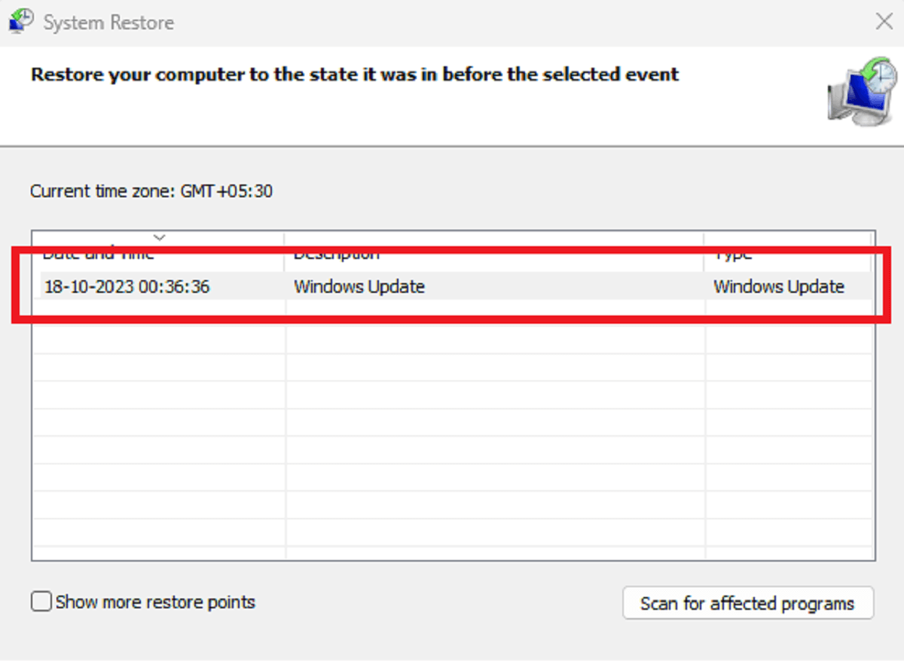

- اتبع التعليمات الظاهرة على الشاشة ﻹكمال الاستعادة.

---

هذا الموضوع نُشر باﻷصل في مجلة لغة العصر العدد 325 شهر 11-2023 ويمكن الإطلاع عليه [هنا](https://drive.google.com/file/d/1zi_4hgRcBpCYLOgd8xx7LP0cXThF62HP/view?usp=drive_link).

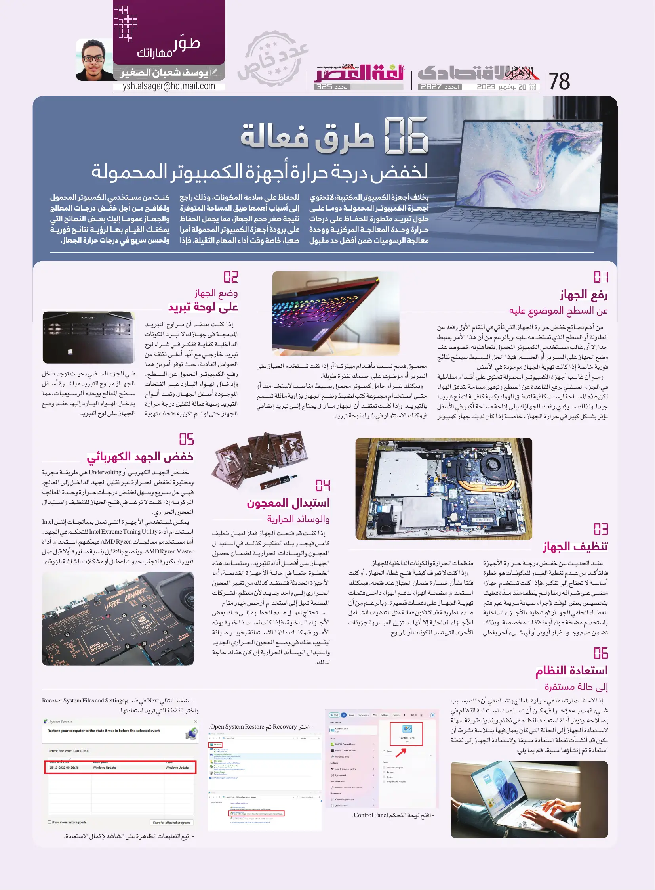
