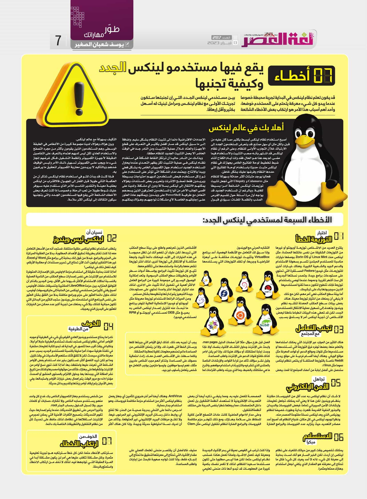

+++
title = "7 أخطاء يقع فيها مستخدمي لينكس الجدد وكيفية تجنبها"
date = "2023-02-19"
description = "قد يكون تعلم نظام لينكس في البداية تجرِبة محبطة خصوصا عندما يبدو كل شيء معركةً يتحتم على المستخدم خوضها، وأحد أهم أسباب هذا اﻷمر هو ارتكاب بعض الأخطاء الشائعة بين مستخدمي لينكس الجدد، التي إن تجنبتها ستكون تجربتك اﻷولى مع نظام لينكس ومراحل تبنيك له أسهل بكثير وأقل إرهاقًا."
categories = ["مهارات رقمية", "لينكس"]
tags = ["مجلة لغة العصر"]

+++

قد يكون تعلم نظام لينكس في البداية تجرِبة محبطة خصوصا عندما يبدو كل شيء معركةً يتحتم على المستخدم خوضها، وأحد أهم أسباب هذا اﻷمر هو ارتكاب بعض الأخطاء الشائعة بين مستخدمي لينكس الجدد، التي إن تجنبتها ستكون تجربتك اﻷولى مع نظام لينكس ومراحل تبنيك له أسهل بكثير وأقل إرهاقًا.

## أهلا بك في عالم لينكس

أصبح استخدام نظام لينكس أبسط بكثير مما كان عليه من قبل، ولكن مثل أي سهل ممتنع، قد يتعرض المستخدمون الجدد إلى الارتباك خلال التجارِب اﻷولى للنظام. وعلى الرغم أن نظام لينكس قد اشتهر بأنه صعبة التثبيت والاستخدام فيما مضى، لم يعد هذا هو الحال، فقد ولت أيام الكفاح أثناء ضبط تخطيط لوحة المفاتيح الخاص بجهازك في نظام لينكس مثبت حديثًا باستخدام لوحة المفاتيح التي حددها النظام وفرضها عليك بشكل خاطئ.

فحاليًا يوجد مثبتات أكثر حداثة وسهولة للنظام مثل  Calamares و Ubiquity التي تجعل تثبيت توزيعات لينكس الشائعة أمرًا بسيطًا للغاية. وبالرغم أن المستخدم الجديد قد يواجه أول مرة أسئلة حول تقسيم القرص الصلب وأنظمة الملفات، سيؤدي قَبُول الإعدادات الافتراضية دائمًا إلى تثبيت النظام بشكل سليم. وإضافة إلى ما سبق، لينكس قد صار أفضل بكثير في التعرف على قطع الأجهزة والعتاد خلال عملية التثبيت ومن النادر جدًا في الوقت الحاضر ألا يعمل التثبيت الجديد للنظام مطلقا.

وبذلك، من النادر حاليا أن ترتكز النقاط المشكلة في استخدام نظام لينكس في عملية التثبيت، لكن يظهر التحدي عندما يحاول المستخدم الجديد استخدام جهاز الكمبيوتر الخاص به بشكل فعلي ويبدأ باﻹنتاج. ويعتمد مدى المشكلة التي تؤثر على المستخدم على نوع كل مستخدم، فبعض المستخدمين لديهم احتياجات بسيطة ويريدون فقط تصفح الإنترنت وتحرير بعض المستندات، وهؤلاء يمكنهم الانتقال إلى لينكس بسلالة ودون أي مشكلة. ولدينا على أقصى الجانب الآخر من أنواع المستخدمين، المحترفون الذين يسعدهم التعامل مع طرفية PowerShell على ويندوز، ويمكنهم عادةً العثور على إجاباتهم الخاصة لأي مشكلات يواجهون، وهؤلاء يمكنهم التكيف بسهولة مع عالم لينكس.

وبين هؤلاء وهؤلاء لدينا مجموعة كبيرة من اﻷشخاص في الطبقة الوسطى، وهم المستخدمون الذين يقومون بأكثر من مجرد التصفح والاستخدام العادي، لكن ليس لديهم اهتمام بالتعرف على التفاصيل الدقيقة لأجهزة الكمبيوتر وأنظمة التشغيل، فكل غرضهم إنجاز شيء ما، ويجب على الكمبيوتر تسهيل ذلك اﻷمر وليس الوقوف ضدهم، وبالتأكيد لا يريدون محاربة الكمبيوتر لتحقيق ما يرغبون به.

فإذا كنت قد بدأت للتو في استخدام نظام لينكس، تذكر أن من الحكمة التأني طويلًا قبل القفز إلى المجهول، فالاقتراب من لينكس بعقلية معينة والتقدير المناسب للأمر الذي ستقدم عليه سيوفر عليك شوطًا طويلاً من تعب الرحلة، وخصوصًا إذا كنت تعرف بعض الأخطاء الشائعة التي يقع فيها المستخدمون الجدد، والتي بتجنبها سيكون انتقالك إلى لينكس أكثر سلاسة.

## 7 أخطاء يقع فيها مستخدمي لينكس الجدد

### 1. اختيار التوزيعة الخطأ

يقترح العديد من اﻷشخاص توزيعة أوبونتو أو غيرها من التوزيعات الشقيقة من نفس عائلتها الممتدة، مثل لينكس منت Linux Mint أو Zorin OS بوصفها خيارات مناسبة للمستخدم المبتدئ تتسم بسهولة الاستخدام والدعم الجيد والشعبية الكبيرة. وهناك خيارات أخرى للتوزيعات مثل فيدورا Fedora المستقرة التي تحتوي على مستودعات برامج جيدة، وتصدر نسختها الجديدة كل ست أشهر تقريبًا. وعموما، عندما توصي باستخدام توزيعة فإنك تتطوع لتكون دعمًا تقنيًا لمستخدميها الذين سيجربونها بناءًا على ترشيحك.

أما بيئة سطح المكتب فهي أمر مهم، لكن مع ذلك لا ينبغي أن يمنعك من اختيار توزيعة معينة. هناك بعض بيئات سطح المكتب المعدلة لتشبه نظام ويندوز، وتهدف إلى تسهيل عملية الانتقال للمستخدمين الجدد، لكن قد تعطي هذه البيئات انطباعًا خاطئًا لبعض الأشخاص أن تجربة لينكس أمر لا يستحق بسبب التشابه المرئي مع الويندوز.

وإذا سبق لك التعامل مع الأنظمة الوهمية، أعد برنامج VirtualBox وتثبيت توزيعات مختلفة على أجهزة افتراضية وجربها، أو تفقد التوزيعات التي يستخدمها الأشخاص الذين تعرفهم واطلع على بيئة سطح المكتب التي تريدها. لكن عليك أن تفهم أنك لن تظل محبوسًا في هذه الخيارات إلى الأبد، فيمكنك دائمًا تثبيت واجهة مختلفة أو الانتقال إلى توزيعة أخرى، لذلك اختر توزيعة تشعر معها بالراحة، واستخدمها حتى تتأقلم معها.

تتيح كل توزيعة تثبيت البرامج بواسطة أدوات سطر الأوامر وتطبيقات سطح المكتب الرسومية، وتعد إمكانية الوصول اليسير إلى مجموعة كبيرة من البرامج العامل اﻷكثر أهمية في تفضيل أداة تثبيت على اﻷخرى، لذلك عند اختيار توزيعة اختر واحدة تحتوي على مستودعات جيدة التجهيز يتم إدارتها وتنظيمها بشكل مستمر.

ومن الميزات الرائعة لاستخدام توزيعة معروفة مثل أوبونتو أو فيدورا الاحتمالية العالية لتوفر برنامج ما تبحث عنه لتنزيل إصدار لينكس الخاص به بصيغ مثل DEB لمستخدمي أوبونتو أو RPM لمستخدمي فيدورا.

### 2. نسيان أن لينكس ليس ويندوز

يتطلب استخدام نظام لينكس عقلية مختلفة، فستجد أنه من الأسهل التعامل معه إذا كنت تفكر بطريقة تحقيق الأهداف المطلوبة، بدلاً من العقلية المركزة على الحزم والبرامج. فبدلاً من قول إنك بحاجة إلى برامج مثل Word أو Excel، غير هذا التفكير ليكون: أنت الآن تحتاج إلى تحرير مستندات أو معالجة الأرقام، كيف تفعل ذلك في لينكس؟

أما إذا كنت بحاجة حقيقة إلى استخدام حزمة اﻷوفيس فإن الإصدارات المتوفرة للاستخدام عبر الإنترنت هي نفس إصدارات سطح المكتب من الناحية العملية بالنسبة لحالات الاستخدام الأكثر شيوعًا على الأقل. ومن الجدير بالذكر أن التوافق المتزايد بين حزمة LibreOffice المكتبية وتنسيقات ملفات الأوفيس أصبح يغني كثير من مستخدمي لينكس عن الحاجة إلى مايكروسوفت أوفيس.

لذلك حاول دائما العثور على حزم وبرامج مكافئة بدلاً من القلق بشأن العثور على نفس البرنامج الذي استخدمته على ويندوز. ستجد الكثير من البدائل التي تكون مجانية كذلك، ولا شيء يمنعك من تجربة أكبر عدد ممكن من الخيارات للعثور على البديل الذي يعجبك.

### 3. تجنب التعامل مع المجتمع

هناك الكثير من الموارد عبر الإنترنت التي يمكنك استخدامها والتعلم منها، بعضها توفره فرق التوزيعة التي تستخدمها أو مستخدميها مثل قنوات ومواقع الدعم، أو قواعد المعرفة مثل مواقع الويكي. وهناك أيضًا أقسام فرعية على موقع ريديت Reddit خاصة بالتوزيعة المختلفة أو يختص لنظام لينكس عمومًا مثل r/linux.

ستحصل على أفضل إجابة من أعضاء المجتمع إذا قمت ببعض العمل قبل طرح سؤال، مثلا اقرأ صفحات الدليل man pages، وابحث على الانترنت وحاول اكتشاف الأشياء بنفسك أولا، فإذا وجدت إجابة لمشكلتك أو سؤالك هنيئًا لك، وإذا لم يكن اﻷمر كذلك فافتح قنوات الدعم على الإنترنت واطلب المساعدة.

وقبل نشر سؤالك تأكد من قراءة القواعد والإرشادات الخاصة بالمنتدى الذي تنشر فيه والتزم بآداب استخدام موقعهم، واشرح ما هي مشكلتك بالضبط، وما الذي جربته، واطلب اقتراحات لما يجب أن تجربه بعد ذلك. كذلك أرفق الأوامر التي جربتها كلها ورسائل الخطأ التي ظهرت لك، وإلا لن يتمكن الأشخاص من المساعدة ما لم تمنحهم معلومات كافية لمعالجة المشكلة.

وكلما سهّلت على الأشخاص العمل معك، زادت احتمالية حصولك على المساعدة. وتذكر أنهم مجرد أشخاص عاديين مثلك، فهم ليسوا موظفين، وليسوا ملزمين بواجب التعامل مع شخص يتعامل بأسلوب غير جيد.

### 4. الخوف من الطرفية

نادرًا ما يحتاج مستخدم ويندوز العادي القيام بأي شيء في الطرفية أو موجه الأوامر. أما في نظام لينكس فستجد نفسك تستخدم الطرفية عاجلاً أم آجلاً، وغالبا في وقت أقرب مما تتصور. في البداية قد تبدو كتابة تعليمات مشفرة في نافذة طرفية سوداء أمرًا مخيفًا بالنسبة للمستخدم الجديد بسبب عدم معرفة ما الذي سيحدث، لكن لا تقلق لأنك ستفهم الأساسيات في وقت قليل.

وما لم تكن تريد التعمق أكثر، فستكون بخير عند استخدام بعض الأوامر الشائعة التي تعرفت عليها واحتفظت بها. أما إذا كنت تنوي نسخ أوامر من الإنترنت وتشغيلها على جهازك، فتأكد من موثوقية مصدرها وكذلك من تاريخ نشر المقالة التي وجدتها بها، وحاول الالتزام بالمحتوى المنشور أو المحدث مؤخرًا ﻷنه مع مرور الوقت يتم إهمال بعض خيارات الأوامر واستبدالها، وفي بعض الأحيان يتم إيقاف أوامر بِرُمَّتها وتقديم بدائل حديثة.

### 5. تجاهل الأمن الإلكتروني 

لا شك أن نظام لينكس به عدد أقل من الفيروسات مقارنةً بنظام ويندوز، لكن هذا لا يعني أنه يمكنك تجاهل تعليمات وإرشادات الأمن السيبراني تمامًا. فبعض الفيروسات والديدان والجذور الخفية القديمة ظهرت بداية وطورت خصيصًا لنظام يونيكس الذي يعد لينكس نسخة مفتوحة المصدر منه.

ونظرًا لوجود لينكس في كل مكان، فنجاح النظام قد أصبح أحد مصادر التهديد حيث يتزايد عدد الفيروسات والبرامج الضارة المصممة لتعمل عليه به. ومما ينبغي ذكره أيضًا أن بعض التهديدات الإلكترونية لا تستهدف أنظمة التشغيل بل تعمل داخل المتصفحات، مما يجعلها خطرًا بنفس الدرجة على مختلف أنظمة التشغيل.

وعلى مدار اﻷعوام الماضية كانت عادات التصفح الآمن كافية للحفاظ على سلامة جهازك. ومع ذلك تتوفر حزم مكافحة الفيروسات والبرامج الضارة لنظام تشغيل لينكس مثل Clam AntiVirus. وهناك أيضًا أمر آخر ضروري لتأمين أي جهاز يعمل بنظام لينكس أكثر من استخدام حزمة مكافحة فيروسات، وهو استخدام جدار حماية.

احرص دائما على التحلي بدرجة صحية من الحذر، فلا تفتح أي روابط داخل رسائل البريد الإلكتروني غير المرغوب فيها، ولا تفتح مرفقات البريد الإلكتروني غير المتوقعة. وتأكد من أن لديك نسخ احتياطية حديثة وجيدة. وإذا كان هناك أكثر من شخص يستخدم جهاز الكمبيوتر الخاص بك، فدع كل واحد منهم يستخدم حسابه الخاص ولا تشارك حسابات أو كلمات مرور. ولا تسجل الدخول بحساب الجذر root.

وأخيرًا احرص على تطبيق التحديثات عندما يتم إصدارها، حيث تقوم التحديثات بتصحيح الثغرات الأمنية التي يمكن لمجرمي الإنترنت استغلالها في نظامك لذلك حافظ على تحديث كلا من نظام التشغيل والتطبيقات الخاصة بك دائما.

### 6. الاستسلام مبكرًا 

يمكنك تخصيص وقت كبير من حياتك للتعرف على نظام لينكس إن أردت، لكن الخبر السار هو أنك لست بحاجة إلى معرفة كل شيء، ﻷنه لا أحد يعرف كل شيء! فكل ما تحتاج إلى معرفته هو المقدار الذي يكفي لجعل استخدام جهازك ممتعًا ومثمرًا.

وإذا كنت ترغب في الغوص عميقًا في بحر الأشياء الجديدة ومعرفة كيف تعمل اﻷشياء ولماذا تعمل هكذا فستحب نظام لينكس حتمًا، لكن هذا ليس مطلوبًا حتى تكون مستخدمًا سعيدًا للنظام. لذلك لا تغمر نفسك بكمية كبيرة من المعلومات قد تبدو أنها ذات منحنى تعليمي مخيف، فاﻷفضل أن يقتصر منحنى تعلمك العملي على مقدار الأشياء التي تحتاج إلى معرفتها لتحقيق ما تحتاج إلى إنجازه فقط، وإذا كنت تواجه صعوبة فابحث عن إجابات واطلب المساعدة.

### 7. الخوف من ارتكاب اﻷخطاء 

سترتكب الأخطاء حتمًا، لكن كل خطأ سترتكبه هو تجرِبة تعليمية مثمرة، وكل مشكلة تتغلب عليها هي أمر لن يكون مشكلة أبدًا في المرة القادمة التي تواجهها فيه، لذلك لا تخف من ارتكاب اﻷخطاء واستمتع بالرحلة.

---

هذا الموضوع نُشر باﻷصل في مجلة لغة العصر العدد 287 شهر 02-2023 ويمكن الإطلاع عليه [هنا](https://drive.google.com/file/d/1nd0ioWRyxLyyG2xtKcz7g55U4ylpTyQm/view?usp=share_link).

