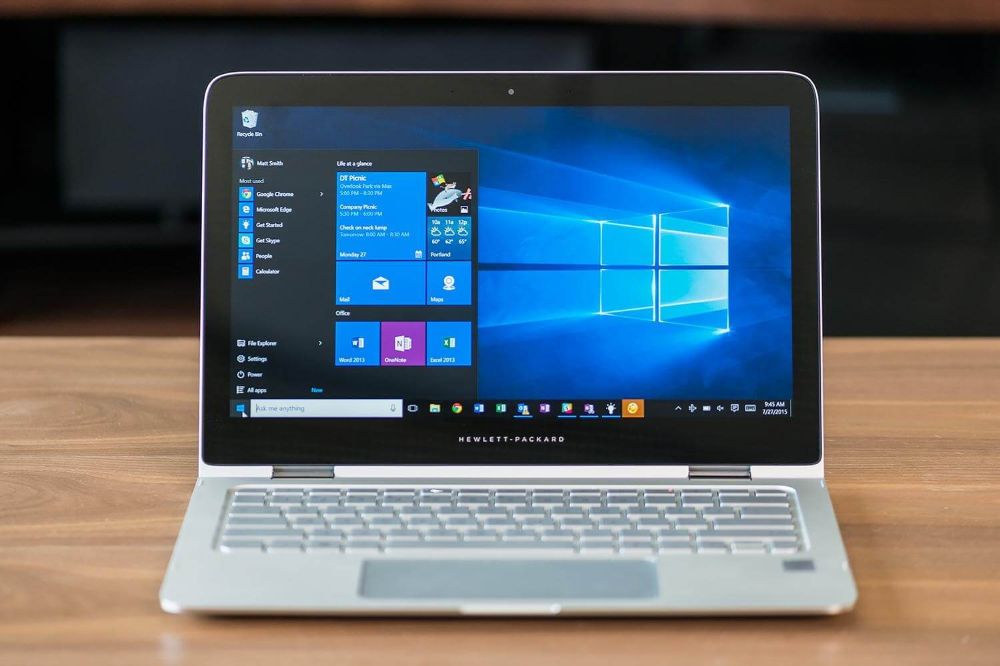
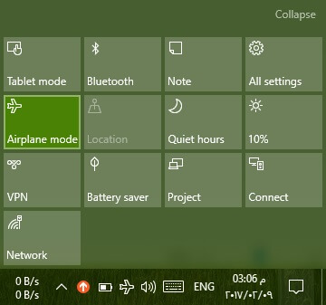
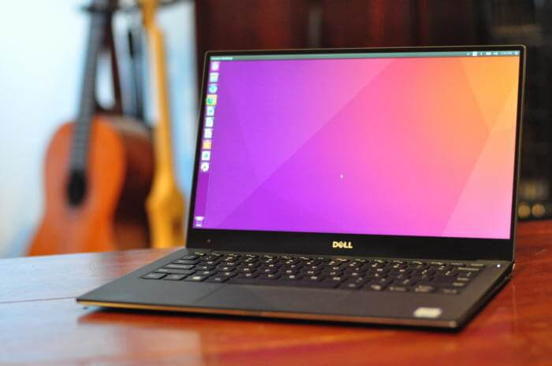

+++
title = "7 حيل للحفاظ على البطارية في ويندوز ولينكس وماك"
date = "2017-06-01"
description = "كم مرة عزيزي القارئ كنت تستخدم اللاب توب الخاص بك في العمل أو الطريق أو حتى الجامعة ووجدت أن نسبة شحن البطارية قد قاربت على الانتهاء وأنك قد نسيت محول الطاقة (الشاحن) الخاص بجهازك أو لم تجد منفذ متاح حتى تشحن جهازك منه، في هذا الموقف لا يجب عليك أن تفقد الأمل لأن هناك العديد من الحيل التي يمكنك فعلها لزيادة عمر البطارية وتقليل استهلاك الطاقة سواء كنت تستخدم ويندوز أو لينكس أو حتى ماك."
categories = ["لينكس",]
tags = ["مجلة لغة العصر"]

+++
كم مرة عزيزي القارئ كنت تستخدم اللاب توب الخاص بك في العمل أو الطريق أو حتى الجامعة ووجدت أن نسبة شحن البطارية قد قاربت على الانتهاء وأنك قد نسيت محول الطاقة (الشاحن) الخاص بجهازك أو لم تجد منفذ متاح حتى تشحن جهازك منه، في هذا الموقف لا يجب عليك أن تفقد الأمل لأن هناك العديد من الحيل التي يمكنك فعلها لزيادة عمر البطارية وتقليل استهلاك الطاقة سواء كنت تستخدم ويندوز أو لينكس أو حتى ماك.

## أولا: 7 طرق لتحسين عمر بطارية اللاب توب في ويندوز 10

يحتوي ويندوز 10 على العديد من الخيارات لتوفير البطارية، مما يبقى بعض الخطوات البسيطة التي يجب أن يقوم المستخدم بها للحصول على عمر أطول للبطارية.

### 1- إيقاف تشغيل الواي فاي والبلوتوث

قام مركز العمل Action Center في ويندوز 10 بتبسيط عملية التحكم في خيارات الاتصال مثل الواي فاي والبلوتوث، والتي بالتأكيد تستنزف جزء كبير من الطاقة.

- إذا كنت لا تحتاج إلى استخدام البلوتوث قم بالضغط على زر المربع الصغير الموجود أسفل يمين الشاشة، ثم اضغط على زر Bluetooth لتعطليه.

- أما بالنسبة للواي فاي، فغالبا ما يتم استخدامه لوقت طويل، ولكن إذا كنت لا تحتاج استخدامه لفترة من الوقت فمن الأفضل إيقافه عن طريق الضغط على زر الواي فاي الموجود على شريط المهام ثم اضغط على زر Wi-Fi.

- كما يمكنك أيضا أن تقوم بإيقاف كلاهما بضغطة زر واحدة عن طريق تفعيل وضع الطيران Airplane mode، اضغط على زر Action Center أو زر الواي فاي ثم زر Airplane mode.

### 2- تشغيل وضع توفير الطاقة:

ميزة أخرى تضمنها ويندوز 10 تعمل على توفير البطارية هي وضع Battery Saver، فهو يقوم تلقائيا بمجرد تفعيله بخفض إضاءة الشاشة وإيقاف التطبيقات التي تعمل في الخلفية وأيضا إيقاف الإشعارات وتحميل التحديثات.

- يمكنك تفعيل وضع Battery Saver عن طريق الضغط على زر البطارية الموجود على شريط المهام ثم الضغط على زر Battery Saver، كما يمكنك فعل ذلك أيضا من Action Center.

- أيضا يمكنك التحكم في التشغيل التلقائي لوضع توفير البطارية عن طريق البحث عن Battery ثم اختيار Turn battery saver on or off.

ثم قم بتفعيل الاختيار كما بالصورة واختيار النسبة التي يبدأ عندها التفعيل التلقائي لوضع توفير الطاقة.

### 3- خفض صوت اللاب توب:

استخدام مكبرات الصوت يستهلك جزء أيضا من الطاقة، لذلك يفضل خفض الصوت إلى المستوي المناسب لك لتوفير مزيد من الطاقة، أيضا استخدام سماعات الرأس يستهلك طاقة أقل من مكبرات الصوت.

### 4- خفض إضاءة شاشة اللاب توب:

من أكبر الأشياء التي تستهلك البطارية بشكل كبير جدا هو سطوع الشاشة، فكلما كان مستوي السطوع أقل كلما كان استهلاك الطاقة أقل.
لضبط إعدادات السطوع قم بالبحث عن Display ثم اختر Display settings.

أسفل Adjust brightness level ستجد شريط للتحكم بمستوي السطوع قم بخفضه إلى المستوي المناسب لك

### 5- ضبط إعدادات الطاقة والنوم Sleep

عند تركك لجهاز لفترة دون استخدامه مع بقاء الشاشة تعمل يستهلك قدر كبير من الطاقة، لذلك عليك بضبط إعدادات الطاقة والنوم حتى تتلاءم مع استخدامك.

- قم بالبحث عن Power ثم اختر Power & sleep settings.

- أسفل Screen ستجد الخيارات بالتحكم في الفترة التي يجب غلق الشاشة بعدها عند العمل على طاقة البطارية وعند التوصيل بالكهرباء، قم بتقليل المدة.
- وأسفل Sleep قم باختيار الفترة التي سيقوم الجهاز بعدها بالدخول في وضع النوم لتوفير البطارية عند عدم استخدامه.

### 6- تعطيل الأجهزة والمنافذ الغير مستخدمة

كل المكونات التي يتم توصيلها باللاب توب تستهلك طاقة، لذا في حالة وجود مكون لا تحتاج استخدامه (مثل الكاميرا) في بعض الأحيان عليك بإيقافه من خلال مدير الأجهزة Device Manager.

- قم بالبحث عن Device Manager وفتحه ثم اضغط بزر الماوس الأيمن على المكون المراد تعطيله واختر Disable، لكن تأكد أنك تعرف ما تفعله ولا تقم بتعطيل المكونات الأساسية أو التي لا تعرفها حتى لا تحدث مشاكل.

### 7- إغلاق التطبيقات والعمليات التي تستهلك الطاقة

ليس فقط المكونات المادية Hardware هي التي تستهلك البطارية، لكن البرامج أيضا لها نصيب أيضا في تقليل عمر البطارية، إذا كل ما عليك فعله هو إيقاف البرامج التي لا تستخدمها والعمليات التي تستهلك قدر كبير من الطاقة.

- قم بإلقاء نظرة على System tray بجانب الساعة للتأكد من البرامج التي تعمل في الخلفية، بعد ذلك قم بفتح مدير المهام Task Manager عن طريق الضغط على Ctrl+Shift+Esc وإذا وجدت أي برنامج يعمل وأنت لا تستخدمه قم بإيقافه، ويمكنك أيضا عن طريق التبويب Processes إيقاف العمليات التي لا تحتاج مثل خدمات التخزين السحابي كـ Dropbox أو مشغلات الصوت والفيديو.

## ثانيا: 7 طرق لتحسين عمر بطارية اللاب توب في لينكس

إن استهلاك البطارية على لينكس قد يكون مشكلة كبيرة بالنسبة لكثير من المستخدمين، وذلك اعتمادا على التوزيعة الذي تستخدمها والأجهزة لديك، فقد تواجه هذه المشكلة من وقت لآخر، لذا دعونا نعرف أولا لماذا قد يكون استهلاك البطارية مرتفع على لينكس؟
عليك أن تعرف أن السبب الرئيسي لاستنزاف البطارية ضخمة على لينكس هو أن مصنعي الأجهزة عادة لا ينشرون الوثائق التفصيلية للأجهزة التي يقومون بتصنيعها، مما يجعل عملية إنشاء التعريفات أكثر صعوبة على مطوري نواة لينكس، ولذلك يكون استهلاك البطارية في لينكس أعلى من استهلاكها في ويندوز في بعض الأحيان، ولتقليل استهلاك البطارية في لينكس عليك باتباع الخطوات التالية:

### 1- تثبيت برنامج TLP

TLP هو برنامج لإدارة الطاقة يعمل على أجهزة لينكس، فهو يوفر الكثير من الخيارات والإعدادات لتشغيل وإيقاف أجزاء الهاردوير المختلفة في جهازك، وبالتأكيد ميزته الأساسية هي تفعيل وضع توفير الطاقة، ويمكنك الحصول عليه عن طريق كتابة أمر التثبيت من خلال الطرفية Terminal.

- لتثبيت برنامج TLP على Ubuntu:
`sudo apt-get install tlp tlp-rdw`
- لتثبيت برنامج TLP على Fedora:
`sudo dnf install tlp tlp-rdw`
- لتثبيت برنامج TLP على SUSE/openSUSE:
`sudo zypper install tlp tlp-rdw`
ولتفعيل البرنامج ليعمل تلقائيا مع بدء التشغيل:
`sudo systemctl enable tlp`

بعد ذلك قم بإعادة تشغيل النظام لتفعيل التغييرات، سيقوم البرنامج بتفعيل الإعدادات الافتراضية لتوفير الطاقة، وإذا كنت بحاجة للتعمق في مزيد من خيارات التخصيص يمكنك الاطلاع على دليل استخدام البرنامج من خلال الرابط التالى:
http://linrunner.de/en/tlp/docs/tlp-configuration.html

- للتحقق من حالة البطارية بعد تشغيل البرنامج يمكنك استخدام الأمر
  `sudo tlp-stat`

### 2- قم بتعطيل أي شاشة توقف Screensaver

كما تعرف عزيزي القارئ فإن شاشة التوقف هي البرنامج البسيط الذي يعمل في الخلفية ليعرض بعض الرسومات الخاصة أو المعلومات عندما لا يكون الكمبيوتر قيد الاستخدام، فأغلبنا بالفعل لا يحتاج لها على أجهزة اللاب توب، لذلك يجب تعطيلها عن العمل لأنها تستهلك قدر كبير من الطاقة.

- قم بكتابة هذا الأمر في الطرفية Terminal.
`xset s off`
لكن هذا الأمر سيعطل شاشة التوقف خلال الجلسة الحالية فقط، ولتعطيل شاشة التوقف دائما قم بتعديل ملف .xsession عن طريق أي برنامج لتحرير النصوص، أو عن طريق الطرفية من خلال كتابة الأمر 
`nano $HOME/.xsession`
ثم إضافة السطر 
`xset s off`

### 3- تحقق من البرامج التي تستهلك الطاقة

يمكنك فعل ذلك عن طريق استخدام برنامج powertop الذي يعمل من خلال الطرفية حيث يقوم بقياس نسبة استهلاك البطارية لكل برنامج، ويمكنك تثبيته على أي توزيعة لينكس ببساطة عن طريق الطرفية.

- لتثبيت برنامج powertop على Ubuntu:
`sudo apt-get install powertop`
- لتثبيت برنامج powertop على Fedora:
`sudo dnf install powertop`
- لتثبيت برنامج powertop على SUSE/openSUSE:
`sudo zypper install powertop`
ولتشغيل البرنامج قم بكتابة الأمر:
`sudo powertop`

### 4- استخدم برامج وواجهة سطح مكتب خفيفة

يوجد العديد من واجهات سطح المكتب للاختيار فيما بينها على لينكس، لكن تبقى واجهات XFCE, LXDE, LxQt وOpenBox من الخيارات الجيدة لتوفير طاقة البطارية، فهذه الواجهات قد تم تصميمها لتعمل على الأجهزة ذات الموارد المحدودة، لذلك هي تستهلك قدر صغير جدا من الطاقة.

أيضا حاول أن تتجنب استخدام البرامج الثقيلة المعروفة باستهلاكها الكبير للموارد مثل Android Studio و VirtualBox طوال فترة عملك على طاقة البطارية، وإذا كنت مضطرا إلى استخدامها حاول توفير بدائل خفيفة أقل استهلاكا للموارد.

### 5- اضبط مستوي السطوع

كما أوضحت بالأعلى، يجب خفض مستوي سطوع الشاشة للحفاظ على طاقة البطارية، لأن الشاشة من أكبر قطع الهاردوير التي تستهلك الطاقة، حاول أن تستخدم الشاشة دائما على أقل مستوي للسطوع، فهو أفضل لعينك حتى، ويمكنك تقليل مستوي سطوع الشاشة من خلال شريط التحكم في السطوع الموجود في أغلب واجهات سطح المكتب.

أو يمكنك استخدام أداة xbacklight الذي يعمل من خلال الطرفية، لتثبيته قم بكتابة أمر التثبيت التالي:
- لتثبيت برنامج xbacklight على Ubuntu:
`sudo apt-get install xbacklight`
- لتثبيت برنامج xbacklight على Fedora:
`sudo dnf install xbacklight`
- لتثبيت برنامج xbacklight على SUSE/openSUSE:
`sudo zypper install xbacklight`
ولضبط السطوع من البرنامج قم بكتابة الأمر:
`xbacklight -set xx`
حيث xx هو قيمة مستوي السطوع من 0 إلى 100، فمثلا لضبط مستوي السطوع على 10 تقوم بكتابة الأمر
`xbacklight -set 10`

### 6- اضبط إعدادات وأوضاع وحدة المعالجة المركزية CPU

استخدام وحدة المعالجة المركزية على أقصى قدر من قوتها عند عدم الحاجة إليها ليس خيارا جيدا، لأنه يتطلب الكثير من الطاقة، وللتحكم في تردد وسرعة المعالج يمكنك استخدام أداة cpufrequtils، فبإمكانك زيادة سرعة المعالج عندما تحتاج إلى تشغيل العديد من البرامج وخفض السرعة في الحالة العادية، كما يمكنك أيضا الاختيار من الأوضاع المختلفة التي توفرها الأداة.

- لتثبيت برنامج cpufrequtils على Ubuntu:
`sudo apt-get install cpufrequtils`
- لتثبيت برنامج cpufrequtils على Fedora:
`sudo dnf install cpufrequtils`
- للتعرف على معلومات حول وحدة المعالجة المركزية استخدم الأمر
`cpufreq-info`
- إذا كنت تريد اختيار تردد معين للمعالج هناك العديد من الخيارات التي توفرها أداة cpufrequtils لعل أهما هو التبديل إلى وضع توفير الطاقة عن طريق كتابة الأمر
`sudo cpufreq-set -g powersave`
- ولتفعيل وضع الأداء performance قم بكتابة الأمر
`sudo cpufreq-set -g performance`

### 7- استخدم إصدار مختلف من نواة لينكس

في بعض الأحيان يلعب إصدار النواة دورا مهما في التأثير على عمر البطارية، ولذلك إذا حدث انخفاض مفاجئ في عمر البطارية عند استخدامك لتوزيعات لينكس حاول تغيير إصدار النواة.

لكن يوجد حل آخر نادرا ما يلجأ له المستخدم المتقدم هو إعادة بناء النواة من المصدر مع إضافة أو تغيير بعض التعريفات للحصول على النتيجة المطلوبة.

## ثالثا: 7 طرق لتحسين عمر بطارية اللاب توب في ماك

من المعروف أن بطاريات أجهزة ماك بوك عمرها أطول من أجهزة الكمبيوتر المحمولة الأخرى، ولكن مع مرور الوقت، فإنه يبدأ في الانخفاض ببطء، لكن لا تقلق باتباعك لهذه النصائح ستستطيع كسب مزيد من الوقت يضاف إلى عمر البطارية.

### 1- استخدام إعدادات توفير الطاقة

في الحقيقة، إعدادات توفير الطاقة في الماك هي الأقل لكنها تعمل بكفاءة لزيادة عمر البطارية، قم بفتح System Preferences ثم توجه إلى Energy Saver واستخدم الشريط لتغيير الوقت الذي يجب غلق الشاشة بعده عند العمل على طاقة البطارية وأيضا وقت دخول الجهاز في وضع النوم Sleep قم بتقليل المدة.

ويمكنك أيضا تفعيل خيارات Automatic graphics switching وPut the hard disk(s) to sleep when possible لمزيد من توفير الطاقة.

### 2- التحكم في خيارات تحديد الموقع الجغرافي

العديد من التطبيقات تستخدم الموقع التلقائي، ولكن في معظم الحالات ليس من الضروري الحصول عليه إلا بإذن المستخدم، حيث أن استخدام الموقع التلقائي يزيد من استهلاك البطارية.
ولتغيير إعدادات الموقع الجغرافي قم بالدخول إلى System Preferences ثم Security and Privacy واختر التبويب Privacy ثم القسم Location Services.

قم بإيقاف خدمة تحديد الموقع الجغرافي أو منع تطبيقات معينة من استخدامها، لمزيد من حفظ الطاقة.

### 3- اضبط مستوي السطوع

كما في ويندوز ولينكس يجب تقليل مستوي السطوع للحفاظ على مستوي البطارية، ولفعل ذلك اضغط على زر F1 وقم بتحريك سطوع الشاشة إلى أقل مستوي، ويمكنك أيضا فعل ذلك عن طريق إعدادات النظام.

### 4- إيقاف العمليات التي تجري في الخلفية

قم بفتح Activity Monitor من Applications/Utilities ثم اختر CPU ثم All Processes وحدد عمود CPU، إذا وجدت أي تطبيق يستهلك أكثر من 70% من المعالج وقم بإغلاقه.

إذا كان البرنامج مثل Safari أو Google Chrome حاول أن تقوم بإيقافه بالطريقة العادية، وإذا لم تنجح قم بإغلاقه من خلال Activity Monitor.

### 5- قم بإغلاق الواي فاي والبلوتوث:

فكما أوضحت بالأعلى إذا لم تكن في حاجة إلى البلوتوث قم بإغلاقه دائما، وكذلك بالنسبة للواي فاي، ويمكنك فعل ذلك عن طريق الشريط العلوي.

أو عن طريق إعدادات النظام System Preferences، قم بالدخول إلى System Preferences ثم Bluetooth وأزل علامة التفعيل، ثم توجه إلى القسم Network وقم بإيقاف الواي فاي.

### 6- قم بإيقاف خدمة Spotlight للفهرسة:

خدمة Spotlight مفيدة جدا لزيادة سرعة عملية البحث عن أي شيء في جهازك لكنها في نفس الوقت تستهلك كمية كبيرة من الطاقة، ويمكنك إيقافها عن طريق إعدادات النظام ثم Spotlight بعد ذلك اختر Privacy واضغط زر + ثم اضغط القرص الصلب الخاص بك.

### 7- تأكد من أنك تستخدم أحدث إصدار من النظام

يساعد قيامك بتحديث النظام إلى أحدث إصدار متوفر في توفير البطارية، حيث أن هناك العديد من التحديثات التي تقوم بحل المشاكل وتحسين الأداء مما يوفر لك مزيد من طاقة البطارية.
لتحديث النظام إلى أحدث نسخة قم بالضغط على شعار أبل من القائمة العلوية واختر Software Update، اضغط على App Store ثم تبويب Updates وتحقق من وجود تحديثات.

---

هذا الموضوع نُشر باﻷصل في مجلة لغة العصر العدد 198 شهر 6-2017 ويمكن الإطلاع عليه [هنا](https://drive.google.com/file/d/1FAYRVeaZDI_9wihFxhZLEr9WeQe0SggY/view?usp=sharing).

