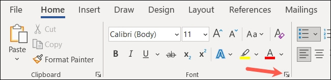
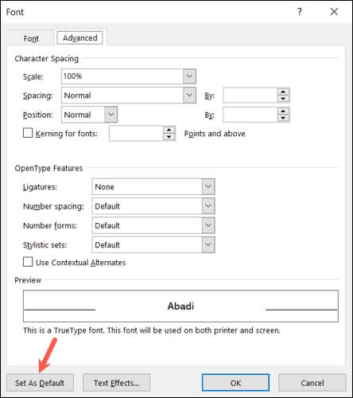

+++
title = "8 خيارات افتراضية في مايكروسوفت وورد عليك تغييرها"
date = "2023-01-02"
description = "إذا كنت تستخدم مايكروسوفت وورد كثيرًا فغالبا أنت تحتاج إلى تغيير بعض الإعدادات بشكل متكرر مثل تباعد الخط أو الهامش في كل مرة تبدأ فيها مستندًا جديدًا. ولحسن الحظ يتيح برنامج وورد ضبط العديد من الإعدادات الافتراضية وتغييرها مرة واحدة وعدم لمسها مرة أخرى إلا إذا كنت ترغب في ذلك، وبهذا توفر وقت كبير يضيع في كل مرة تقرر فيها استخدام البرنامج. إليك مجموعة من الخيارات الافتراضية التي نقترح عليك تغييرها."
categories = ["مهارات رقمية",]
tags = ["مجلة لغة العصر"]

+++

إذا كنت تستخدم مايكروسوفت وورد كثيرًا فغالبا أنت تحتاج إلى تغيير بعض الإعدادات بشكل متكرر مثل تباعد الخط أو الهامش في كل مرة تبدأ فيها مستندًا جديدًا. ولحسن الحظ يتيح برنامج وورد ضبط العديد من الإعدادات الافتراضية وتغييرها مرة واحدة وعدم لمسها مرة أخرى إلا إذا كنت ترغب في ذلك، وبهذا توفر وقت كبير يضيع في كل مرة تقرر فيها استخدام البرنامج. إليك مجموعة من الخيارات الافتراضية التي نقترح عليك تغييرها.

## 1. خيارات التصحيح التلقائي

باستخدام ميزة التصحيح التلقائي في الوورد يمكن للبرنامج خلال كتابتك للنصوص تكبير أول حرف من كلمات معينة تلقائيًا أو استبدال بعض الحروف والرموز وعلامات الترقيم بأخرى وتحويل الأحرف الخاصة إلى رموز، وأمور أخرى.

وبالتالي يمكنك تغيير إعدادات التصحيح التلقائي لتناسب احتياجاتك الخاصة عن طريق الدخول إلى قائمة File ثم Options ثم اختيار Proofing والضغط على زر AutoCorrect Options الموجود على اليمين. وإذا كنت تستخدم الوورد على أجهزة ماك فستجد هذه الخيارات في قائمة Preferences.

بعد أن تفتح نافذة الإعدادات ستجد خيارات تغيير الكتابة بالأحرف الكبيرة أسفل تبويب AutoCorrect، وكذلك خيارات استبدال النصوص والتعامل مع الاستخدام الخاطيء زر Caps Lock.

كما ستجد المزيد من خيارات التنسيق التلقائي في تبويب AutoFormat، مثل تحويل علامات الاقتباس والكسور والروابط والقوائم.

## 2. إعدادات التدقيق الإملائي والنحوي

إذا كنت تعتمد على أداة التدقيق الإملائي والنحوي في برنامج وورد، فيمكنك تخصيص بعض الخيارات لتعمل حسب ما تفضله عبر الدخول إلى قائمة File ثم Options ثم اختيار Proofing والنزول إلى قسم "When Correcting Spelling and Grammar in Word".

ستجد بهذا القسم عدد من الخيارات التي يمكنك فتحها أو إغلاقها كما تريد مثل التدقيق الإملائي والنحوي خلال الكتابة، وعرض إحصائيات سهولة القراءة.

ولضبط مزيد من خيارات القواعد اللغوية، اضغط على زر Settings على يمين خيار أسلوب الكتابة Writing Style. بعد ذلك تستطيع اختار نمط الكتابة الخاص بك من المربع في الجزء العلوي، ثم حدد الخيارات الأخرى الخاصة بالعناصر التي تريد التحقق منها مثل إعدادات القواعد اللغوية العامة والوضوح والإيجاز والرسمية وبعدها اضغط فوق موافق عند الانتهاء.

أيضا ستجد خيارات للتحكم في التصحيح اللغوي خلال استخدام برامج اﻷوفيس الأخرى أسفل خيار When Correcting Spelling in Microsoft Office Programs مثل تجاهل الكلمات الكبيرة والكلمات التي بها الأرقام وعناوين الإنترنت أو الملفات.

## 3. إعدادات العرض

يمكنك التحكم في العديد من الخيارات المتعلقة بالعرض مثل إظهار مسافة بيضاء بين الصفحات وعلامات التظليل وتلميحات أدوات المستند عند تحريك المؤشر عبر فتح قائمة File ثم الخيارات Options ثم قسم Display والانتقال إلى خيارات عرض الصفحة Page Display Options.

أما القسم التالي مباشرة فيحتوي على خيارات عرض علامات التنسيق بشكل دائم مثل المسافات وعلامات الكائنات المضمنة بالملف والمزيد. وبمجرد تحديد مربع إحدى هذه العلامات ستراه في المستند دون الحاجة إلى تغيير عرض علامات التنسيق يدويًا في تبويب الصفحة الرئيسية كل مرة.

## 4. إعدادات القص والنسخ واللصق

من الطبيعي خلال استخدامك اليومي لبرنامج الوورد القيام بالعديد من عمليات النسخ واللصق، وبالتالي من الأفضل أن تعدل إعداداتها لتعمل بالطريقة التي تريدها.

افتح قائمة File ثم Options ثم اختر Advanced ثم قسم Cut, Copy, and Paste الذي ستجد به خيارات اللصق داخل نفس المستند وبين المستندات وبين البرامج المختلفة، وتحديد كيفية التنسيق عند لصق النص والصور.

ويمكنك التحكم في خيارات إضافية عبر الدخول على الإعدادات بعد ذلك ثم تفعيل أو تعطيل خيارات مثل ضبط التباعد ودمج التنسيق عند اللصق من برامج Excel أو PowerPoint.

## 5. تباعد الخطوط والحروف

من الأمور الشائعة التي يقوم بها مستخدمو الوورد دائما عند بداية كتابة مستند جديد تغيير الخط، وللتحكم في الخط والتباعد الافتراضيين للمستندات انتقل إلى علامة تبويب الصفحة الرئيسية واضغط على السهم الصغير في الزاوية اليمين لقسم خيارات الخط.

في تبويب Font ستجد خيارات التحكم في الخط والتنسيق والحجم واللون والتأثيرات. بعد تغيير ما تريد اضغط على تعيين كافتراضي Set as Default عند الانتهاء.

يمكنك بعد ذلك الانتقال إلى تبويب خيارات متقدمة Advanced لتغيير تباعد الحروف والأرقام وخيارات أخرى. وبعد تغيير كل الخيارات المطلوبة اضغط على OK لحفظ الإعدادات الجديدة.

## 6. هوامش المستند

ومن الخيارات التي يمكنك أيضًا ضبطها مرة واحدة لتجنب تغييرها في كل مرة تبدأ فيها مستندًا جديدًا الهوامش الافتراضية. انتقل إلى تبويب التخطيط Layout وافتح نافذة إعداد الصفحة Page Setup بالضغط على السهم الصغير أسفل يمين هذا القسم من الشريط.

داخل تبويب الهوامش يمكنك ضبط هوامش الجوانب اﻷربعة من الصفحة عبر كتابة القياسات المطلوبة في المربعات أو استخدم الأسهم لزيادتها أو تقليلها بنسبة صغيرة.

## 7. إعدادات تعقب التغييرات

إذا كنت تتعاون أنت وزملاؤك في العمل على كتابة المستندات بشكل متكرر، فغالبا أنت تستخدم ميزة تتبع التغييرات لمعرفة التغييرات الحادثة بالملف، وفي هذه الحالة يمكنك ضبط إعدادات ميزة تعقب التغييرات في الوورد لتعمل بالطريقة التي تفضلها بواسطة فتح تبويب المراجعة Review ثم فتح خيارات تعقب التغييرات بالضغط على السهم الصغير أسفل يمين القسم.

ثم اضغط على زر Advanced Options في النافذة التالية.

يمكنك بعد ذلك تغيير مظهر عمليات الإدراج والحذف ولون الكاتب وخيارات التحركات والتنسيق. ثم الضغط على موافق عند الانتهاء وموافق في مربع خيارات تعقب التغييرات.

## 8. خيارات الضغط على الروابط

من اﻷمور الشائعة خلال كتابة المستندات إدراج الروابط، وقد يرغب البعض في تغيير طريقة فتح الروابط افتراضيا ليفتح مباشرة بالضغط على الرابط بدلا من الضغط باستمرار على مفتاح Ctrl عند الضغط على الرابط ويمكن عمل ذلك بخطوات بسيطة.

افتح قائمة File ثم خيارات Options ثم التبويب متقدم Advanced وانتقل إلى قسم خيارات التحرير Editing Options على اليمين، ثم ألغ تحديد مربع Use CTRL + Click to Follow Hyperlink، واضغط على زر موافق في الجزء السفلي من النافذة لحفظ التغييرات.

---

هذا الموضوع نُشر باﻷصل في مجلة لغة العصر العدد 281 شهر 01-2023 ويمكن الإطلاع عليه [هنا](https://drive.google.com/file/d/1w1nWejXY9aVPf02TQ4N3gP1VwU7ehsG5/view?usp=share_link).

