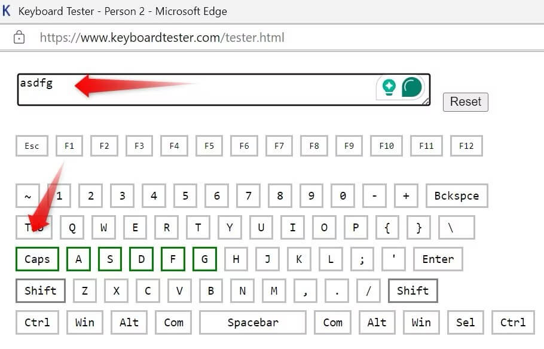
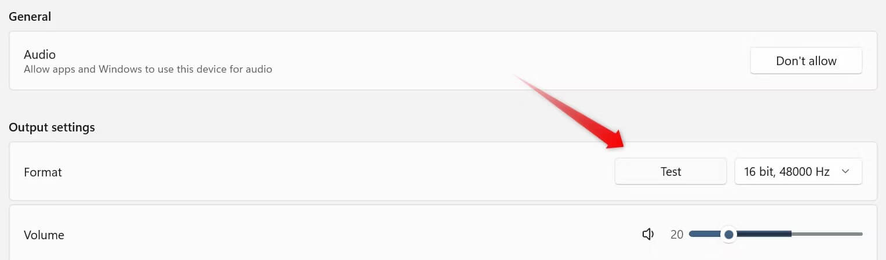
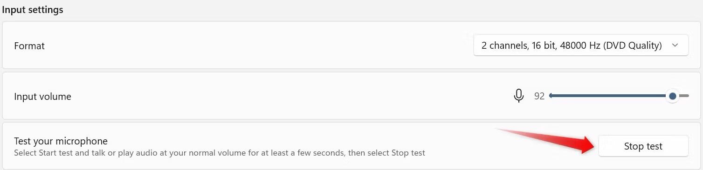
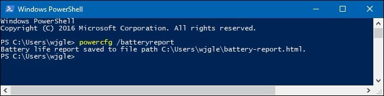
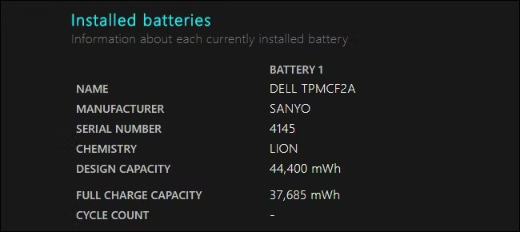
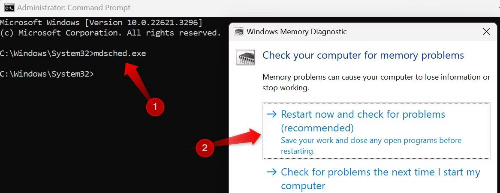
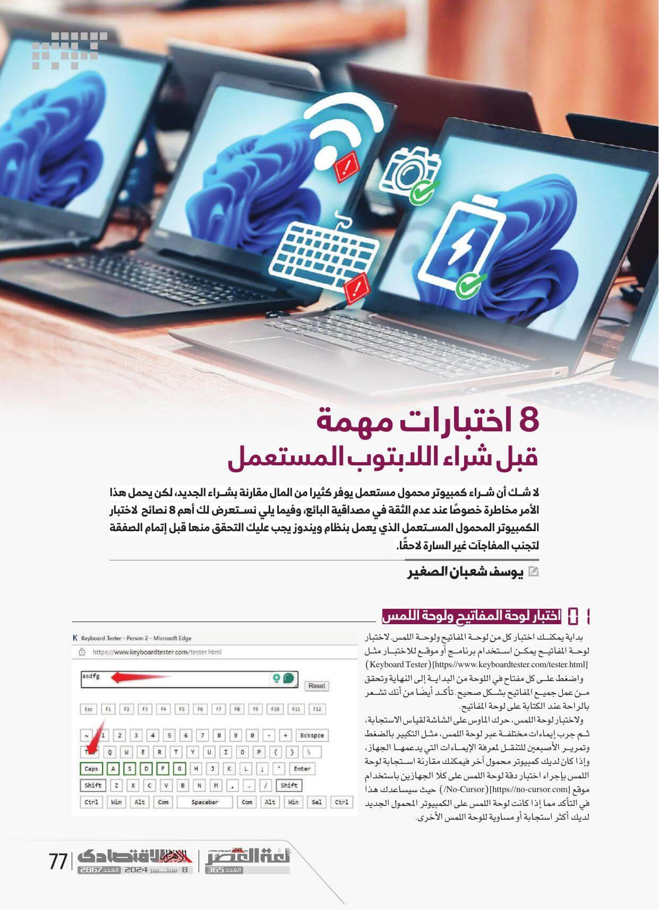
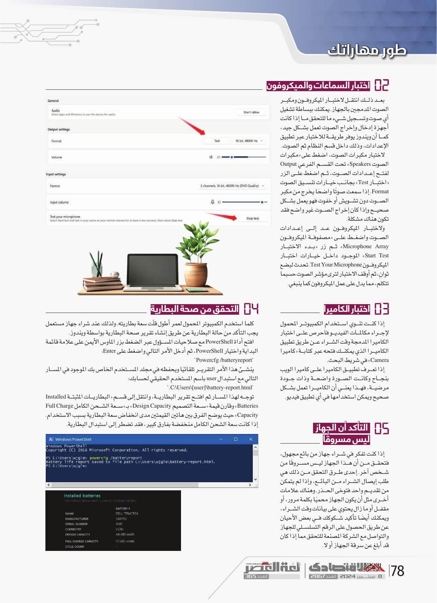
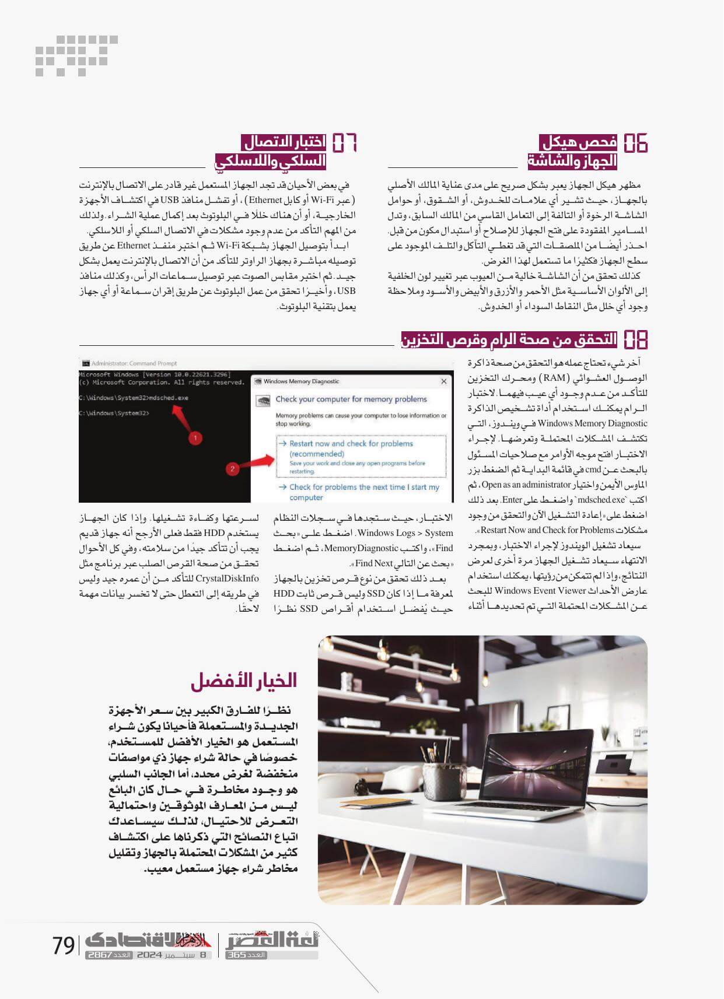

+++

title = "8 اختبارات مهمة قبل شراء حاسوب محمول مستعمل"
date = "2024-09-08"
description = "لا شك أن شراء حاسوب محمول مستعمل يوفر كثيرًا من المال مقارنة بشراء الجديد، لكن يحمل هذا الأمر مخاطرة خصوصًا عند عدم الثقة في مصداقية البائع، وفيما يلي نستعرض أهم 8 نصائح لاختبار الحاسوب المحمول المستعمل الذي يعمل بنظام ويندوز التي يجب عليك التحقق منها قبل إتمام الصفقة لتجنب المفاجآت غير السارة لاحقًا."
categories = ["مهارات رقمية", "ويندوز"]
tags = ["مجلة لغة العصر"]

+++

## مقدمة

لا شك أن شراء حاسوب محمول مستعمل يوفر كثيرًا من المال مقارنة بشراء الجديد، لكن يحمل هذا الأمر مخاطرة خصوصًا عند عدم الثقة في مصداقية البائع، وفيما يلي نستعرض أهم 8 نصائح لاختبار الحاسوب المحمول المستعمل الذي يعمل بنظام ويندوز التي يجب عليك التحقق منها قبل إتمام الصفقة لتجنب المفاجآت غير السارة لاحقًا.

## 1. اختبار لوحة المفاتيح ولوحة اللمس

بداية يمكنك اختبار كلا من لوحة المفاتيح ولوحة اللمس. لاختبار لوحة المفاتيح يمكن استخدام برنامَج أو موقع للاختبار مثل [Keyboard Tester](https://www.keyboardtester.com/tester.html) واضغط على كل مفتاح في اللوحة من البداية إلى النهاية وتحقق من عمل جميع المفاتيح بشكل صحيح. تأكد أيضًا من أنك تشعر بالراحة عند الكتابة على لوحة المفاتيح.

ولاختبار لوحة اللمس، حرك الماوس على الشاشة لقياس الاستجابة، ثم جرب إيماءات مختلفة عبر لوحة اللمس، مثل التكبير بالضغط وتمرير الأصبعين للتنقل لمعرفة الإيماءات التي يدعمها الجهاز، وإذا كان لديك حاسوب محمول آخر فيمكنك مقارنة استجابة لوحة اللمس بإجراء اختبار دِقَّة لوحة اللمس على كلَا الجهازين باستخدام موقع [No-Cursor](https://no-cursor.com/) حيث سيساعدك هذا في التأكد مما إذا كانت لوحة اللمس على الحاسوب المحمول الجديد لديك أكثر استجابة أو مساوية للوحة اللمس الأخرى.

## 2. اختبار السماعات والميكروفون

بعد ذلك انتقل لاختبار الميكروفون ومكبر الصوت المدمجين بالجهاز. يمكنك ببساطة تشغيل أي صوت وتسجيل شيء ما للتحقق ما إذا كانت أجهزة إدخال وإخراج الصوت تعمل بشكل جيد، كما أن ويندوز يوفر طريقة للاختبار عبر تطبيق الإعدادات، وذلك داخل قسم النظام ثم الصوت.

لاختبار مكبرات الصوت، اضغط على "مكبرات الصوت Speakers" تحت القسم الفرعي Output لفتح إعدادات الصوت، ثم اضغط على الزر "اختبار Test" بجانب خيارات تنسيق الصوت Format. إذا سمعت صوتًا واضحًا يخرج من مكبر الصوت دون تشويش أو خفوت فهو يعمل بشكل صحيح وإذا كان إخراج الصوت غير واضح فقد تكون هناك مشكلة.

ولاختبار الميكروفون عد إلى إعدادات الصوت واضغط على "مصفوفة الميكروفون Microphone Array" ثم زر "بَدْء الاختبار Start Test" الموجود داخل خيارات اختبار الميكروفون Test Your Microphone. تحدث لبضع ثوانٍ، ثم أوقف الاختبار لترى مؤشر الصوت حسبما تتكلم، مما يدل على عمل الميكروفون كما ينبغي.

## 3. اختبار الكاميرا

إذا كنت تنوي استخدام الحاسوب المحمول لإجراء مكالمات الفيديو فاحرص على اختبار الكاميرا المدمجة وقت الشراء عن طريق تطبيق الكاميرا الذي يمكنك فتحه عبر كتابة "كاميرا Camera" في شريط البحث.

إذا تعرف تطبيق الكاميرا على كاميرا الويب بنجاح وكانت الصورة واضحة وذات جودة مرضية، فهذا يعني أن الكاميرا تعمل بشكل صحيح ويمكن استخدامها في أي تطبيق فيديو.

## 4. التحقق من صحة البطارية

كلما استخدم الحاسوب المحمول لعمر أطول قلّت سَعَة بطاريته. ولذلك عند شراء جهاز مستعمل يجب التأكد من حالة البطارية عن طريق إنشاء تقرير صحة البطارية بواسطة ويندوز.  
افتح أداة PowerShell مع صلاحيات المسؤول عبر الضغط بزر الماوس الأيمن على علامة قائمة البداية واختيار PowerShell، ثم أدخل الأمر التالي واضغط على Enter:

`Powercfg /batteryreport`

ينشيء هذا الأمر التقرير تلقائيًا ويحفظه في مجلد المستخدم الخاص بك الموجود في المسار التالي مع استبدال user باسم المستخدم الحقيقي لحسابك:  
`C:\Users\[user]\battery-report.html.`

توجه لهذا المسار ثم افتح تقرير البطارية، وانتقل إلى قسم "البطاريات المثبتة Installed Batteries" وقارن قيمة "سَعَة التصميم Design Capacity" بـ "سَعَة الشحن الكامل Full Charge Capacity" حيث يوضح الفرق بين هاتين القيمتين مدى انخفاض سَعَة البطارية بسبب الاستخدام. إذا كانت سَعَة الشحن الكامل منخفضة بفارق كبير، فقد تضطر إلى استبدال البطارية.

## 5. التأكد من أن الجهاز ليس مسروقًا

إذا كنت تفكر في شراء جهاز من بائع مجهول، فتحقق من أن هذا الجهاز ليس مسروقًا من شخص آخر. إحدى طرق التحقق من ذلك هي طلب إيصال الشراء من البائع، وإذا لم يتمكن من تقديم واحد فتوخى الحذر. وهناك علامات أخرى مثل أن يكون الجهاز محميًا بكلمة مرور، أو مقفل أو ما زال يحتوي على بيانات وقت الشراء، ويمكنك أيضًا تأكيد شكوكك في بعض الأحيان عن طريق الحصول على الرقم التسلسلي للجهاز والتواصل مع الشركة المصنعة للتحقق مما إذا كان قد أبلغ عن سرقة الجهاز أو لا.

## 6. فحص هيكل الجهاز والشاشة

مظهر هيكل الجهاز يعبر بشكل صريح على مدى عناية المالك الأصلي بالجهاز، حيث تشير أي علامات للخدوش، أو الشقوق، أو حوامل الشاشة الرخوة أو التالفة إلى التعامل القاسي من المالك السابق، وتدل المسامير المفقودة على فتح الجهاز للإصلاح أو استبدال مكون من قبل. احذر أيضًا من الملصقات التي قد تغطي التآكل والتلف الموجود على سطح الجهاز فكثيرًا ما تستعمل لهذا الغرض.

كذلك تحقق من أن الشاشة خالية من العيوب عبر تغيير لون الخلفية إلى الألوان الأساسية مثل الأحمر والأزرق والأبيض والأسود وملاحظة وجود أي خلل مثل النِّقَاط السوداء أو الخدوش.

## 7. اختبار الاتصال السلكي واللاسلكي

في بعض الأحيان قد تجد الجهاز المستعمل غير قادر على الاتصال بالإنترنت (عبر Wi-Fi أو كابل Ethernet)، أو تفشل منافذ USB في اكتشاف الأجهزة الخارجية، أو أن هناك خللًا في البلوتوث بعد إكمال عملية الشراء. ولذلك من المهم التأكد من عدم وجود مشكلات في الاتصال السلكي أو اللاسلكي.

ابدأ بتوصيل الجهاز بشبكة Wi-Fi ثم اختبر منفذ Ethernet عن طريق توصيله مباشرة بجهاز الراوتر للتأكد من أن الاتصال بالإنترنت يعمل بشكل جيد. ثم اختبر مقابس الصوت عبر توصيل سماعات الرأس، وكذلك منافذ USB، وأخيرًا تحقق من عمل البلوتوث عن طريق إقران سماعة أو أي جهاز يعمل بتقنية البلوتوث.

## 8. التحقق من صحة الرام وقرص التخزين

آخر شيء تحتاج عمله هو التحقق من صحة ذاكرة الوصول العشوائي (RAM) ومحرك التخزين للتأكد من عدم وجود أي عيب فيهما. لاختبار الرام يمكنك استخدام أداة تشخيص الذاكرة Windows Memory Diagnostic في ويندوز، التي تكتشف المشكلات المحتملة وتعرضها. لإجراء الاختبار افتح موجه الأوامر مع صلاحيات المسؤول بالبحث عن cmd في قائمة البداية ثم الضغط بزر الماوس الأيمن واختيار Open as an administrator، ثم اكتب `mdsched.exe` واضغط على Enter. بعد ذلك اضغط على "إعادة التشغيل الآن والتحقق من وجود مشكلات Restart Now and Check for Problems".

سيعاد تشغيل الويندوز لإجراء الاختبار، وبمجرد الانتهاء سيعاد تشغيل الجهاز مرة أخرى لعرض النتائج، وإذا لم تتمكن من رؤيتها، يمكنك استخدام عارض الأحداث Windows Event Viewer للبحث عن المشكلات المحتملة التي تم تحديدها أثناء الاختبار، حيث ستجدها في سجلات النظام Windows Logs > System. اضغط على "بحث Find"، واكتب MemoryDiagnostic، ثم اضغط "بحث عن التالي Find Next".

بعد ذلك تحقق من نوع قرص تخزين بالجهاز لمعرفة ما إذا كان SSD وليس قرص ثابت HDD حيث يُفضل استخدام أقراص SSD نظرًا لسرعتها وكفاءة تشغيلها. وإذا كان الجهاز يستخدم HDD فقط فعلى الأرجح أنه جهاز قديم يجب أن تتأكد جيدًا من سلامته، وفي كل الأحوال تحقق من صحة القرص الصُّلْب عبر برنامَج مثل CrystalDiskInfo للتأكد من أن عمره جيد وليس في طريقه إلى التعطل حتى لا تخسر بيانات مهمة لاحقًا.

## خاتمة

نظرًا للفارق الكبير بين سعر الأجهزة الجديدة والمستعملة فأحيانا يكون شراء المستعمل هو الخِيار الأفضل للمستخدم، خصوصًا في حالة شراء جهاز ذو مواصفات منخفضة لغرض محدد، أما الجانب السلبي هو وجود مخاطرة في حال كان البائع ليس من المعارف الموثوقين واحتمالية التعرض للاحتيال، لذلك سيساعدك اتباع النصائح التي ذكرناها على اكتشاف كثير من المشاكل المحتملة بالجهاز وتقليل مخاطر شراء جهاز مستعمل مَعِيب.

---

هذا الموضوع نُشر باﻷصل في مجلة لغة العصر العدد 365 شهر 09-2024 ويمكن الإطلاع عليه [هنا](https://drive.google.com/file/d/1ph8jkWupYX_1XfReRxgEJLNFRfcbQa8o/view?usp=drive_link).

