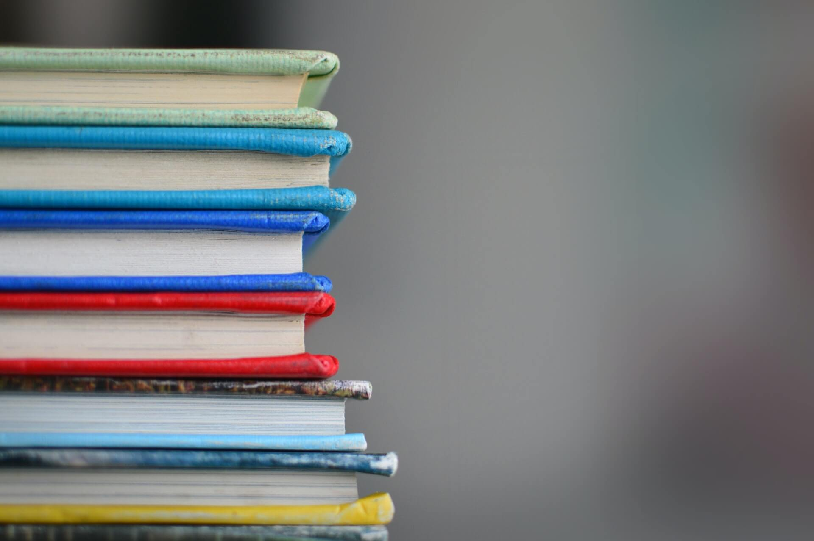

+++
title = "رسائل من القلب إلى طلاب الثانوية اﻷزهرية والعامة"
date = "2022-03-16"
description = "في مثل هذا التوقيت من كل عام، يكون قد مر بعض الوقت على أجازة نصف العام بالنسبة لطلاب الثانوية الأزهرية والعامة في مصر، ويبدأ الضغط بالتزايد نتيجة لتراكم الدروس واقتراب وقت الامتحانات وربط اﻷحزمة في الدروس الخصوصية وبدء موسم المراجعات والاختبارات الشاملة. ووسط كل هذه الفوضى يجد الطلاب أنفسهم في دوامة من الهم والقلق، والتي قد تؤدي بالبعض منهم إلى تأجيل بعض المواد أو تقسيم السنة، وربما الدخول في حالة نفسية سيئة أو لا قدر الله بداية حالة اكتئاب. وفي توقيت كتابتي لهذه السطور يكون قد مضى على مروري بهذه التجربة اﻷليمة 5 سنوات تقريبا، وانطلاقا من كوني كنت في نفس هذا الوضع في يوم ما، دعوني أخبركم ببعض الأمور التي تمنيت أن أسمعها وأعرفها وقتها."
categories = ["تدوينات"]
tags = ["المدونة"]

+++
## مقدمة

في مثل هذا التوقيت من كل عام، يكون قد مر بعض الوقت على أجازة نصف العام بالنسبة لطلاب الثانوية الأزهرية والعامة في مصر، ويبدأ الضغط بالتزايد نتيجة لتراكم الدروس واقتراب وقت الامتحانات وربط اﻷحزمة في الدروس الخصوصية وبدء موسم المراجعات والاختبارات الشاملة. ووسط كل هذه الفوضى يجد الطلاب أنفسهم في دوامة من الهم والقلق، والتي قد تؤدي بالبعض منهم إلى تأجيل بعض المواد أو تقسيم السنة، وربما الدخول في حالة نفسية سيئة أو لا قدر الله بداية حالة اكتئاب. وفي توقيت كتابتي لهذه السطور يكون قد مضى على مروري بهذه التجربة اﻷليمة 5 سنوات تقريبا، وانطلاقا من كوني كنت في نفس هذا الوضع في يوم ما، دعوني أخبركم ببعض الأمور التي تمنيت أن أسمعها وأعرفها وقتها.

|  |
| -----------------------------------------------------------: |
| الصورة بواسطة [Kimberly Farmer](https://unsplash.com/@kimberlyfarmer?utm_source=unsplash&utm_medium=referral&utm_content=creditCopyText) من موقع [Unsplash](https://unsplash.com/s/photos/secondary-education?utm_source=unsplash&utm_medium=referral&utm_content=creditCopyText). |

## تصحيح البوصلة: الثانوية والدنيا والغرض من الحياة
المرحلة الثانوية ليست نهاية الكون! وعلى الرغم من كل المشاكل الموجودة خلال هذه المرحلة من الحياة والتي تمر بعد انتهاء المرحلة ونضحك عليها أوقات استرجاع الماضي، إلا أن الواقع الحالي يفرض نوعا من الضغط الشديد على الطلاب حتى ينتهي المطاف بهم إلى تصور أن من لم يحقق ما يريد في نهاية السابق شخص فاشل ولن يكتب له النجاح طوال حياته.

وهذا الكلام لا يختلف عاقل في أنه خطأ، وأضف إليه مشكلة "كليات القمة" وتقسيم المجالات والاهتمامات إلى "قمة" و "قاع"، وكمية المشاكل الحياتية التي تنتج بسبب هذا التصور، سواء بين الطلاب وبعضهم، أو بينهم وبين أهلهم، أو بين أصحاب الكليات والمجالات المختلفة ونظرتهم إلى بعض. وزد على ذلك كون بعض الكليات التي تدرس العلوم الشرعية تقبل الدخول من نسب منخفضة للغاية وبذلك يدخلها بعض الطلاب غير المهتمين أصلا بهذه العلوم، مما ينعكس على جودة خريجي هذه الكليات.

ولذلك، أحب أن يغير كل طالب من القناعات والموروثات حول ما سبق ذكره، وأن يصحح بوصلته عبر ضبط اتجاهها إلى الاتجاه الصحيح، وهو أننا لم نأت إلى الدنيا للدراسة، بل للعبادة ثم دخول الجنة إن شاء الله، وهذه المراحل المختلفة من الحياة ما هي إلا وسائل نحصل منها على أدوات تعيننا على إكمال الرحلة بطريقة أفضل. ولا يفهم من كلامي التزهيد من قيمة هذه المرحلة الدراسية أو التشجيع على عدم الاهتمام بها، ولكن ما أرغب بتوصليه هو وضع كل شيء في موضعه الصحيح وعدم إعطاءه أكثر من حجمه، فعدم التوفيق في أي مرحلة من مراحل الحياة أيًا كانت لا يعني الفشل ولا يعني نهاية الحياة!

## حسن الظن بالله والاستخارة والرضا
عن أبي هريرة رضي الله عنه أن النبي صلى الله عليه وسلم قال: {قالَ اللَّهُ تعالى: أنا عِنْدَ ظَنِّ عَبْدِي بي} (صحيح البخاري 7505). في هذا الحَديثِ القُدسيِّ يَروي النَّبيُّ صلَّى اللهُ عليه وسلَّم عن رَبِّه سُبحانَه وَتَعالَى أنَّه يَقولُ: «أنا عِندَ ظَنِّ عَبْدي بي»، يَعني: إن ظَنَّ باللهِ خَيرًا فَلَه، وإن ظَنَّ بِه سِوَى ذلك فَلَه. (أنظر [شرح الحديث](https://dorar.net/hadith/sharh/106) في موقع الدرر السنية).

ويقول العلامة السعدي في تفسيره لآية {كُتِبَ عَلَيْكُمُ الْقِتَالُ وَهُوَ كُرْهٌ لَكُمْ وَعَسَى أَنْ تَكْرَهُوا شَيْئًا وَهُوَ خَيْرٌ لَكُمْ وَعَسَى أَنْ تُحِبُّوا شَيْئًا وَهُوَ شَرٌّ لَكُمْ وَاللَّهُ يَعْلَمُ وَأَنْتُمْ لا تَعْلَمُونَ} (البقرة: 216):

> وأما أحوال الدنيا، فليس الأمر مطردا، ولكن الغالب على العبد المؤمن، أنه إذا أحب أمرا من الأمور، فقيض الله [له] من الأسباب ما يصرفه عنه أنه خير له، فالأوفق له في ذلك، أن يشكر الله، ويجعل الخير في الواقع، لأنه يعلم أن الله تعالى أرحم بالعبد من نفسه، وأقدر على مصلحة عبده منه، وأعلم بمصلحته منه كما قال [تعالى:] {وَاللَّهُ يَعْلَمُ وَأَنْتُمْ لا تَعْلَمُونَ} فاللائق بكم أن تتمشوا مع أقداره، سواء سرتكم أو ساءتكم.

فيجب على الإنسان المؤمن تسليم أمره لله، والرضا بما قسمه له، والاعتقاد الجازم بأن ما يختاره له هو الخير والمصلحة في الدنيا والآخرة، وذلك بعد بذل اﻷسباب واستفراغ الوسع في الجِدّ والمذاكرة والاستعداد بأفضل ما يمكن حتى لا يترك ذرة للندم على مجهود لم يبذله.

أما الاستخارة، فهي أمر لا بد منه في كل خطوة واختيار نقوم به في حياتنا حتى لو كان بسيطًا، فهي بجانب استشارة العقلاء عاملان مهمان جدا من وجهة نظري في التخطيط للمستقبل واختيار الكليات عندما يحين وقت ذلك.

## لا تدع الدراسة تلهيك عن التعلم
[أحمد أبو زيد](https://twitter.com/droos_online) صاحب قناة دروس أونلاين له مقولة جميلة جدا وهي: "لا تدع الدراسة تلهيك عن التعلم". والحقيقة أن هذه المقولة حقيقة جدا، ﻷننا أصبحنا في زمان صعب يلهي فيه التعليم اﻹلزامي عن "التعلم الحقيقي". وأقصد بالتعلم الحقيقي هو اﻷمور التي تنفع بشكل كبير في الدين والدنيا، بداية من العقيدة الصحيحة وأساسيات فقه العبادات التي لا غني عنها، وحتى العلوم الدنيوية التي أصبحنا للأسف نتلقنها بطريقة غرضها اجتياز الامتحانات فقط. ولعل من أهم اﻷمور التي يجب تعلمها هو تعلم كيفية التعلم، ويوجد كورس بهذا الاسم فعلا على [منصة Coursera](https://www.coursera.org/learn/learning-how-to-learn) يستعرض كيف نتعلم وكيف يعمل الدماغ وكيف يمكن تطبيق بعض التقنيات والنصائح الصغيرة لتحسين عملية التعلم، ويمكن لمن وقته ضيق جدا [مشاهدة ملخص هذا الكورس](https://youtu.be/7nmKtI7fEmU) من قناة دروس أونلاين.

من اﻷمور الضرورية جدا للتعلم في زماننا اللغة اﻹنجليزية، والتي لا يكفينا فيها الاعتماد على ما ندرسه في المدارس فقط، لأننا نهمل مهارات مهمة مثل الاستماع والمحادثة، والحمد لله أن الانترنت مليئ بالمصادر الجيدة للتعلم مثل قناة [ZAmericanEnglish](https://www.youtube.com/channel/UCHrD4qdeQc1BbpG6EPqDBcA) وغيرها. وأيضًا تعلم مهارات التعامل مع الحاسوب والإنترنت بشكل جيد، حتى لا يصطدم الواحد بأمور لا يحسنها ولا غنى عنها خلال مدّة الجامعة أو بعدها في اﻷعمال المختلفة.

## مساعدة الغير ومحبة الخير لهم
عن أبي هريرة رضي الله عنه قال: قال صلى الله عليه وسلم: {مَن نَفَّسَ عن مُؤْمِنٍ كُرْبَةً مِن كُرَبِ الدُّنْيَا، نَفَّسَ اللَّهُ عنْه كُرْبَةً مِن كُرَبِ يَومِ القِيَامَةِ، وَمَن يَسَّرَ علَى مُعْسِرٍ، يَسَّرَ اللَّهُ عليه في الدُّنْيَا وَالآخِرَةِ، وَمَن سَتَرَ مُسْلِمًا، سَتَرَهُ اللَّهُ في الدُّنْيَا وَالآخِرَةِ، وَاللَّهُ في عَوْنِ العَبْدِ ما كانَ العَبْدُ في عَوْنِ أَخِيهِ، وَمَن سَلَكَ طَرِيقًا يَلْتَمِسُ فيه عِلْمًا، سَهَّلَ اللَّهُ له به طَرِيقًا إلى الجَنَّةِ …} (صحيح مسلم: 2699)
وقال علي رضي الله عنه: «إن الله عز وجل خلق خلقا من خلقه لخلقه، فجعلهم للناس وجوها وللمعروف أهلا، يفزع الناس إليهم في حوائجهم، أولئك الآمنون يوم القيامة». وقال الفضيل بن عياض: «أما علمتم أن حاجة الناس إليكم نعمة من الله عليكم، فاحذروا أن تملوا النعم فتصير نقما». [فقه النفس من أقوال العلماء وأعمالهم - ص185-186]

ومما يحزن رؤية بعض الطلاب يبخل بمساعدة غيره بأي صورة كان، سواء كانت مساعدة بالدعم النفسي أو شرح أمر صعب أو إدخال السرور على زملائه، أو مشاركة مصدر أو كتاب أو ملخص أو ورق ما مع زملائه خوفا من أن يكون هذا العلم سببًا في تفوق زملائه عليه أو أن يظن البعض أنه متفوق ومتقن لكل المطلوب منه بشكل جيد فيحسدونه.

لكن الواقع خلاف ذلك تماما، فمن خاف الحسد عليه أن يواظب على أذكاره وإن شاء الله لن يضره شيء، وبعد ذلك عليه بمساعدة الناس بقدر ما يستطيع، فوالله لقد رأيت أنا وغيري من بركة مساعدة الناس العجب العجاب، وصدق رسول الله صلى الله عليه وسلم، ماذا يتصور من كان الله في عونه؟ والله سبحانه هو الكريم وهو مدبر اﻷمور كلها، فمساعدة الناس وكون الواحد عونا لهم مفتاح الحصول على عون الله تبارك وتعالى، فهل من عاقل لا يرغب في عون الله؟!

## الوقت
روي عن الحسن البصري أنه كان يقول: «يا ابن آدم *إنما أنت أيام* فإذا ذهب يومك ذهب بعضك، وإذا ذهب البعض يوشك أن يذهب الكل». ولعل الوقت هو أكثر ما يشتكي الطلاب منه في هذه الفترة من المرحلة الثانوية. ومن يحاول تحليل أين يذهب وقته فيستنتج أن الهاتف الذكي هو أحد أكثر ما يضيع الوقت إن لم يكن أكثر ما يضيعه.

نحن الآن نعيش في عالم عصبه البيانات، وهذه البيانات مصدرها مستخدمو الإنترنت، وهؤلاء المستخدمون أكثرهم من مستخدمي الهواتف الذكية، والشركات الكبرى كلها تحارب حتى تسرق انتباهك ثم تسرق وقتك. فقط فكر في كيف يسحبك تطبيق مثل فيس بوك كل مرة إلى دوامة التمرير اللانهائي، أو يسرق وقتك يوتيوب كل مرة تدخل لمشاهدة بعض المقاطع، ويمكنك مشاهدة وثائقي The social dilemma لمعرفة كيف يتم توظيف الخبراء في شتى المجالات لجعلك تستخدم الهاتف وتطبيقات التواصل الاجتماعي لأكبر وقت ممكن.

لافتة: يمكنك قراءة موضوع [كيف تحقق أقصى فائدة من يوتيوب وتتجنب المشتتات؟](https://yshalsager.com/ar/posts/youtube-distraction-free/) للتعامل مع يوتيوب بشكل أكثر حكمة.

وإن كنت تظن أن هذه التطبيقات ضرورية فدعني أخبرك بأمر: منذ سنة تقريبا تخلصت من فيس بوك وواتس أب نهائيًا وحذفتهم من حياتي، وها أنا ما زلت على قيد الحياة، حي أرزق، أتابع بعض اﻷشخاص على منصات أخرى، وأتواصل مع أصدقائي ومعارفي بواسطة تطبيقات أخرى (تليجرام مثلا)، ولم أنقطع عن العالم كما قد يتصور البعض عند القيام بهذه الخطوة، وإن كنت قد امتنعت عن الاطّلاع على الأخبار بشكل مستمر متعمد لصحة نفسية أفضل.

## شكر النعم
خلال هذه الرحلة الطويلة المتعبة، لا تنس أن تشكر الله تعالى دوما على نعمه، ولا تجعل بعض المعكرات لصفو الحياة تنسيك شكر النعم، فوالله إننا لمغمورون بنعم الله تعالى وفضله، ولن نستطيع أداء حق هذه النعم مهما فعلنا. إنما المشكلة أن البعض يركز على تفاصيل ومشاكل صغيرة - قد يكون لا طائل منها أصلا - وينسي اﻷمور المهمة التي تستحق التركيز عليها.

أحمد الله تعالى أن أعطاك جسدًا سليمًا تستطيع الذَّهاب والمجيء على قدميك وقتما تريد، وأن أعطاك عقلا سليما فقده غيرك، وأن أعطاك سمعًا وبصرًا  قد حرم منهما غيرك، وأن رزقك أنت أو والديك بما يكفي لأن تشتري الكتب وتأخذ الدروس وتدرس بينما غيرك يضطر إلى ترك التعليم لأن أبواه لا يقدران على توفير مصاريف دراسته. وتذكر أن شكر النعم من ضمنه أن تحسن استخدامها وأن تعاون غيرك بها من باب الصدقة.

## ختام

قد طال الكلام أكثر مما كنت أتوقع، وتأخرت في كتابة هذه التدوينة التي كان من المفترض أن تنتهي قبل عدة أسابيع، لكن لعل الله ينفع بها من يقرأها من طلاب المرحلة الثانوية في مصر خصوصًا وفي أي مكان عمومًا. وخلاصة ما أريد إيصاله في جملة واحدة هو: تصحيح البوصلة ومعرفة أين تقع المرحلة الحالية من خريطة الحياة السليمة، وحسن الظن بالله تعالى والرضا بقضاءه مهما كانت النتائج فما عليك إلا السعي، والاستخارة في اﻷمور الكبيرة وخصوصا ما يترتب عليه تقرير مرحلة جديدة في الحياة، والتفريق بين التعلم الحقيق والدراسة الإلزامية، وتعلم المهارات الضرورية التي لا نتعلمها في المدارس خلال الوقت المتوفر، واغتنام الوقت وأوقات الفراغ وملاحظة أين يضيع وقتنا، ومساعدة الغير ومحبة الخير لهم، وأخيرًا تذكر نعم الله وشكرها دائما. وفق الله كل الطلاب فيما هو قادم وحقق لهم ما فيه خير لهم، والسلام.