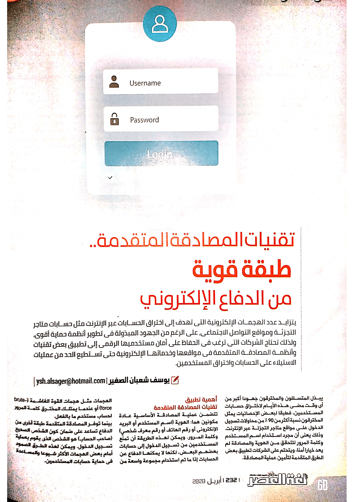
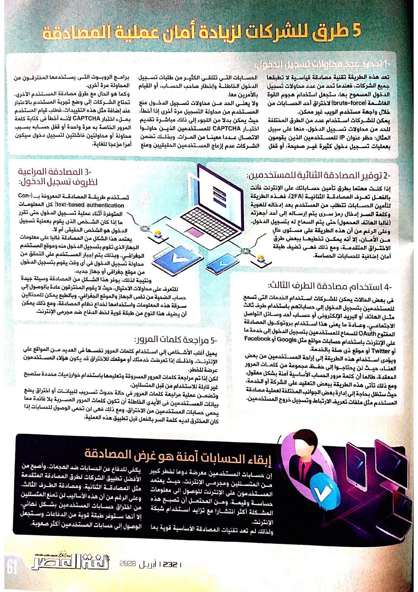

+++
title = "تقنيات المصادقة المتقدمة.. طبقة قوية من الدفاع الإلكتروني"
date = "2020-04-01"
description = "لا يزال عدد الهجمات الإلكترونية التي تهدف إلى اختراق الحسابات عبر الإنترنت مثل حسابات متاجر التجزئة ومواقع التواصل الاجتماعي مرتفعًا على الرغم من الجهود المبذولة في تطوير أنظمة حماية أقوى. ولذلك تحتاج الشركات التي ترغب في الحفاظ على أمان مستخدميها الرقمي إلى تطبيق بعض تقنيات وأنظمة المصادقة المتقدمة في مواقعها وخدماتها الإلكترونية حتى تستطيع الحد من عمليات الاستيلاء على الحسابات واختراق المستخدمين."
categories = ["اﻷمن الرقمي", "تقارير",]
tags = ["مجلة لغة العصر"]

+++

لا يزال عدد الهجمات الإلكترونية التي تهدف إلى اختراق الحسابات عبر الإنترنت مثل حسابات متاجر التجزئة ومواقع التواصل الاجتماعي مرتفعًا على الرغم من الجهود المبذولة في تطوير أنظمة حماية أقوى. ولذلك تحتاج الشركات التي ترغب في الحفاظ على أمان مستخدميها الرقمي إلى تطبيق بعض تقنيات وأنظمة المصادقة المتقدمة في مواقعها وخدماتها الإلكترونية حتى تستطيع الحد من عمليات الاستيلاء على الحسابات واختراق المستخدمين.

يبذل المتسللون والمخترقون جهودًا أكبر من أي وقت مضى هذه الأيام لاختراق حسابات المستخدمين، فطبقا لبعض الإحصائيات يمثل المخترقون نسبة أكثر من 90 بالمائة من محاولات تسجيل الدخول على مواقع متاجر التجزئة عبر الإنترنت. وذلك يعني أن مجرد استخدام اسم المستخدم وكلمة المرور للتحقق من الهوية والمصادقة لم يعد خيارا آمنا، ويتحتم على الشركات تطبيق بعض الطرق المتقدمة لتأمين عملية المصادقة.

## أهمية تطبيق تقنيات المصادقة المتقدمة

تتضمن عملية المصادقة الأساسية عادةً مكونين هما الهوية (اسم المستخدم أو البريد الإلكتروني أو رقم الهاتف أو رقم معرف شخصي) وكلمة المرور. ويمكن لهذه الطريقة أن تمنع المستخدمين من تسجيل الدخول إلى حسابات بعضهم البعض، لكنها لا يمكنها الدفاع عن الحسابات إذا ما تم استخدام مجموعة واسعة من الهجمات مثل هجمات القوة الغاشمة (brute-force) أو عندما يمتلك المخترق كلمة المرور لحساب مستخدم ما بالفعل.

بينما توفر المصادقة المتقدمة طبقة أخرى من الدفاع تساعد على ضمان كون الشخص الصحيح (صاحب الحساب) هو الشخص الذي يقوم بعملية تسجيل الدخول. ويمكن لهذه الطرق الصمود أمام بعض الهجمات الأكثر شيوعًا والمساعدة في حماية حسابات المستخدمين.

## 5 طرق يجب على الشركات تطبيقها لزيادة أمان عملية المصادقة

### 1- تحديد عدد محاولات تسجيل الدخول

تعد هذه الطريقة تقنية مصادقة قياسية لا تطبقها جميع الشركات، فعندما تحد من عدد محاولات تسجيل الدخول المسموح بها، ستجعل استخدام هجوم القوة الغاشمة (brute-force) لاختراق أحد الحسابات من خلال واجهة مستخدم الويب غير ممكن.

يمكن للشركات استخدام عدد من الطرق المختلفة للحد من محاولات تسجيل الدخول، منها على سبيل المثال: حظر عنوان IP للمستخدمين الذين يقومون بعمليات تسجيل دخول كثيرة غير صحيحة، أو قفل الحسابات التي تتلقى الكثير من طلبات تسجيل الدخول الخاطئة وإخطار صاحب الحساب، أو القيام بالأمرين معًا.

ولا يعني الحد من محاولات تسجيل الدخول منع المستخدم من محاولة التسجيل مرة أخرى إذا أخطا، حيث يمكن بدلاً من اللجوء إلى ذلك مباشرة تقديم اختبار CAPTCHA للمستخدمين الذين حاولوا الاتصال عددًا معينًا من المرات، وبذلك تضمن الشركات عدم إزعاج المستخدمين الحقيقين ومنع برامج الروبوت التي يستخدمها المخترقون من المحاولة مرة أخرى.

وكما هو الحال مع طرق مصادقة المستخدم الأخرى، تحتاج الشركات إلى وضع تجربة المستخدم بالاعتبار عند إضافة مثل هذه التقييدات، فطلب قيام المستخدم بملء اختبار CAPTCHA لأنه أخطأ في كتابة كلمة المرور الخاصة به مرة واحدة أو قفل حسابه بسبب محاولة أو محاولتين فاشلتين لتسجيل دخول سيكون أمرًا مزعجًا للغاية.

### 2- توفير المصادقة الثنائية للمستخدمين

إذا كنت مهتما بطرق تأمين حساباتك على الإنترنت فأنت بالفعل تعرف المصادقة الثنائية (2FA)، فهذه الطريقة لتأمين الحسابات تتطلب من المستخدم بعد إدخاله للهوية وكلمة السر إدخال رمز سري يتم إرساله إلى أحد أجهزته (غالبا الهاتف المحمول) حتى يتم السماح له بتسجيل الدخول. وعلى الرغم من أن هذه الطريقة على مستوى عالي من الأمان، إلا أنه يمكن تخطيها ببعض طرق الاختراق المتقدمة، ومع ذلك فهي تضيف طبقة أمان إضافية للحسابات الحساسة.

### 3- المصادقة المراعية لظروف تسجيل الدخول

تستخدم طريقة المصادقة المعروفة بـ (Context-based authentication) كل المعلومات المتوفرة أثناء عملية تسجيل الدخول حتى تقرر ما إذا كان الشخص الذي يقوم بعملية تسجيل الدخول هو الشخص الحقيقي أم لا.

يعتمد هذا الشكل من المصادقة غالبًا على معلومات الجهاز الذي تقوم بتسجيل الدخول منه وموقع المستخدم الجغرافي. وبذلك يتم إجبار المستخدم على التحقق من محاولة تسجيل الدخول في أي وقت يقوم بتسجيل الدخول من موقع جغرافي أو جهاز جديد.

ونتيجة لذلك، يوفر هذا الشكل من المصادقة وسيلة جيدة للتعرف على محاولات الاحتيال، حيث لا يقوم المخترقون عادة بالوصول إلى حساب الضحية من نفس الجهاز والموقع الجغرافي. وبالطبع يمكن للمحتالين سرقة هذه المعلومات واستخدامها لخداع نظام المصادقة، ومع ذلك يمكن أن يضيف هذا النوع من طبقة قوية لخط الدفاع ضد مجرمي الإنترنت.

### 4- استخدام مصادقة الطرف الثالث

في بعض الحالات يمكن للشركات استخدام الخدمات التي تسمح للمستخدمين بتسجيل الدخول إلى حساباتهم باستخدام طرف ثالث مثل الهاتف أو البريد الإلكتروني أو حساب أحد وسائل التواصل الاجتماعي. وعادةً ما يعني هذا استخدام بروتوكول المصادقة المفتوح OAuth للسماح للمستخدمين بتسجيل الدخول إلى خدمة ما على الإنترنت باستخدام حسابات مواقع مثل Google أو Facebook أو Twitter أو موقع ذي صلة بالخدمة.

ويؤدي استخدام هذه الطريقة إلى إراحة المستخدمين من بعض العناء، حيث لن يحتاجوا إلى حفظ مجموعة من كلمات المرور المعقدة، طالما أن كلمة مرور الحساب الأساسية آمنة بشكل معقول.

ومع ذلك تأتي هذه الطريقة ببعض التعقيد على الشركة أو الخدمة، حيث ستظل بحاجة إلى إدارة بعض الجوانب المختلفة لعملية مصادقة المستخدم مثل ملفات تعريف الارتباط وتسجيل خروج المستخدمين.

### 5- مراجعة كلمات المرور

يميل أغلب الأشخاص إلى استخدام كلمات المرور نفسها في العديد من المواقع على الإنترنت. ولذلك إذا تعرضت خدمتك أو موقعك للاختراق قد يكون هؤلاء المستخدمون عرضة للخطر.

لكن إذا تم مراجعة كلمات المرور المسروقة وتعليمها باستخدام خوارزميات محددة ستصبح غير قابلة للاستخدام من قبل المتسللين.

وتضمن عملية مراجعة كلمات المرور في حالة حدوث تسريب للبيانات أو اختراق يضع بيانات المستخدمين في الأيدي الخاطئة أن تكون كلمات المرور المسربة بلا فائدة مما يحمي حسابات المستخدمين من الاختراق، ومع ذلك فهي لن تحمي الوصول للحسابات إذا كان المخترق لديه كلمة السر بالفعل قبل تطبيق هذه العملية.

## إبقاء الحسابات آمنة هو غرض المصادقة

إن حسابات المستخدمين معرضة دوما لخطر كبير من المتسللين ومجرمي الإنترنت، حيث يعتمد المستخدمون على الإنترنت للوصول إلى معلومات حساسة وقيمة. ومن المحتمل أن تصبح هذه المشكلة أكثر انتشارًا مع تزايد استخدام شبكة الإنترنت.

ولذلك لم تعد تقنيات المصادقة الأساسية قوية بما يكفي للدفاع عن الحسابات ضد الهجمات، وأصبح من الأفضل تطبيق الشركات لطرق المصادقة المتقدمة مثل المصادقة الثنائية ومصادقة الطرف الثالث. وعلى الرغم من أن هذه الأساليب لن تمنع المتسللين من اختراق حسابات المستخدمين بشكل نهائي، لكنها ستوفر طبقة قوية من الدفاعات وستجعل الوصول إلى حسابات المستخدمين أكثر صعوبة.

---

هذا الموضوع نُشر باﻷصل في مجلة لغة العصر العدد 232 شهر 04-2020 ويمكن الإطلاع عليه [هنا](https://drive.google.com/file/d/1b276XqXOR2YqHe-lJdHshLi-eJJVlksz/view?usp=sharing).

