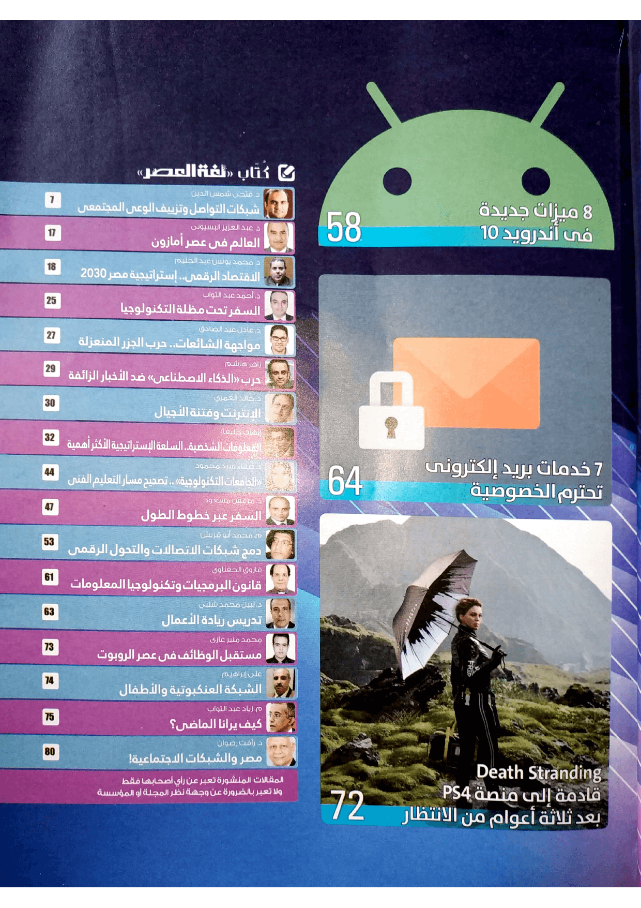

+++
title = "أبرز الميزات الجديدة في تحديث أندرويد 10"
date = "2019-10-01"
description = "أطلقت جوجل التحديث الجديد المنتظر لنظام أندرويد شهر سبتمبر الماضي، والذي خلافا للتوقعات ولعادات جوجل في اختيار أسماء الحلويات لإصدارات النظام قد حمل الاسم \"أندرويد 10\". وكما هي العادة، أول من حصل على التحديث الجديد كان مستخدمي أجهزة جوجل بيكسل، ثم جهاز Essential Phone، ومفاجأة هذا العام هاتف شاومي Redmi K20 Pro الذي وصله التحديث في الصين في نفس يوم الإطلاق. ولأول مرة على الإطلاق تتوفر نسخة للتحميل من صورة النظام العامة GSI (Generic System Image) التي تدعم كل أجهزة أندرويد التي صدرت بنظام أندرويد باي 9.0، وذلك بفضل مشروع Project Treble المميز الذي تحدثنا عنه من قبل في عدد مايو 2018. إذن، ما أبرز المميزات الجديدة التي جاء بها تحديث أندرويد 10؟"
categories = ["أندرويد",]
tags = ["مجلة لغة العصر"]
images = ["images/0.jpg"]

+++
أطلقت جوجل التحديث الجديد المنتظر لنظام أندرويد شهر سبتمبر الماضي، والذي خلافا للتوقعات ولعادات جوجل في اختيار أسماء الحلويات لإصدارات النظام قد حمل الاسم "أندرويد 10".

وكما هي العادة، أول من حصل على التحديث الجديد كان مستخدمي أجهزة جوجل بيكسل، ثم جهاز Essential Phone، ومفاجأة هذا العام هاتف شاومي Redmi K20 Pro الذي وصله التحديث في الصين في نفس يوم الإطلاق. ولأول مرة على الإطلاق تتوفر نسخة للتحميل من صورة النظام العامة GSI (Generic System Image) التي تدعم كل أجهزة أندرويد التي صدرت بنظام أندرويد باي 9.0، وذلك بفضل مشروع Project Treble المميز الذي تحدثنا عنه من قبل في عدد مايو 2018. إذن، ما أبرز المميزات الجديدة التي جاء بها تحديث أندرويد 10؟

## 1- تحكم أفضل في الخصوصية

تعد الخصوصية أحد أبزر التغييرات التي تم التركيز عليها من قبل جوجل في هذا التحديث، فالطريقة التي يتم التحكم بها الآن في أذونات التطبيقات أصبحت أفضل بكثير من أي وقت مضي.

فعندما يطلب تطبيق ما صلاحية استخدام الموقع الجغرافي مثلا يوفر لك أندرويد 10 مزيد من التحكم، حيث يمكنك السماح للتطبيق بالحصول على هذه الصلاحية فقط أثناء تشغيله مما يمنع التطبيق من الوصول إلى هذه الصلاحية بمجرد خروجك منه، أو السماح بشكل دائم، أو الرفض.

بالإضافة إلى ظهور أيقونات خاصة باستخدام أي من مميزات الهاتف مثل الكاميرا أو الميكروفون على شريط الحالة جهة اليمين عندما يقوم أي تطبيق باستخدام هذه الميزات، وبذلك يكون المستخدم على علم تام بما تستخدمه التطبيقات المختلفة من صلاحيات وهذ تعمل في الخلفية.

## 2- المظهر الداكن على مستوي النظام

في الآونة الأخيرة اتجهت أنظمة التشغيل والبرامج المختلفة لإضافة الثيم المظلم أو الداكن الذي يعشقه العديد من المستخدمين، ويبدو أن جوجل لا تريد التأخر عن الركب، وبالرغم من أن تغيير ثيم أندرويد إلى الوضع المظلم ممكن حاليا عن طريق الثيمات الخارجية أو بعض الطرق الأخرى، إلا أن تحديث أندرويد 10 أضاف هذه الميزة افتراضيا بشكل رسمي.

أيضا أصبح من الممكن الآن تغيير ألوان النظام من خلال إعدادات المطور مباشرة، وهو الشيء الذي لم يكن متاحا لكل الأجهزة التي تعمل بأندرويد 9.0، إلى جانب إمكانية تغيير شكل أيقونات التحكم السريع في ال Wi-Fi والأشياء الأخرى.

## 3- إيماءات التحكم بشكل جديد

رأينا جميعا إيماءات التحكم لأول مرة في أندرويد 9.0، لكنها لم تكن بالمستوي المطلوب، فقد انتقدها العديد من المستخدمين. وقد أضاف تحديث أندرويد 10 تغييرات كبيرة على طريقة التحكم بواسطة الإيماءات الموجودة حاليا، حيث أصبح هناك الآن ثلاثة طرق للتنقل، إيماءات التحكم الجديدة، والتنقل بزرين أو بثلاثة أزرار.

وتختلف الطريقة الجديدة عن الموجودة في أندرويد 9 اختلافا كبيرا، حيث أنها أصبحت أقرب إلى أسلوب التحكم بالإيماءات الموجود في أجهزة أيفون، فيمكنك الرجوع للخلف عن طريق السحب من جهة اليمين أو اليسار من حافة الشاشة، والسحب من الأسفل مع الاتجاه ناحية اليمين أو اليسار للتبديل بين التطبيقات المفتوحة، أو السحب من منتصف الشريط السفلي للعودة إلى الشاشة الرئيسية.

## 4- مشروع Mainline.. خطوة أخرى لتحسين تحديثات أندرويد

يهدف مشروع Mainline إلى جعل نظام أندرويد مجزئا إلى وحدات أصغر، ليصبح أسهل في التحديث. حيث ستتحول مسؤولية إيصال أجزاء أساسية من تحديثات نظام التشغيل من الشركات المصنعة للأجهزة إلى جوجل مثل التحديثات الأمنية، وسيتم إرسالها للمستخدمين مباشرة من خلال متجر Play، لتتم عملية التحديث بكل سهولة ويسر كما لو كان تحديث تطبيق. وبذلك يجب أن تحديثات الأمان مرة واحدة شهريًا للأجهزة بداية من تحديث أندرويد 10.

## 5- إشعارات أكثر مرونة وذكاء

حصلت لوحة الإشعارات على عدد من التحسينات في أندرويد 10، مثل عرض المتبقي من البطارية في صورة أكثر وضوحا مثل "متبقي يوم و3 ساعات" بدلا من عرض النسبة المئوية فقط، وإضافة شريط تمرير لإشعارات الوسائط المشغلة، بالإضافة إلى إعادة تصميم بعض أيقونات شريط الإشعارات. كما أصبح من الممكن الآن التحكم في أولوية وصول الإشعارات عن طريق زر الإعدادات الذي يظهر عند سحب الإشعار.

أيضا تم إضافة مزية جديدة هي "إجراءات الإشعارات" والتي تحسن بشكل كبير من آلية الرد على الإشعارات وتجعلها أكثر ذكاءًا. حيث تظهر أزرار للقيام ببعض الإجراءات حسب محتوي الإشعار أعلى زر الرد. فمثلا عند إرسال رابط تطبيق من جوجل بلاي لك، سيظهر زر فتح الرابط في المتجر داخل الإشعار.

## 6- وضع التركيز

إضافة رائعة تنضم إلى ترسانة أدوات أندرويد للرفاهية الرقمية Digital Well-being، يسمح لك هذا الوضع بمنع تطبيق ما من العمل لفترة من الوقت، حتى تتمكن من إنجاز المهم دون تشتيت بطريقة سهلة للغاية، فكل ما عليك فعله هو تحديد التطبيقات التي تشتتك واختيار المدة وتفعيل وضع التركيز، وسيقوم الوضع بمنع إشعارات تلك التطبيقات خلال هذه الفترة ومنعك من فتح التطبيقات ختي تقوم بإغلاق الوضع أو ينقضي الوقت.

## 7- قائمة المشاركة تحصل على العديد من التحسينات

منذ تغير شكل قائمة المشاركة في أندرويد 6.0 ومشاكلها لا تتوقف، فالشكوى الدائمة من المستخدمين هي البطء الشديد لهذه القائمة، وانعدام السلاسة أثناء الاستخدام. لكن مع هذا التحديث سيتغير هذا الوضع، حيث تعمل النسخة المحسنة من قائمة المشاركة بشكل سريع للغاية، ودون مشاكل تذكر.

## 8- الرابط العائلي

ميزة أخرى تضيفها جوجل للتحكم في وصول الأطفال للتقنية. فعن طريق ميزة Family Link ستستطيع وضع قواعد استخدام الأجهزة لأبنائك، مثل مدة استخدام الجهاز، والاطلاع على سجل استخدام التطبيقات وإدارة الوصول للتطبيقات والمحتوي، ومعرفة أين يتواجد ابنك الآن.

---

هذا الموضوع نُشر باﻷصل في مجلة لغة العصر العدد 226 شهر 10-2019 ويمكن الإطلاع عليه [هنا](https://drive.google.com/file/d/1NAvPlQ1pTZFGSqS05qfD9mrYHnRamRHd/view?usp=sharing).

