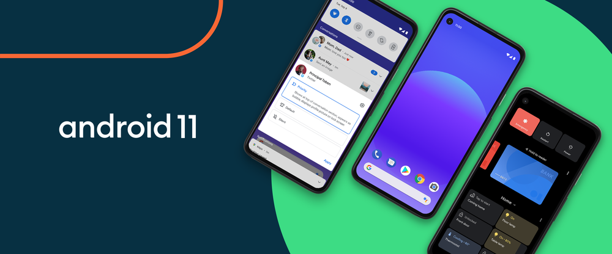

+++
title = "11 ميزة جديدة في أندرويد 11"
date = "2020-10-01"
description = "كما عودتنا جوجل في مثل هذا التوقيت من كل عام، ها نحن على موعد مع إصدار جديد من تحديثات نظام تشغيل الهواتف الذكية الأكثر استخدامًا في العالم، حيث بدأت جوجل بإرسال التحديث الجديد إلى أجهزة بيكسل بداية من 8 سبتمبر الماضي بالفعل. وخلافًا للأعوام الماضية بدأت العديد من الهواتف الأخرى بتلقي التحديث الجديد سواء النسخة التجريبية أو المستقرة مثل هواتف ASUS وOnePlus وXiaomi وOPPO وRealme وSamsung وذلك بفضل تغييرات نظام التحديثات التي قدمتها جوجل مع إصدار أندرويد السابق. ويشمل التحديث الجديد عددًا من الميزات المهمة للمستخدمين والتي تركز على جوانب الدردشة والمحادثات، وتحسين الخصوصية، والتحكم السهل في الأجهزة المتصلة بالهاتف."
categories = ["أندرويد",]
tags = ["مجلة لغة العصر"]

+++
كما عودتنا جوجل في مثل هذا التوقيت من كل عام، ها نحن على موعد مع إصدار جديد من تحديثات نظام تشغيل الهواتف الذكية الأكثر استخدامًا في العالم، حيث بدأت جوجل بإرسال التحديث الجديد إلى أجهزة بيكسل بداية من 8 سبتمبر الماضي بالفعل. وخلافًا للأعوام الماضية بدأت العديد من الهواتف الأخرى بتلقي التحديث الجديد سواء النسخة التجريبية أو المستقرة مثل هواتف ASUS وOnePlus وXiaomi وOPPO وRealme وSamsung وذلك بفضل تغييرات نظام التحديثات التي قدمتها جوجل مع إصدار أندرويد السابق. ويشمل التحديث الجديد عددًا من الميزات المهمة للمستخدمين والتي تركز على جوانب الدردشة والمحادثات، وتحسين الخصوصية، والتحكم السهل في الأجهزة المتصلة بالهاتف.

> ميزات وتحسينات تركز على المحادثات والخصوصية

وعلى الرغم من إضافة العديد من الميزات الجديدة بتحديث أندرويد 11، سيبدو النظام مألوفًا بمجرد تجربته إذا قمت باستخدام أندرويد 10 من قبل، وذلك لأن جوجل لم تقم بالكثير من التغييرات على مستوى واجهة النظام والتي تكون واضحة للمستخدم أكثر من التغييرات على مستوى النظام.

## 1- مساحة مخصصة لإشعارات المحادثات

مراسلة الأشخاص عبر مختلف تطبيقات التواصل من أكثر الأشياء التي نقوم بها بشكل يومي على هواتفنا الذكية. ويجعل أندرويد 11 الاطلاع على إشعارات المحادثات أسهل عن طريق تخصيص مساحة منفصلة لها في مركز الإشعارات بدلًا من ظهورها بجانب إشعارات التطبيقات الأخرى مما يسهل إدارة المحادثات في مكان واحد. كما أصبح بإمكانك تغيير أولوية المحادثات للأشخاص المهمين في حياتك حتى لا تفوتك أي رسالة منهم.

ويحاول نظام أندرويد تحديد التطبيقات التي يجب تضمينها في قسم المحادثات بشكل تلقائي، ولكن هذا الأمر ليس جيدًا كفاية بعد، حيث لا يظهر في هذا القسم سوى عدد قليل من التطبيقات. وللأسف لا توجد طريقة لإضافة التطبيقات يدويًا إلى قسم المحادثات ويجب على المستخدم الانتظار حتى يقوم مطورو التطبيقات بدعم هذه الميزة. ولكن على الجانب الآخر يمكنك إزالة أي من التطبيقات التي لا ترغب في ظهورها في هذا القسم من خلال الإعدادات.

ومع هذا التغيير، تقوم جوجل بإزالة منصات التواصل من المعادلة. فسواء كنت تتلقى رسالة عبر الواتس آب أو التيليجرام أو الفيس بوك أو حتى رسالة نصية قصيرة عادية، سيتم تمييز جميع المحادثات في الأعلى ليكون التركيز على الأشخاص وليس على التطبيق الذي أُرسلت باستخدامه الرسالة.

## 2- فقاعات الدردشة

في عام 2013، قدم تطبيق فيس بوك ماسنجر ميزة Chat Heads أو فقاعات المحادثات العائمة والتي تجعل الرسائل تظهر كفقاعات عائمة على جانب الشاشة. وبالضغط على هذه الفقاعات ستقوم بالتوسع وعرض المحادثة وإتاحة الرد عليها فوق كل ما هو موجود على شاشة هاتفك. وتجعل الفقاعات تعدد المهام على جهازك أمرًا سهلاً حيث تمكنك من الرد على المحادثات المهمة دون الحاجة إلى التبديل بين ما تفعله وبين تطبيق المراسلة.

وفي العام الماضي، قدمت جوجل لأول مرة واجهة برمجة فقاعات الدردشة مع أندرويد 10 تمهيدًا لتحل محل واجهة برمجة التطبيقات المتراكبة في إصدار أندرويد مستقبلي. والآن مع تحديث أندرويد 11، أصبحت هذه الميزة مستقرة كفاية ومتاحة بشكل افتراضي على النظام.

فمثلا إذا كنت تقوم بمحادثة على الواتس آب، ثم قمت بالتبديل إلى تطبيق آخر ووصلتك رسالة جديدة من المحادثة الجارية، فيمكنك تحويل هذا الإشعار إلى فقاعة دردشة تطفو في أي مكان على الشاشة. وبذلك تعمل فقاعة الدردشة كاختصار للعودة إلى المحادثة دون الحاجة إلى الخروج من التطبيق الذي تستخدمه، وتجعل تعدد المهام أكثر سهولة.

## 3- مسجل شاشة مدمج

على الرغم من وجود ميزة أخذ لقطات للشاشة في نظام أندرويد منذ إصداراته الأولى، إلا أنه لم يكن متاحًا في أي من الإصدارات السابقة تسجيل محتويات شاشتك دون الحاجة إلى تطبيق تابع لجهة خارجية.

أما فيما يخص واجهات أندرويد المعدلة الخاصة بالشركات، فقد أضافت Xiaomi مسجل شاشة إلى واجهتها الخاصة MIUI في عام 2017، وقدمت OPPO هذه الميزة في واجهة ColorOS 5.0، وأضافتها Samsung إلى واجهة One UI 2.0، وقامت OnePlus بدمج الميزة في OxygenOS 9.5 العام الماضي، إلا أن نظام أندرويد الافتراضي قد ظل متأخرًا، لكن أن تصل متأخرًا خير من ألا تصل أبدًا.

أضاف أندرويد 11 أخيرًا مسجل شاشة مدمج بالنظام يتيح لك تسجيل ومشاركة ما يحدث على هاتفك بسهولة، ويمكنك من تسجيل الصوت من الميكروفون أو الجهاز أو كليهما معا دون الحاجة إلى تطبيقات إضافية.

## 4- التحكم في الأجهزة المتصلة من خلال قائمة الطاقة

أحد أهم التغييرات في أندرويد 11 هي قائمة الطاقة، وهي أحد الأماكن التي لا نستخدمها كثيرًا لكن التحديث الجديد قام باستغلالها بشكل جيد يربط الهاتف الذكي بالمنزل الذكي. فبدلاً من استخدام تطبيق Home لإطفاء الأضواء أو التحكم في منظم الحرارة في منزلك الذكي، ستتمكن من القيام بذلك عبر قائمة الطاقة.

يؤدي الضغط لفترة طويلة على زر الطاقة إلى فتح قائمة الطاقة الجديدة والتي يمكنك من خلالها إضافة اختصارات وأزرار للتحكم في أجهزتك المنزلية الذكية من أي تطبيق على هاتفك يدعم هذه الميزة.

ولا تزال خيارات إيقاف تشغيل الهاتف أو إعادة تشغيله موجودة بقائمة الطاقة، لكن باقي القائمة أصبح يحتوي الآن على اختصارات الأجهزة المنزلية الذكية المرتبطة بحسابك على Google في تطبيق Home.

## 5- تحكم أفضل في الوسائط المتعددة

على الرغم من أن نظام iOS يتفوق على أندرويد عندما يتعلق الأمر بالتحكم في الوسائط، إلا أن جوجل تحاول تحسين ذلك في أندرويد 11. فقد تمت إعادة تصميم صندوق التحكم في الوسائط ليكتسب الآن مكانًا ثابتًا في قائمة الإعدادات السريعة بدلًا من مركز الإشعارات في الإصدارات السابقة.

يؤدي التمرير لأسفل مرة واحدة إلى إظهار صندوق التحكم في الوسائط، كما يؤدي التمرير سريعًا لأسفل مرة أخرى إلى توسيع الواجهة. وإذا كان لديك عدة تطبيقات تقوم بتشغيل الوسائط في الوقت نفسه، فيمكنك السحب لأحد الجانبين لتغيير صندوق التحكم.

وإذا كان التطبيق الذي يُشغل الوسائط يدعم أندرويد 11 فيمكنك أيضًا تغيير مكان تشغيل الوسائط عن طريق الضغط على اختصار الوصول السريع مثل Google Cast أو الجهاز الذي يتم تشغيل الصوت عليه لإظهار قائمة بالأجهزة المتصلة بالهاتف والتي يمكنك تشغيل الوسائط الحالية عليها بسهولة دون فتح التطبيق.

## 6- منح صلاحيات التطبيقات لمرة واحدة فقط

تعتبر الخصوصية مشكلة كبيرة لكل مستخدمي الهواتف الذكية، وللمساعدة في حل هذه المشكلة تضيف جوجل بشكل مستمر أدوات لحماية بياناتك الشخصية في مختلف منتجاتها. فقد أضاف تحديث أندرويد 10 بعض خيارات الأذونات المهمة مثل السماح باستخدام أحد الأمور مثل الوصول إلى الموقع الجغرافي فقط أثناء استخدام التطبيق، والآن أتي أندرويد 11 ليضيف المزيد.

يمكنك الآن إعطاء التطبيق الأذن لمرة واحدة فقط، مما يعني يمكنك السماح للتطبيق ما بالوصول إلى موقعك أو استخدام الكاميرا أو الميكروفون مرة واحدة فقط، وفي المرة القادمة التي يريد التطبيق فيها استخدام هذه المكونات سيطلب الإذن مرة أخرى.

## 7- الإلغاء التلقائي لصلاحيات التطبيقات

أيضا يقوم أندرويد 11 تلقائيًا بإلغاء أذونات التطبيقات التي لا تستخدمها كثيرًا. ستتلقى إشعارًا بمجرد إبطال الإذن لأحد التطبيقات، وستحصل على خيار منح هذا التطبيق صلاحية الوصول في المرة التالية التي تستخدمه فيها. وتعمل هذه الميزة على ضمان عدم قدرة التطبيقات التي لا تستخدمها على جمع البيانات في الخلفية.

## 8- الاتصال اللاسلكي بالسيارات

أصبحت ميزة Android Auto لتوصيل هواتف الاندرويد بالسيارات ومشاركة شاشة الهاتف تدعم إمكانية تفعيل الخاصية لاسلكياً دون الحاجة لتوصيل الهاتف عبر USB. وتعمل هذه الميزة طالما أن لديك وحدة رئيسية متوافقة أو جهاز استقبال. وتؤكد جوجل أن Android Auto اللاسلكي سيتطلب دعمًا لشبكات Wi-Fi بسرعة 5 جيجاهرتز. وبالتالي، لن تتوفر هذه الوظيفة في بعض المناطق الجغرافية.

## 9- تحديث النظام عبر متجر بلاي والتحديثات السلسة تصبح إجبارية

أحد أكبر التغييرات التي جاء بها أندرويد 10 العام الماضي على مستوي النظام هي Project Mainline، والذي يهدف إلى أن تتولى جوجل زمام أمور مكونات إطار العمل وتطبيقات النظام بعيدًا عن مصنعي الهواتف حتى تتمكن من إرسال المزيد من إصلاحات الأمان والخصوصية إلى الهواتف عن طريق متجر بلاي، بنفس طريقة تحديث التطبيقات. وبذلك ستحصل الهواتف على هذه الإصلاحات بمجرد توفرها دون الحاجة إلى انتظار تحديث نظام التشغيل. وقد وسعت جوجل هذا الأمر مع أندرويد 11 ليصبح عدد المكونات التي ستتولى جوجل القيام بتحديثها عبر جوجل بلاي بشكل إجباري 25 مكون.

وينطبق نفس الأمر أيضًا على التحديثات السلسة، التي تضمن قدرة المستخدم على استخدام الهاتف عند تثبيت تحديث هوائي جديد. حيث تعتمد التحديثات السلسة على استخدام قسمين من النظام لتقليل وقت التوقف عن العمل عند تثبيت التحديث. فإذا كان هاتفك مثلًا يستخدم القسم أ حاليًا وتلقيت تحديث هوائي فسيتم تنزيل التحديث وثبيته في القسم ب في الخلفية بينما تستمر في استخدام هاتفك. وعند إعادة تشغيل هاتفك، سيتم استخدام القسم ب من النظام والذي يحتوي على التحديث الجديد. 

يضمن هذا النظام أيضًا وجود احتياطي في حالة عدم تثبيت تحديث OTA بشكل صحيح لأي سبب من الأسباب. وفي حالة فشل التحديث الموجود بالقسم ب في التشغيل، فسيعود النظام إلى الإصدار الأقدم الذي لا يزال مثبتًا على القسم أ.

## 10- مزيد من الخصوصية لمستخدمي هواتف العمل

بالنسبة لمستخدمي Android Enterprise، يوفر أندرويد 11 حماية أفضل للخصوصية أثناء استخدام الموظفين للهاتف المملوك لجهة العمل، وذلك عن طريق إنشاء ملف شخصي منفصل للعمل بحيث يتم عزل الحياة الشخصية عن الحياة العملية ووضع حد للمعلومات التي يمكن لجهة العمل الوصول إليها.

## 11- ميزات حصرية لمستخدمي هواتف بيكسل

وكما فعلت جوجل مع أندرويد 10، سيكون هناك بعض الميزات الجديدة الحصرية لأجهزة بيكسل التي تصنعها، ومن المحتمل أن يتم توفير هذه الميزات من خلال Pixel Launcher مغلق المصدر وخدمات تخصيص الجهاز. وتشمل هذه الميزات أمورًا مثل أدوات تنظيم وإدارة الهاتف كاقتراحات التطبيقات بناءً على الروتين اليومي وإمكانية نسخ النصوص والصور الموجودة بلقطات الشاشة.

---

هذا الموضوع نُشر باﻷصل في مجلة لغة العصر العدد 238 شهر 10-2020 ويمكن الإطلاع عليه [هنا](https://drive.google.com/file/d/10yGy3Wdzek_WEmmI2v3_tN8vRzFZbC1D/view?usp=sharing).

