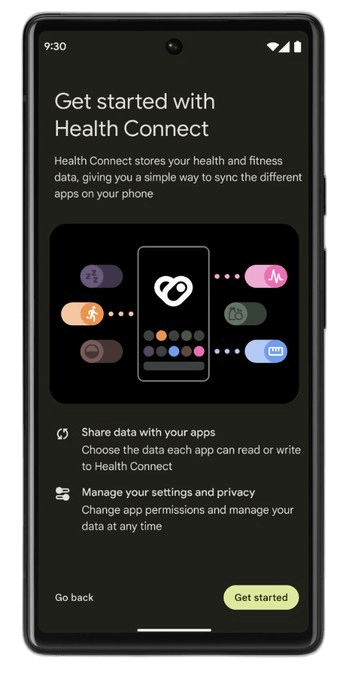
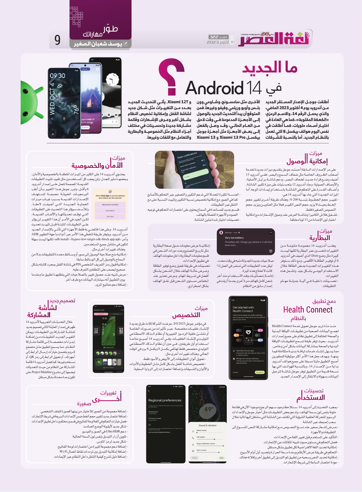

+++
title = "ما الجديد في أندرويد 14؟"
date = "2023-10-30"
description = "أطلقت جوجل الإصدار المستقر الجديد من أندرويد يوم 4 أكتوبر 2023K والذي يحمل الرَّقْم 14 والاسم الرمزي "الكعكة المقلوبة" كما هي العادة في اختيار أسماء حَلْوَيَات، كما أطلقت في نفس اليوم هواتف بيكسل 8 التي تعمل بالنظام الجديد. أما بالنسبة للشركات الأخرى مثل سامسونج، وشاومي وون بلس وأوبو وريلمي وفيفو وغيرهم فمن المتوقع أن يبدأ التحديث الجديد بالوصول إلى الأجهزة المدعومة في وقت لاحق من العام الحالي، وقد وصل فعلًا إلى بعض الأجهزة مثل أجهزة جوجل بيكسل Xiaomi 13 Pro و Xiaomi 13 و Xiaomi 12T. يأتي التحديث الجديد بعدد من التغييرات مثل شكل جديد لشاشة القُفْل وإمكانية تخصيص النظام بشكل أكبر وعرض اﻹشعارات وقائمة مشاركة جديدة وتحسينات في مختلف أجزاء النظام مثل الخصوصية والبطارية والتعامل مع اللغات وغيرها."
categories = ["أندرويد",]
tags = ["مجلة لغة العصر"]

+++

أطلقت جوجل الإصدار المستقر الجديد من أندرويد يوم 4 أكتوبر 2023، ولذي يحمل الرَّقْم 14 والاسم الرمزي "الكعكة المقلوبة" كما هي العادة في اختيار أسماء حَلْوَيَات، كما أطلقت في نفس اليوم هواتف بيكسل 8 التي تعمل بالنظام الجديد. أما بالنسبة للشركات الأخرى مثل سامسونج، وشاومي وون بلس وأوبو وريلمي وفيفو وغيرهم فمن المتوقع أن يبدأ التحديث الجديد بالوصول إلى الأجهزة المدعومة في وقت لاحق من العام الحالي، وقد وصل فعلًا إلى بعض الأجهزة مثل أجهزة جوجل بيكسل Xiaomi 13 Pro و Xiaomi 13 و Xiaomi 12T. يأتي التحديث الجديد بعدد من التغييرات مثل شكل جديد لشاشة القُفْل وإمكانية تخصيص النظام بشكل أكبر وعرض اﻹشعارات وقائمة مشاركة جديدة وتحسينات في مختلف أجزاء النظام مثل الخصوصية والبطارية والتعامل مع اللغات وغيرها.

## ميزات إمكانية الوصول

على مر اﻹصدارات السابقة أحسنت جوجل بتقديم ميزات جديدة لخدمة أصحاب الظروف الخاصة مثل ضعاف السمع والبصر، ففي أندرويد 13 أضيف وضع قراءة جديد لضعاف البصر، ودعم شاشة برايل الأصلية، والأوصاف الصوتية، وجاء أندرويد 12 بتحسنيات على مِيزة تكبير الشاشة وأضاف القدرة على التحكم في الشاشة باستخدام إيماءات الوجه. أما الميزات الجديدة التي جاء بها أندرويد 14 هي:

- تغيير حجم الخطوط بنسبة 200%، وهناك طريقة أخرى لتغيير حجم الخط بحيث لا يزيد حجم النص الكبير فعلًا مثل العناوين ويزيد حجم النصوص الصغيرة فقط.
- تشغيل فلاش الكاميرا وشاشة العرض عند وصول الإشعارات مع إمكانية اختيار لون الإضاءة من 13 لون مختلف.
- العدسة المكبرة المحدثة التي تدعم التكبير والتصغير عبر التحكم بالأصابع كما في الصور مع إمكانية تخصيص نسبة التكبير وتثبيت النسبة حتى مع التنقل عبر التطبيقات.
- قسم جديد للمساعدة في السماع يحتوى على اختصارات التحكم في توجيه الصوت والأجهزة المتصلة بالهاتف.
- تحسينات اختيار شدة تباين الشاشة.

## ميزات البطارية

يجلب أندرويد 14 مجموعة متنوعة من التغييرات لتحسين عمر البطارية لكنها ليست كبيرة مثل وضع Doze الذي أضيف في أندرويد 6 أو توفير الطاقة اﻷقصى، ومع ذلك ستوفر هذه التغييرات الجديدة بعض الطاقة خلال الاستخدام اليومي بشكل جيد. وتشمل هذه التغييرات:

- تحسينات داخلية في آلية جدولة مهام التطبيقات.
- صلاحيات جديدة لجدولة منبه في وقت محدد، ليقل عدد التطبيقات التي تستمر في العمل إذا كانت لا تحتاج هذه المِيزة.
- إتاحة إحصائيات وقت الاستخدام منذ آخر شحن كامل للهاتف مرة أخرى بعدما أزيلت في إصدار سابق من النظام.
- إمكانية عرض معلومات حول صحة البطارية مثل تاريخ التصنيع وعدد دورات الشحن في قسم معلومات البطارية داخل معلومات الهاتف في تطبيق اﻹعدادات.
- تحسينات على طريقة تفعيل وضع توفير الطاقة وعرض حالة الهاتف خلال الشحن بشكل أفضل في شريط المهام، وعرض تحذير عند انخفاض مستوى الشحن قبل غلق الهاتف بشكل اضطراري.

## ميزات الأمان والخصوصية

يحتوي أندرويد 14 على الكثير من الميزات المتعلقة بالخصوصية والأمان، وبعضها مثير للجدل ولن يعجب كل المستخدمين مثل تقييد تثبيت التطبيقات القديمة المصممة لتعمل على إصدار أندرويد 6 وأقل، وتبرر جوجل هذا التغيير بأن أغلب البرمجيات الخبيثة مصممة لتستهدف الإصدارات القديمة بسبب غياب ميزات الحماية الجديدة التي أضيفت لاحقا، وللأسف سيؤثر هذا التحديث على التطبيقات التي توقف تحديثاتها والألعاب القديمة، لكن الجيد في الأمر أن هذا التغيير لن يؤثر على التطبيقات المثبتة قبل تثبيت تحديث أندرويد 14، وعلى هذا فالمعني به فقط الأجهزة التي تأتي بالإصدار الجديد من أندرويد. ويتوفر طريقة لتخطي هذا اﻷمر عبر أدوات واجهة التطوير ADB وأمر "adb install --bypass-low-target-sdk-block app.apk" لكنها ليست سهلة لتكون في متناول جميع المستخدمين.

وهناك تغييرات أخرى مثل:

- إمكانية منح صَلاحِيَة الوصول إلى صور أو وسائط محددة للتطبيقات بدلا من السماح بالوصول إلى كل الوسائط سابقًا.
- إمكانية قَبُول رمز التعريف الشخصي PIN في شاشة القُفْل بمجرد كتابته بشكل صحيح ليصعب على المتطفلين التعرف عليه.
- عرض تنبيه عند حصول تغيير بالصلاحيات التي يتطلبها تطبيق ما وعندما يبين التطبيق أنه سيشارك البيانات مع طرف آخر.
- إضافة دعم مفاتيح المرور.

## دمج تطبيق Health Connect بالنظام

منذ مدّة تريد جوجل تحويل خدمة Health Connect لجمع البيانات الصحية من تطبيقات اللِّيَاقَة البدنية والصحة المختلفة إلى تطبيق نظام على جميع إصدارات أندرويد، بحيث توفر طبقة تسمح لتطبيقات اللِّيَاقَة البدنية والصحة بمشاركة البيانات بشكل آمن وخاص، مما يسهل إنشاء خِدْمَات لِيَاقَة بدنية متكاملة فِيما بينها، وبهدف جعل هذا الأمر أكثر موثوقية للمطورين أصبح التطبيق مثبتًا مسبقًا على جميع هواتف أندرويد بداية من اﻹصدار 14، وبالنسبة للهواتف التي بها نسخة قديمة من التطبيق توفر جوجل شاشة لترحيل البيانات بسهولة والانتقال إلى الإصدار الجديد.

## ميزات التخصيص

في مؤتمر جوجل I/O 2023، عرضت الشركة ثلاث طرق جديدة لإنشاء خلفيات مخصصة، عبر تأثيرات من صورك الخاصة أو مُنشئ خلفية الرموز التعبيرية أو نظام الذكاء الاصطناعي التوليدي لإنشاء الخلفيات. وفي أندرويد 14 أصبح متاحًا استخدام أول طريقتين، في حين أن نظام الذكاء الاصطناعي التوليدي مخصص فقط لهاتفي بيكسل 8 وبيكسل 8 برو في الوقت الحالي. وهناك تغييرات أخرى مثل:

- تحويل ألوان التطبيقات إلى الأبيض والأسود فقط.
- تخصيص شاشة القُفْل بشكل كامل مثل الخطوط والأدوات والألوان والتنسيقات وإضافة اختصارات إلى الزوايا السفلية.

## تصميم جديد لشاشة المشاركة

خلال التحديثات التجريبية لأندرويد 14 ظهر في إصدار المعاينة الثاني تصميم جديد لشاشة المشاركة بين التطبيقات، ويمكن التغيير الجديد التطبيقات من إضافة إجراءات مخصصة إلى قائمة مشاركة النظام، مما يسمح لتطبيق مثل متصفح كروم بتضمين خيارات إرسال الرابط إلى أجهزتك، أو تحويل الرابط إلى رمز QR، أو نسخه وغيرها. كما فصل أندرويد 14 قائمة المشاركة عن النظام من حيث التحديثات ليضمها إلى مشروع Project Mainline حتى تكون وحدة محدثة بشكل مستقل.

## تحسينات الاستخدام

- بمجرد التحديث إلى أندرويد 14، ستلاحظ وجود سهم الرجوع موجود الآن في فقاعة ملونة بنفس لون سمة الهاتف، وتدعم بعض التطبيقات مثل أخبار جوجل والإعدادات الرسوم المتحركة الخلفية التنبؤية التي تكشف عن الشاشة التي ستنتقل إليها تاليًا خلال سحب إصبعك عبر الشاشة.
- عرض إشعار صغير عند نسخ النصوص مع إمكانية مشاركة النص المنسوخ إلى التطبيقات والأجهزة.
- التأكيد على المستخدم قبل تغيير اللغة من الإعدادات.
- فصل التحكم في مستوى صوت تنبيه المكالمات عن اﻹشعارات.

- إمكانية تحديد اللغة الافتراضية لكل تطبيق بشكل مستقل.
- التحكم في طريقة عرض الأرقام ووحدة درجة الحرارة وتحديد أول أيام الأسبوع.
- إمكانية تحديد النص وسحبه من تطبيق ثم التبديل إلى تطبيق آخر وإفلاته هناك.
- عودة اختصار الساعة إلى شريط اﻹشعارات.

## تغييرات أخرى صغيرة

- إضافة مجموعة من الصور لاختيار صورة للملف الشخصي منها.
- إضافة اختصار جديد لتغيير حجم الخط ضمن اﻹعدادات السريعة في شريط اﻹشعارات.
- فصل خيارات التحكم في اللغة لوحة المفاتيح في قسمين مختلفين داخل تطبيق اﻹعدادات.
- شكل جديد لأيقونة الوضع الصامت.
- دعم Ultra HDR في الصور والفيديو.
- تلوين أزرار التبديل بنفس لون السمة الحالية.
- شكل جديد لرمز الماوس.
- إضافة دعم مجموعة كبيرة من اختصارات لوحة المفاتيح.
- إضافة إمكانية التبديل بين ترددات نِقَاط اتصال Wi-Fi.
- إضافة دليل لشرح كيفية التنقل داخل النظام عبر الإيماءات.

---

هذا الموضوع نُشر باﻷصل في مجلة لغة العصر العدد 322 شهر 10-2023 ويمكن الإطلاع عليه [هنا](https://drive.google.com/file/d/1oTpmizCiGwHMVsZ_mjnUA0VJbfwFi605/view?usp=drive_link).

