+++
title = "ما الجديد في أندرويد 9؟"
date = "2018-12-03"
description = "منذ إعلان جوجل عن أندرويد 9 في شهر مايو الماضي، وحتى صدوره بشكل رسمي في أغسطس تحت اسم \"Pie\" أو \"الفطيرة\" بات من الواضح أن هذا التحديث الجديد يعد نقله كبيرة، بل إنه أكبر تحديث لنظام أندرويد منذ أكثر من 4 سنوات، متضمنا العديد من التغييرات، سواء على مستوي واجهة المستخدم، أو التعامل مع التطبيقات أو المميزات الجديدة وحتى التفاصيل الصغيرة."
categories = ["أندرويد",]
tags = ["مجلة لغة العصر"]

+++
منذ إعلان جوجل عن أندرويد 9 في شهر مايو الماضي، وحتى صدوره بشكل رسمي في أغسطس تحت اسم "Pie” أو "الفطيرة" بات من الواضح أن هذا التحديث الجديد يعد نقله كبيرة، بل إنه أكبر تحديث لنظام أندرويد منذ أكثر من 4 سنوات، متضمنا العديد من التغييرات، سواء على مستوي واجهة المستخدم، أو التعامل مع التطبيقات أو المميزات الجديدة وحتى التفاصيل الصغيرة.

> تغييرات سمتها الذكاء والبساطة ومزيد من الرفاهية

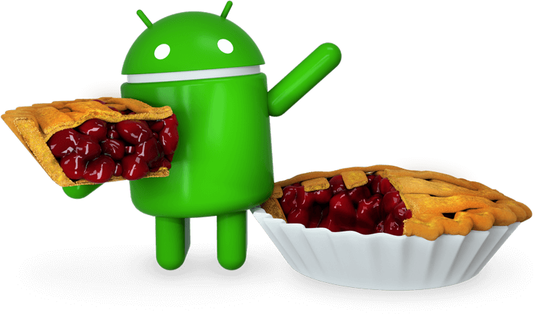

تتبع جوجل جدول ثابت تمر به المراحل المختلفة للتحديث لكن المفاجأة هذا العام كانت إطلاق النظام بشكل مبكر وتحديدا في 6 أغسطس الماضي. وكالعادة، وصل التحديث لأجهزة جوجل بيكسل المختلفة في نفس اليوم. إلى جانب جهاز Essential ph-1 الذي كان إنجازا غير مسبوق كأول جهاز ليس من جوجل يصله التحديث الجديد.

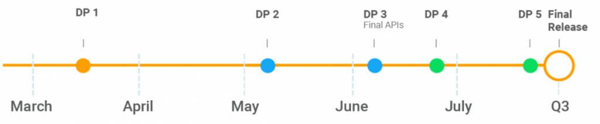

## واجهة مستخدم جديدة

أول ما سيلفت انتباهك عند تجربة أندرويد 9 هو الشكل الجديد للنظام، والذي يخلف بشكل كبير عن أندرويد 8، فقد تم تحديث كل شيء من الإعدادات إلى الإشعارات. وهذا الشكل الجديد يتوافق مع التصميم الجديد من جوجل ومع الكثير من تطبيقات أندرويد أيضًا. 

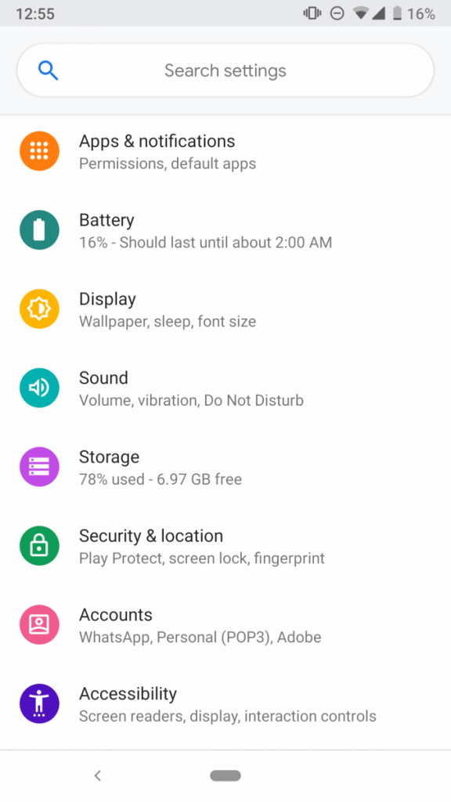

ويظهر هذا التغيير بوضوح في كل من تطبيق الإعدادات ومشغل التطبيقات وشريط الإشعارات والإعدادات السريعة.

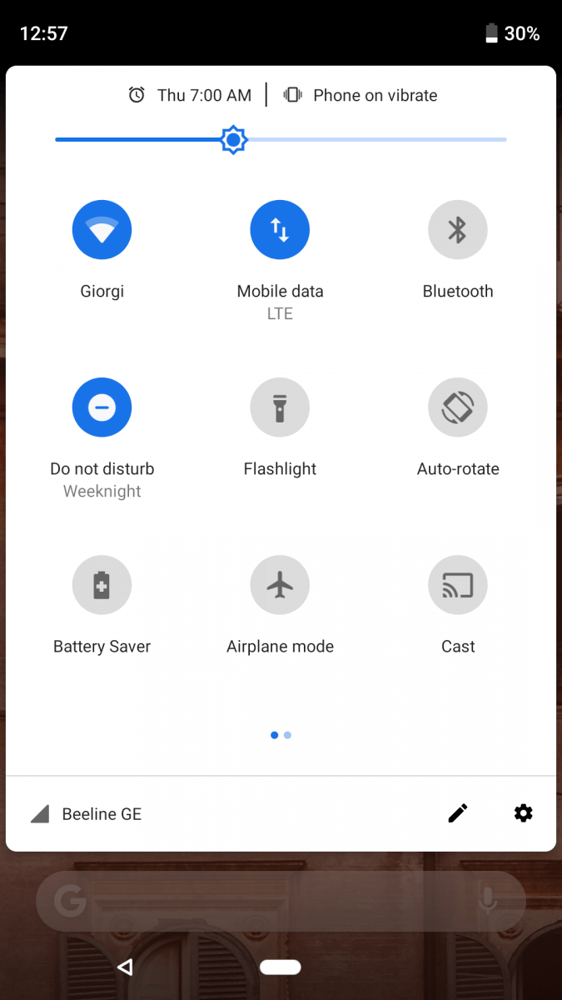

ولعل التغيير الأبرز في شريط الحالة هو نقل الساعة إلى الجانب الأيسر، وذلك لمزيد من التوافق مع الأجهزة التي تحتوي على "نوتش" أو "نتوء الشاشة".

## شكل جديد لإشعارات للرسائل

واحد من التغييرات المثيرة للجدل بعض الشيء. فكما تلاحظون في لقطات الشاشة، فإن الإشعارات يمكنها عرض المحادثات كاملة، إلى جانب الملصقات والصور. وتتوفر أيضًا الردود الذكية، على غرار ما يقدمه تطبيق Reply المعروف.

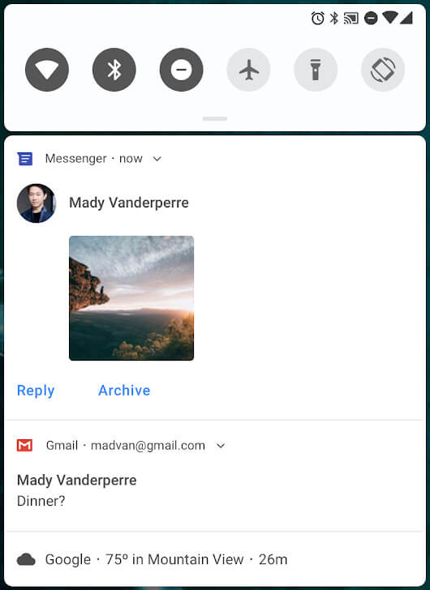

وعندما تضغط على الإشعار لفترة طويلة، يظهر لك الأزرار "إيقاف الإشعارات" و "الاستمرار في العرض". وهي طريقة سريعة لتحديد ما إذا كنت تريد إشعارات من أحد التطبيقات دون الغوص في الإعدادات.

## إيماءات التنقل

كان حل أبل لإزالة زر الصفحة الرئيسية في هاتف iPhone X هو إضافة نظام إيماءات. ثم تبعها العديد من صانعي أجهزة أندرويد حيث كان كل من OnePlus وXiaomi من بين الأوائل الذين قاموا بتنفيذ الإيماءات على الواجهات الخاصة بهم. والآن حان دور جوجل أيضًا لإضافة إيماءات التنقل إلى أندرويد مع التحديث الجديد.

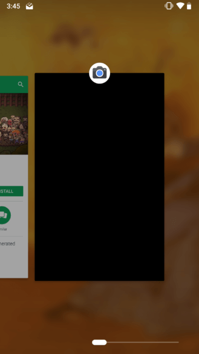

لا تعمل إيماءات أندرويد 9 مثل معظم الهواتف الأخرى. فلا يزال هناك شريط التنقل في الجزء السفلي من الشاشة. أصبح زر "المنزل" الآن عبارة عن شكل حبة يمكن تمريرها بشكل سريع أو من جانب إلى جانب. يؤدي التمرير السريع لأعلى إلى فتح مبدل التطبيقات الحديثة ويمكنه أيضًا فتح درج التطبيق من أي مكان. بينما يؤدي التمرير سريعًا إلى اليسار سريعًا إلى التطبيق السابق، أو يمكنك تحريك الحبة ذهابًا وإيابًا للتمرير عبر جميع التطبيقات الحديثة.

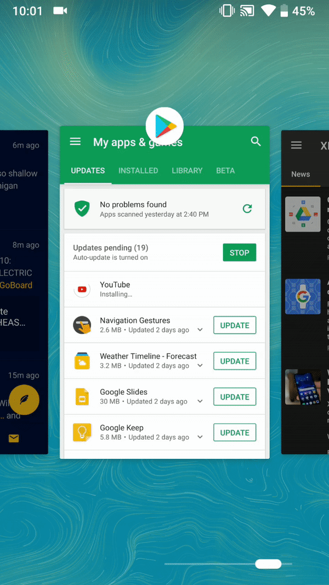

## مبدل التطبيقات الحديثة

ولتتماشى الأمور مع الإيماءات الجديدة، يحتوي أندرويد 9 على واجهة مستخدم جديدة تمامًا للتطبيقات الحديثة. عبارة عن قائمة أفقية مع نوافذ لا تتداخل مع بعضها. مما يجعل من السهل معرفة ما كنت تفعله في التطبيق. وأصبح من الأسهل أيضًا تشغيل وضع تقسيم الشاشة عن طريق الضغط باستمرار على رمز التطبيق. وإذا كنت تستخدم مشغل بيكسل، فستحصل أيضًا على شريط التطبيقات وشريط البحث أسفل الشاشة.

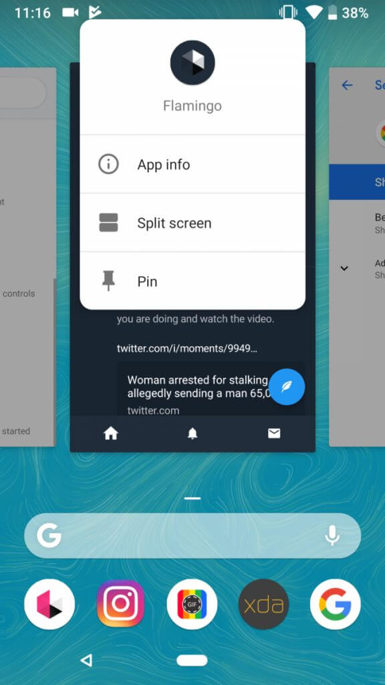

أحد الأشياء الرائعة حقًا حول شاشة مبدل التطبيقات الجديدة هي القدرة على التفاعل مع التطبيقات دون الدخول بشكل كامل. يمكنك الضغط لفترة طويلة لتحديد النص والصور مباشرة مما يجعل تعدد المهام أسهل بكثير.

## البطارية المتكيفة

يقدم أندرويد 9 أيضًا بعض الحيل المدعومة بالذكاء الاصطناعي لإطالة عمر بطارية هاتفك، حيث يلاحظ النظام التطبيقات التي تستخدمها بشكل متكرر، وعدد مرات استخدامها، ثم يطبق قيودًا على التطبيقات التي تستخدمها بشكل أقل بحيث تستهلك طاقة أقل.

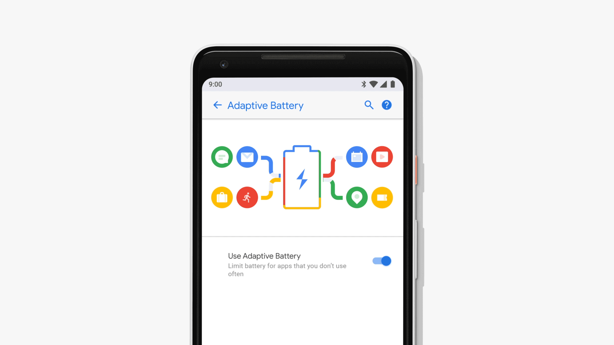

## السطوع المتكيف

يقدم أندرويد 9 السطوع المتكيف بطريقة جديدة تعتمد على الذكاء الاصطناعي. فبمجرد تمكينه سوف يتوافق السطوع المتكيف تلقائيًا مع الأجواء التي تتواجد بها كما هو الحال دائمًا، ولكنه سيتعلم أيضًا كيفية تعديل السطوع في هذه الظروف. لذا إذا كنت تميل دائمًا إلى خفض سطوع الشاشة أكثر قليلاً عند إيقاف تشغيل الأضواء، فسيتعرف أندرويد على هذا السلوك ويقوم بعمله من أجلك قريبًا.

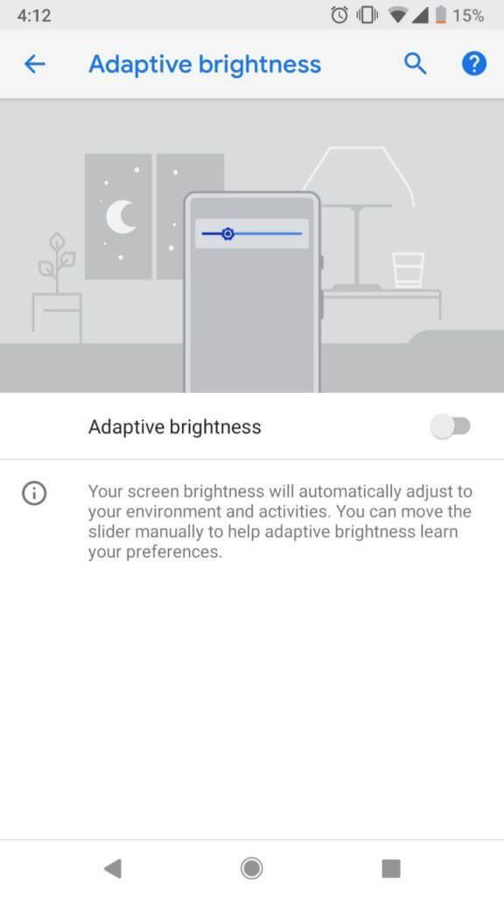

## إجراءات التطبيق

ميزة أخرى تعمل بالذكاء الاصطناعي هي إجراءات التطبيقات. ومفهومها بسيط جدًا: استنادًا إلى ما تفعله عادةً بهاتفك، وجهات الاتصال الأكثر تكرارًا، وإحصاءات الاستخدام الأخرى، سيحاول النظام أخذ زمام المبادرة والتنبؤ بما ستفعله وتقديم اقتراحات بشأن ما يمكنك إجراء ذلك من خلال هاتفك، وليس بالضرورة تطبيقًا، ولكنه قد يقترح أيضًا المهام واختصارات التطبيقات وأشياء أخرى. إذا كنت تحب التحدث مع الآخرين على الواتساب، فقد يظهر اختصار لهذه الدردشة الخاصة على المشغل الخاص بك، وهكذا.

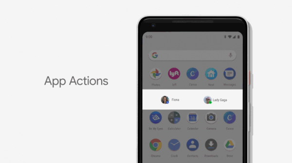

## الشرائح

تعتبر الشرائح طريقة جديدة لعرض محتوى من تطبيق على شكل أجزاء تفاعلية من ضمن تطبيق آخر. فمثلا لو كنت تبحث عن اسم شارع معين فقد تظهر لك شريحة من تطبيق الخرائط تعرض عليك بدء التنقل لهذا المكان، ويتم إطلاقها مباشرة في هذا الإجراء في التطبيق. من شأن هذا أن يوفر عليك الوقت من التبديل داخل التطبيقات وخارجها.

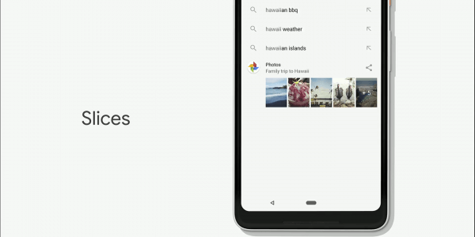

## الرفاهية الرقمية

تحدثت جوجل كثيرًا عن الرفاهية الرقمية "Digital Wellbeing" عندما كانت تستعرض تحديث أندرويد 9. وكان واضحًا أنه جزء مهم من الإصدار الجديد. ومن الغريب أن Digital Wellbeing تعمل على مساعدة المستخدمين على استخدام هواتفهم بشكل أقل.

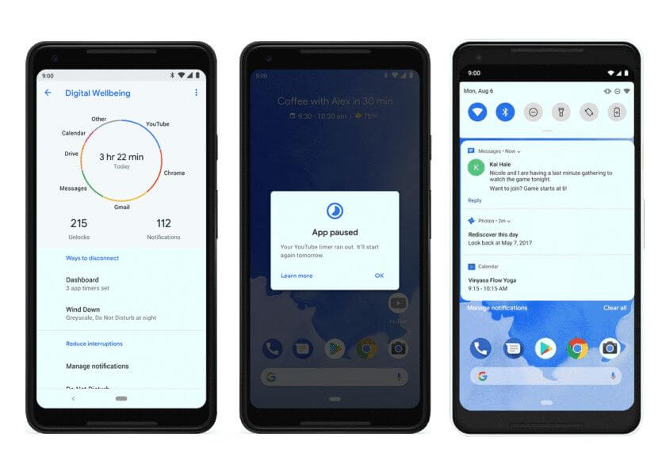

تعرض لوحة التحكم مقدار الوقت الذي يقضيه المستخدمون في هواتفهم والتطبيقات التي يستخدمونها في هذا الوقت. حتى أنها تعرض عدد عمليات إلغاء القفل والإعلامات التي تلقيتها. بينما يسمح مؤقت التطبيقات للمستخدمين بتقييد استخدام التطبيق لفترة زمنية محددة. وبعد انقضاء المدة لا يمنع النظام المستخدم من الوصول إلى التطبيق، لكن أيقونته ستفقد ألوانها وتتحول إلى الأبيض والأسود كوسيلة لتذكير المستخدم بعدم الضغط عليها.

## مؤثرات انتقالية جديدة

تغيير ملحوظ أخر مع التحديث الجديد، فتوجد تأثيرات جديدة للانتقال بين الأنشطة، وحتى فتح نشاط من الإشعارات.
يمكنك مشاهدتها في الفيديوهات التالية:
https://www.youtube.com/watch?v=Eqwge3hRYO8
https://www.youtube.com/watch?v=OFATDhoSsQs
https://www.youtube.com/watch?v=qZahgza79F8
https://www.youtube.com/watch?v=59QmzQZZQHk
https://www.youtube.com/watch?v=dr3Xvb7Tk-I

## طريقة جديدة للتحكم في الصوت

تم إعادة تصميم كيفية التحكم في الصوت، فتظهر لوحة الصوت الآن على جانب الشاشة بدلاً من الأعلى، ويعمل الضغط على أزرار الصوت على التحكم في صوت الوسائط بدلا من صوت المكالمات. كما يمكن التبديل بين أجهزة الوسائط المتصلة عبر البلوتوث عن طريق نافذة منبثقة تظهر عند الضغط على مفتاح السهم في لوحة الصوت.

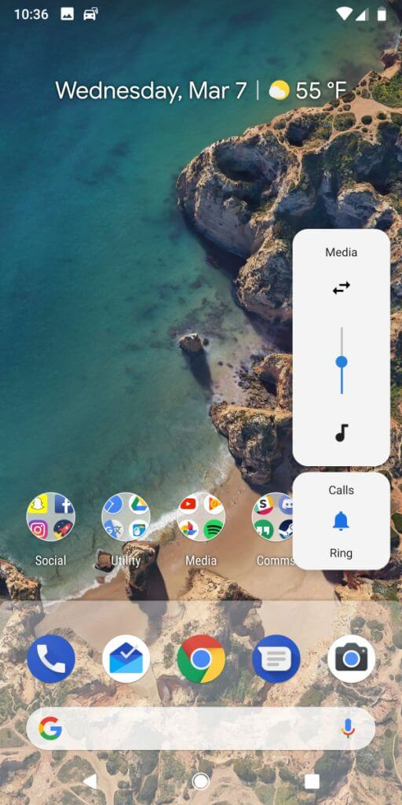

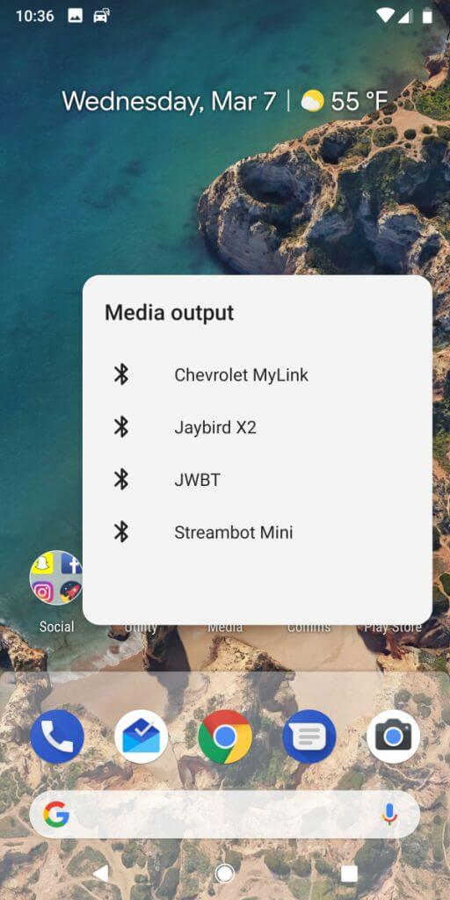

## مشغل بيكسل

حصل على تغييرات صغيرة، مثل شريط البحث الضي يحتوي الآن على رمز الميكروفون بحيث يمكنك بدء بحث صوتي. كما أصبحت الخلفية الآن أكثر وضوحًا، لذا نتيجة لمحاذاة التطبيقات أسفل الشاشة.

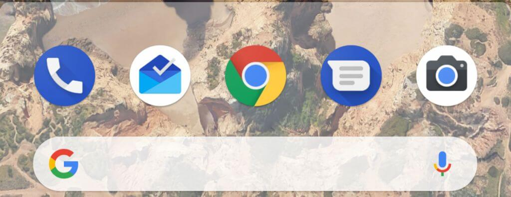

## وضع توفير البطارية

هل تذكر كيف كان تشغيل وضع توفير البطارية في الإصدارات السابقة يؤدي إلى ظهور الشريط البرتقالي المزعج؟ لحسن الحظ تم التخلص منه مع تحديث أندرويد 9.0! كما يمكن الآن جدولة وضع توفير الطاقة كما ترغب، بخلاف أندرويد 8 الذي يتيح لك فقط جدولة وضع توفير شحن البطارية عند النسبتين 5 و15٪ من البطارية المتبقية. فيوسع أندرويد 9.0 دائرة الاختيارات من خلال إعطائك شريط تمرير لاختيار مستوى بطارية دقيق يبدأ تفعيل توفير شحن البطارية عنده.

## وضع الشاشة الدائمة يعرض الآن معلومات البطارية

العديد من الهواتف الجديدة تدعم وضع "الشاشة الدائمة" أو "Always on Display” والذي كان يعرض سابقا الوقت والتاريخ فقط، أما الآن فتظهر معلومات حول شحن البطارية ومعلومات الوسائط التي تعمل في الخلفية أيضا، وعلاوة على ذلك، يوجد فاصل جديد بين معلومات الوقت والإشعار. وأخيرً، تتمركز الإشعارات في منتصف الشاشة تماما.

## طريقة جديدة لعرض معلومات الهاتف

تظهر المعلومات الآن في نافذة منبثقة عند النقر على عناصر معينة داخل القسم حول الهاتف من تطبيق الإعدادات.

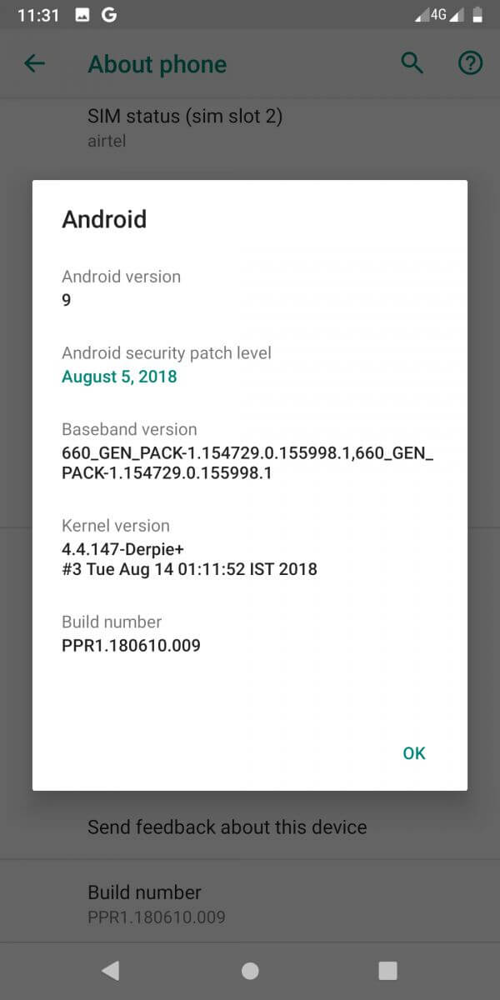

## مزيد من الإضافات إلى لقطات الشاشة

من الأشياء التي افتقدها نظام أندرويد بشدة لوقت طويل محرر لقطات الشاشة. فقبل ذلك، إذا كنت تريد تعديل لقطة شاشة على هاتف أندرويد فسيتعين عليك تثبيت تطبيق لتعديل لقطات الشاشة من جهة خارجية. لكن الآن عند التقاط صورة من شاشة سيظهر زر "تعديل" جديد يفتح محرّر الشاشة الأساسي. (تجدر الإشارة إلى أن معظم صانعي الأجهزة لديهم مثل هذه الميزة بالفعل في الواجهات الخاصة بهم).

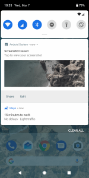

أيضا تم إضافة اختيار التقاط صورة من الشاشة إلى قائمة الطاقة، فلن تضطر بعد الآن إلى الضغط على مجموعة من المفاتيح لالتقاط صورة.

## إغلاق نقطة الاتصال تلقائيا عند عدم وجود أجهزة متصلة بها

تغيير صغير آخر، لكنه إضافة مرحب بها في ميزة نقطة الاتصال (الهوت سبوت). حيث يقوم النظام بإيقاف تشغيل نقطة الاتصال تلقائيًا إذا لم تكن هناك أجهزة متصلة حاليًا. مما يضمن عدم استنزاف بطارية جهازك عند عدم استخدام نقطة الاتصال بشكل نشط.

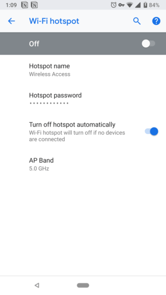

## تحكم أفضل بشبكات الواي فاي

إذا كنت متصلاً بشبكة Wi-Fi مقيدة بكمية محددة من البيانات يجب عليك دائما توخي الحذر بشأن مقدار التحميل. ومع التحديث الجديد يمكن أن يكتشف النظام تلقائيًا إذا كانت الشبكة مقيدة ويمكنك أيضا تحديد الشبكة يدويًا كما ترغب.

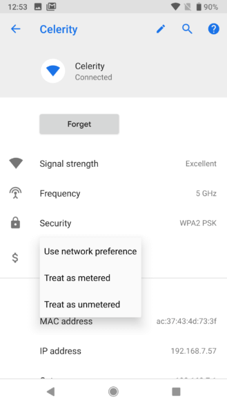

## التحكم في الاهتزاز

ضمن إعدادات إمكانية الوصول، هناك إعداد جديد للتحكم في الاهتزاز تمت إضافته. حيث يتيح لك ذلك تحديد ما إذا كنت تريد تشغيل الاهتزازات أو إيقافها للرنين والإشعارات واللمس. ويمكنك أيضًا اختيار مستوي الاهتزازات.

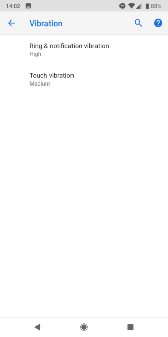

## الثيم المظلم

يمكنك الآن تبديل المظهر للثيم المظلم يدويًا في إعدادات العرض ضمن فئة سمة الجهاز.

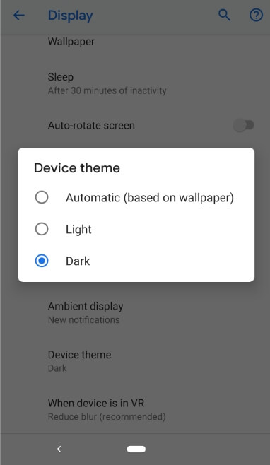

## التنقل في الأماكن المغلقة

يدعم أندرويد 9.0 الآن بروتوكول IEEE 802.11mc Wi-Fi الذي يُعرف أيضًا باسم Wi-Fi Round-Trip-Time (RTT). وتتيح هذه الميزة الجديدة التجول باستخدام GPS في الأماكن المغلقة من خلال تحديد موقعك داخل المبنى وتسهيل التوجيهات منعطف بمنعطف داخل المباني.

## دعم نتوء الشاشة

سواء كنت تحب ذلك أم لا، فإن كل شركة مصنعة للهواتف الذكية بدأت تتبع موضة “النوتش”. ويتميز أندرويد 9 بدعم الشاشات ذات الأبعاد الجديدة بشكل أفضل وكافة أشكال النتوءات المختلفة مثل الضيقة والطويلة والعريضة. ويمكنك التحكم في دعم النوتش بشكل يدوي بعد تمكين خيارات المطورين. والانتقال إلى Developer options > Drawing > Simulate a display with a cutout، ثم اختر حجم قطع الشاشة.

إذن كما رأينا، يتابع أندرويد باي الأسلوب الجديد الذي بدأت تتخذه جوجل، حيث وضع كل شيء تقريبا في مكانه الصحيح، مع الالتزام بالبساطة وعدم التكلف والاعتماد على الذكاء الاصطناعي، ومن المتوقع أن يبدأ التحديث في الوصول إلى باقي الأجهزة في وقت لاحق من هذا العام.

---

هذا الموضوع نُشر باﻷصل في مجلة لغة العصر العدد 1 شهر 1 ويمكن الإطلاع عليه هنا.

هذا الموضوع نُشر باﻷصل في مجلة لغة العصر العدد 216 شهر 12-2018 ويمكن الإطلاع عليه [هنا](https://drive.google.com/file/d/18TzxpJ64gqA7SWZsUk-s9GLsvVYcz0sc/view?usp=sharing).

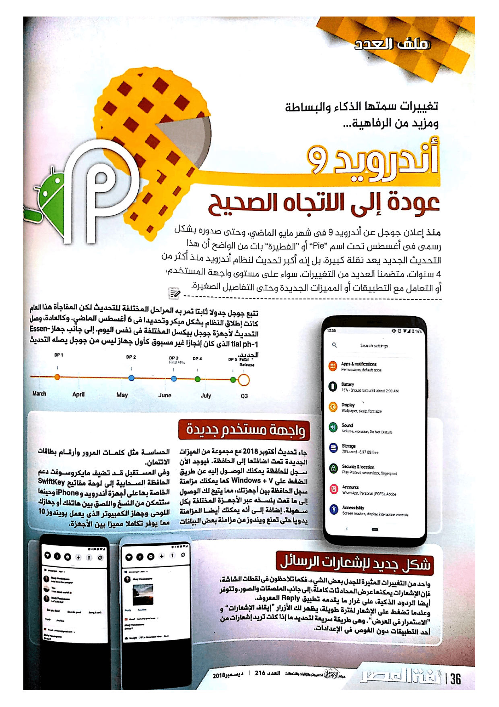

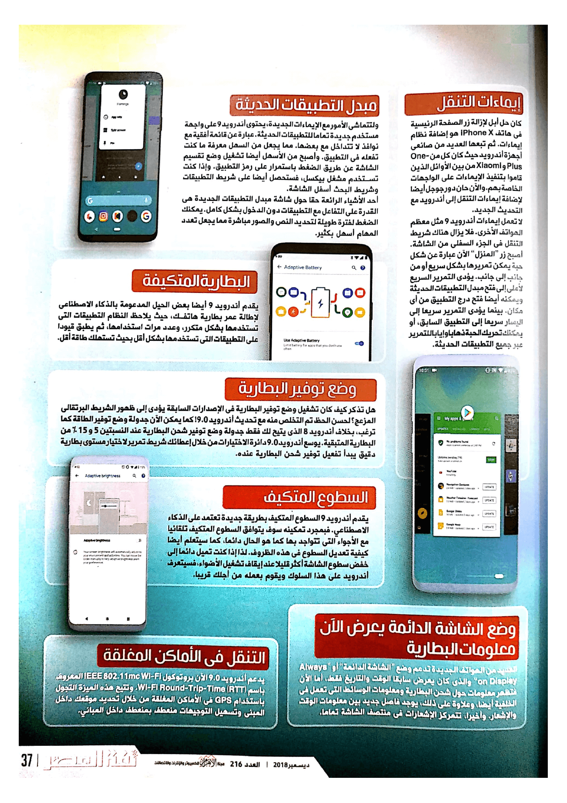

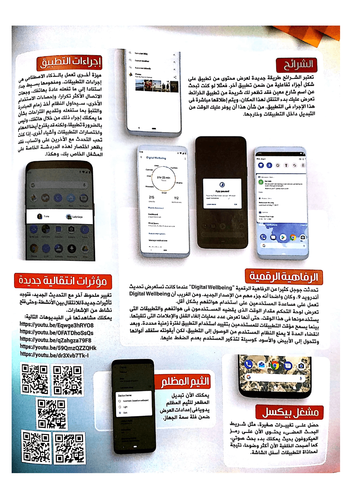

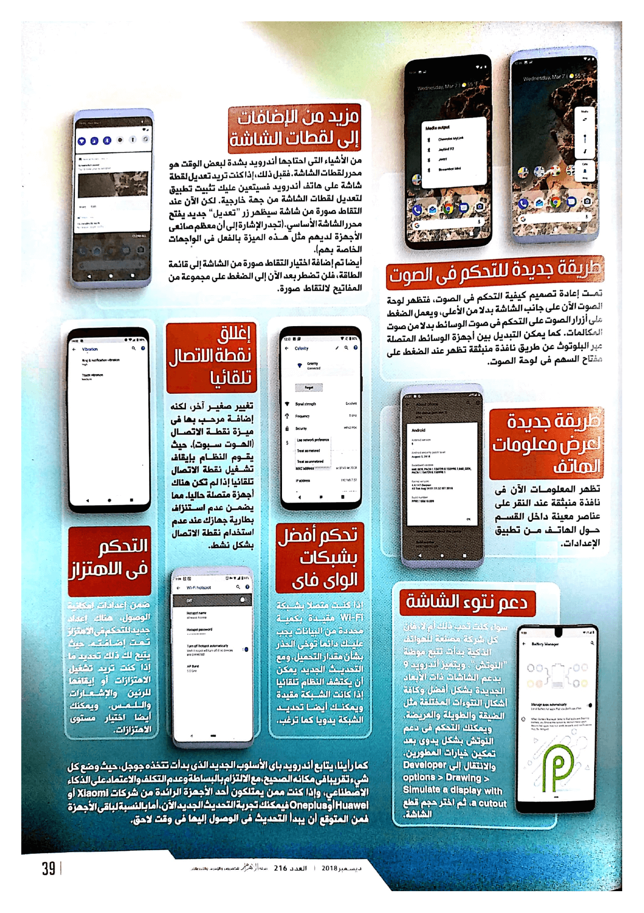
