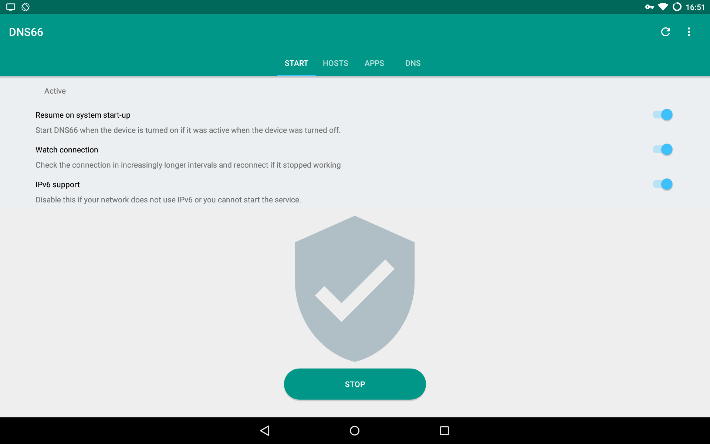
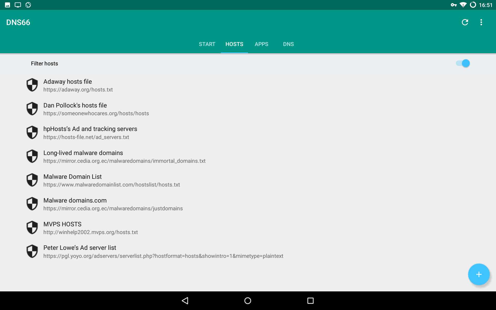
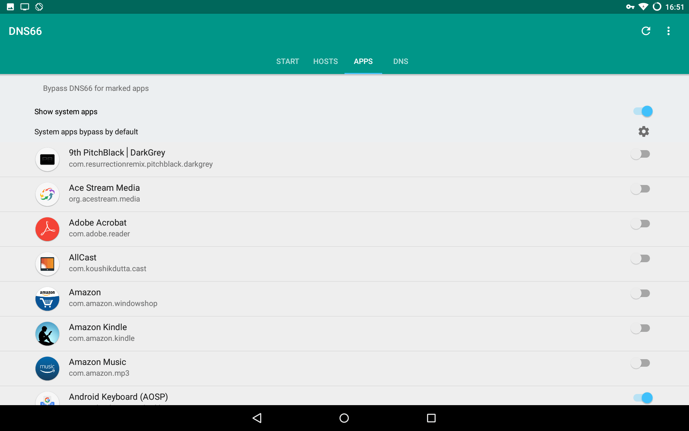
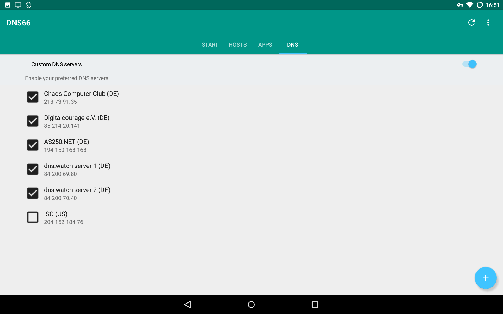
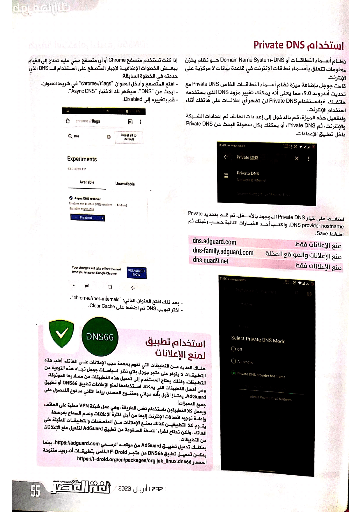
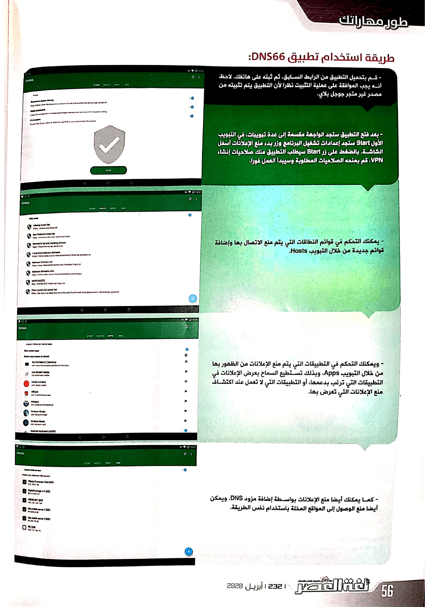
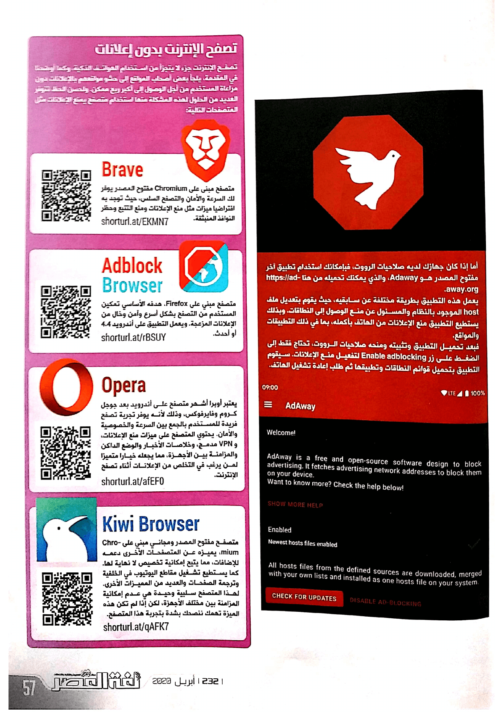

+++
title = "دليل شامل للتخلص من الإعلانات على أندرويد"
date = "2020-04-01"
description = "هل تستخدم هاتف أندرويد؟ إذن تعاني من الإعلانات المزعجة التي تملأ غالبية التطبيقات المجانية، فالبعض من هذه الإعلانات يمكن تحمله مثل الإعلانات السفلية، والبعض الآخر يتفنن في مضايقة المستخدم بشتى الطرق من أجل ربح أكبر كمية من المال. ولذلك على مستخدم أندرويد أن يلجأ لمجموعة من الحلول التي تريحه من هذا الإزعاج المستمر وتمنع كافة الإعلانات من على هاتفه."
categories = ["أندرويد", "مهارات رقمية",]
tags = ["مجلة لغة العصر"]

+++

الإعلانات داخل التطبيقات هي مصدر الربح الأول للمطورين، وكذلك هو الحال بالنسبة للمواقع على الإنترنت. فعن طريق هذه الإعلانات يضمن المطور أو منشئ المحتوي دخلًا شهريًا مستمرًا. لكن عندما يزيد الأمر عن حده يصبح مزعجا بصورة لا يمكن تحملها.

يستخدم أغلب مطورو التطبيقات وأصحاب المواقع خدمات جوجل الإعلانية مثل Google Adsense وAdmob. لكن هذه الخدمات تتطلب أن تكون التطبيقات أو المواقع متوافقة مع لائحة طويلة من الشروط، التي تضمن قانونية المحتوي المعروض وعدم كونه مسروقا من مصادر أخرى، مما يجعل الحصول على موافقة هذه الخدمات أمرا صعبا في حالة كان التطبيق أو الموقع يخالف هذه السياسات. وذلك يدفع المطورين الذين لم ينجحوا في استخدام تلك الخدمات إلى استخدام طرق أخرى للربح، مثل شبكات إعلانية أخرى تعتمد على أساليب مزعجة لعرض الإعلانات، كالإعلان على شاشة القفل أو داخل قائمة الإشعارات.

ولذلك يجب على المستخدم اتخاذ بعض الإجراءات لمنع عرض الإعلانات المزعجة على هاتفه، وإبقاء الإعلانات داخل التطبيقات التي يود دعمها حتى لا يؤثر على أرباح مطوريها، أو لمنع الإعلانات من الهاتف بأكمله.

## استخدام Private DNS

DNS (Domain Name System) أو نظام أسماء النطاقات، هو نظام يخزن معلومات تتعلق بأسماء نطاقات الإنترنت في قاعدة بيانات لا مركزية على الإنترنت.

قامت جوجل بإضافة ميزة نظام أسماء النطاقات الخاص Private DNS مع تحديث أندرويد 9.0، مما يعني أنه يمكنك تغيير مزود DNS الذي يستخدمه هاتفك. فباستخدام Private DNS يمنع الإعلانات، لن تظهر أي إعلانات على هاتفك أثناء استخدام الإنترنت.

ولتفعيل هذه الميزة، قم بالدخول إلى إعدادات الهاتف ثم إعدادات الشبكة والإنترنت، ثم Private DNS، أو يمكنك بكل سهولة البحث عن Private DNS داخل تطبيق الإعدادات.

اضغط على خيار Private DNS الموجود بالأسفل، ثم قم بتحديد Private DNS provider hostname، واكتب أحد الخيارات التالية حسب رغبتك ثم اضغط Save:

| منع الإعلانات فقط | dns.adguard.com |
| ------------------------------------- | ---------------------- |
| منع الإعلانات والمواقع المخلة | dns-family.adguard.com |
| منع الإعلانات فقط | dns.quad9.net |

إذا كنت تستخدم متصفح Chrome أو أي متصفح مبني عليه تحتاج إلى القيام ببعض الخطوات الإضافية لإجبار المتصفح على استخدام ال DNS الذي حددته في الخطوة السابقة:

- افتح المتصفح وأدخل العنوان "chrome://flags" في شريط العنوان.

- ابحث عن "DNS"، سيظهر لك الاختيار "Async DNS".

- قم بتغييره إلى Disabled.

- بعد ذلك افتح العنوان التالي " chrome://net-internals".

- اختر تبويب DNS ثم اضغط على Clear Cache.

## استخدام تطبيق لمنع الإعلانات

هناك العديد من التطبيقات التي تقوم بمهمة حجب الإعلانات على الهاتف. أغلب هذه التطبيقات لا يتوفر على متجر جوجل بلاي نظرا لسياسات جوجل تجاه هذه النوعية من التطبيقات. ولذلك يحتاج المستخدم إلى تحميل هذه التطبيقات من مصادرها الموثوقة.

ومن أفضل التطبيقات التي يمكنك استخدامها لمنع الإعلانات تطبيق DNS66 أو تطبيق AdGuard. يمتاز الأول بأنه مجاني ومفتوح المصدر، بينما الثاني مدفوع (للحصول على كافة المميزات).

ويعمل كلا التطبيقين باستخدام نفس الطريقة، وهي عمل شبكة VPN محلية على الهاتف، وإعادة توجيه اتصالات الإنترنت إليها من أجل فلترة الإعلانات وعدم السماح بعرضها.

يقوم كلا التطبيقين كذلك بمنع الإعلانات من المتصفحات والتطبيقات المثبتة على الهاتف، ولكن تحتاج لشراء النسخة المدفوعة من تطبيق AdGuard لتفعيل منع الإعلانات من التطبيقات.

يمكنك تحميل تطبيق AdGuard من موقعه الرسمي [https://adguard.com](https://adguard.com/)، بينما يمكن تحميل تطبيق DNS66 من متجر F-Droid الخاص بتطبيقات أندرويد مفتوحة المصدر https://f-droid.org/en/packages/org.jak_linux.dns66

### تطبيق DNS66

أما طريقة استخدام تطبيق DNS66 فهي كالتالي:

- قم بتحميل التطبيق من الرابط السابق، ثم ثبته على هاتفك. لاحظ أنه يجب الموافقة على عملية التثبيت نظرا لأن التطبيق يتم تثبيته من مصدر غير متجر جوجل بلاي.

- بعد فتح التطبيق ستجد الواجهة مقسمة إلى عدة تبويبات، في التبويب الأول Start ستجد إعدادات تشغيل البرنامج وزر بدء منع الإعلانات أسفل الشاشة. بالضغط على زر Start سيطلب التطبيق منك صلاحيات إنشاء VPN، قم بمنحه الصلاحيات المطلوبة وسيبدأ العمل فورا.

- يمكنك التحكم في قوائم النطاقات التي يتم منع الاتصال بها وإضافة قوائم جديدة من خلال التبويب Hosts.

- ويمكنك التحكم في التطبيقات التي يتم منع الإعلانات من الظهور بها من خلال التبويب Apps، وبذلك تستطيع السماح بعرض الإعلانات في التطبيقات التي ترغب بدعمها، أو التطبيقات التي لا تعمل عند اكتشاف منع الإعلانات التي تعرض بها.

- كما يمكنك أيضا منع الإعلانات بواسطة إضافة مزود DNS. ويمكن أيضا منع الوصول إلى المواقع المخلة باستخدام نفس الطريقة.

### تطبيق AdGuard

أما إذا كان جهازك لديه صلاحيات الرووت، فبإمكانك استخدام تطبيق آخر مفتوح المصدر هو Adaway، والذي يمكنك تحميله من هنا [https://adaway.org](https://adaway.org/).

يعمل هذه التطبيق بطريقة مختلفة عن سابقيه، حيث يقوم بتعديل ملف host الموجود بالنظام والمسؤول عن منع الوصول إلى النطاقات. وبذلك يستطيع التطبيق منع الإعلانات من الهاتف بأكمله، بما في ذلك التطبيقات والمواقع.

فبعد تحميل التطبيق وتثبيته ومنحه صلاحيات الرووت، تحتاج فقط إلى الضغط على زر Enable adblocking لتفعيل منع الإعلانات. سيقوم التطبيق بتحميل قوائم النطاقات وتطبيقها ثم طلب إعادة تشغيل الهاتف.

## تصفح الإنترنت بدون إعلانات

تصفح الإنترنت جزء لا يتجزأ من استخدام الهواتف الذكية، وكما أوضحت في المقدمة، يلجأ بعض أصحاب المواقع إلى حشو مواقعهم بالإعلانات، دون مراعاة المستخدم من أجل الوصول إلى أكبر ربح ممكن. ولحسن الحظ تتوفر العديد من الحلول لهذه المشكلة منها استخدام متصفح يمنع الإعلانات مثل المتصفحات التالية:

- Brave: متصفح مبنى على Chromium مفتوح المصدر يوفر لك السرعة والأمان والتصفح السلس، حيث توجد به افتراضيا ميزات مثل منع الإعلانات ومنع التتبع وحظر النوافذ المنبثقة.

https://play.google.com/store/apps/details?id=com.brave.browser

- Adblock Browser: متصفح مبني على Firefox، هدفه الأساسي تمكين المستخدم من التصفح بشكل أسرع وآمن وخال من الإعلانات المزعجة. ويعمل التطبيق على أندرويد 4.4 أو أحدث.

https://play.google.com/store/apps/details?id=org.adblockplus.browser

- Opera: يعتبر أوبرا أشهر متصفح على أندرويد بعد جوجل كروم وفايرفوكس، وذلك لأنه يوفر تجربة تصفح فريدة للمستخدم بالجمع بين السرعة والخصوصية والأمان. يحتوي المتصفح على ميزات منع الإعلانات، وVPN مدمج، وخلاصات الأخبار والوضع الداكن والمزامنة بين الأجهزة، مما يجعله خيارا متميزا لمن يرغب في التخلص من الإعلانات أثناء تصفح الإنترنت.

https://play.google.com/store/apps/details?id=com.opera.browser

- Kiwi Browser: متصفح مفتوح المصدر ومجاني مبني على Chromium، يميزه عن المتصفحات الأخرى دعمه للإضافات، مما يتيح إمكانية تخصيص لا نهاية لها. كما يستطيع تشغيل مقاطع اليوتيوب في الخلفية وترجمة الصفحات والعديد من المميزات الأخرى. لهذا المتصفح سلبية وحيدة هي عدم إمكانية المزامنة بين مختلف الأجهزة، لكن إذا لم تكن هذه الميزة تهمك فأنصحك بشدة بتجربة هذا المتصفح.

https://play.google.com/store/apps/details?id=com.kiwibrowser.browser

---

هذا الموضوع نُشر باﻷصل في مجلة لغة العصر العدد 232 شهر 04-2020 ويمكن الإطلاع عليه [هنا](https://drive.google.com/file/d/1b276XqXOR2YqHe-lJdHshLi-eJJVlksz/view?usp=sharing).

