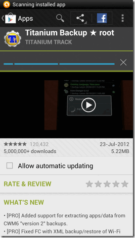
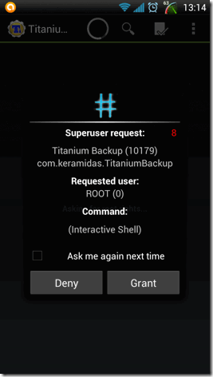
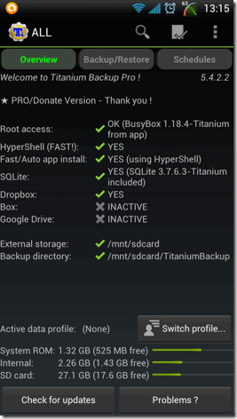
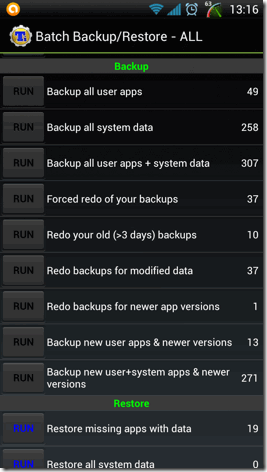
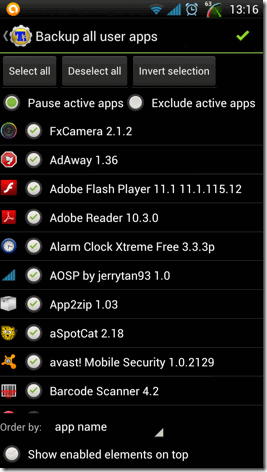
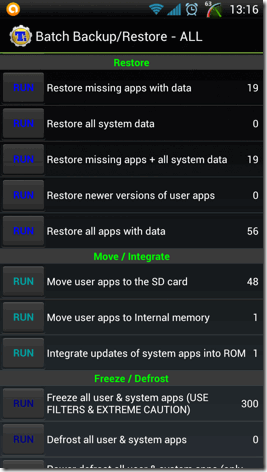
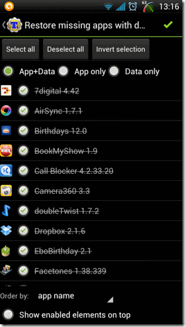

+++
title = "طريقة عمل نسخة احتياطية من تطبيقاتك على الأندرويد"
date = "2014-12-19"
description = "كثير من محترفي نظام الأندرويد الذين يرغبون في الانتقال الى روم جديد أو معدل يقومون بعمل نسخة احتياطية من جميع تطبيقاتهم لسهولة استرجاعها، اليك طريقة عمل نسخة احتياطية من جميع تطبيقات على نظام أندرويد."
categories = ["أندرويد",]
tags = ["موقع لغة العصر"]

+++

1. بعد تثبيت البرنامج وفتحه سيطلب صلاحيات الرووت، اضغط امنح أو Grant.

2. ستظهر لك واجهة البرنامج كما بالصورة.

3. قم بالضغط على زر الخيارات أعلى يمين البرنامج.

4. تظهر لك مجموعة من الأوامر قم باختيار Batch Actions.

5. اختر الخيار الأول Backup all user appsبالضغط على RUN.

6. قم باختيار التطبيقات التي تريد نسخها احتياطيا ثم اضغط على علامة الموافقة أعلى يمين البرنامج.

7. انتظر حتى ينتهي البرنامج من النسخ الاحتياطي ويجب أن تتوافر لديك مساحة 300 ميجا أو أكثر فارغة للتخزين.

## طريقة استرجاع النسخة الاحتياطية

1. ستتبع نفس الخطوات السابقة من 1 الى 4.

2. قم باختيار Restore Missing APPS With Data.

3. قم باختيار التطبيقات التي تريد استرجاعها ثم اضغط على علامة الموافقة أعلى يمين البرنامج.

---
هذا الموضوع نٌشر باﻷصل على موقع مجلة لغة العصر.

http://aitmag.ahram.org.eg/News/3235.aspx