+++
title = "تقرير شامل ومراجعة بالفيديو: ما هو أفضل متصفح انترنت للأندرويد 2016؟"
date = "2016-08-09"
description = "جميعنا يستخدم هواتف الأندرويد في كل شيء تقريبا، المكالمات والرسائل، التحقق من البريد الإلكتروني والتواصل عن طريق السوشيال ميديا، وأيضا تصفح الانترنت، ولمن يبحث عن متصفح انترنت يعتمد عليه على نظام أندرويد، تابع هذا الموضوع حيث سأعرض لك أفضل متصفحات للأندرويد لعام 2016، ثم سأخبرك بتقييمي الشخصي لهذه المتصفحات، بعدها قرر أي متصفح هو الأفضل لك!"
categories = ["أندرويد",]
tags = ["افهم تكنولوجيا"]
images = ["images/Main.jpg"]

+++

جميعنا يستخدم هواتف الأندرويد في كل شيء تقريبا، المكالمات والرسائل، التحقق من البريد الإلكتروني والتواصل عن طريق السوشيال ميديا، وأيضا تصفح الانترنت، ولمن يبحث عن متصفح انترنت يعتمد عليه على نظام أندرويد، تابع هذا الموضوع حيث سأعرض لك أفضل متصفحات للأندرويد لعام 2016، ثم سأخبرك بتقييمي الشخصي لهذه المتصفحات، بعدها قرر أي متصفح هو الأفضل لك!

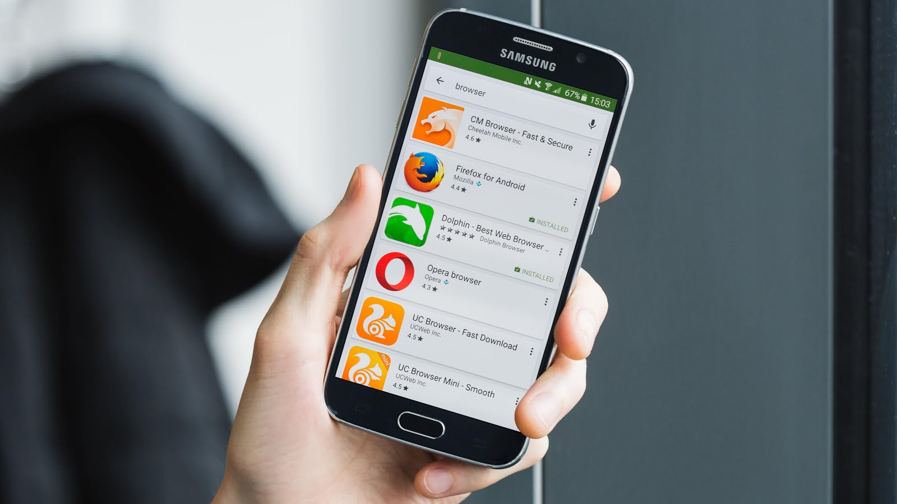

هذا الموضوع هو خلاصة العديد من المواضيع الأجنبية التي قامت بمراجعة أكثر من 15 تطبيق متصفح هي الأفضل على الاطلاق، في الجزء الأول من الموضوع سنري اختبارات الأداء للمتصفحات، وفي الجزء الثاني من موضوعنا سنراجع أغلب المتصفحات التي تم اختبارها مع توضيح مميزات كل منها، أما الجزء الثالث فهو عبارة عن استعراض ومراجعة للمتصفحات وأخيرا في النهاية ستجد المصادر التي قمت بالاستعانة بها.

## الجزء الأول: اختبار المتصفح الأفضل

قام موقع [AndroidAuthority](http://www.androidauthority.com/best-fastest-android-browsers-337802/) بعمل اختبارات لأفضل 10 متصفحات موجودة على متجر جوجل بلاي، هذه الاختبارات تمت باستخدام هاتف Nexus 6P يعمل ب Android 6.0.1 Marshmallow، مع مراعاة معايير المساواة بين التطبيقات، مثل عدم وجود أي تطبيق على الجهاز بخلاف التطبيق الذي سيتم اختباره، إعادة تشغيل الهاتف قبل كل اختبار، وهكذا.

\- المتصفحات التي تم اختبارها:

Google Chrome 49.0.2623.105

Dolphin Browser 11.5.5

Mozilla Firefox 45.0.2

Naked Browser version 1.0 build 112

Opera Browser 36.1.2126.102083

Puffin Browser 4.7.4.2567

UC Browser 10.9.0

InfiKen Labs Flynx Browser 2.0.1

Ghostery Browser 1.3.2

Mercury Browser 3.2.3

| 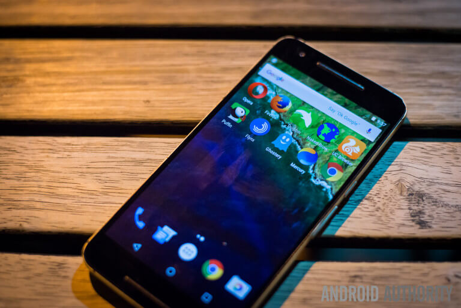                        |
| ------------------------------------------------------------ |
| [مصدر الصورة](http://www.androidauthority.com/wp-content/uploads/2016/04/fastest-browsers-2-840x561.jpg) |

**ما تم اختباره في المتصفحات:**

1. دعم JavaScript والأداء العام للمتصفح.

2. سرعة تحميل الصفحات.

3. استهلاك الذاكرة.

### أولا: اختبار أداء المتصفح

\- الأدوات المستخدمة في الاختبار:

مجموعة من أشهر حزم قياس الأداء Benchmark هي: Sunspider، Mozilla Kraken، Browsermark، Peacekeeper.

#### 1- SunSpider 1.0.2

تم استخدام [SunSpider 1.0.2 JavaScript Benchmark](http://www.webkit.org/perf/sunspider/sunspider.html) لاختبار القدرات الأساسية لجافا سكريبت المتصفح، الرقم الأقل يعنى أداء أفضل.

| 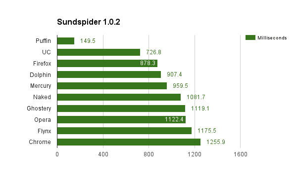                           |
| ------------------------------------------------------------ |
| [مصدر الصورة](http://www.androidauthority.com/wp-content/uploads/2016/04/sunspider-chart.png) |

كما تري عزيزي القارئ تصدر هذا الاختبار متصفح [Puffin Web Browser](https://play.google.com/store/apps/details?id=com.cloudmosa.puffinFree&hl=en) يليه متصفح [UC Browser](https://play.google.com/store/apps/details?id=com.UCMobile.intl)، بينما المتصفح الأقل سرعة هو [Chrome Browser](https://play.google.com/store/apps/details?id=com.android.chrome).

#### 2- Mozilla Kraken 1.1

تم استخدام أداة [Mozilla Kraken JavaScript Benchmark 1.1](http://krakenbenchmark.mozilla.org/) أيضا لاختبار أداء المتصفح، الأداة مصممة بواسطة مؤسسة Mozilla، في هذا الاختبار الرقم الأقل يعنى أداء أفضل أيضا.

| 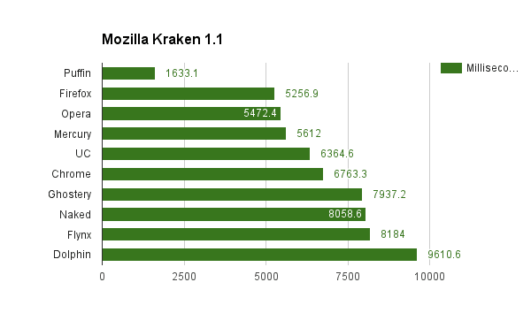                          |
| ------------------------------------------------------------ |
| [مصدر الصورة](http://www.androidauthority.com/wp-content/uploads/2016/04/image-3.png) |

تصدر هذا الاختبار متصفح [Puffin Web Browser](https://play.google.com/store/apps/details?id=com.cloudmosa.puffinFree&hl=en) أيضا، وحصل [Firefox Browser](https://play.google.com/store/apps/details?id=org.mozilla.firefox&hl=en) على المركز الثاني، [Chrome Browser](https://play.google.com/store/apps/details?id=com.android.chrome) تقدم إلى المركز السادس، وجاء [Dolphin Browser](https://play.google.com/store/apps/details?id=mobi.mgeek.TunnyBrowser&hl=en) في المرتبة الأخيرة.

#### 3- Browsermark 2.1.3

تستخدم أداة [Browsermark](http://web.basemark.com/) لقياس أداء المتصفح بشكل عام، حيث تقيس كل من زمن تحميل الصفحة، تغيير حجم الشاشة، JavaScript، CSS، DOM، وأيضا جودة الرسوميات، الرقم الأكبر في هذا الاختبار هو الأفضل.

| 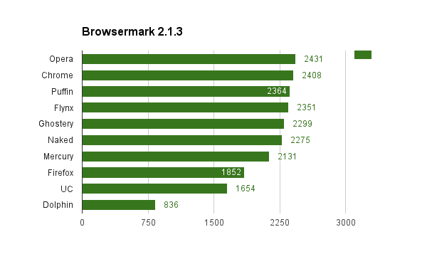                             |
| ------------------------------------------------------------ |
| [مصدر الصورة](http://www.androidauthority.com/wp-content/uploads/2016/04/browsermark-2.png) |

صاحب المركز الأول في هذا الاختبار كان [Opera Browser](https://play.google.com/store/apps/details?id=com.opera.browser&hl=en) ثم [Chrome Browser](https://play.google.com/store/apps/details?id=com.android.chrome) وبعده [Puffin Web Browser](https://play.google.com/store/apps/details?id=com.cloudmosa.puffinFree&hl=en) الذي تراجع هذه المرة!، وجاء [Dolphin Browser](https://play.google.com/store/apps/details?id=mobi.mgeek.TunnyBrowser&hl=en) في المرتبة الأخيرة كما في الاختبار السابق.

#### 4- Peacekeeper

أداة [Peacekeeper](http://peacekeeper.futuremark.com/) لا تختلف كثيرا عن سابقاتها، إلا أنها تختبر كل من HTML5 (WebGL, video, web worker, game, Canvas), data arrays, DOM بشكل فردي، ومثل الاختبار السابق الرقم الأكبر يعنى أداء أفضل.

| 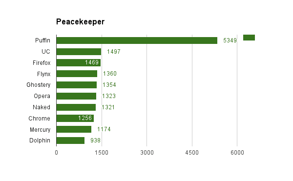                               |
| ------------------------------------------------------------ |
| [مصدر الصورة](http://www.androidauthority.com/wp-content/uploads/2016/04/Peacekeeper.png) |

مرة أخري يعود متصفح [Puffin Web Browser](https://play.google.com/store/apps/details?id=com.cloudmosa.puffinFree&hl=en) ليسترد مركزه، ثم متصفح [UC Browser](https://play.google.com/store/apps/details?id=com.UCMobile.intl) في المركز الثاني، بخلاف [Chrome Browser](https://play.google.com/store/apps/details?id=com.android.chrome) الذي تراجع إلى المركز الثامن !، وبقى [Dolphin Browser](https://play.google.com/store/apps/details?id=mobi.mgeek.TunnyBrowser&hl=en) كما هو.

### ثانيا: اختبار استهلاك الذاكرة

استهلاك الذاكرة هو عامل آخر بالغ الأهمية في اختيار المتصفح، وخاصة لمن يستخدم هواتف متوسطة أو ضعيفة، وفى هذا الاختبار تم قياس مقدار الذاكرة التي استهلكها كل متصفح.

**1- استهلاك الذاكرة بدون فتح أي صفحة:**

| 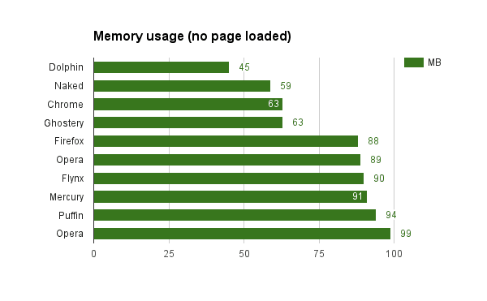                               |
| ------------------------------------------------------------ |
| [مصدر الصورة](http://www.androidauthority.com/wp-content/uploads/2016/04/ram-no-page.png) |

أقل متصفح في الاستهلاك كان [Dolphin Browser](https://play.google.com/store/apps/details?id=mobi.mgeek.TunnyBrowser&hl=en) (45 ميجا فقط!)، والمركز الثاني كان من نصيب [Naked Browser Pro](https://play.google.com/store/apps/details?id=com.fevdev.nakedbrowserpro&hl=en) ، أما [Chrome Browser](https://play.google.com/store/apps/details?id=com.android.chrome) المعروف بالتهامه للذاكرة جاء في المركز الثالث (بدون أي تبويبات مفتوحة)، وفى المركز الأخير جاء [Opera Browser](https://play.google.com/store/apps/details?id=com.opera.browser&hl=en) الذي استهلك 99 ميجا من الذاكرة.

**2- استهلاك الذاكرة بعد فتح 5 تبويبات:**

| 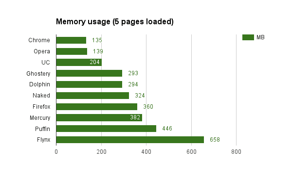                               |
| ------------------------------------------------------------ |
| [مصدر الصورة](http://www.androidauthority.com/wp-content/uploads/2016/04/ram-5-pages.png) |

من أغرب النتائج التي كشفها هذا الاختبار هو أن متصفح [Chrome Browser](https://play.google.com/store/apps/details?id=com.android.chrome) هو الأقل في استهلاك الذاكرة! (يبدو أن مشكلة التهام الرام على النسخة المكتبية من المتصفح فقط)، بينما جاء [Opera Browser](https://play.google.com/store/apps/details?id=com.opera.browser&hl=en) في المركز الثاني، أما [Puffin Web Browser](https://play.google.com/store/apps/details?id=com.cloudmosa.puffinFree&hl=en) فيبدو أن السرعة الكبيرة التي حققها في الاختبار السابق جاءت على حساب جزء كبير من الذاكرة، وفى المركز الأخير جاء متصفح Flynx الذي استهلك 658 ميجا من الذاكرة !

### الاستنتاج وخلاصة الاختبارات

| 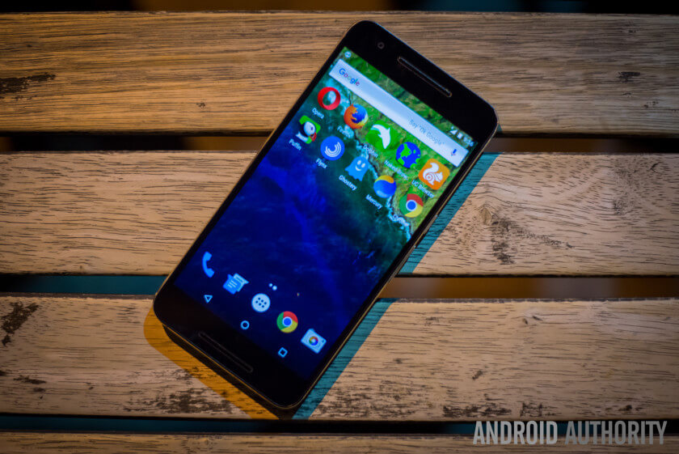                        |
| ------------------------------------------------------------ |
| [مصدر الصورة](http://www.androidauthority.com/wp-content/uploads/2016/04/fastest-browsers-1-840x561.jpg) |

بعد كل الاختبارات التي تمت، يبدو أن أسرع متصفح للأندرويد هو [Puffin Web Browser](https://play.google.com/store/apps/details?id=com.cloudmosa.puffinFree&hl=en)، أما المتصفحات الأكثر استخداما مثل Firefox, Chrome, Dolphin, Opera & [UC](https://play.google.com/store/apps/details?id=com.UCMobile.intl) سجلت معدلات أداء متغيرة في الاختبارات المختلفة، فلم يظهر أن أحدهم كان الأسرع أو الأخف في استهلاك الذاكرة، لكن جوجل كروم هو الوحيد الذي تفاجأت بنتائجه خصوصا في اختبار الذاكرة.

## الجزء الثاني: استعراض أفضل المتصفحات

**ملاحظة**: ترتيب المتصفحات هنا هو أبجدي، وفى الأسفل ستجد ترتيبي الشخصي لأفضل المتصفحات.

1. [Chrome Browser – Google](https://play.google.com/store/apps/details?id=com.android.chrome) – الأفضل لمحبي الكلاسيكية

جوجل كروم، المتصفح الأكثر استخداما على أندرويد، المتصفح سريع جدا على جميع الأجهزة ذات الإمكانيات المتوسطة والقوية، أما بالنسبة للهواتف الضعيفة فلا عزاء لهم عند فتح أكثر من 3 تبويبات.

يحتوي التطبيق على وضع توفير البيانات وباقي المميزات المعروفة لجوجل كروم.

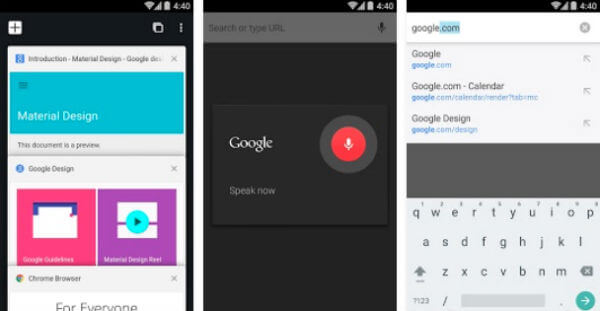[تحميل Chrome Browser للأندرويد](https://play.google.com/store/apps/details?id=com.android.chrome)

[تحميل Chrome Browser النسخة التجريبية Beta](https://play.google.com/store/apps/details?id=com.chrome.beta)

[تحميل Chrome Browser نسخة المطورين](https://play.google.com/store/apps/details?id=com.chrome.dev)

2. [Dolphin Browser](https://play.google.com/store/apps/details?id=mobi.mgeek.TunnyBrowser&hl=en) – أفضل تجربة للمستخدم

ما زال متصفح دولفين هو المفضل لدى كثيرين من مستخدمي أندرويد (حاصل على ما يقارب 80,000,000 تحميل على Google Play)، والسر وراء ذلك هو سرعة الأداء وسلاسة التعامل معه، كما أن واجهة المتصفح بسيطة جدا، أيضا المتصفح مفيد جدا عندما يتعلق الأمر بمشاركة المحتوي بين الأجهزة.

| [                        |
| ------------------------------------------------------------ |
| [مصدر الصورة](https://fscl01.fonpit.de/userfiles/7142162/image/apps/browsers/androidpit-dolphin-browser-best-browsers-1-w782.jpg) |

من المميزات التي تتوفر في هذا المتصفح: دعم الفلاش، سرعة التحميل، منع الإعلانات، وأيضا التصفح الخفي ودعم الإضافات.

[تحميل Dolphin Browser للأندرويد](https://play.google.com/store/apps/details?id=mobi.mgeek.TunnyBrowser&hl=en)

3. [Firefox Browser](https://play.google.com/store/apps/details?id=org.mozilla.firefox&hl=en) – الأفضل لمحبي التخصيص

من أقوي متصفحات الانترنت على أندرويد، يقدم أداء ثابت جدا ولائحة من المميزات التي تجعل منه منافسا لأقوى المتصفحات، مزامنة متصفح المحمول مع إصدار سطح المكتب تعمل بتميز، كما يقدم طنا من خيارات التخصيص!

|                          |
| ------------------------------------------------------------ |
| [مصدر الصورة](https://fscl01.fonpit.de/userfiles/7142162/image/apps/browsers/androidpit-firefox-browser-best-browsers-1-w782.jpg) |

على الرغم من كونه خفيف الحجم فهو يدعم أغلب إضافات الفايرفوكس نسخة سطح المكتب، ويوجد به العديد من خيارات الخصوصية، وأيضا وضع القارئ لسهولة قراءة الموضوعات والمقالات.

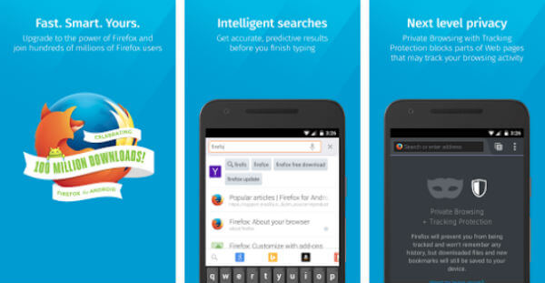

[تحميل Firefox Browser للأندرويد](https://play.google.com/store/apps/details?id=org.mozilla.firefox&hl=en)

[تحميل Firefox Browser النسخة التجريبية Beta](https://play.google.com/store/apps/details?id=org.mozilla.firefox_beta)

4. [Naked Browser Pro](https://play.google.com/store/apps/details?id=com.fevdev.nakedbrowserpro&hl=en) – السرعة والبساطة!

على الرغم من أنه متصفح جديد نسبيا، إلا أنه قد أثبت جدارته لمستخدمي [أندرويد](https://efhamtechnology.blogspot.com/search/label/أندرويد)، فهو يقدم لهم سرعة في التصفح وواجهة مستخدم غنية، إلى جانب الحجم الصغير (250 كب) الذي لم يمنعه من تقديم العديد من المميزات.

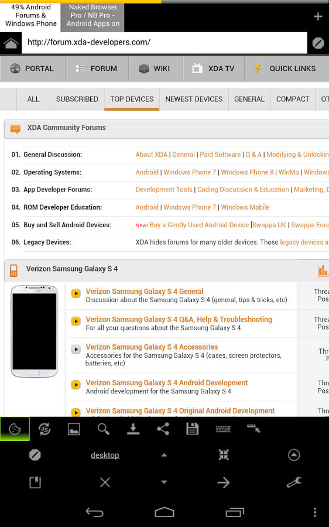

للمتصفح بعض العيوب وهي: منها عدم القدرة على استخدام ال GPS من خلاله، ولكنه يظل خيار جيد جدا لأصحاب الهواتف الضعيفة.

[تحميل Naked Browser Proللأندرويد](https://play.google.com/store/apps/details?id=com.fevdev.nakedbrowser)

[تحميل Naked Browser Pro النسخة المدفوعة](https://play.google.com/store/apps/details?id=com.fevdev.nakedbrowserpro&hl=en)

5. [Opera Browser](https://play.google.com/store/apps/details?id=com.opera.browser&hl=en) – الأفضل لتوفير البيانات

يعتبر واحد من أفضل تطبيقات تصفح الانترنت حيث يستخدمه أكثر من 50 مليون شخص، أقوي مميزاته هي توفير بيانات التصفح، فهو يستطيع ضغط المحتوي، الصور، وحتى مقاطع الفيديو.

| 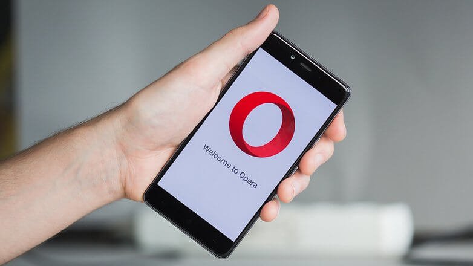                           |
| ------------------------------------------------------------ |
| [مصدر الصورة](https://fscl01.fonpit.de/userfiles/6727621/image/2nd_YEAR/browsers/AndroidPIT-Opera-browser-2-w782.jpg) |

يحتوي المتصفح على مانع إعلانات، متصفح خفي، كما يتيح المزامنة بين نسخة الهاتف ونسخة سطح المكتب من المتصفح، ومتصفح أوبرا ليس أسرع متصفح فقط، ولكن بمجرد فتح صفحة ستجد أنها ظهرت كاملة في لحظة واحدة، فليس هناك مزيد من الانتظار لتحميل الصور.

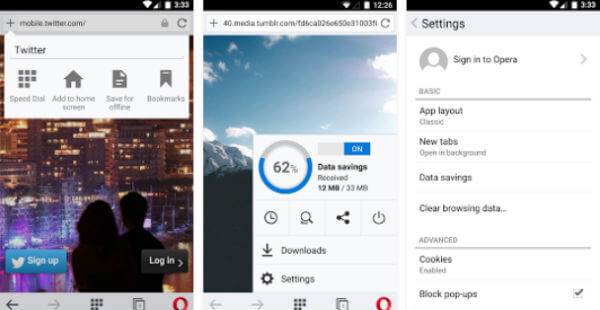

[تحميل Opera Browser للأندرويد](https://play.google.com/store/apps/details?id=com.opera.browser&hl=en)

[تحميل Opera Browser النسخة المصغرة Mini](https://play.google.com/store/apps/details?id=com.opera.mini.native)

[تحميل Opera Browser النسخة التجريبية Beta](https://play.google.com/store/apps/details?id=com.opera.mini.native.beta)

6. [Puffin Web Browser](https://play.google.com/store/apps/details?id=com.cloudmosa.puffinFree&hl=en) – الأفضل لمحبي السرعة!

Puffin Browser من أفضل المتصفحات التي قد تجربها على هاتفك، فليس فقط أسرع متصفح كما رأينا في الاختبارات بل يمكن للمستخدم تخصيصه كما يريد، يأتي هذا المتصفح مع مجموعة من الخلفيات والعديد من الإضافات add-ons.

| 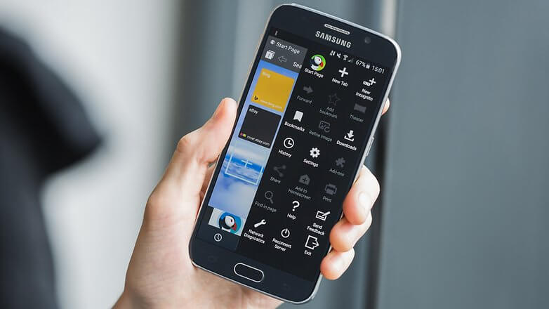                            |
| ------------------------------------------------------------ |
| [مصدر الصورة](https://fscl01.fonpit.de/userfiles/7142162/image/apps/browsers/androidpit-puffin-browser-best-browsers-1-w782.jpg) |

من أهم مميزات المتصفح تسريع تصفح الإنترنت عن طريق نقل الصفحات إلى سيرفرات التطبيق ثم تسليمها إلى المستخدم، وهذا يساعد في زيادة سرعة لتصفح بشكل كبير.

يدعم المتصفح أيضا تشغيل محتويات الفلاش مما يمكنك من تشغيل الألعاب ومقاطع الفيديو بكل سهولة على هاتفك.

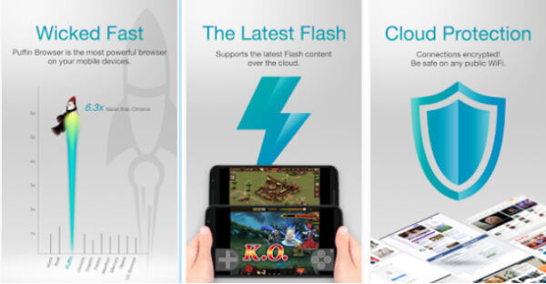

حجم المتصفح 24MB، وهو مجاني بشكل تجريبي، ويوجد منه اصدار مدفوع يتيح لك كافة المميزات.

[تحميل Puffin Web Browser النسخة المجانية](https://play.google.com/store/apps/details?id=com.cloudmosa.puffinFree)

#### [تحميل Puffin Web Browser النسخة المدفوعة](https://play.google.com/store/apps/details?id=com.cloudmosa.puffinFree)

7. [UC Browser](https://play.google.com/store/apps/details?id=com.UCMobile.intl) – عملاق المميزات الإضافية!

هو المتصفح الأكثر تحميلا على أندرويد، يتوفر منه العديد من الإصدارات التي تلائم كل المستخدمين، به العديد والعديد من المميزات مثل مانع الإعلانات، دعم الإضافات، إمكانية تغيير ثيمات المتصفح، وجود وضع القراءة ودعم الفلاش.

| 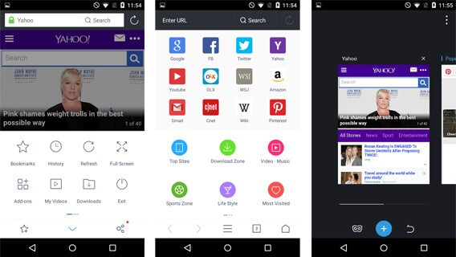                                        |
| ------------------------------------------------------------ |
| [مصدر الصورة](http://articles-images.sftcdn.net/wp-content/uploads/sites/3/2015/04/5.jpg) |

أما الميزة الأكبر التي تتوفر في متصفح [UC](https://play.google.com/store/apps/details?id=com.UCMobile.intl) هي وضع السرعة الذي يوفر لك سرعة أكبر في حالة ضعف الانترنت لديك، ويوجد مزيد من الإضافات مثل حفظ الصفحات بدون انترنت، الوضع الليلي، وجود Clipboard لتخزين النصوص المنسوخة، وأيضا إمكانية التقاط صورة للمواقع المفتوحة.

[تحميل UC Browser النسخة العادية](https://play.google.com/store/apps/details?id=com.UCMobile.intl)

[تحميل UC Browser النسخة الصغيرة Mini](https://play.google.com/store/apps/details?id=com.uc.browser.en)

[تحميل UC Browser نسخة هواتف X86](http://pdds.ucweb.com/download/package?uc_param_str=ve&product=ucbrowser&fileid2=19449&pfid=151&bid=33436&lang=arabic&from=www-dft-dft-pc)

[تحميل UC Browser نسخة U3](http://pdds.ucweb.com/download/package?uc_param_str=ve&product=ucbrowser&fileid2=19513&pfid=145&bid=33436&lang=arabic&from=www-dft-dft-pc)

## الجزء الثالث: مراجعة أفضل المتصفحات بالفيديو



**خلاصة**: في هذه الصورة ستجد المميزات التي توفرها المتصفحات التي تم اختبارها.

| 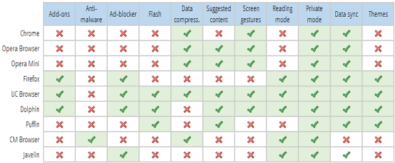                  |
| ------------------------------------------------------------ |
| [مصدر الصورة](http://articles-images.sftcdn.net/wp-content/uploads/sites/2/2015/04/android-browser-features.png) |

**ترتيبي الشخصي لأفضل المتصفحات:**

1- [UC Browser](https://play.google.com/store/apps/details?id=com.UCMobile.intl)

2- [Puffin Web Browser](https://play.google.com/store/apps/details?id=com.cloudmosa.puffinFree&hl=en)

3- [Firefox Browser](https://play.google.com/store/apps/details?id=org.mozilla.firefox&hl=en)

4- [Opera Browser](https://play.google.com/store/apps/details?id=com.opera.browser&hl=en)

5- [Dolphin Browser](https://play.google.com/store/apps/details?id=mobi.mgeek.TunnyBrowser&hl=en)

6- [Chrome Browser](https://play.google.com/store/apps/details?id=com.android.chrome)

هل قررت الأن صديقي ما هو المتصفح الذي ستستخدمه بعد قرأتك لهذا المقال؟

وماذا كان المتصفح المفضل لديك قبل الآن؟ سأنتظر اجابتك في التعليقات!

**المصادر**:

[موقع androidauthority](http://www.androidauthority.com/best-fastest-android-browsers-337802/)

[موقع androidpit](https://www.androidpit.com/best-android-browser)

[موقع mashtips](http://mashtips.com/android-browsers-save-memory-data/)

[موقع softonic](http://features.en.softonic.com/best-android-browser-comparison-2015)

---

هذا المقال نشر باﻷصل على مدونة افهم تكنولوجيا ويمكن الإطلاع عليه [هنا](https://efhamtechnology.blogspot.com/2016/08/best-android-browser-2016.html).
