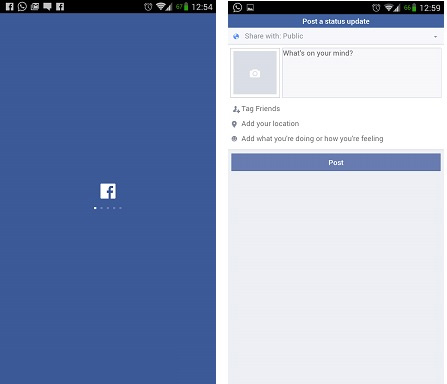
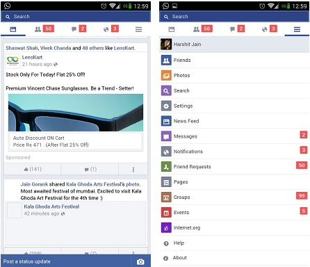

+++
title = "الطريقة الرسمية لتشغيل حسابي فيس بوك على نفس الهاتف"
date = "2015-01-30"
description = "ملك معظم مستخدمي حسابات فيس بوك متعددة ولكن عند استخدم تطبيق الفيس بوك الموجود على هواتف الأندرويد لا يمكن للمستخدم تسجيل الدخول بأكثر من حساب في نفس الوقت، نقدم لك عزيزي القارئ الطريقة الرسمية لتشغيل حسابي فيس بوك على نفس الهاتف."
categories = ["أندرويد",]
tags = ["موقع لغة العصر"]

+++

يملك معظم مستخدمي حسابات فيس بوك متعددة ولكن عند استخدم تطبيق الفيس بوك الموجود على هواتف الأندرويد لا يمكن للمستخدم تسجيل الدخول بأكثر من حساب في نفس الوقت سوى عن طريق متصفح الانترنت الموجود على الهاتف، أو عن طريق بعض النسخ المعدلة من التطبيق.

نقدم لك عزيزي القارئ الطريقة الرسمية لتشغيل حسابي فيس بوك على نفس الهاتف وبدون الحاجة الى صلاحيات الرووت.

أعلنت شركة فيسبوك عن نسخة خفيفة من تطبيقها المُخصص لأجهزة أندرويد مُوجهة لأصحاب الأجهزة مُتوسطة المواصفات أو الأجهزة التي تتصل بالإنترنت باستخدام اتصال بيانات بطيء. وعند البحث عن هذه النسخة داخل متجر جوجل بلاي، لم تظهر ضمن

نتائج البحث لأنها سوف تصل تدريجياً إلى أجهزة المُستخدمين.
هذه النسخة المصغرة هي الحل حيث أنها تعمل جنبا الى جنب مع التطبيق الرسمي بدون أي مشاكل، ويمكن للمستخدم تسجيل حساب مختلف لكل تطبيق.

أولا: قم بتحميل تطبيق الفيس بوك الرسمي من [متجر بلاي](https://play.google.com/store/apps/details?id=com.facebook.katana).

قم بتثبيت التطبيق وفتحه ثم قم بتسجيل الدخول الى حسابك.

ثانيا: قم بتحميل تطبيق Facebook lite [من هنا](http://www.apkmirror.com/wp-content/themes/APKMirror/download.php?id=4550) لعدم توافره على جوجل بلاي حاليا.
قم بتثبيت التطبيق ثم قم بتسجيل الدخول بحساب مختلف عن الذي قمت بالدخول عليه من التطبيق الأساسي.

ستجد أن كلا التطبيقين يعملان معا بدون أي مشاكل.

صور من داخل تطبيق Facebook lite:

---

هذا الموضوع نٌشر باﻷصل على موقع مجلة لغة العصر.

http://aitmag.ahram.org.eg/News/4747.aspx
