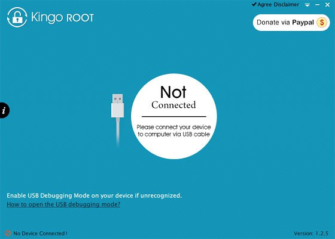
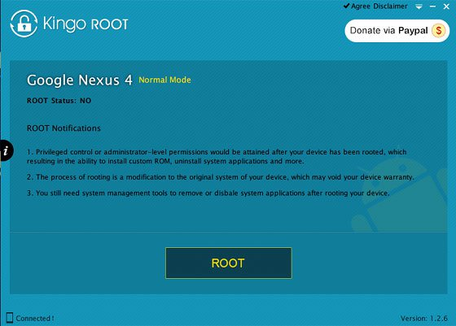
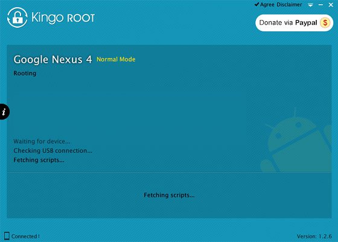
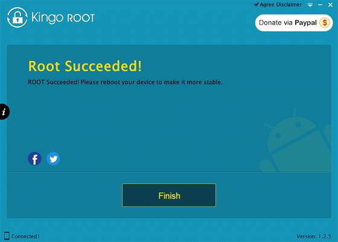
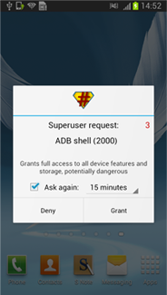

+++
title = "أسهل طريقة لعمل رووت ببرنامج Kingo Android Root"
date = "2015-01-24"
description = "يعتبر برنامج Kingo Android Root من أسهل برامج الكمبيوتر المتخصصة في عمل رووت لغالبية هواتف الأندرويد وبطريقة آمنة جدا تنعدم فيها نسبة الخطر، تم تجربة هذا البرنامج على العديد من الأجهزة وكانت النتائج أن تمت العملية بنجاح تام."
categories = ["أندرويد",]
tags = ["موقع لغة العصر"]
images = ["images/2015-635577337780786861-78.jpg"]

+++

يعتبر برنامج Kingo Android Root من أسهل برامج الكمبيوتر المتخصصة في عمل رووت لغالبية هواتف الأندرويد وبطريقة آمنة جدا تنعدم فيها نسبة الخطر، تم تجربة هذا البرنامج على العديد من الأجهزة وكانت النتائج أن تمت العملية بنجاح تام.
سبق أن تكلمنا بالتفصيل عن الرووت في موضوع: ""تعرف على الرووت في نظام الأندرويد".

## مميزات البرنامج

* يدعم مجموعة كبيرة جدا من الهواتف.
* البرنامج مجانا تماما.
* العملية تتم بأمان جدا.
* العملية تتم بضغطة زر.
* إمكانية إزالة الرووت في أي وقت بنفس الطريقة.
ملاحظات قبل البدء:
* يجب أن تتأكد من تثبيت تعريفات هاتفك.
* قم بعمل نسخة احتياطية من جميع ملفاتك المهمة.
* إذا كان هاتفك Sony أو HTC يجب فتح ال Bootloader الخاص بجهازك أولا.
* تأكد من أن هاتفك مفتوح.
* تأكد من وجود 50% على الأقل من البطارية.
* تأكد من فتح "تصحيح أخطاء USB " "‘USB Debugging".
* البرنامج يحتاج الى وجود اتصال بالإنترنت.
## شرح البرنامج

1. قم بتحميل البرنامج [من الموقع الرسمي](http://www.kingoapp.com/).
2. قم بتثبيت البرنامج، ثم قم بتوصيل هاتفك وافتح البرنامج.

3. انتظر حتى يتعرف البرنامج على هاتفك، سوف يقوم البرنامج بتحميل التعريفات من الإنترنت.
4. بعد انتهاء البرنامج من تثبيت تعريف هاتفك اضغط Root.

5. سيأخذ البرنامج وقت حتى ينتهي من العملية.

 6. بمجرد انتهاء البرنامج سيظهر كلمة Finish اضغط عليها ليعيد الهاتف التشغيل وإياك أن تقوم بفصل ال USB.

7. سيقوم الهاتف بإعادة التشغيل وبعدها سيتصل البرنامج مرة أخرى بالهاتف.
9. ستظهر لك رسالة كما بالصورة اضغط Grant أو منح.

10. ستجد تطبيق SuperSU قد تم تثبيته وهذا معناه أن العملية تمت بنجاح.
لإزالة الرووت قم باتباع الخطوات الموجودة في هذا الموضوع: "طرق إزالة الرووت من أي هاتف أندرويد".

---
هذا الموضوع نٌشر باﻷصل على موقع مجلة لغة العصر.

http://aitmag.ahram.org.eg/News/4427.aspx