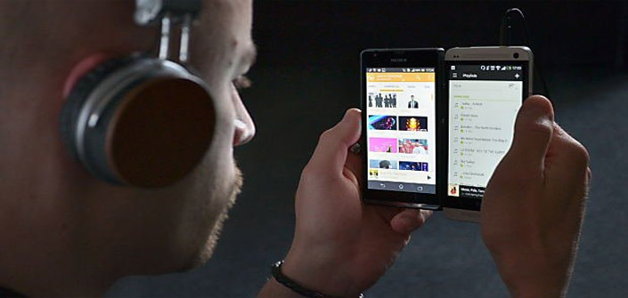
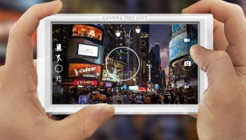
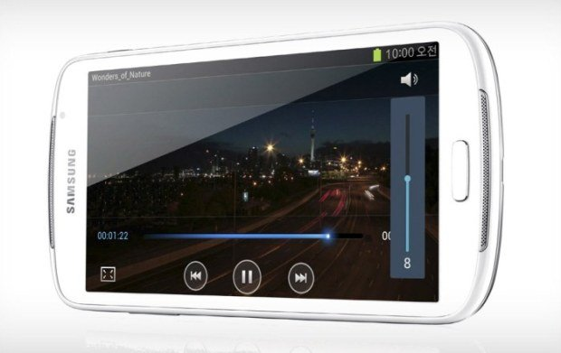

+++
title = "كيف تجعل هاتفك الأندرويد قادرا على فتح جميع صيغ الملفات"
date = "2015-04-18"
description = "بالرغم من أن الأندرويد نظام كبير مفتوح المصدر إلا أنه لا يستطيع أن يفتح كل صيغ الملفات التي تستطيع تشغيلها على نظام الويندوز، ولكن بفضل التطبيقات العديدة التي تعطى المستخدم ميزات جديدة، تستطيع بعد تثبيت هذه التطبيقات فتح جميع صيغ الملفات."
categories = ["مهارات رقمية",]
tags = ["موقع لغة العصر"]

+++

بالرغم من أن الأندرويد نظام كبير مفتوح المصدر إلا أنه لا يستطيع أن يفتح كل صيغ الملفات التي تستطيع تشغيلها على نظام الويندوز، ولكن بفضل التطبيقات العديدة التي تعطى المستخدم ميزات جديدة، تستطيع بعد تثبيت هذه التطبيقات فتح جميع صيغ الملفات.

اليك عزيزي القارئ مجموعة من التطبيقات المهمة لتشغيل الملفات، وبالتأكيد تستطيع الاكتفاء بواحد من التطبيقات من كل مجموعة.

**1. ملفات الصوت:**

مشغل الأندرويد الافتراضي يستطيع تشغيل ملفات Mp3 وبعض الصيغ الأخرى بدون مشاكل.
تطبيق [PowerAmp](https://play.google.com/store/apps/details?id=com.maxmpz.audioplayer)

هو أفضل تطبيق تشغيل صوتيات يدعم كل الصيغ المعروفة MP4; M4A; ALAC; OGG; WMA; FLAC; WAV; APE; WV; وTTK1، كما أن التطبيق يمتاز بالواجهة البسيطة والتحكم المرن، تستطيع تحميل نسخة تجريبية من التطبيق، أو شرائه من جوجل بلاي.

تطبيق [VLC for Android](https://play.google.com/store/apps/details?id=org.videolan.vlc)

هو الإصدار الخاص بالأندرويد من البرنامج الشهير بإمكانياته المعروفة.

**2. المستندات:**

متجر جوجل بلاي ملئ بالتطبيقات المخصصة لقراءة الكتب وفتح المستندات، ولكن أفضلها هما:
تطبيق [WPS Office + PDF](https://play.google.com/store/apps/details?id=cn.wps.moffice_eng)

يتميز التطبيق بتناسقه مع شاشة الهاتف التي يعمل عليها مهما كام حجمها، ويستطيع فتح صيغ Word، Excel، PowerPointوPDF.

تطبيق [AndrOpen Office](https://play.google.com/store/apps/details?id=com.andropenoffice)

هو التطبيق الخاص بفتح صيغ برنامج Open Office مثل ODT، ODS، ODP، ODG وODF

**3. ملفات الصور:**
يستطيع تطبيق المعرض الافتراضي تشغيل الصور ذات الصيغ JPEG، GIF، PNG وBMP.

تطبيق [QuickPic](https://play.google.com/store/apps/details?id=com.alensw.PicFolder) أفضل بديل المعرض

تطبيق [Raw Decoder](https://play.google.com/store/apps/details?id=com.tssystems.rawdecoder) لفتح صيغ RAW.

تطبيق [Photoshop Touch for phone](https://play.google.com/store/apps/details?id=air.com.adobe.pstouchphone) لفتح صيغة PSD.

تطبيق [Image Converter](https://play.google.com/store/apps/details?id=com.paul.icon) لتحويل صيغ الصور.

**4. ملفات الفيديو:**

تطبيق [VLC for Android](https://play.google.com/store/apps/details?id=org.videolan.vlc)

تطبيق [MX Player](https://play.google.com/store/apps/details?id=com.mxtech.videoplayer.ad) أفضل مشغل فيديو.

**5. الملفات المضغوطة:**
تطبيق [RAR for Android](https://play.google.com/store/apps/details?id=com.rarlab.rar&hl=ar)

الإصدار الخاص بالأندرويد من برنامج Winrar عملاق التعامل مع الملفات المضغوطة.

**6. باقي الصيغ:**
تطبيق [ES File Explorer File Manager](https://play.google.com/store/apps/details?id=com.estrongs.android.pop)

يستطيع فتح أغلب صيغ الملفات التي تتضمن الصور والفيديوهات والنصوص والملفات المضغوطة وملفات ال Html والعديد من الصيغ الأخر أتركك لتكتشفها.

---

هذا الموضوع نٌشر باﻷصل على موقع مجلة لغة العصر.

http://aitmag.ahram.org.eg/News/10160.aspx