+++
title = "دليل تطبيقات أندرويد مفتوحة المصدر"
date = "2021-09-01"
description = "يتميز أندرويد كنظام تشغيل بأنه مفتوح المصدر، وبذلك فهو يضمن للمستخدمين حرية التخصيص والتطوير بشكل كبير. ونتيجة لهذا الأمر نجد أن الشعبية الكبيرة لنظام أندرويد قد نتج عنها التنوع الكبير في التطبيقات المتوفرة والتي وصل عددها لأكثر من 2.7 مليون تطبيق حتى الربع الثاني من 2020. ومن ضمن هذه التطبيقات المتوفرة يوجد عدد كبير من التطبيقات مفتوحة المصدر تنافس التطبيقات المشهورة والأكثر تثبيتًا في مختلف التصنيفات وتوفر لمستخدميها الأمان والخصوصية بشكل مجاني. نستعرض في الصفحات التالية مجموعة من تطبيقات أندرويد مفتوحة المصدر بعضها متوفر على متجر جوجل بلاي وبعضها غير متوفر، يمكنك الاعتماد عليها بشكل يومي كبديل للبرامج مغلفة المصدر."
categories = ["برمجيات حرة", "أندرويد",]
tags = ["مجلة لغة العصر"]
images = ["images/0.jpg"]
+++
يتميز أندرويد كنظام تشغيل بأنه مفتوح المصدر، وبذلك فهو يضمن للمستخدمين حرية التخصيص والتطوير بشكل كبير. ونتيجة لهذا الأمر نجد أن الشعبية الكبيرة لنظام أندرويد قد نتج عنها التنوع الكبير في التطبيقات المتوفرة والتي وصل عددها لأكثر من 2.7 مليون تطبيق حتى الربع الثاني من 2020. ومن ضمن هذه التطبيقات المتوفرة يوجد عدد كبير من التطبيقات مفتوحة المصدر تنافس التطبيقات المشهورة والأكثر تثبيتًا في مختلف التصنيفات وتوفر لمستخدميها الأمان والخصوصية بشكل مجاني. نستعرض في الصفحات التالية مجموعة من تطبيقات أندرويد مفتوحة المصدر بعضها متوفر على متجر جوجل بلاي وبعضها غير متوفر، يمكنك الاعتماد عليها بشكل يومي كبديل للبرامج مغلفة المصدر.

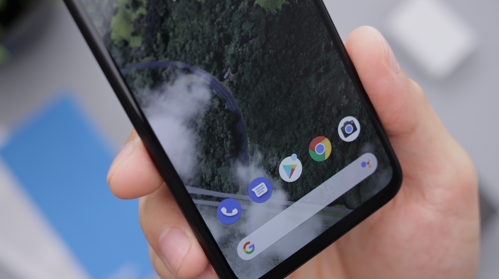

## متجر F-Droid

هناك العديد من التطبيقات مفتوحة المصدر غير المتوفرة على متجر جوجل بلاي، للعديد من الأسباب مثل عدم التوافق مع سياسيات جوجل أو عدم رغبة مطوريها في الاعتماد على جوجل. لكن لحسن الحظ، هناك مكان آخر يمكنك الوصول إلى تطبيقات أندرويد مفتوحة المصدر من خلاله وهو متجر F-Droid.

F-Droid هو متجر تطبيقات أندرويد مثل جوجل بلاي يحتوي فقط على التطبيقات الحرة أو مفتوحة المصدر، ويمكن من خلاله تصفح وتحميل التطبيقات دون الحاجة إلى التسجيل أو إنشاء حساب.

يوفر المتجر أيضًا معلومات مفصلة عما يسميه "مضاد الميزات" Anti-Features مثل الإعلانات والتتبع والاعتماد على برمجيات غير حرة، مما يجعل جميع الأمور واضحة للمستخدم. كما يتيح المتجر أيضا الكود المصدري للتطبيقات وبذلك يمكن لأي شخص بناء التطبيق بنفسه أو تفصحه أو تعديله أو إعادة توزيعه حسب رخصة الكود.

https://www.f-droid.org

https://bit.ly/3lRe2lN

يعتمد F-Droid على نظام المستودعات لتخزين التطبيقات ووصفها ومختلف المعلومات الخاصة بها وصورها وملفات التثبيت الخاصة بها. ويتطلب لإضافة تطبيق جديد فتح طلب على المستودع الرسمي مفتوح المصدر وملء جميع المعلومات الخاصة بالتطبيق ومن ثم التنسيق مع المسؤولين الانتظار لتزويدهم بنسخه من التطبيق موقعه باستخدام توقيع signature المتجر. وبما أن كافة أجزاء المشروع مفتوحة المصدر فهناك العديد من الأشخاص والفرق التي تستخدم نفس البنية الأساسية ل F-Droidوتوفر مستودعات شبيهة مثل IzzyOnDroid وGuardian Project.

## تطبيق Aurora Droid

هو تطبيق عميل لمتجر F-Droid مفتوح المصدر، يوفر العديد من المميزات التي تسهل التعامل مع تطبيقات أندرويد مفتوحة المصدر، مثل مدير المستودعات الذي يتيح للمستخدم التحكم في المستودعات المفعلة بضغط واحدة، والبحث المتقدم وفلترة التطبيقات، ومدير التحميلات والتصميم الحديث المميز.

ونظرًا لتفوق هذا التطبيق على التطبيق الرسمي ل F-Droid فأنصحك باستخدامه بدلًا من التطبيق الرسمي في إيجاد وتثبيت وإدارة التطبيقات مفتوحة المصدر التي سنستعرضها. ويمكنك تحميله من خلال موقعه الرسمي https://auroraoss.com.
https://bit.ly/3k2b2CQ

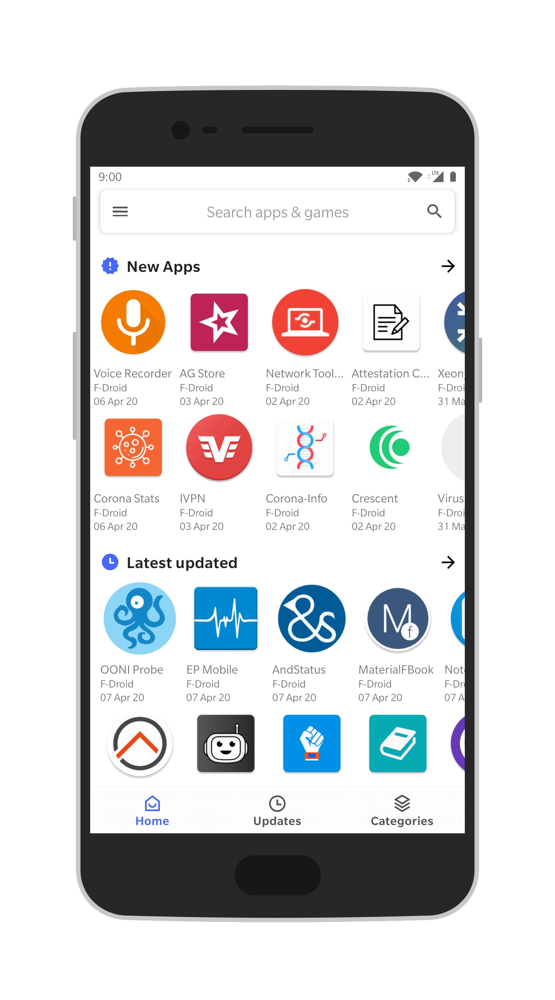

## 1- تطبيقات إدارة التطبيقات

### Aurora Store

هو التطبيق الشقيق ل Aurora Droidوالذي يعمل كبديل لمتجر جوجل بلاي، ويمكن المستخدم من تحميل وتحديث التطبيقات من خلال بيانات جوجل بلاي دون الحاجة إلى وجود خدمات جوجل على الهاتف.

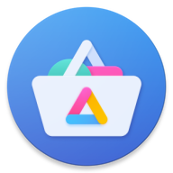

https://f-droid.org/en/packages/com.aurora.store

https://bit.ly/3dw8sSS

### App Warden

تطبيق متميز لإدارة التطبيقات الموجودة على الهاتف وإزالة التطبيقات الدعاية المثبتة مسبقًا Bloatware، وإنشاء تقارير بالتطبيقات التي تحتوي على تتبع أو تسيء استغلال الصلاحيات. كما يمكن من خلاله تعطيل كافة آليات التتبع المدمجة بالتطبيقات على مستوي الهاتف بأكمله تلقائيا.

https://apt.izzysoft.de/fdroid/repo/com.aurora.warden

https://bit.ly/2IxGYAZ

## 2- تطبيقات التواصل والمراسلة

### Signal

سيجنال تطبيق مجاني ومفتوح المصدر متوفر على أندرويد وiOS وأنظمة تشغيل سطح المكتب. يستخدم سيجنال التشفير التام من النهاية الى النهاية E2E، مما يسمح للمستخدمين بإرسال الرسائل النصية والجماعية والصور والفيديو والملفات وإجراء المكالمات الهاتفية بالصوت والفيديو مشفرة.

https://signal.org/android/apk

https://bit.ly/37cdGC8

### Element

تطبيق تواصل اجتماعي مفتوح المصدر يعتمد على بروتوكول Matrix، ومتوفر على جميع منصات التشغيل مثل ويندوز ولينكس وماك وأندرويد وiOS وكذلك المتصفحات. لدى Element العديد من الميزات مثل المجموعات والقنوات ومشاركة الملفات بين المستخدمين، كما أن التسجيل به لا يتطلب رقم هاتف.

https://f-droid.org/en/packages/im.vector.app

https://bit.ly/3j1ssy8

### Telegram

أحد أفضل تطبيقات التواصل الموجودة حاليًا، ويستخدمه أكثر من 400 مليون مستخدم نشط. يميز تيليجرام العديد من الأمور مثل تخزين المحادثات سحابيًا، وإمكانية إرسال الوسائط والملفات بحجم يصل إلى 2 جيجا بايت، وإمكانية إنشاء مجموعات يصل أعضاؤها إلى 200000 عضو، والمكالمات الصوتية والمرئية، والعديد من بوتات الدردشة.

https://f-droid.org/packages/org.telegram.messenger

https://bit.ly/378Q2GQ

### Wire

تطبيق سويسري تقع خوادمه في أراضي الاتحاد الأوروبي. يدعم التراسل الآمن والمكالمات، ومشاركة الصور والفيديوهات، والملفات. يستخدم التطبيق التشفير التام من النهاية الى النهاية، وبذلك يمكن للمرسل والمستلم فقط قراءة الرسائل ورؤية محتواها. يمكن التسجيل في التطبيق عن طريق رقم الهاتف أو البريد الإلكتروني واستخدام نفس الحساب على مختلف المنصات، كما لا تحتاج إلى مشاركة بياناتك مع الأشخاص حيث كل ما يحتاجونه للتواصل معاك هو اسم المستخدم.

https://wire.com/en/download

https://bit.ly/3j1sx4U

### Jitsi Meet

جيتسي هي منصة لمكالمات الفيديو والمؤتمرات الرقمية متوفرة بشكل مجاني ومفتوح المصدر. يتيح التطبيق إجراء المحادثات عبر الصوت والفيديو بدون قيود زمنية ويدعم عدد لا محدود من الأعضاء مما يجعل منه منافسًا شرسًا لتطبيق Zoom الشهير. تعمل منصة جيتسي على مختلف أنظمة التشغيل والمتصفحات أيضًا.

https://f-droid.org/en/packages/org.jitsi.meet

https://bit.ly/2SWTTyf

### Frost for Facebook

تطبيق Frost عبارة عن متصفح فيسبوك يهدف لاستبدال التطبيق الرسمي الذي يجمع الكثير من البيانات حول المستخدم ويتطلب العديد من الصلاحيات. يحتوي التطبيق على ميزات عديدة منها: دعم الحسابات المتعددة والتبديل السريع بينها، وتخصيص شكل الفيسبوك عن طريق الثيمات، وعرض مقاطع فيديو في نافذة صغيرة أثناء التصفح.

https://f-droid.org/packages/com.pitchedapps.frost

https://bit.ly/2HeyePq

## 3- تطبيقات البريد الإلكتروني

### K-9 Mail

تطبيق بريد إلكتروني حر لنظام تشغيل أندرويد متاح مجانًا منذ عام 2008 ومفتوح المصدر تحت ترخيص أباتشي الإصدار 2.0. يعتبر هذا التطبيق أشهر تطبيقات البريد الإلكتروني مفتوحة المصدر على الإطلاق. ويدعم التطبيق بروتوكولات البريد POP3 وIMAP، كما يدعم IMAP IDLE لاستلام الإشعارات في الوقت الحقيقي.

https://f-droid.org/packages/com.fsck.k9

https://bit.ly/2SYBeST

### FairEmail

تطبيق بريد إلكتروني جديد نسبيًا يركز بشكل كبير على الخصوصية ويدعم مختلف مزودي خدمات البريد الإلكتروني مثل جيمل وأوتلوك وياهوو. كما يدعم التطبيق إضافة عدد لا نهائي من الحسابات وخدمات البريد، ويتسم بالبساطة وسهولة الواجهة مما يجعله ملائمًا للمبتدئين.

https://f-droid.org/en/packages/eu.faircode.email

https://bit.ly/3nUxhNe

## 4- متصفحات الإنترنت

### Firefox

موزيلا فايرفوكس هو أحد أشهر متصفح الويب المجانية الموجودة منذ زمن طويل. فقد تم إصداره في 2002 ويعمل على تطويره مؤسسة موزيلا والعديد من المتطوعين حول العالم. يتميز فايرفوكس بالسرعة والأداء المرتفع ودعم عدد ضخم من الإضافات، ومزامنة سجل التصفح والمفضلات عبر مختلف الأجهزة والحماية من التتبع بشكل تلقائي.

https://play.google.com/store/apps/details?id=org.mozilla.firefox

https://bit.ly/3lS02s9

### Bromite

متصفح مبني على متصفح Chromium مفتوح المصدر (الذي يستخدمه جوجل كروم كذلك)، يهدف بشكل رئيسي إلى توفير تجربة تصفح منظمة مع ميزات حماية الخصوصية ومنع الإعلانات بشكل افتراضي. ويتوفر متصفح Bromite لأجهزة أندرويد التي تعمل بإصدار أندرويد 5.0 أو أعلى.

https://github.com/bromite/bromite/releases/latest

https://bit.ly/2IEsWxL

### Kiwi Browser

متصفح آخر مبني على Chromium يركز بشكل كبير على الأداء السريع ودعم إضافات كروم خلافًا لأغلب المتصفحات المعروفة. ويأتي المتصفح كذلك مع العديد من الميزات الأخرى مثل الوضع الليلي والحماية من برمجيات التعدين والإعلانات المزعجة.

https://play.google.com/store/apps/details?id=com.kiwibrowser.browser

https://bit.ly/31csLQw

### Lightning Browser

متصفح ويب بسيط وسريع يركز على التصميم والأمان ويعمل على الأجهزة ذات المواصفات الضعيفة بكفاءة عالية حيث يصل حجمه الإجمالي إلى 3 ميجا بايت فقط.

https://f-droid.org/app/acr.browser.lightning

https://bit.ly/3jadFkQ

## 5- تطبيقات قراءة الكتب

### Librera

أحد أفضل برامج قراءة الكتب المجانية ومفتوحة المصدر الموجودة على نظام أندرويد، حيث يدعم العشرات من الصيغ المختلفة، وتحويل النص إلى كلام، والعديد من الخصائص الأخرى مثل: سمات القراءة الخاصة بالنهار والليل لتوفير قراءة مريحة، ورف الكتب والمفضلات، وإمكانية أخذ ملاحظات داخل الكتب. كما يأتي بميزات أخرى تجعل منه خيارًا ممتازًا لدارسي اللغات الأجنبية مثل: تشغيل ملفات الصوت داخل الكتاب، والبحث في برامج القواميس أو القواميس المتاحة عبر الإنترنت.

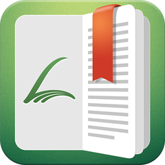

https://f-droid.org/en/packages/com.foobnix.pro.pdf.reader

https://bit.ly/3duKrM2

### Book Reader

بديل بسيط وخفيف الحجم لفتح لملفات fb2 - html - txt - epub - mobi - rtf - doc - pdf - djvu - cbz - cbr ويعدم مختلف أجهزة أندرويد بداية من الإصدار 2.3.

https://f-droid.org/packages/com.github.axet.bookreader

https://bit.ly/379R7Ou

## 6- تطبيقات الصور والصوت والفيديو

### VLC

مشغل الوسائط المعروف والمتوفر بشكل مجاني ومفتوح المصدر على مختلف أنظمة التشغيل. يدعم VLC معظم صيغ ملفات الوسائط المتعددة بالإضافة إلى الأقراص وبروتوكولات تدفق الشبكة.

https://f-droid.org/en/packages/org.videolan.vlc

https://bit.ly/3dt6F16

### Vinyl Music Player

تطبيق مشغل صوتيات خفيف الحجم ذو تصميم مميز، يتسم ببساطة الواجهة وسهولة التخصيص وتغيير الثيمات. كما يدعم أيضًا تصفح المجلدات ومؤقت النوم ومحرر بطاقات معلومات الصوتيات.

https://f-droid.org/en/packages/com.poupa.vinylmusicplayer

https://bit.ly/3nXy7sr

### Simple Gallery Pro

Simple Gallery هو أحد أفضل تطبيقات معرض الصور التي لا تستخدم الإنترنت وتوفر إمكانيات تخصيص لكل تفاصيل التطبيق. كما يوفر أيضًا ميزات تعديل الصور وحمايتها بكلمة مرور وإخفائها وإنشاء ألبوم صور سري واقتصاص الصور بسهولة. ويدعم التطبيق مجموعة كبيرة من تنسيقات الصور والفيديو المختلفة مثل RAW وSVG وGIF والصور البانورامية وغير ذلك الكثير.

https://f-droid.org/packages/com.simplemobiletools.gallery.pro

https://bit.ly/3nV7kgz

### NewPipe

أفضل تطبيق بديل لمشغل اليوتيوب الرسمي بلا منازع. حيث يمكنك من مشاهدة اليوتيوب دون قيود أو قلق من اختراق خصوصيتك. ويدعم العديد من الأمور التي لن تحصل عليها في تطبيق الرسمي بدون الاشتراك المدفوع مثل التشغيل في الخلفية. كما يدعم أيضَا التحميلات وتشغيل الفيديوهات في نافذة منبثقة واختيار جودة التشغيل والتحكم في الاشتراكات والعلامات المرجعية والسجل بشكل كامل وبدون أي إعلانات مزعجة.

https://f-droid.org/packages/org.schabi.newpipe

https://bit.ly/342RV5R

### AntennaPod

AntennaPod هو تطبيق مدير بودكاست مرن وسهل الاستخدام ومفتوح المصدر لنظام أندرويد. يعدم التطبيق التحميل تلقائي للحلقات الجديدة من برامج البودكاست التي تتابعها وتشغيلها بالسرعة التي تريدها، ويدعم خلاصات البرامج بصيغ RSS وAtom، كما يدعم استيراد وتصدير اشتراكات البرامج بصيغة OPML والمزامنة عبر خدمة gpodder.

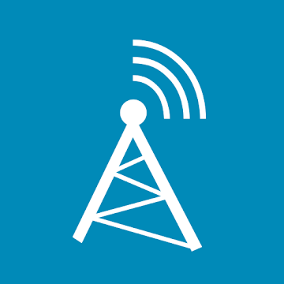

https://play.google.com/store/apps/details?id=de.danoeh.antennapod

https://bit.ly/2SXhBKK

## 7- أدوات وتطبيقات متنوعة

### Collabora Office

تطبيق حزمة مكتبية يحتوي على محرر نصوص وجداول بيانات ومنشئ عروض تقديمية يعتمد على حزمة LibreOffice وهي أشهر مجموعة مكتبية مفتوحة المصدر في العالم. يدعم التطبيق مختلف صيغ الملفات المكتبية مثل Open Document وامتدادات ملفات الأوفيس بداية من إصدار 97 وحتى 2019.

https://play.google.com/store/apps/details?id=com.collabora.libreoffice

https://bit.ly/3lRLetE

### Joplin

Joplin هو تطبيق مجاني ومفتوح المصدر لتدوين الملاحظات والمهام، يمكنه التعامل مع عدد كبير من الملاحظات المنظمة في دفاتر الملاحظات. الملاحظات المخزنة به تكون قابلة للبحث ويمكن نسخها وإضافة التسميات لها وتعديلها إما من التطبيقات مباشرة أو من محرر النصوص الخاص بك حيث يتم حفظ الملاحظات بتنسيق Markdown. يدعم التطبيق مزامنة الملاحظات مع العديد من الخدمات السحابية بما أو مجلدات الشبكة، وعند مزامنة الملاحظات يتم حفظ دفاتر الملاحظات والعلامات والبيانات الوصفية الأخرى في ملفات نصية عادية يمكن فتحها ونسخها احتياطيًا ونقلها بسهولة.

https://play.google.com/store/apps/details?id=net.cozic.joplin

https://bit.ly/3lJEpKy

### My Expenses

تطبيق إدارة نفقات متميز يتسم بالسهولة وكثرة المميزات التي تعينك على إدارة الأموال بكفاءة مثل تجميع معاملاتك حسب اليوم والأسبوع والشهر والسنة، وتلخيص إجمالي الأموال بحساباتك مع المعالجة التقائي لأسعار الصرف لكل حساب ولكل معاملة)، وتحديد المبلغ الذي تنوي إنفاقه في بشكل سنوي أو شهري أو أسبوعي، ومزامنة بيانات الحساب المشفرة عبر الأجهزة المتعددة باستخدام الخدمات السحابية الخاصة أو العامة.

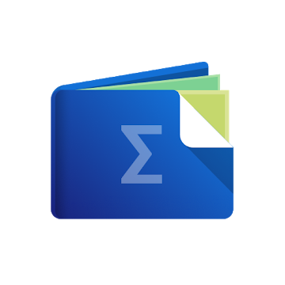

https://f-droid.org/packages/org.totschnig.myexpenses

https://bit.ly/3nQqEM1

### Blokada

تطبيق لمنع الإعلانات يعتمد على استخدام خدمة VPN محلية لحجب الإعلانات دون الحاجة إلى صلاحيات الرووت، ويتسم بالاستهلاك القليل للبطارية وسهولة الاستخدام والكفاءة.

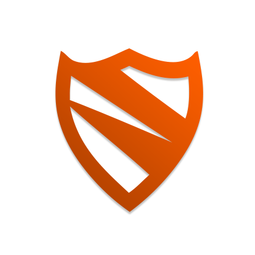

https://f-droid.org/en/packages/org.blokada.alarm

https://bit.ly/3k2tafG

### Open Camera

أحد أفضل تطبيقات الكاميرا المجانية المتوفرة على أندرويد ويحتوي على عدد كبير من الخصائص والميزات التي تسمح لك بالتحكم بكل شيء يخص الكاميرا تقريبًا بشكل يفوق التطبيق الأصلي للكاميرا الموجود على الهاتف وبدون الحاجة إلى صلاحيات الرووت.

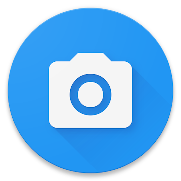

https://f-droid.org/en/packages/net.sourceforge.opencamera

https://bit.ly/378Sey4

### Material Files

مدير ملفات قوي وخفيف الحجم وذو تصميم رائع يمكنك من التعامل مع مختلف الملفات على هاتفك بسهولة وفاعلية، ويدعم التخصيص من خلال مجموعة كبيرة من الثيمات.

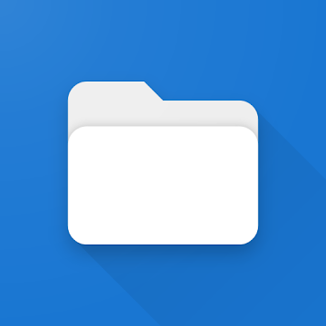

https://f-droid.org/packages/me.zhanghai.android.files

https://bit.ly/3j17GOT

### andOTP

andOTP هو تطبيق مصادقة ثنائية لهواتف أندرويد التي تعمل بإصدار 4.4 أو أعلى. ويتميز التطبيق بالبساطة الشديدة حيث كل ما تحتاج إلى عمله هو مسح كود QR ليتم توليد رموز المصادقة الثنائية تلقائيا. ويدعم التطبيق التشفير باستخدام كلمات المرور وأرقام التعريف الشخصية ومفاتيح التشفير.

https://f-droid.org/packages/org.shadowice.flocke.andotp

https://bit.ly/3dt7Qxy

---

هذا الموضوع نُشر باﻷصل في مجلة لغة العصر العدد 249 شهر 09-2021 ويمكن الإطلاع عليه [هنا](https://drive.google.com/file/d/1ovpFNEGB96_W2rG0fCEtRL9uRwCnGb-t/view?usp=sharing).

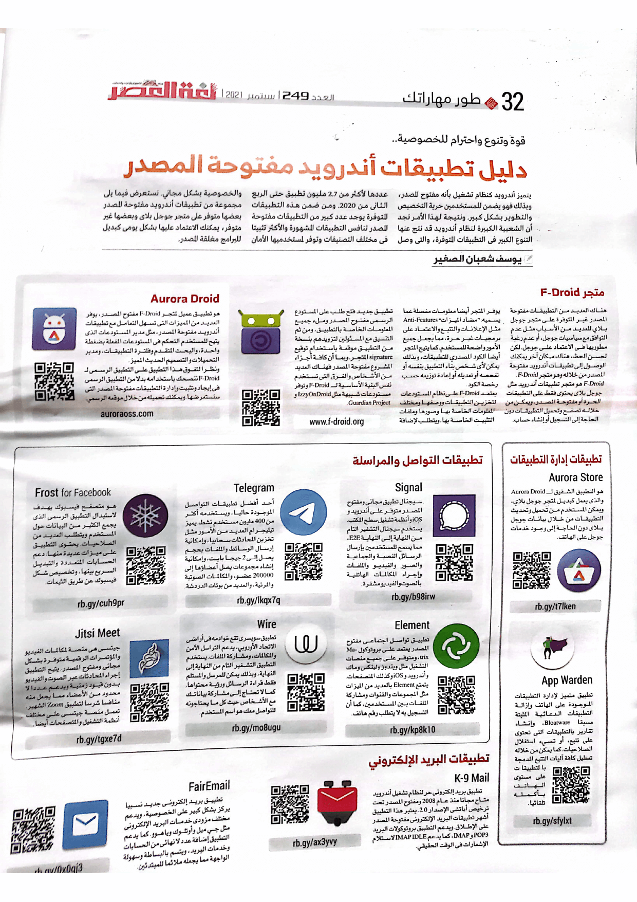

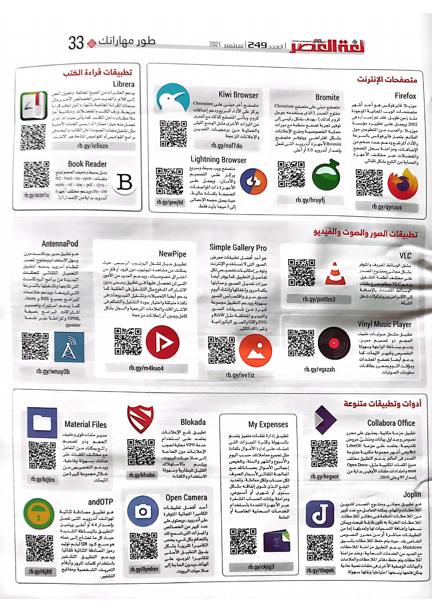
