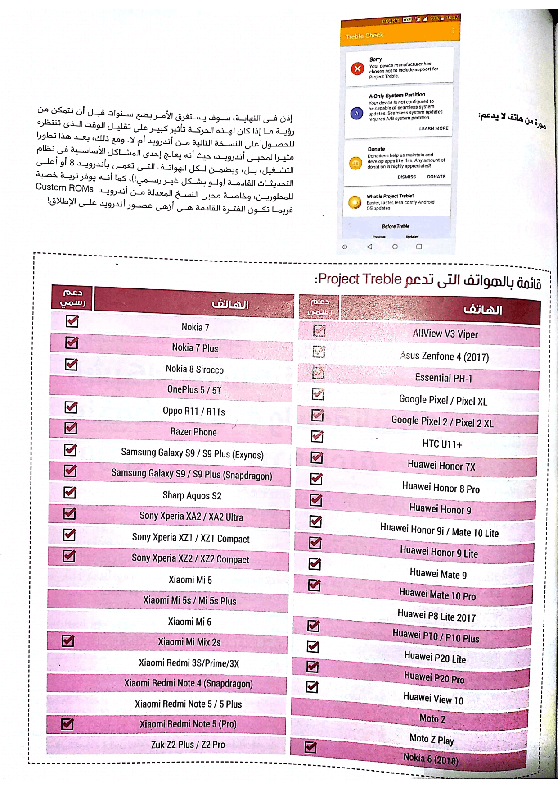

+++
title = "مشروع Treble من جوجل.. صفحة جديدة في تاريخ نظام أندرويد"
date = "2018-05-01"
description = "إذا سألت أي مستخدم لهاتف يعمل بنظام أندرويد عن أكبر السلبيات الموجودة في النظام سيجيبك بشيء واحد: التحديثات. فمقارنة بالتحديثات المستمرة التي تحصل عليها هواتف أيفون، لا تحصل أغلب الهواتف المتوسطة إلا على تحديث واحد، وقد يصل الأمر في بعض الأجهزة الرائدة إلى ثلاثة تحديثات. وفى خطوة جديدة قد تغير قواعد اللعبة من جوجل، تم الإعلان عن الألية الجديدة لحل مشكلة التحديثات تحت اسم Project Treble."
categories = ["أندرويد",]
tags = ["مجلة لغة العصر"]

+++

إذا سألت أي مستخدم لهاتف يعمل بنظام أندرويد عن أكبر السلبيات الموجودة في النظام سيجيبك بشيء واحد: التحديثات. فمقارنة بالتحديثات المستمرة التي تحصل عليها هواتف أيفون، لا تحصل أغلب الهواتف المتوسطة إلا على تحديث واحد، وقد يصل الأمر في بعض الأجهزة الرائدة إلى ثلاثة تحديثات. وفى خطوة جديدة قد تغير قواعد اللعبة من جوجل، تم الإعلان عن الألية الجديدة لحل مشكلة التحديثات تحت اسم Project Treble.

## لماذا تتأخر التحديثات في الوصول لأجهزة أندرويد؟

تتعدد أسباب تأخر أو انعدام وصول التحديثات إلى الأجهزة المختلفة، باستثناء أجهزة Google Pixel وNexus سابقا، وذلك يرجع لطبيعة نظام أندرويد مفتوح المصدر بشكل كبير، فإذا نظرت إلى إحصائيات نسبة انتشار إصدارات أندرويد الموجودة على الموقع الرسمي ستلاحظ أن أعلى الإصدارات انتشارا في الوقت الحالي لا يزال أندرويد 7 نوجا بنسبة 28.5%

فعند إصدار جوجل لنسخة جديدة يمر النظام بعده مراحل حتى يصل للمستخدم:

1. نشر الكود المصدري للنظام، والمعروف باسم AOSP.
2. يتم تعديل النظام من قبل شركات تصنيع الشرائح الإلكترونية والمعالجات مثل كوالكم وإنتل وسامسونج حتى يعمل الهاردوير بشكل صحيح على النسخة الجديدة.
3. يتم تعديل النسخة مرة أخرى من قبل شركات التصنيع المختلفة، وتقوم كل شركة بإضافة الواجهة والتطبيقات الخاصة بها.
4. بعد ذلك يتم اختبار النظام بشكل داخلي للتأكد من عمل كل شيء بالشكل الصحيح.
5. الإصدار النهائي للمستخدم عن طريق التحديثات الهوائية OTA.

ولهذه الأسباب يستغرق وصول أي تحديث جديد للأجهزة وقت طويلا، وقد لا يصل بسبب عدم توافق الهاردوير مع التحديث في بعض الأجهزة القديمة.

تعي جوجل هذا الأمر جيدا، وقد قامت ببعض المحاولات السابقة لحل هذه المشكلة لكنها لم تجد نفعا، مثل تهديد الشركات المتأخرة في توفير التحديثات، بأن تضعها ضمن قائمة مرتبة بحسب الشركات الأسرع، ثم الضغط على الشركات من أجل توفير التحديثات الأمنية بشكل شهري. وفى النهاية وصلت جوجل للحل السحري لإرسال التحديثات لجميع الأجهزة بغض النظر عن مواصفاتها أو تاريخ إطلاقها!

## مشروع Project Treble

يتكون نظام أندرويد من بعض من 5 طبقات مختلفة، تبدأ من الواجهة البرمجية للتطبيقات وحتى تصل إلى نواة النظام Linux Kernel.

تكمن مشكلة التحديثات البطيئة لنظام أندرويد في الطريقة التي تتواصل بها طبقات أندرويد مع أجهزة الهاردوير الأساسية للهاتف. فمثلاً من أجل تشغيل التطبيقات على وحدة المعالجة المركزية أو استخدام الكاميرا، يجب على نظام التشغيل التحدث إلى الأجهزة المتصلة عبر واجهة تشغيل برمجية Hardware Abstraction Layer أو (HAL).

ويعد هذا أمر مهم بالنسبة للمطورين، فقد تم تصميم HALs ببساطة لتقوم بعملية فصل بين أساسيات النظام والتي تشمل تعريفات الهاتف، والأكواد الخاصة بالهاردوير ونواة لينكس، وبين أجزاء النظام من المرحلة الأعلى الأقل تعقيداً والتي تتعامل مع البرمجيات Android System Services.

ففي أنظمة التشغيل السابقة مثل أندرويد 7.0 وما قبله لم يكن هناك فصل بين الأكواد الخاصة بالهاردوير وبين المراحل الأعلى من نظام التشغيل، وهو ما أدي إلى أن الشركات المصنعة للأجهزة يجب أن تقوم بتحديث أجزاء كبيرة من النظام مع كل تحديث، وهو ما يحتاج بالضرورة إلى انتظار مصنعي الهاردوير، لتوفير الإصدار الأحدث من البرمجيات الخاصة بها لربط الأجهزة مع نظام التشغيل الجديد.

ما يقوم به مشروع Project Treble هو عزل نظام التشغيل نفسه عن الإضافات المطلوبة من مُصنّعي الشرائح عبر إضافة طبقة وسيطة تدعى Vendor Interface تشمل كل ما يخص الجهاز من تعريفات وملفات يتم التحقق من توافقها عن طريقVendor Test Suite (VTS). والتي تعمل بشكل مماثل لمستند تعريف التوافق Compatibility Definition Document (CDD) وحزمة اختبار التوافق Compatibility Test Suite (CTS) حيث تضمن هذه الأليات معرفة المصنعين بما يحتاجون تنفيذه حتى تلبى أجهزتهم المتطلبات الضرورية لتشغيل أحدث إصدار من أندرويد، إلى جانب خدمات جوجل بلاي Google Play.

ببساطة، قامت جوجل بتجزئة أندرويد حتى يتم فصل إطار عمل نظام التشغيل بشكل كامل عن التعديلات الخاصة بكل جهاز على حدي أو التعريفات والأكواد ذات المستوى الأدنى والتي يتم كتابتها بواسطة شركات تصنيع الشرائح الإلكترونية.

وبالتالي، تتمثل الميزة الرئيسية لهذا التغيير في أن صانعي الأجهزة يمكنهم الآن أخذ النسخة المصدرية للتحديث فور صدوره، وتركيبها على الهاتف بشكل فوري وسيعمل التحديث مباشرة، دون الحاجة لانتظار مصنعي الشرائح لتحديث الأكواد الخاصة بهم، مما يعنى أن هذه الطريقة تضمن التوافق المستقبلي ما بين الهاردوير والنسخ القادمة من نظام التشغيل.

(الصورة تشرح الفرق في بنية النظام قبل وبعد Project Treble)

ولتقريب الكيفية التي تعمل بها هذه التقنية، يمكن تشبيهها بالواجهات البرمجية APIs التي يقدمها أندرويد والتي تتيح للمبرمجين برمجة تطبيق وضمان أنه سيعمل على جميع هواتف أندرويد على اختلافها.

## هل سيحل Project Treble مشكلة تأخر وصول التحديثات؟

بقدر ما ستعمل هذه الخطوة على تقليل تأخر وصول التحديث، إلا أنه لا يمكن التنبؤ بالضبط متى ستصل النسخة الجديدة للهواتف، ففي نهاية الأمر يقع ما تبقى على عاتق مصنعي الهواتف.
وبالنسبة للأجهزة الجديدة فإن سياسة إصدار النسخ التجريبية من الإصدارات القادمة بشكل مبكر التي بدأت جوجل باتباعها مؤخرًا، ستساعد وبلا شك الشركات على اختبار واجهاتها الخاصة مُبكرًا على الإصدارات الجديدة من نظام التشغيل، ما قد يعني بأن الواجهة يجب أن تكون جاهزة أو شبه جاهزة للإطلاق النهائي بمجرد إطلاق تحديث أندرويد الرسمي ودون أي انتظار لموافقة شركات تصنيع الشرائح.

## أندرويد يصبح نظام قابل للتشغيل على أي جهاز!

من ضمن الإنجازات التي قام بها مشروع Treble، هي توفير نسخة من نظام أندرويد، يمكن للمستخدمين تشغيلها على أي هاتف، مهما كان نوعه ومهما كانت مواصفاته الداخلية، ما دام قد تم إصداره بأندرويد 8.0 أو أعلى، فحتى لو لن يتم إصدار التحديث بشكل رسمي، يمكنك تحميل النظام في صورة ملف img تسمي Generic System Image (GSI) من موقع XDA Developers

وهو ما قد تم تجربته بالفعل من قبل المطورين، حيث أن نفس نسخة النظام الذي تم بناؤوها من الكود المصدري للأندرويد AOSP قد عملت بكفاءة على هواتف مثل Huawei Mate 10 (معالجHiSilicon Kirin) وSony Xperia XZ1 Compact (معالج Qualcomm Snapdragon) وSamsung Galaxy S9 (معالج Exynos) بل وحتى بعض أجهزة التابلت التي تعمل بمعالجات MediaTek مثلAllView V3 Viper.
ولمن يرغب في تجربة تشغيل نسخة GSI على هاتفه، قام موقع المطورين بنشر دليل تفصيلي للخطوات اللازمة لتثبيتها يمكنك الاطلاع عليها من هنا. https://www.xda-developers.com/flash-generic-system-image-project-treble-device/

## هل سيحصل جهازك على دعم Project Treble؟

للأسف بالنسبة للغالبية العظمى من الأجهزة الحالية، لن ترى ثمار عمل فريق أندرويد في Project Treble، لكن كل جهاز جديد تم إطلاقه بنظام الأندرويد 8.0 وما بعده، سيدعم مشروع Treble.
أما الهواتف التي سيتم تحديثها إلى أندرويد8.0 فليس شرطا أن تدعم مشروع Treble، فمثلاً هاتف OnePlus 5T هو أحد تلك الهواتف التي لن تحصل على هذا الدعم "بشكل رسمي"، في حين أن هناك هواتف أخري ستحصل على الدعم مثل هواتف جوجل بيكسل.
لكن الخبر الجيد أن هناك بعض المطورين على منتدى XDA Developers الشهير قد تمكنوا من جلب دعم Treble بشكل غير رسمي على العديد من الهواتف.

## كيف تتأكد من دعم جهازك الجديد ل Project Treble؟

ببساطة قم بتحميل التطبيق التالي من جوجل بلاي
https://play.google.com/store/apps/details?id=com.kevintresuelo.treble
حيث سيقوم بفحص معلومات الموجودة في نظام الهاتف، وفى حالة وجود الخاصية ro.treble.enabled يكون الهاتف داعما لمشروع Treble.
صورة من هاتف يدعم:

صورة من هاتف لا يدعم:

إذن في النهاية، سوف يستغرق الأمر بضع سنوات قبل أن نتمكن من رؤية ما إذا كان لهذه الحركة تأثيرًا كبيرًا على تقليل الوقت الذي تنتظره للحصول على النسخة التالية من أندرويد أم لا، ومع ذلك، يعد هذا تطورا مثيرا لمحبي أندرويد ، حيث أنه يعالج إحدى المشاكل الأساسية في نظام التشغيل، بل ويضمن لكل الهواتف التي تعمل بأندرويد 8 أو أعلى التحديثات القادمة (ولو بشكل غير رسمي!)، كما أنه يوفر تربة خصبة للمطورين وخاصة محبي النسخ المعدلة من أندرويد Custom ROMs، فربما تكون الفترة القادمة هي أزهى عصور أندرويد على الإطلاق!

## [قائمة بالهواتف التي تدعم Project Treble](https://github.com/phhusson/treble_experimentations/wiki)

|                                                                    **الهاتف**                                                                     | **دعم رسمي** |
| :-----------------------------------------------------------------------------------------------------------------------------------------------: | :----------: |
|                           [AllView V3 Viper](https://github.com/phhusson/treble_experimentations/wiki/AllView-V3-Viper)                           |      ✓       |
|                     [Asus Zenfone 4 (2017)](<https://github.com/phhusson/treble_experimentations/wiki/Asus-Zenfone-4-(2017)>)                     |      ✓       |
|                             [Essential PH-1](https://github.com/phhusson/treble_experimentations/wiki/Essential-PH-1)                             |      ✓       |
|                   [Google Pixel / Pixel XL](https://github.com/phhusson/treble_experimentations/wiki/Google-Pixel-and-Pixel-XL)                   |      ✓       |
|               [Google Pixel 2 / Pixel 2 XL](https://github.com/phhusson/treble_experimentations/wiki/Google-Pixel-2-and-Pixel-2-XL)               |      ✓       |
|                                   [HTC U11+](https://github.com/phhusson/treble_experimentations/wiki/HTC-U11-)                                   |      ✓       |
|                            [Huawei Honor 7X](https://github.com/phhusson/treble_experimentations/wiki/Huawei-Honor-7X)                            |      ✓       |
|                         [Huawei Honor 8 Pro](https://github.com/phhusson/treble_experimentations/wiki/Huawei-Honor-8-Pro)                         |      ✓       |
|                             [Huawei Honor 9](https://github.com/phhusson/treble_experimentations/wiki/Huawei-Honor-9)                             |      ✓       |
|             [Huawei Honor 9i / Mate 10 Lite](https://github.com/phhusson/treble_experimentations/wiki/Huawei-Honor-9i---Mate-10-Lite)             |      ✓       |
|                        [Huawei Honor 9 Lite](https://github.com/phhusson/treble_experimentations/wiki/Huawei-Honor-9-Lite)                        |      ✓       |
|                              [Huawei Mate 9](https://github.com/phhusson/treble_experimentations/wiki/Huawei-Mate-9)                              |      ✓       |
|                         [Huawei Mate 10 Pro](https://github.com/phhusson/treble_experimentations/wiki/Huawei-Mate-10-Pro)                         |      ✓       |
|                        [Huawei P8 Lite 2017](https://github.com/phhusson/treble_experimentations/wiki/Huawei-P8-Lite-2017)                        |              |
|                     [Huawei P10 / P10 Plus](https://github.com/phhusson/treble_experimentations/wiki/Huawei-P10-and-P10-Plus)                     |      ✓       |
|                            [Huawei P20 Lite](https://github.com/phhusson/treble_experimentations/wiki/Huawei-P20-Lite)                            |      ✓       |
|                             [Huawei P20 Pro](https://github.com/phhusson/treble_experimentations/wiki/Huawei-P20-Pro)                             |      ✓       |
|                             [Huawei View 10](https://github.com/phhusson/treble_experimentations/wiki/Huawei-View-10)                             |      ✓       |
|                                     [Moto Z](https://github.com/phhusson/treble_experimentations/wiki/Moto-Z)                                     |              |
|                                [Moto Z Play](https://github.com/phhusson/treble_experimentations/wiki/Moto-Z-Play)                                |              |
|                            [Nokia 6 (2018)](<https://github.com/phhusson/treble_experimentations/wiki/Nokia-6-(2018)>)                            |      ✓       |
|                                    [Nokia 7](https://github.com/phhusson/treble_experimentations/wiki/Nokia-7)                                    |      ✓       |
|                               [Nokia 7 Plus](https://github.com/phhusson/treble_experimentations/wiki/Nokia-7-Plus)                               |      ✓       |
|                            [Nokia 8 Sirocco](https://github.com/phhusson/treble_experimentations/wiki/Nokia-8-Sirocco)                            |      ✓       |
|                            [OnePlus 5 / 5T](https://github.com/phhusson/treble_experimentations/wiki/OnePlus-5-and-5T)                            |              |
|                            [Oppo R11 / R11s](https://github.com/phhusson/treble_experimentations/wiki/Oppo-R11---R11s)                            |      ✓       |
|                                [Razer Phone](https://github.com/phhusson/treble_experimentations/wiki/Razer-Phone)                                |      ✓       |
|     [Samsung Galaxy S9 / S9 Plus (Exynos)](<https://github.com/phhusson/treble_experimentations/wiki/Samsung-Galaxy-S9-and-S9-Plus-(Exynos)>)     |      ✓       |
| [Samsung Galaxy S9 / S9 Plus (Snapdragon)](<https://github.com/phhusson/treble_experimentations/wiki/Samsung-Galaxy-S9-and-S9-Plus-(Snapdragon)>) |      ✓       |
|                             [Sharp Aquos S2](https://github.com/phhusson/treble_experimentations/wiki/Sharp-Aquos-S2)                             |      ✓       |
|               [Sony Xperia XA2 / XA2 Ultra](https://github.com/phhusson/treble_experimentations/wiki/Sony-Xperia-XA2-and-XA2-Ultra)               |      ✓       |
|             [Sony Xperia XZ1 / XZ1 Compact](https://github.com/phhusson/treble_experimentations/wiki/Sony-Xperia-XZ1-and-XZ1-Compact)             |      ✓       |
|             [Sony Xperia XZ2 / XZ2 Compact](https://github.com/phhusson/treble_experimentations/wiki/Sony-Xperia-XZ2-and-XZ2-Compact)             |      ✓       |
|                                [Xiaomi Mi 5](https://github.com/phhusson/treble_experimentations/wiki/Xiaomi-Mi-5)                                |              |
|                 [Xiaomi Mi 5s / Mi 5s Plus](https://github.com/phhusson/treble_experimentations/wiki/Xiaomi-Mi-5s-and-Mi-5s-Plus)                 |              |
|                                [Xiaomi Mi 6](https://github.com/phhusson/treble_experimentations/wiki/Xiaomi-Mi-6)                                |              |
|                           [Xiaomi Mi Mix 2s](https://github.com/phhusson/treble_experimentations/wiki/Xiaomi-Mi-Mix-2s)                           |      ✓       |
|                   [Xiaomi Redmi 3S/Prime/3X](https://github.com/phhusson/treble_experimentations/wiki/Xiaomi-Redmi-3S-Prime-3X)                   |              |
|          [Xiaomi Redmi Note 4 (Snapdragon)](<https://github.com/phhusson/treble_experimentations/wiki/Xiaomi-Redmi-Note-4-(Snapdragon)>)          |              |
|               [Xiaomi Redmi Note 5 / 5 Plus](https://github.com/phhusson/treble_experimentations/wiki/Xiaomi-Redmi-Note-5---5-Plus)               |              |
|                 [Xiaomi Redmi Note 5 (Pro)](<https://github.com/phhusson/treble_experimentations/wiki/Xiaomi-Redmi-Note-5-(Pro)>)                 |      ✓       |
|                      [Zuk Z2 Plus / Z2 Pro](https://github.com/phhusson/treble_experimentations/wiki/Zuk-Z2-Plus-and-Z2-Pro)                      |              |

---

هذا الموضوع نُشر باﻷصل في مجلة لغة العصر العدد 209 شهر 05-2018 ويمكن الإطلاع عليه [هنا](https://drive.google.com/file/d/1sP9wnMD0klYT_NdwVt1tP2NcW1D2QaUe/view?usp=sharing).

