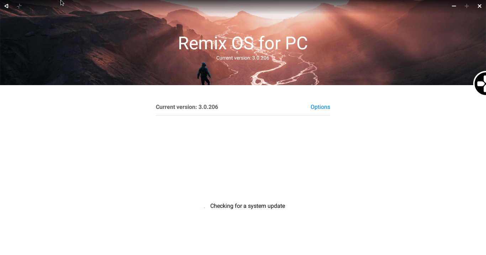
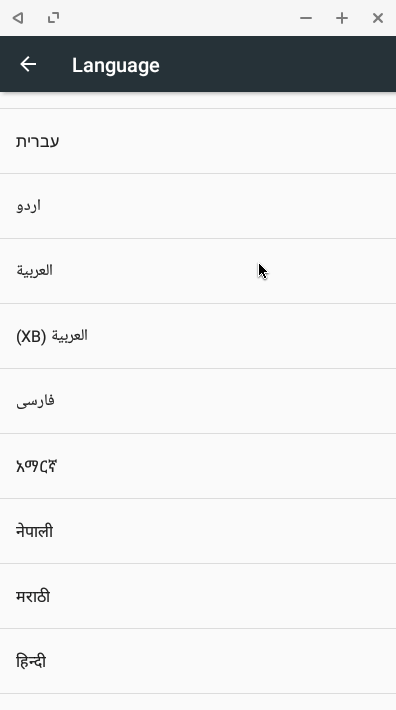

+++
title = "نظام Remix OS 3 نجم يتألق في سماء أنظمة التشغيل"
date = "2016-12-01"
description = "منذ إطلاق الإصدار الأول من نظام Remix OS في بداية 2016، ثم ضم مؤسس مشروع Android-x86 إلى صفوف فريق تطوير Jide Technology، شهد النظام العديد من التغييرات الكبيرة التي جعلت منه الخيار الأفضل لتشغيل نظام أندرويد مارشملو 6.0.1 على أجهزة الكمبيوتر واللاب توب."
categories = ["تقارير",]
tags = ["مجلة لغة العصر"]

+++

منذ إطلاق الإصدار الأول من نظام Remix OS في بداية 2016، ثم ضم مؤسس مشروع Android-x86 إلى صفوف فريق تطوير Jide Technology، شهد النظام العديد من التغييرات الكبيرة التي جعلت منه الخيار الأفضل لتشغيل نظام أندرويد مارشملو 6.0.1 على أجهزة الكمبيوتر واللاب توب.

فنظام Remix OS كما تعرفنا عليه سابقا، هو تجربة فريدة من نوعها لتشغيل تطبيقات وألعاب أندرويد بشكل مدهش على جهازك الشخصي، دون الحاجة لاستخدام أي برنامج محاكي أو استهلاك جزء كبير من موارد الجهاز، وذلك لأن Remix OS نظام تشغيل مستقل يعمل بجانب الويندوز كما لو كنت تستخدم نظام لينكس.

## أبرز مميزات الإصدار الجديد من نظام Remix OS

-   النظام مبنى على أندرويد مارشملو 6.0.1، وبذلك فهو يدعم 99% من التطبيقات الحديثة.

-   واجهة أنيقة سهلة الاستخدام، تعتمد على وجود شريط مهام وأزرار التحكم أسفل الشاشة.

-   أداء مذهل وسرعة لا تقارن، حيث حقق النظام تقييم يقدر ب 214218 نقطة على مقياس Antutu Benchmark.

-   يوجد نسختان من النظام واحدة لمعمارية 32-bit والأخرى لأجهزة 64-bit، كما يدعم UEFI.
-   النظام يعمل بجانب أي نظام تشغيل (ويندوز، لينكس أو OS X) لكن يحتاج إلى الويندوز للتثبيت (حسب الطريقة الرسمية).
-   يعمل على أغلب الأجهزة فهو لا يحتاج مواصفات عالية للتشغيل، كما يمكن تثبيته على USB أو على القرص الصلب.
-   التبديل بين وضع النوافذ ووضع الشاشة الكاملة أثناء استخدام أي تطبيق بضغطة زر.
-   التحكم الكامل في حجم نوافذ التطبيقات عن طريق حواف النافذة كما في نظام ويندوز تماما.

-   دعم عرض جميع أقسام القرص الصلب سواء كانت بنظام ملفات NTFS أو EXT4.

-   دعم التحديثات الهوائية عن طريق تطبيق System Updates.

-   دعم متجر جوجل بلاي وخدماته لتشغيل جميع التطبيقات والألعاب.

-   وجود صلاحيات الرووت في النظام دون الحاجة لأي خطوات اضافية.

-   دعم تشغيل الألعاب بواسطة لوحة المفاتيح عن طريق Gaming Toolkit.

-   إضافة دعم أغلب الهاردوير مثل معالجات انتل وبطاقات ذاكرة AMD وNVIDIA وبطاقات Realtek wireless وتعريفات شاشات اللمس ولوحة اللمس في أجهزة اللاب توب، كما تم دعم أجهزة اللاب توب التي تحتوي على بطاقتي ذاكرة.
-   دعم أغلب اللغات ومن ضمنها اللغة العربية على عكس الإصدار السابق.

-   دعم الإنترنت من خلال ال Wi-Fi أو من خلال ال Ethernet على أجهزة الكمبيوتر.

---

هذا الموضوع لم ينشر بالمجلة نظرًا لضيق عدد الصفحات في العدد 192.
