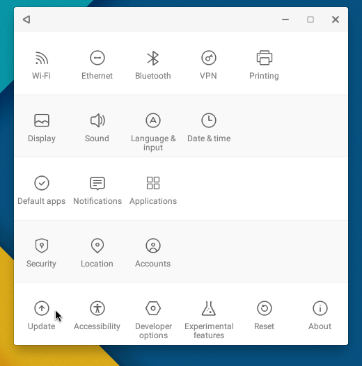

+++
title = "كيفية تحديث نظام Remix OS إلى آخر إصدار"
date = "2016-07-12"
description = "بعد إطلاق التحديث الأخير لنظام Remix OS قبل أيام، تساءل بعض المستخدمين عن كيفية الترقية إلى آخر إصدار، إليكم الطريقة."
categories = ["أندرويد",]
tags = ["موقع لغة العصر"]
+++

بعد إطلاق التحديث الأخير لنظام Remix OS قبل أيام، تساءل بعض المستخدمين عن كيفية الترقية إلى آخر إصدار، إليكم الطريقة.

1. قم بفتح تطبيق الإعدادات عن طريق فتح قائمة البداية ثم اختيار Settings.

أو يمكنك ذلك عن طريق الضغط على اختصار الإعدادات الموجود على سطح المكتب.

2. انتقل إلى القسم Update في تطبيق الإعدادات.

3. سيبدأ النظام التحقق تلقائيا من وجود تحديث جديد، وفى حالة عدم بدئه تلقائيا، اضغط زر Check For Updates.

4. ستجد التحديث الجديد متاحا كما بالصورة.

5. انتظر حتى اكتمال التحميل، سيطلب النظام إعادة التشغيل، بعد إعادة التشغيل سيكتمل تثبيت الإصدار الجديد.

---
هذا الموضوع نٌشر باﻷصل على موقع مجلة لغة العصر.

http://aitmag.ahram.org.eg/News/54949.aspx