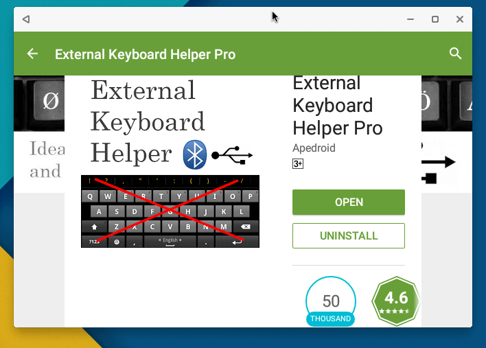
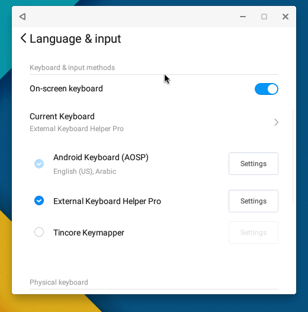
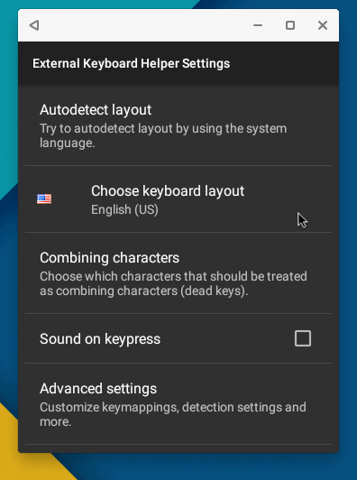
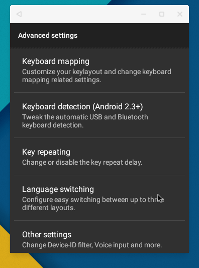
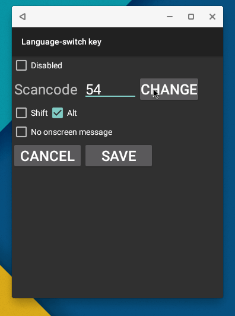
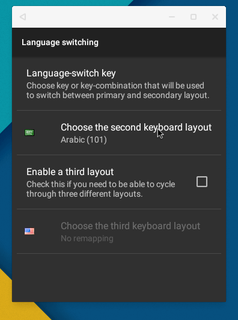

+++
title = "كيفية الكتابة بأكثر من لغة في Remix OS"
date = "2016-07-17"
description = "لا يدعم نظام Remix OS افتراضيا الكتابة بأكثر من لغة بواسطة لوحة المفاتيح الحقيقة، ولكن يمكن للمستخدم فعل ذلك عن طريق التطبيق الذي سنتعرف عليه"
categories = ["أندرويد",]
tags = ["موقع لغة العصر"]
+++

لا يدعم نظام Remix OS افتراضيا الكتابة بأكثر من لغة بواسطة لوحة المفاتيح الحقيقة، ولكن يمكن للمستخدم فعل ذلك عن طريق التطبيق الذي سنتعرف عليه.

1. قم بتحميل وتثبيت تطبيق External Keyboard Helper Pro [من هنا.](https://play.google.com/store/apps/details?id=com.apedroid.hwkeyboardhelper&hl=ar)

2. انتقل إلى [تطبيق الإعدادات](()ٕعدادات.aspx) – ثم Language & input بعد ذلك قم بتفعيل التطبيق كما بالصورة.

3. قم بفتح تطبيق External Keyboard Helper Settings، ثم اختر اللغة الأولى للكتابة.

4. اضغط على Advanced settings ثم اختر إعدادات Language switching.

5. سنقوم باختيار زر التبديل بين اللغات – يفضل الاختصار المشهور Alt+Shift.

6. اضغط على المربع Alt ثم اضغط زر Scan واضغط زر Shift ثم Save.

7. ارجع خطوة للخلف، ثم اختر لغة الكتابة الثانية.

8. إذا احتجت إلى اضافة لغة مفاتيح أخرى قم بتفعيل Enable a third layout.

كما يوجد تطبيق بديل آخر هو Multilanguage Keymap Redefiner يمكنك تحميله من جوجل بلاي أو تجربته [من هنا](https://play.google.com/store/apps/details?id=innerlife.keyboard.multilanguagekeymapredefiner)

---
هذا الموضوع نٌشر باﻷصل على موقع مجلة لغة العصر.

http://aitmag.ahram.org.eg/News/55248.aspx