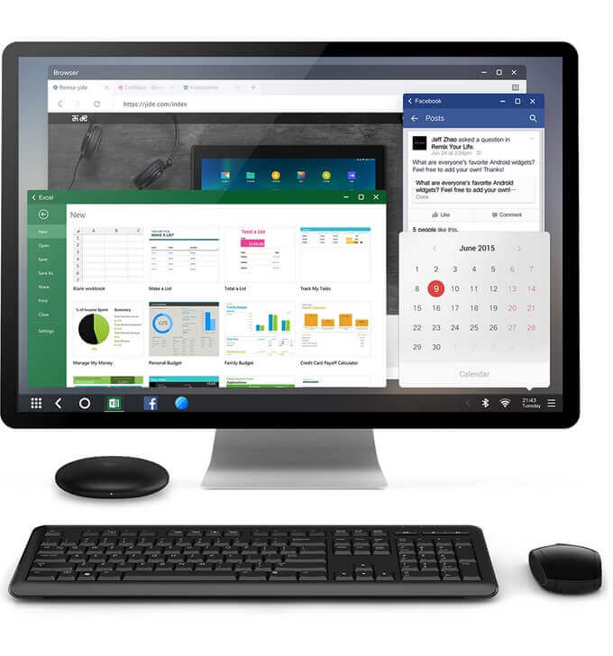
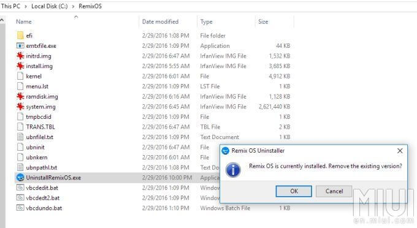

+++
title = "نظام Remix OS.. أندرويد مصمم للأجهزة الشخصية"
date = "2016-07-01"
description = "Remix OS هو نظام تشغيل جديد لأجهزة الكمبيوتر واللاب توب، يتيح للمستخدم استخدام نظام أندرويد على جهازه بشكل كامل، كما يدعم الماوس ولوحة المفاتيح والبلوتوث وأغلب الهاردوير، في السطور القادمة سنتعرف على هذا النظام وأهم مميزاته وطريقة تثبيته على جهازك، أيضا سنتطرق إلى كيفية التعامل معه ونكتشف العديد من أسراره."
categories = ["أندرويد",]
tags = ["مجلة لغة العصر"]
images = ["images/0.jpg"]

+++
Remix OS هو نظام تشغيل جديد لأجهزة الكمبيوتر واللاب توب، يتيح للمستخدم استخدام نظام أندرويد على جهازه بشكل كامل، كما يدعم الماوس ولوحة المفاتيح والبلوتوث وأغلب الهاردوير، في السطور القادمة سنتعرف على هذا النظام وأهم مميزاته وطريقة تثبيته على جهازك، أيضا سنتطرق إلى كيفية التعامل معه ونكتشف العديد من أسراره.

نظام Remix OS هو أندرويد مصمم للأجهزة الشخصية، مبنى على نظام Android-x86 (الذي تأسس سنة 2009 وهو مبادرة لتشغيل نظام أندرويد على الأجهزة التي تعمل بمعالجات انتل وAMD وحاليا أصبح نظام مستقر يمكن استخدامه على أغلب الأجهزة أو كجهاز وهمى).

- تم تطوير نظام Remix OS من قبل Jide Technology التي تأسست في 2014 على يد ثلاثة مهندسين سابقين في جوجل وانضم إليهم في منتصف الشهر الماضي مؤسس مشروع Android-x86، مقر المؤسسة يقع في بكين – الصين.

- أعلن عن النظام في يناير 2016، النظام متاح للتحميل بشكل مجاني ويمكن للجميع استخدامه دون أي تكلفة، في النسخة الأولى من النظام كان يجب على المستخدم تثبيت النظام على ذاكرة خارجية USB (فلاشه) فقط، كما كان متاحا لمعالجات 64-bit فقط.
- مع إطلاق الإصدار 2.0.205 في 26 أبريل 2016 (أندرويد 5.1.1) تم إضافة إمكانية التثبيت على القرص الصلب، وإضافة دعم معالجات 32-bit، إلى جانب إضافة التحديثات الهوائية OTA.

- على عكس نظام Android-x86 المفتوح المصدر، فإن الكود المصدري لنظام Remix OS ليس متاحا للعامة، ولكن يوجد مستودع على موقع Github باسم JideTechnology يوجد به جزء من كود النظام.
- يدعم النظام عددا من الأجهزة الأخرى بشكل رسمي مثل Remix Ultratablet، Remix Mini، Nexus 9، Nexus 10، NVIDIA Shield TV، والعديد من الأجهزة الأخرى يمكنك معرفتها من الموقع الرسمي http://www.jide.com/remixos/devices

## أهم مميزات نظام Remix OS

1. تشغيل أندرويد 5.1.1 بشكل كامل على أجهزة الكمبيوتر الشخصي والأجهزة المحمولة.
2. الدعم الكامل لكل مكونات الكمبيوتر من ماوس ولوحة مفاتيح إلى ال Wi-Fi والكاميرا.
3. يعمل على كل من معمارية 32-bit و64-bit، كما يدعم UEFI.
4. يعمل بجانب أي نظام تشغيل (ويندوز، لينكس أو OS X).
5. يعمل على معظم الحواسيب بحيث أنه لا يحتاج مواصفات/متطلبات عالية للتشغيل
6. يمكن تثبيته على USB أو على القرص الصلب.
7. يتميز بالأداء الممتاز الذي يتفوق على أقوي هواتف أندرويد (طبقا للموقع الرسمي).
8. النظام مجاني بالكامل ولا تحتاج لدفع أي مبلغ لاستخدام مميزاته.
9. النظام يدعم تعدد المهام، اختصارات لوحة المفاتيح، وخدمات جوجل.
10. القدرة على العمل في وضع النوافذ كما في الأنظمة الأخرى.
11. قائمة تشغيل مشابهة لقائمة البداية في الويندوز مع شريط الأدوات
12. دعم التحديثات الهوائية لتبسيط عملية التحديث.

## كيفية تحميل نظام Remix OS

طبعا عزيزي القارئ لا تحتاج لتحميل الإصدار 2.0.205 من النظام لأنه متوفر على ال DVD الهدية، ولكن في حالة رغبت بتحميل أي إصدار آخر فيما بعد، قم بالخطوات التالية:

1. قم بالدخول إلى الموقع الرسمي لنظام Remix OS http://www.jide.com/remixos-for-pc#downloadNow
2. أسفل بيانات الإصدار وتاريخ آخر تحديث ستجد روابط التحميل لكل من معمارية 32-bit و64-bit.

3. يمكنك التحميل إما بروابط مباشرة أو بروابط Torrent.

## كيفية تثبيت نظام Remix OS على USB

تحتاج إلى USB بحجم 8 جيجا على الأقل، بسرعة نقل 20 ميجا/ثانية، يفضل أن تكون من نوع USB 3.0.
اختر النسخة التي تريد تثبيتها من على الأسطوانة (32bit أو 64bit) – ثم قم بفك ضغط الملف على جهازك.
1. قم بعمل تهيئة (Format) لمفتاح USB، وقم باختيار نوع الملفات FAT32.

2. قم بفتح أداة Remix OS Installation Tool، ثم اختر ملف ال ISO الخاص بالنظام، واختر النوع USB Drive.

3. اضغط OK، ستظهر لك رسالة تحذير تفيد بأن كل البيانات الموجودة على ال USB سيتم مسحها، اضغط OK.
4. انتظر حتى ينتهي النظام من التثبيت.

5. ستظهر لك رسالة إعادة التشغيل، اضغط على Reboot Now.

6. ستحتاج الآن إلى عمل Boot من ال USB، بمجرد أن يفتح الجهاز مرة أخري اضغط على الزر الذي يفتح قائمة ال Boot (غالبا F9 أو F11 أو F12 حسب نوع جهازك).
7. اختر ال USB لعمل Boot منها، لتظهر لك نافذة اختيار نوع الإقلاع الخاصة بنظام Remix OS.
8. ستلاحظ ظهور اختيارين:

- Guest Mode: ومن خلاله يمكنك تجربة النظام ولكن جميع الإعدادات المخزنة، بما فيها البرامج والبيانات سيتم حذفها بمجرد إعادة تشغيل جهازك.
- Resident Mode: ومن خلاله يمكنك العمل مع Remix OS كنظام تشغيل عادي بحيث يمكنك حفظ بياناتك وإعداداتك وستبقى كما هي حتى في حالة قمت بإعادة تشغيل الجهاز، لأنه في هذا الوضع يتم تخزين بياناتك في قسم مخصص على ال USB.

9. اختر الوضع الذي تريد، ثم انتظر حتى يكتمل الإقلاع.

10. ستظهر لك شاشة اختيار اللغة، اختر الإنجليزية واضغط Next.

11. اضغط Next للموافقة على الاتفاقية.

12. وأخيرا اضغط Start لبدء تشغيل النظام.

13. يمكنك الآن التعامل مع النظام بكل سهولة.

## كيفية تثبيت نظام Remix OS على القرص الصلب

لاحظ عزيزي القارئ أنه يفضل استخدام هذه الطريقة إذا كنت ستستخدم نظام Remix OS بشكل مستمر، وكما ذكرت بالمميزات، تستطيع تثبيت نظام Remix بجانب أي نظام تشغيل آخر، كما تستطيع إزالته بكل سهولة.

1. قم بفتح أداة Remix OS Installation Tool، ثم اختر ملف ال ISO الخاص بالنظام، واختر النوع Hard Disk ثم من قائمة Driveاختر القسم الذي تريد تثبيت النظام عليه.

2. انتظر حتى اكتمال التثبيت وظهور رسالة إعادة التشغيل، أعد تشغيل الجهاز لتجد اختيار الدخول للنظام قد ظهر بجانب الويندوز.

3. انتظر حتى يكتمل الإعداد الذي سيستغرق من 15 ل 30 دقيقة، حيث سيقوم النظام بحجز مساحة 8 جيجا وإنشاء قسم جديد سيستخدم لتخزين ملفات النظام.

4. بعد الانتهاء من كل شيء، سيظهر سطح المكتب أمامك>

5. للعودة لنظام الويندوز مرة أخري اضغط على زر القائمة ثم زر الطاقة واختر Reboot، وعند العودة لقائمة اختيار النظام اختر الويندوز.

كيفية إزالة نظام Remix OS من على جهازك:
إذا لم يتم تثبيت نظام Remix OS بشكل صحيح، أو إذا كنت ترغب فقط في إزالته لأي سبب من الأسباب قم بالدخول إلى المكان الذي قمت بتثبيت النظام به، ثم افتح المجلد RemixOS، ستجد الملف UninstallRemixOS.exe قم بفتحه واضغط OK ثم انتظر حتى اكتمال الغاء التثبيت.

## كيفية استخدام نظام Remix OS

في البداية عليك أن تعلم عزيزي القارئ أن النظام يمتاز بالبساطة وسهولة التعامل معه، فهو لا يحتاج لشرح ولكن سأقدم لك بعض النصائح والتلميحات التي ستجعل من تعاملك مع النظام أسهل.

- تستطيع استخدام الماوس كما تستخدمه في نظام الويندوز، إلى جانب استخدامه كما تستخدم اللمس على هاتفك.
- تستطيع استخدام اختصارات لوحة المفاتيح مثل Start لعرض قائمة التطبيقات، Ctrl+C للنسخ، وAlt+Tab للتبديل بين التطبيقات المفتوحة، وWin+D لتصغير كل التطبيقات والعودة لسطح المكتب.
- تنقسم الواجهة الرئيسية للنظام إلى عدة أجزاء:

1. زر مشغل التطبيقات: أو قائمة البداية كما في الويندوز، من خلاله تستطيع الوصول لجميع التطبيقات المثبتة وفتحها.
2. أزرار التحكم: وهي زر الرجوع، للتحرك خطوة للخلف وزر ال Home (الرئيسية) الذي ينقلك لسطح المكتب مباشرة.
3. منطقة شريط المهام: ويعرض فيها الاختصارات المثبتة والتطبيقات المفتوحة حاليا.
4. الإشعارات وأزرار المهام: ووظيفة كل واحد منها من اليمين لليسار: عرض شريط الإشعارات، عرض الوقت والتاريخ، التحكم في ال Wi-Fi، التحكم في لوحة المفاتيح، التحكم في الصوت، التحكم في البلوتوث، منظف الرام، زر التصغير، ويظهر زر البطارية أيضا إذا كان النظام مثبتا على كمبيوتر محمول (لاب توب).
5. منطقة سطح المكتب: وتظهر فيها الاختصارات، كما يمكنك إضافة اختصار جديدة وحذف اختصارات كما تريد.

- مشغل التطبيقات (قائمة البداية):
  تستطيع الوصول إليها عن طريق شريط المهام أو الضغط على زر Start، وتتكون من:

  

زر الطاقة – زر البحث – زر تغيير ترتيب عرض التطبيقات – مكان عرض التطبيقات.

- مدير الملفات:
  يمكنك من الوصول لكل ملفاتك والتعامل معها، ويدعم السحب والإفلات، يمتاز بواجهة أنيقة تشبه مدير الملفات في ويندوز إلى حد كبير.

  

- التعامل مع التطبيقات:
  لتثبيت التطبيقات – قم بفتح ملف التطبيق الذي تريد تثبيته ثم اضغط Install.

لإلغاء تثبيت التطبيقات – افتح مشغل التطبيقات ثم اضغط بزر الماوس الأيمن على التطبيق الذي تريد إلغاء تثبيته واختر Uninstall، ستظهر لك رسالة تأكيد اضغط OK.

- مركز تطبيقات Remix:
وهو متجر مصغر يحتوي على بعض البرامج التي يمكنك تثبيته على النظام مباشرة، مثل Facebook، Messenger، WhatsApp، Microsoft Word.

لتثبيت أي تطبيق: قم بالضغط على زر التحميل الموجود بجانبه وانتظر حتى اكتمال التثبيت.

طريقة تثبيت متجر Google Play في نظام Remix OS:
متجر جوجل بلاي يأتي مدمجا مع نظام Remix OS ولكنه يحتاج لتفعيله من أجل البدء في استخدامه:
1. قم بفتح تطبيق Remix Central ثم قم بتثبيت تطبيق Google Play Installer.

2. بعد اكتمال التثبيت قم بفتح التطبيق ثم اضغط على الزر Install Google Services.

3. انتظر حتى اكتمال تحميل بعض الملفات وتثبيتها تلقائيا حتى تظهر لك هذه الرسالة.

4. أعد تشغيل النظام ثم قم بفتح تطبيق Google Play وتسجيل الدخول بحساب Gmail الخاص بك.

5. ستجد متجر جوجل بلاي قد تم تثبيته بنجاح ويمكنك تحميل التطبيقات التي تريدها كما تفعل على هاتفك.

## طريقة تفعيل لوحة المفاتيح العربية

لا يدعم نظام Remix اللغة العربية كواجهة حتى الآن، لكنه يدعم الكتابة باللغة العربية سواء كانت بلوحة المفاتيح الحقيقة أو لوحة المفاتيح على الشاشة On screen keyboard.

- لاحظ عزيزي القارئ أنه يمكنك استخدام لوحة المفاتيح الحقيقية للكتابة بلغة واحدة فقط، بينما 
باستخدام لوحة المفاتيح يمكنك الكتابة بأكثر من لغة والتبديل بينها بالطريقة العادية أو باستخدام الاختصار Ctrl+ Space.

### تغيير لغة لوحة المفاتيح الحقيقية

1. قم بفتح تطبيق الإعدادات ثم Language & input بعد ذلك قم بالنزول الى اختيارات Physical keyboard.

2. اضغط على السهم للدخول إلى إعدادات لوحة المفاتيح، ثم اضغط على زر Set up keyboard layouts، وأخيرا اختر اللغة التي تريد استخدامها.

لتغيير لغة لوحة المفاتيح:
1. قم بفتح تطبيق الإعدادات ثم Language & input بعد ذلك قم بالنزول الى اختيارات Keyboard & input methods.

2. قم بتفعيل On-screen keyboard، ثم اضغط على زر Settings ثم Languages.
3. قم بإلغاء تفعيل الاختيار Use system language، ثم قم بتفعيل اللغات التي تريدها.

---

هذا الموضوع نُشر باﻷصل في مجلة لغة العصر العدد 187 شهر 07-2016 ويمكن الإطلاع عليه [هنا](https://drive.google.com/file/d/1CD9q3uUGvd28xniKBQ3SZyHiUCWtfvlJ/view?usp=sharing).

