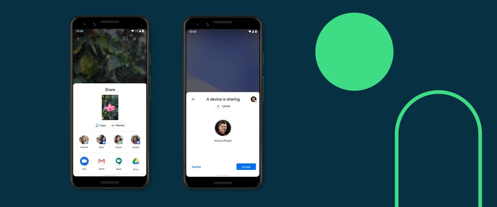
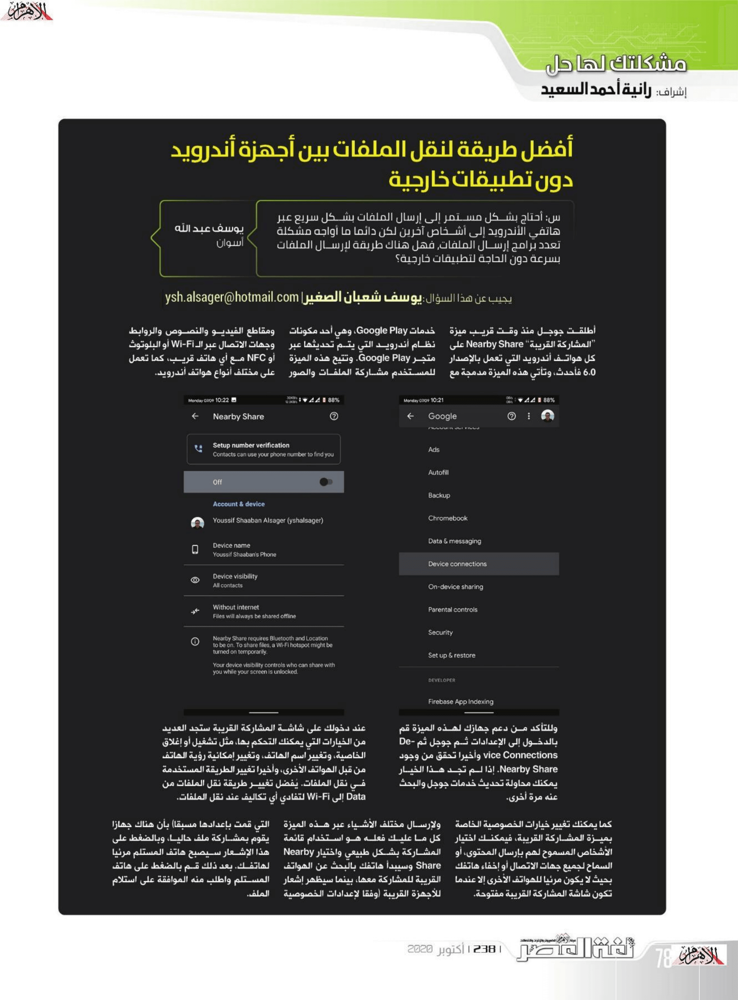

+++
title = "أفضل طريقة لنقل الملفات بفعالية بين أجهزة أندرويد"
date = "2020-10-01"
description = "أطلقت جوجل منذ وقت قريب ميزة \"المشاركة القريبة\" Nearby Share على كل هواتف أندرويد التي تعمل بالإصدار 6.0 فأحدث. وتأتي هذه الميزة مدمجة مع خدمات Google Play، وهي أحد مكونات نظام أندرويد التي يتم تحديثها عبر متجر Google Play. وتتيح هذه الميزة للمستخدم مشاركة الملفات والصور ومقاطع الفيديو والنصوص والروابط وجهات الاتصال عبر الـ Wi-Fi أو البلوتوث أو NFC مع أي هاتف قريب، كما تعمل على مختلف أنواع هواتف أندرويد."
categories = ["أندرويد",]
tags = ["مجلة لغة العصر"]

+++
س: أحتاج بشكل مستمر إلى إرسال الملفات بشكل سريع عبر هاتفي الأندرويد إلى أشخاص آخرين لكن دائمًا ما أواجه مشكلة تعدد برامج إرسال الملفات، فهل هناك طريقة لإرسال الملفات بسرعة دون الحاجة لتطبيقات خارجية؟

أطلقت جوجل منذ وقت قريب ميزة "المشاركة القريبة" Nearby Share على كل هواتف أندرويد التي تعمل بالإصدار 6.0 فأحدث. وتأتي هذه الميزة مدمجة مع خدمات Google Play، وهي أحد مكونات نظام أندرويد التي يتم تحديثها عبر متجر Google Play. وتتيح هذه الميزة للمستخدم مشاركة الملفات والصور ومقاطع الفيديو والنصوص والروابط وجهات الاتصال عبر الـ Wi-Fi أو البلوتوث أو NFC مع أي هاتف قريب، كما تعمل على مختلف أنواع هواتف أندرويد.

وللتأكد من دعم جهازك لهذه الميزة قم بالدخول إلى الإعدادات ثم جوجل ثم Device Connections وأخيرا تحقق من وجود Nearby Share. إذا لم تجد هذا الخيار يمكنك محاولة تحديث خدمات جوجل والبحث عنه مرة أخرى.

عند دخولك على شاشة المشاركة القريبة ستجد العديد من الخيارات التي يمكنك التحكم بها، مثل تشغيل أو إغلاق الخاصية، وتغيير اسم الهاتف، وتغيير إمكانية رؤية الهاتف من قبل الهواتف الأخرى، وأخيرا تغيير الطريقة المستخدمة في نقل الملفات. يُفضل تغيير طريقة نقل الملفات من Data إلى Wi-Fi لتفادي أي تكاليف عند نقل الملفات.

كما يمكنك تغيير خيارات الخصوصية الخاصة بميزة المشاركة القريبة. فيمكنك اختيار الأشخاص المسموح لهم بإرسال المحتوى، أو السماح لجميع جهات الاتصال أو إخفاء هاتفك بحيث لا يكون مرئيًا للهواتف الأخرى إلا عندما تكون شاشة المشاركة القريبة مفتوحة.

ولإرسال مختلف الأشياء عبر هذه الميزة كل ما عليك هو استخدام قائمة المشاركة بشكل طبيعي واختيار Nearby Share وسيبدأ هاتفك بالبحث عن الهواتف القريبة للمشاركة معها، بينما سيظهر إشعار للأجهزة القريبة (وفقًا لإعدادات الخصوصية التي قمت بإعدادها مسبقًا) بأن هناك جهاز يقوم بمشاركة ملف حاليًا، وبالضغط على هذا الإشعار سيصبح هاتف المستلم مرئيًا لهاتفك. بعد ذلك قم بالضغط على هاتف المستلم واطلب منه الموافقة على استلام الملف.

---

هذا الموضوع نُشر باﻷصل في مجلة لغة العصر العدد 238 شهر 10-2020 ويمكن الإطلاع عليه [هنا](https://drive.google.com/file/d/10yGy3Wdzek_WEmmI2v3_tN8vRzFZbC1D/view?usp=sharing).

