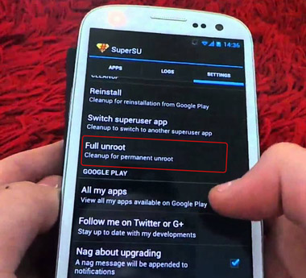
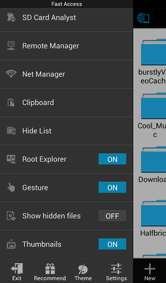
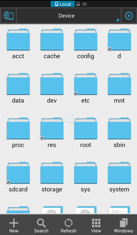

+++
title = "طرق إزالة الرووت من أي هاتف أندرويد"
date = "2015-01-20"
description = "بعدما تقوم بعمل رووت لهاتفك الأندرويد قد تحتاج الى الذهاب الى مركز الصيانة أو تثبيت تحديث رسمي وفى هذه الحالة لابد من إزالة الرووت كاملا من هاتفك لتتمكن من استرجاع الضمان الخاص بهاتفك. نقدم لك عزيزي القارئ طريقتين لإزالة الرووت كاملا من هاتفك الأندرويد."
categories = ["أندرويد",]
tags = ["موقع لغة العصر"]

+++

بعدما تقوم بعمل رووت لهاتفك الأندرويد قد تحتاج الى الذهاب الى مركز الصيانة أو تثبيت تحديث رسمي وفى هذه الحالة لابد من إزالة الرووت كاملا من هاتفك لتتمكن من استرجاع الضمان الخاص بهاتفك.

نقدم لك عزيزي القارئ طريقتين لإزالة الرووت كاملا من هاتفك الأندرويد.

## الطريقة الأولى: بواسطة تطبيق SuperSU

وهو التطبيق المسئول عن إدارة صلاحيات الرووت إذا لم يكن مثبتا على جهازك قم بتحميله [من متجر جوجل بلاي من هنا](https://play.google.com/store/apps/details?id=eu.chainfire.supersu).

1. قم بالدخول على التطبيق.
2. قم بالدخول الي التبويب إعدادات Settings.
3. قم بالنزول الى الأسفل ستجد خيار ‘Full unroot’ قم بالضغط عليه.

1. ستظهر رسالة تأكيدية اضغط موافق Confirm.
2. قم بإعادة تشغيل هاتفك.
3. إذا وجدت برنامج SuperSu لايزال موجودا قم بإلغاء تثبيته.

## الطريقة الثانية: بواسطة تطبيق Es File Explorer

1. قم بتحميل التطبيق [من جوجل بلاي](https://play.google.com/store/apps/details?id=com.estrongs.android.pop) ثم قم بتثبيته.
2. افتح التطبيق ثم قم بالضغط على زر القائمة.
3. اضغط على أدوات Tools ثم اختر Root Explorer متصفح ملفات النظام.

1. سيقوم التطبيق بطلب صلاحيات الرووت امنحه إياها.
2. قم بالرجوع الى الشاشة الرئيسية للتطبيق ثم اختر / من الركن العلوي من الشاشة.
1. قم بالدخول الى مجلد system ثم المجلد bin.
2. قم بمسح الملفين busybox وsu، إذا لم تجدهما انتقل للخطوة التالية.
3. قم بالرجوع الى مجلد system ثم اختر المجلد xbin.
4. قم بمسح الملفين busybox وsu أيضا.
5. قم بالرجوع الى مجلد system مرة أخرى ثم اختر المجلد app.
6. قم بمسح التطبيق supeuser.apk ثم قم بإعادة تشغيل هاتفك.
يمكنك التأكد من أنه قد تمت العملية بنجاح عن طريق تطبيق [ROOT CHECKER](https://play.google.com/store/apps/details?id=com.joeykrim.rootcheck).

---
هذا الموضوع نٌشر باﻷصل على موقع مجلة لغة العصر.

http://aitmag.ahram.org.eg/News/4250.aspx