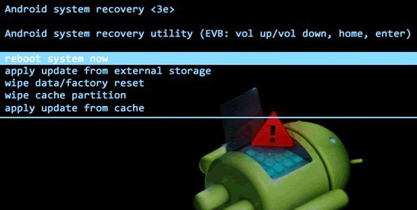
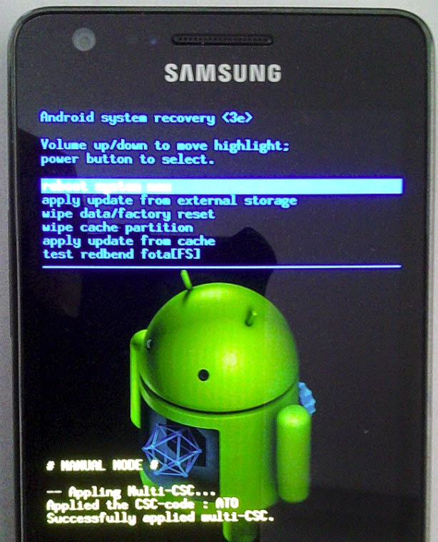
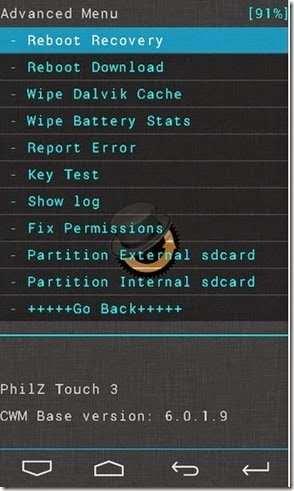

+++
title = "ما هو الريكفري مود في نظام الأندرويد؟"
date = "2014-12-16"
description = "الريكفري مود أو وضع الاسترداد هو وضع خاص يمكن الدخول إليه عن طريق ضغط مجموعة من اﻷزرار، سنتعرف على كيفية الدخول عليه وما فائدته وأنواعه في هذه التدوينة."
categories = ["أندرويد",]
tags = ["افهم تكنولوجيا"]

+++

## أولا: ما هو الريكفري؟

الريكفري في عالم الأندرويد هو وضع خاص نقوم بالدخول عليه عن طريق ضغط أزرار معينة.

بمعنى آخر: هي جزء من نظام الأندرويد يتيح للمستخدم اتمام مهام خاصة على النظام.

هذه المهام تكون مثل تحديث الهاتف عن طريق ملفات معينة، تحميل رومات معدلة، عمل ضبط مصنع للهاتف.

## ثانيا: أنواع الريكفري

1. الريكفري الاصلية والتي تكون موجودة بالفعل على الهاتف.

يمكنك هذا النوع من الريكفري من تثبيت التحديثات الخاصة بجهازك فقط، وعمل ضبط مصنع.

2. الريكفري المعدل:

ومن أمثلته: 

- Clockwork Mod Recovery أو ما تعرف باسم CWM وهي ريكفرى مطبوخة وعن طريقها يمكن التعديل علي النظام باستخدام ملفات مضغوطة بصيغة zip يصنعها المطورين لجهازك ونقوم بتنصيبها عن طريق الريكفري المعدل.

  

- TeamWin Recovery Project أو ما تعرف باسم TWRP وهي ريكفرى معدلة أيضاً ولها نفس مميزات ال CWM لكن مع اضافة بعض التفاصيل والتغير الكامل في الشكل.

  

- Philz touch recovery وهي نسخة معدلة من CWM وهي تختلف بإمكانية التحكم في الشكل والألوان كما أنها تعمل باستخدام الشاشة اللمس وليس باستخدام الازرار فقط.

  

**ماهي الاختلافات الرئيسية بين TWRP وCWM:**

كلا النوعين يحتويان خاصية تنصيب ملفات ال zip. مثل ملفات الروم والرووت.

تحتوي TWRP الى أزرار كبيرة وهذا يسهل من عملية السيطرة على مهامك وعدم الوقوع في اخطاء بسيطة ولكن خطرة.

لدى TWRP الخاصية لدعم ملفات خاصة في حالة الدعم مما تسرع عملية الدعم وتبسطه. حيث في CWM عملية الدعم تدعم كل النظام.

سرعة تنصيب ملفات ال zip. الخاصة بالمودم أو الروم تختلف بشكل خفيف ولكن ملحوظ، حيث TWRP أسرع من CWM في هذه العمليات.

تحتوي TWRP الى مدير ملفات سهل الاستخدام وهذا يتيح لك تنصيب ونقل ونسخ ولصق الملفات بسهولة تامة.

## ثالثا: طريقة الدخول الى وضع الريكفري

عن طريق ضغط زر رفع الصوت والهوم والباور في آن واحد.

في بعض الاجهزة الأخرى ضغط زر الهوم والباور فقط.

في اجهزة اخري نقوم بضغط زر رفع الصوت وخفض الصوت معاً مع ضغط زر الباور.

### رابعا: طريقة تثبيت الريكفري المعدل

اما عن طريق تطبيق [Rom Manager](http://www.clockworkmod.com/rommanager) (يحتاج صلاحيات الرووت).

أو عن طريق برنامج Odin لهواتف السامسونج.

أو عن طريق تحميل الملف الخاص بهاتفك وتثبيته من الريكفري الأصلي [من هنا](http://www.clockworkmod.com/rommanager).

**تحذير:** تثبيت ريكفرى معدل يفقد الضمان، وقد يؤدى الى حدوث مشاكل في الهاتف إذا لم يتم اتباع التعليمات بشكل صحيح.

أما إذا كنت من هواة تجربة الرومات المعدلة والميزات الجديدة على هاتفك فانطلق.

---

هذا المقال نشر باﻷصل على مدونة افهم تكنولوجيا ويمكن الإطلاع عليه [هنا](https://efhamtechnology.blogspot.com/2014/12/Recovery.html).
