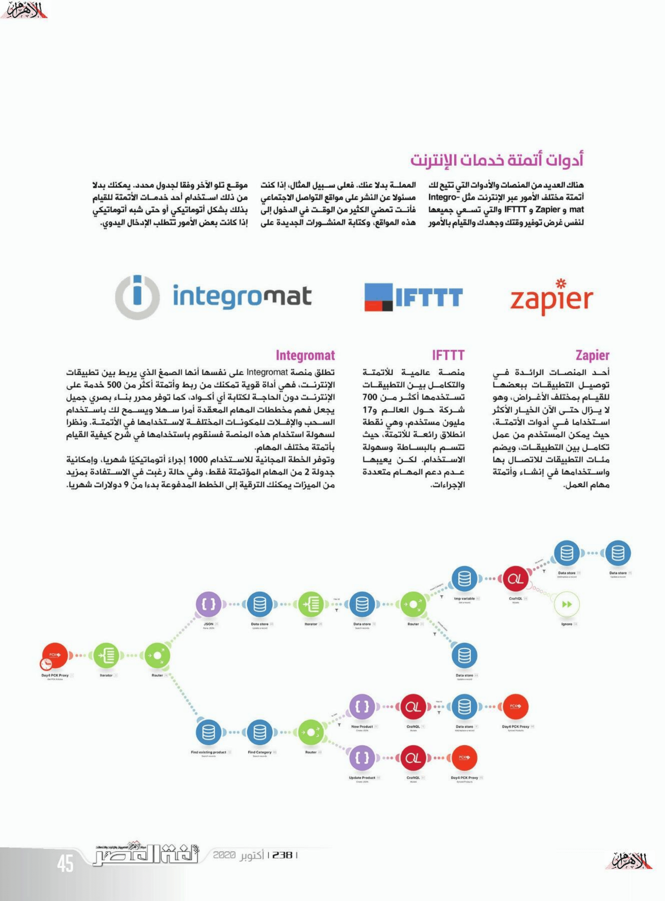

+++
title = "أتمتة مهام الإنترنت باستخدام منصة Integromat"
date = "2020-10-01"
description = "سواء كنت تستخدم الإنترنت بشكل شخصي أو لأداء الأعمال فلا بد أنك تقوم ببعض المهام الروتينية بشكل دوري والتي تستغرق الكثير من وقتك وجهدك. ولحسن الحظ تتوفر وسيلة للتخلص من هذه المهام وهي الأتمتة، فنحن نعيش في وقت يمكنك فيه تحويل أي شيء يتم عن طريق سلسلة من الأوامر إلى شكل أوتوماتيكي. سواء عن طريق استخدام البرامج البسيطة التي تتيح التحكم في حركة الماوس ولوحة المفاتيح، أو عن طريق الاستعانة بأحد المتخصصين لكتابة برنامج أو أداة تقوم بالأمر الذي تريده، أو أخيرًا استخدام إحدى منصات الأتمتة التي تعينك على إنجاز المهام بأسرع وقت وأقل تكلفة."
categories = ["مهارات رقمية", "الإنتاجية",]
tags = ["مجلة لغة العصر"]
images = ["images/0.png"]

+++
سواء كنت تستخدم الإنترنت بشكل شخصي أو لأداء الأعمال فلا بد أنك تقوم ببعض المهام الروتينية بشكل دوري والتي تستغرق الكثير من وقتك وجهدك. ولحسن الحظ تتوفر وسيلة للتخلص من هذه المهام وهي الأتمتة، فنحن نعيش في وقت يمكنك فيه تحويل أي شيء يتم عن طريق سلسلة من الأوامر إلى شكل أوتوماتيكي. سواء عن طريق استخدام البرامج البسيطة التي تتيح التحكم في حركة الماوس ولوحة المفاتيح، أو عن طريق الاستعانة بأحد المتخصصين لكتابة برنامج أو أداة تقوم بالأمر الذي تريده، أو أخيرًا استخدام إحدى منصات الأتمتة التي تعينك على إنجاز المهام بأسرع وقت وأقل تكلفة.

## متى تستخدم الأتمتة؟

من أصعب الأمور التي تتعلق بالأتمتة هي ملاحظة متى يجب استخدامها. ولذلك عليك أن تسأل نفسك ما إذا كان أحد المهام التي تقوم بها شيئًا يمكن للكمبيوتر القيام به دون مساعدتك. وباختصار يمكنك أتمتة المهمات إذا كانت:

- أمرًا يجب عليك القيام به بشكل متكرر أو وفقًا لجدول محدد.
- أمرًا يتضمن نقل المعلومات بين التطبيقات.
- أمرًا مملًا ولا يتطلب تفكيرًا عميقًا.
- أمرًا يعطلك عن الأمور المهمة التي تريد فعلها.

وعلى سبيل المثال، يمكنك أتمتة مهام مثل:

- إعادة توجيه رسائل البريد الإلكتروني الجديدة التي تحتوي على كلمة معينة تلقائيًا إلى عنوان بريد إلكتروني آخر.
- إضافة معلومات رسائل البريد الإلكتروني الجديدة إلى جدول أو قاعدة بيانات.
- النشر التلقائي من وإلى فيس بوك وتويتر وDiscord وLinkedIn وتيليجرام.

## ما قبل الأتمتة

قبل البدء في أتمتة أي من المهام، عليك القيام ببعض الخطوات:

- حدد المهام وصنفها حسب صفات مثل التكرار، ومقدار الوقت المستغرق لإكمالها، ومستوى التعقيد.
- تحقق من التطبيقات والخدمات التي ستُستخدم في المهام.
- قم بتقييم الخيارات، والتي تتلخص في ثلاثة بدائل: كتابة برامج مخصصة لأتمتة المهام، أو اختيار أدوات أتمتة بدون كتابة أكواد مثل Integromat، أو الاعتماد على التكامل بين التطبيقات بصورة رسمية عندما يكون ذلك متاحًا.

## أدوات أتمتة خدمات الإنترنت

هناك العديد من المنصات والأدوات التي تتيح لك أتمتة مختلف الأمور عبر الإنترنت مثل Integromat وZapier وIFTTT والتي تسعي جميعها لنفس غرض توفير وقتك وجهدك والقيام بالأمور المملة بدلًا عنك. فعلى سبيل المثال، إذا كنت مسئولًا عن النشر على مواقع التواصل الاجتماعي فأنت تمضي الكثير من الوقت في الدخول إلى هذه المواقع، وكتابة المنشورات الجديدة على موقع تلو الآخر وفقًا لجدول محدد. يمكنك بدلًا من ذلك استخدام أحد خدمات الأتمتة للقيام بذلك بشكل أتوماتيكي أو حتى شبه أوتوماتيكي إذا كانت بعض الأمور تتطلب الإدخال اليدوي.

### Zapier

أحد المنصات الرائدة في توصيل التطبيقات ببعضها للقيام بمختلف الأغراض، وهو لا يزال حتى الآن الخيار الأكثر استخدامًا في أدوات الأتمتة. حيث يمكن المستخدم من عمل تكامل بين التطبيقات، ويضم مئات التطبيقات للاتصال بها واستخدامها في إنشاء وأتمتة مهام العمل.

### IFTTT

منصة عالمية للأتمتة والتكامل بين التطبيقات تستخدمها أكثر من 700 شركة حول العالم و17 مليون مستخدم. وهي نقطة انطلاق رائعة للأتمتة حيث تتسم بالبساطة وسهولة الاستخدام. لكن يعيبها عدم دعم المهام متعددة الإجراءات.

### Integromat

تطلق منصة Integromat على نفسها أنها الصمغ الذي يربط بين تطبيقات الإنترنت. فهي أداة قوية تمكنك من ربط وأتمتة أكثر من 500 خدمة على الإنترنت دون الحاجة لكتابة أي أكواد. كما توفر محرر بناء بصري جميل يجعل فهم مخططات المهام المعقدة أمرًا سهلًا ويسمح لك باستخدام السحب والإفلات للمكونات المختلفة لاستخدامها في الأتمتة. ونظرًا لسهولة استخدام هذه المنصة فسنقوم باستخدامها في شرح كيفية القيام بأتمتة مختلف المهام.

وتوفر الخطة المجانية للاستخدام 1000 إجراء أوتوماتيكي شهريًا وإمكانية جدولة 2 من المهام المؤتمتة فقط، وفي حالة رغبت في الاستفادة بمزيد من الميزات يمكنك الترقية إلى الخطط المدفوعة بدءًا من 9 دولار شهريًا.

#### مميزات منصة Integromat

هناك العديد من الأمور التي تجعل منصة Integromat مكانًا مثاليًا لأتمتة مهامك المختلفة، منها:

- وجود محرر مرئي يتيح السحب والإفلات لإضافة الوحدات والتحكم في سير العمل.

- إعطاء معلومات مفصلة عن كل عملية تنفيذ يتم إجراؤها عند تنفيذ سيناريو محدد وبهذه الطريقة يمكنك معرفة ما تمت معالجته من بيانات ومتى بكل بسهولة.

- إمكانية استخدام الدوال لتعديل البيانات مثل برنامج إكسيل وجداول بيانات جوجل. فيمكنك بخطة بسيطة أن تقوم بجمع قيم متعددة أو تعديل قيمة تاريخ والقيام بمختلف الأمور على النصوص والأرقام والتواريخ والقوائم.

- استخدام البيانات مع أكثر من خدمة، عن طريق وحدات التوجيه التي تمكنك من تقسيم السيناريو الخاص بك إلى مسارات متعددة ومعالجة البيانات داخل كل مسار بشكل مختلف، وتصفية البيانات التي تمر عبر كل مسار.

- التعامل مع الأخطاء والاستثناءات غير المتوقعة بشكل فعال. فيمكنك بسهولة إنشاء مسار لتطبيق أوامر أو تعليمات خاصة تحدد كيفية استمرار التنفيذ عند حدوث أخطاء.

## استخدام منصة Integromat

تستخدم المنصة مصطلح "السيناريوهات" لوصف خطة سير الأتمتة، ولذلك سأستخدم نفس المصطلح في السطور القادمة خلال شرح كيفية استخدام المنصة.

### أولًا: إنشاء سيناريو جديد

- بعد إنشاء حساب على المنصة قم بإنشاء سيناريو فارغ عن طريق زر Create a new scenario.

- قم بالبحث عن واختيار الخدمات التي ترغب باستخدامها في عملية الأتمتة ثم اضغط على زر Continue أعلى يمين الشاشة.

- سيظهر لك محرر السيناريو، والذي عن طريقه يمكنك تعديل كل شيء سيحدث خلال هذه المهمة وتخصيص سير العمل بالطريقة التي تناسبك.

**ملاحظة:**

تنقسم وحدات بناء السيناريو إلى ثلاثة أنواع: الأول هو وحدات الخدمات، والتي تمكنك من إنشاء اتصال بالخدمة التي تريد استخدامها في الأتمتة والتحكم في المهمة التي ستتم عن طريقها. والثاني هو وحدات الأدوات، والتي تتيح لك أمورًا مثل التعامل مع المتغيرات والنصوص والأرقام. أما الأخير فهو المسؤول عن التحكم في سير العمل عن طريق إتاحة أمور مثل التكرار والتوجيه والتجميع والتراجع والإنهاء والتجاهل.

### ثانيًا: بناء السيناريو

حتى تتضح الأمور أكثر، سأقوم بإنشاء سيناريو لأتمتة النشر التلقائي على الفيس بوك وتيليجرام من خلال خلاصات الويب RSS لأحد المواقع.

**ملاحظة:**

يمكن إضافة خدمات من داخل المحرر عن طريق الضغط على زر + الموجود أقصى اليمين بأسفل المحرر. قم بالضغط على هذا الزر واختر وحدات Facebook Page وTelegram Bot وRSS. ولإضافة أي من هذه الخدمات إلى مخطط سير العمل اضغط بزر الماوس الأيسر على الأيقونة الخاصة بها.

- بعد إضافة الخدمات إلى السيناريو اضغط على الفقاعة المركزية التي بجانبها شكل الساعة، والتي سينطلق منها باقي الإجراءات ثم اختر وحدة RSS.

- اضغط على فقاعة RSS وقم بملء المعلومات المطلوبة (بالخط الغامق) مثل رابط الخلاصات والعدد الأقصى لما سيتم استخدامه من عناصر خلاصة الأخبار ثم اضغط OK.

- بعد ذلك، سنحتاج إلى إضافة وحدة تحكم بسير العمل حتى نتمكن من استخدام أكثر من وحدة خدمات معًا في الخطوة القادمة. قم بالضغط على زر الإعدادات ذو اللون الأخضر واختر Router.

- ثم قم بتوصيل وحدة Router بالفقاعة الرئيسية عن طريق السحب من نصف الدائرة الموجودة بجانب الفقاعة والتوصيل بالفقاعة الأخرى.

- والآن يمكنك إضافة وحدات خدمات الفيس بوك وبوت تيليجرم وتوصيلهما بوحدة Router.

- ستلاحظ وجود فقاعات حمراء فوق وحدات الخدمات التي أضفتها، وذلك لأن هذه الخدمات تحتاج إلى بعض الإعداد. اضغط على وحدة الفيس بوك حتى تقوم بتوصيل حسابك الذي سيُستخدم في هذه المهمة، ثم اختر الصفحة التي تريد النشر عليها.

- تحتاج أيضًا إلى اختيار ما سيتم نشره على الصفحة من محتوى خلاصة الأخبار. فكما تلاحظ، عند الضغط على خانة Message تظهر نافذة لاختيار المحتوى. في حالتنا هذه يمكنك اختيار عنوان الخلاصة Title ومحتواها Description، ويمكنك كتابة أي شيء تريده في نفس الخانة أو التنسيق بإضافة سطر جديد بين العنوان والمحتوى وما إلى ذلك. ثم أخيرًا اضغط على خانة URL وحدد ال URLالذي بداخل خلاصة الأخبار.

- ولإعداد بوت التيليجرام للنشر تحتاج للقيام بنفس الخطوات السابقة، لكن هذه المرة ستقوم بوضع القناة أو المجموعة التي سيتم النشر بها في خانة Chat، والمحتوى في خانة Text.

### ثالثًا: جدولة السيناريو

والآن أصبح السيناريو الخاص بنا جاهزًا لكن نحتاج للقيام بأمرين: التأكد من أن السيناريو يعمل بنجاح من خلال الضغط على زر التشغيل الموجود أسفل يسار الشاشة وبجانبه Run Once، وتحديد الجدولة التي سيعمل بها السيناريو تلقائيًا عن طريق الضغط على زر الساعة الموجود بالشريط السفلي وتغيير إعدادات الجدولة كما نريد.

وأخيرًا أصبح كل شيء جاهزًا ويمكننا تفعيل السيناريو من خلال زر التفعيل أسفل يسار الشاشة.

**ملاحظة:** بدلاً من إنشاء سيناريو فارغ يمكنك استيراد سيناريو جاهز من القوالب المتوفرة ثم التعديل عليه لتوفير الوقت والجهد.

**استثمار الوقت**

قد تشعر بأن هذا الأمر معقد للغاية ولا يستحق كل هذا التعب لأجله، لكن بمجرد أن تفهم هذه المفاهيم الأساسية وتبدأ ببناء سيناريوهات خاصة بك حتى لو كانت بسيطة فستعرف أن الأمر يستحق بذل بعض المجهود وأنه ليس بهذه الصعوبة. وكن متأكدًا أن استثمار بعض الوقت لأتمتة المهام الروتينية سيوفر عليك ساعات طويلة من العمل اليدوي المتكرر ويجعلك قادرًا على إنفاق وقتك في أمور أخرى مهمة بشكل أفضل.

---

هذا الموضوع نُشر باﻷصل في مجلة لغة العصر العدد 238 شهر 10-2020 ويمكن الإطلاع عليه [هنا](https://drive.google.com/file/d/10yGy3Wdzek_WEmmI2v3_tN8vRzFZbC1D/view?usp=sharing).

