+++

title = "دليل المبتدئين للتعامل مع تحديثات برامج التشغيل في ويندوز"
date = "2024-09-01"
description = "تعد برامج التشغيل صاحبة أكبر دور جوهري في عملية تشغيل أي نظام تشغيل سواء كان ويندوز أو لينكس أو حتى أندرويد، فهي بمنزلة المترجم بين طبقة قطع العتاد (الهاردوير) المختلفة مثل اللوحة الأم والرام والماوس، ونظام التشغيل المثبت على الجهاز، فبدونها لا يستطيع النظام التواصل مع العتاد والعكس. وهي كذلك ضمن أكبر العوامل المؤثرة في استقرار النظام، إذ تشير الإحصاءات أن قرابة ٧٥٪ من الأخطاء ومشاكل التشنج والتحطم يرجع سببها إلى برامج التشغيل. ونظرا لحساسية برامج التشغيل فإنها من المواضيع المحيرة لكثير من المستخدمين الذين لديهم تساؤلات حولها، وفي السطور القادمة سنجيب عن العديد من هذه التساؤلات مثل متى وكيف تحدث برامج التشغيل."
categories = ["ويندوز",]
tags = ["مجلة لغة العصر"]

+++

## مقدمة

تعد برامج التشغيل صاحبة أكبر دور جوهري في عملية تشغيل أي نظام تشغيل سواء كان ويندوز أو لينكس أو حتى أندرويد، فهي بمنزلة المترجم بين طبقة قطع العتاد (الهاردوير) المختلفة مثل اللوحة الأم والرام والماوس، ونظام التشغيل المثبت على الجهاز، فبدونها لا يستطيع النظام التواصل مع العتاد والعكس. وهي كذلك ضمن أكبر العوامل المؤثرة في استقرار النظام، إذ تشير الإحصاءات أن قرابة ٧٥٪ من الأخطاء ومشاكل التشنج والتحطم يرجع سببها إلى برامج التشغيل. ونظرا لحساسية برامج التشغيل فإنها من المواضيع المحيرة لكثير من المستخدمين الذين لديهم تساؤلات حولها، وفي السطور القادمة سنجيب عن العديد من هذه التساؤلات مثل متى وكيف تحدث برامج التشغيل.

## من المسؤول عن تطوير برامج التشغيل؟

من البديهي اعتقاد أن صناع الأجهزة هم من يطورون برامج التشغيل الخاصة بها كذلك، لكن هذا صحيح في بعض الأحيان فقط مثل بطاقات الفيديو GPU، إذ توفر مايكروسوفت وبعض الشركات المصنعة برامج تشغيل عامة يمكن لأي شخص استخدامها، لتوفير التكلفة وتحقيق أداء ثابت مع الأجهزة المختلفة.

فيمكن للشركة المصنعة تعديل أجهزتها لتتناسب مع برنامج تشغيل معروف ومختبر جيدًا يلبي الاحتياجات المطلوبة، فمثلا ستجد أجهزة الماوس ولوحة المفاتيح وأقراص USB تستخدم برامج تشغيل عامة من صنع مايكروسوفت، لكن في حالات أخرى قد تؤدي أداءًا أفضل مع برامج التشغيل المخصصة للجهاز كما في لوحات المفاتيح المتقدمة وبطاقة الفيديو الحديثة.

وبغض النظر عن مطور برامج التشغيل ففي النهاية تستخدم البرمجيات المختلفة بما فيها نظام التشغيل نفسه واحد منها أو أكثر للتواصل مع العتاد لأداء مهام محددة.

## لماذا تسبب برامج التشغيل مشكلات النظام؟

ليتضح لنا مدى حساسية التعامل بين برامج التشغيل ونظام التشغيل دعونا نتخيل أن برامج التشغيل مترجم يتقن العربية والإنجليزية بينما النظام لا يتحدث إلا الفرنسية، والمترجم لا يتقنها لكن يعرف كيف يتكلم، ففي هذه الحالة لا بد أن يخطئ في نقل وتفسير المطلوب. وفي حالة برامج التشغيل قد يكون المشاكل سببها أمرين، الأول أن برنامج التشغيل نفسه قد لا يكون مثاليًا والثاني البرمجيات والعتاد نفسه.

وتصبح المشكلة أكبر في حال كان برنامج التشغيل يتعامل مع مكونات حساسة مثل اللوحة الأم والرام، فهنا لا يمتلك برنامج التشغيل القدرة الذاتية على علاج المشاكل وتصحيح الأخطاء البرمجية أو الفيزيائية ومن ثم تحدث المشاكل.

## ما الذي تحتاج عمله عندما تشك في برنامج تشغيل؟

إذا كنت تظن وجود مشكلة في أحد برامج التشغيل لديك فأول شيء يجب عليك فعله هو التوقف والرجوع خطوة إلى الوراء والتأمل في سبب وصولك إلى هذا الاستنتاج. فإذا أوصى أحد البرامج لديك بتحديث برنامج تشغيل قديم فتوقف، لأن هذا قد يكون مضرًا أكثر من النفع المرتقب والسلامة لا يعدلها شيء، وفي جميع الأحوال لا يوصى باستخدام البرامج المساعدة لتحديث برامج التشغيل بشكل آلي، وأفضل شيء يمكنك القيام به في حال وجود مشكلة حقيقة هو إلغاء تثبيت تحديث برنامج التشغيل الذي تشك فيه.

## متى تحدّث برامج التشغيل؟

**القاعدة العامة: لا تصلح ما لا يحتاج إصلاحًا.**

عمومًا لا تحتاج في غالب الأحيان إلى تحديث برامج تشغيل الأجهزة إذا لم يكن هناك مشاكل في أجهزتك وكانت تعمل بشكل جيد، وفي ويندوز ١١ يحدث النظام تلقائيًا العديد من برامج التشغيل، بما في ذلك لوحات اللمس ووحدات تحكم USB، فمن الأفضل ترك الأمور كما هي بدلًا من المخاطرة بحدوث مشكلة. أما إذا كان هدفك من التحديث زيادة سرعة وأداء الجهاز فللأسف لن يحسن تحديث برامج التشغيل إلى الإصدار الأحدث الأداء بشكل سحري في غالب الأحيان.

ومن الملاحظات التي يجب الانتباه لها أنك إذا كنت ترقي برنامج تشغيل من إصدار إلى آخر فتأكد أن الأشياء الوحيدة المضمنة في هذا التحديث هي إصلاحات الأخطاء وربما بعض تحسينات الأداء، لأن هناك فرصة لتعطل أشياء إذا كانت التغييرات كبيرة جدًا وكنت لا تعرف ما هي.

والاستثناء الوحيد لهذه القاعدة تحديثات برامج تشغيل بطاقات الفيديو من شركات مثل AMD/ATI أو NVidia؛ حيث يجب تحديثها بانتظام لحل المشكلات وإضافة ميزات جديدة وتحسين الأداء لألعاب الكمبيوتر الجديدة.

ومن الحالات التي يجب عليك فيها تحديث برنامج التشغيل لمكون ما هي حدوث عطل وظهور شاشة الموت الزرقاء (BSOD) التي تعرض رسالة خطأ حول برنامج تشغيل ما بشكل مفاجئ.

## برامج التشغيل التي تحتاج إلى تحديث

**القاعدة العامة: استخدام الإصدار الأصح وليس الأحدث.**

عند شراءك جهاز كمبيوتر جديد أو إعادة تثبيت ويندوز ستحتاج للتأكد من استخدام برامج التشغيل الصحيحة، فلا يقتصر الأمر على تحديث برامج التشغيل إلى آخر إصدار، بل استخدام برنامج التشغيل الخاص بالمكونات من مصنعها الأصلي بدلًا من العام للحصول على أداء واستقرار أفضل.

أما إذا كنت من هواة الألعاب أو لديك جهاز كمبيوتر مجمع بنفسك فغالبا ستحتاج إلى تحديث عدد من برامج التشغيل مثل:

- **بطاقة الفيديو**: سوف يفاجئك الفرق في السرعة بين برامج تشغيل الويندوز العامة لبطاقة الفيديو الخاصة بك وبرامج تشغيل NVidia أو ATI/AMD الرسمية، وحتى لو لم تكن لاعبًا، تحقق من تثبيت برامج التشغيل الحقيقية.
- **اللوحة الأم/مجموعة الشرائح**: ستحتاج للتأكد زيارة موقع الشركة المصنعة والحصول على برامج تشغيل الشرائح الخاصة بها. إذا اشتريت جهاز كمبيوتر فتوجه إلى موقع الشركة صاحبة الجهاز مثل Dell أو HP، أما إذا بنيت الجهاز بنفسك، فتوجه إلى موقع الشركة المصنعة للوحة الأم.
- **بطاقة الصوت**: لن تتضمن برامج تشغيل ويندوز العامة جميع ميزات الصوت الإضافية مثل لذلك تحتاج تحديثها تمامًا مثل اللوحة الأم.
- **بطاقة الشبكة**: على الأرجح أنك تستخدم نوعًا من البطاقات المدمجة التي تعد جزءًا من اللوحة الأم، وقد حدثتها فعلًا مع تحديث برنامج تشغيل اللوحة، أما إذا كنت تستخدم بطاقة منفصلة توجه إلى الموقع الرسمي لها للحصول على برامج التشغيل من هناك.

## التحقق من إصدار برنامج تشغيل

عندما تواجه مشكلة مع أحد المكونات فمن المفيد جدًا معرفة إصدار برنامج التشغيل الذي تستخدمه خاصة إذا كنت تحتاج سؤال أحد أو البحث عن المشكلة. ولعمل ذلك ما عليك سوى فتح مدير الجهاز Device Manager عبر مربع البحث في قائمة البداية والوصول إلى المكون الذي تريده مثل بطاقة الفيديو، ثم الضغط بزر الماوس الأيمن واختيار خصائص Properties، وستظهر نافذة تعرض معلومات كثيرة، من ضمنها معلومات الإصدار والتاريخ في تبويب برنامج التشغيل Driver. ويمكنك عبر هذه النافذة أيضًا تحديث برنامج التشغيل أو استرجاعه أو تعطيله أو إلغاء تثبيته، وهذه الخيارات مفيدة إذا رقيت برامج التشغيل وتسببت في حدوث مشكلة.

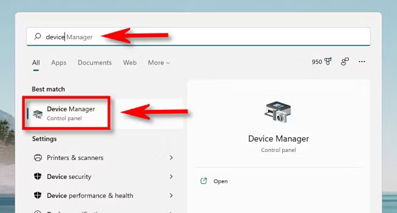

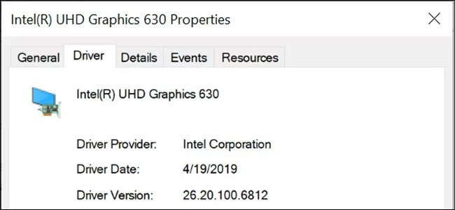

## تحديث برامج التشغيل بأمان

**القاعدة العامة: لا تستخدم برنامج خارجي للتحديث.**

ذكرنا سابقًا أن ويندوز يبقى العديد من برامج التشغيل محدثة تلقائيًا فإذا كانت هناك أية تحديثات بسيطة ضرورية للمكونات الشائعة مثل لوحات اللمس أو وحدات تحكم USB عادةً ما يكفيك البحث عن تحديثات الويندوز وتثبيتها لتحدث هي كذلك. كما يوجد أيضًا خيارات التحديات الاختيارية التي توصي مايكروسوفت بتثبيتها عند محاولة حل مشكلة معينة معروفة في إحدى الأجهزة.

ولمعرفة ما إذا كانت هناك أية تحديثات اختيارية متوفرة افتح الإعدادات بالضغط على Windows+i ثم تحديثات الويندوز Windows Update ثم اضغط زر الخيارات المتقدمة Advanced Options.

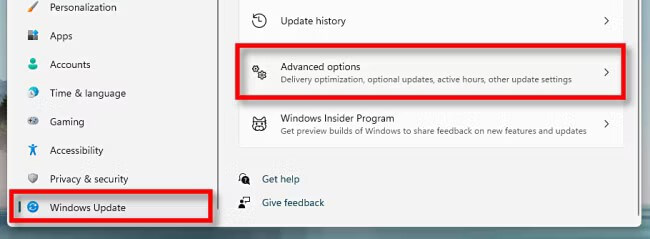

 ستجد زر التحديثات الاختيارية Optional Updates عند التمرير للأسفل قليلًا، اضغط عليه.

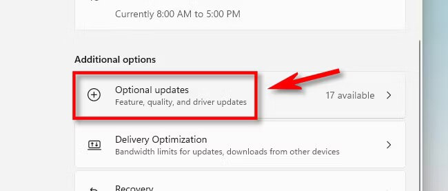

ثم ستجد قائمة التحديثات المتوفرة التي يمكنك اختيار ما تريد منها ثم الضغط على زر تحميل وتثبيت Download & Install.

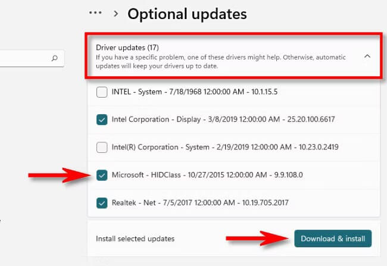

## تحميل وتثبيت برامج التشغيل يدويًا

من المتوقع ألا تجد كل برامج التشغيل المطلوبة عبر تحديثات الويندوز في أوقات كثيرة، وفي هذه الحالة يجب البحث عن التحديث يدويًا وتثبيته. وأفضل مكان تجد فيه برنامج التشغيل المطلوب هو الموقع الرسمي للشركة المصنعة، فعند دخولك للموقع ابحث عن قسم الدعم Support ثم عن التنزيلات Downloads أو التحديثات Updates أو برامج التشغيل Drivers الخاصة بجهازك، لكن احذر من وجود العديد من مواقع برامج التشغيل الاحتيالية التي تثبت برامج ضارة، ونفس هذا الخطر ينطبق على أغلب الأدوات المساعدة لتحديث برامج التشغيل التي قد تجدها عبر الإنترنت.

وبعد تنزيل حزمة برامج التشغيل الموثوقة من الشركة المصنعة لجهازك، تحتاج غالبا لفك الضغط عنها إذا كانت في صورة ملف مضغوط من نوع RAR أو ZIP أو غيرهما، ثم ابحث عن برنامج الإعداد Setup أو التثبيت Install لتشغيل مثبت برنامج التشغيل، وعادةً ما يتم التثبيت تلقائيًا ثم سيطلب إعادة التشغيل الجهاز، وبعد ذلك ستصبح برامج التشغيل الجديدة جاهزة للاستخدام.

أما في حالة برامج تشغيل بطاقات الفيديو GPU من شركات NVIDIA أو AMD أو Intel، قد يثبت برنامج تحديث برنامج التشغيل أداة مساعدة مثل GeForce Experience (لأجهزة NVIDIA) التي ستوفر لك تحديثات برنامج التشغيل كلما صدرت نسخة جديدة في المستقبل.

وفي حال كان التحديث لا يحتوى على مثبت فتحتاج إلى تثبيته يدويًا عبر مدير الجهاز Device Manager ثم اختيار المكون من قائمة التصنيفات ثم الضغط بزر الماوس الأيمن واختيار تحديث برنامج التشغيل Update Driver، سيظهر لك خياران:

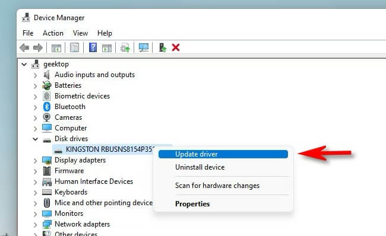

- البحث تلقائيًا عن برامج التشغيل Search automatically for drivers: هذا الاختيار يجعل الويندوز يبحث عن برامج التشغيل المتوافقة ويثبتها تلقائيًا.

- اختيار برامج التشغيل من الكمبيوتر Browse my computer for drivers: يتيح لك هذا الخيار تحديد مكان برامج التشغيل الجديدة التي تريد تثبيتها يدويًا.

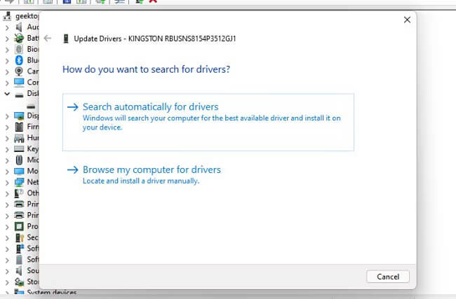

إذا اخترت البحث تلقائيًا عن برامج التشغيل، فسيقوم الويندوز بالبحث عن برامج تشغيل محدثة للجهاز وإذا عثر عليها سيثبتها ويطلب منك إعادة تشغيل الجهاز الكمبيوتر.

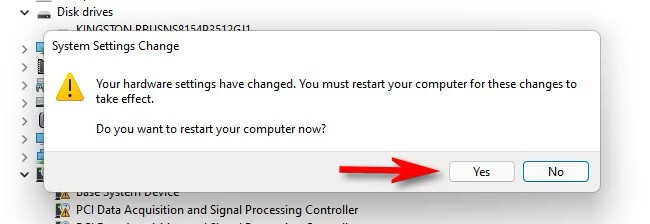

وإذا لم يجد فسترى رسالة تفيد بأن أفضل برامج التشغيل مثبت فعلًا، ويمكنك حينها مواصلة بحثك باختيار البحث عبر محدث الويندوز أو إغلاق النافذة.

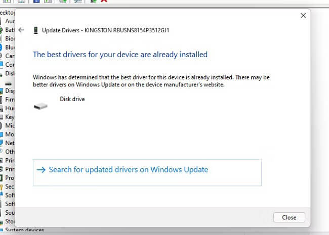

أما إذا اخترت تحديد برنامج التشغيل يدويًا فاضغط على زر التصفح Browse واختيار مجلد البرنامج.

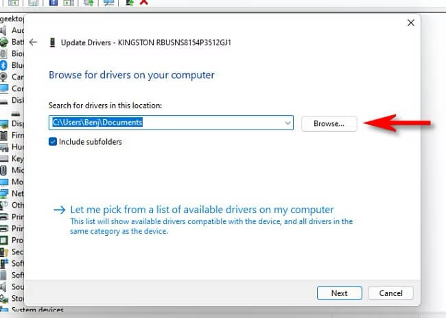

وإذا تعرف عليه الويندوز أو اخترت زر اختيار برنامج تشغيل من قائمة البرامج المتوفرة على الكمبيوتر فسيعرض الويندوز برامج التشغيل المتاحة لتختار منها.ومثل الحالة السابقة إما سيظهر الويندوز أن أفضل برنامج مثبت أو سيثبته ويطلب إعادة التشغيل.

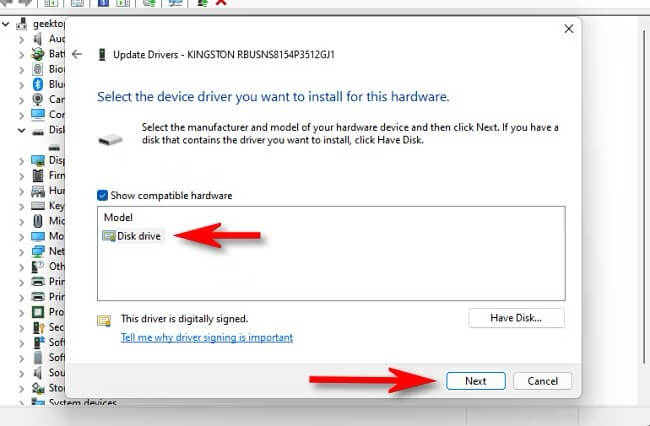

---

هذا الموضوع نُشر باﻷصل في مجلة لغة العصر العدد 364 شهر 09-2024 ويمكن الإطلاع عليه [هنا](https://drive.google.com/file/d/1PV51yk3cvR614ShSWZKTXSVcNn0EjBK6/view?usp=drive_link).

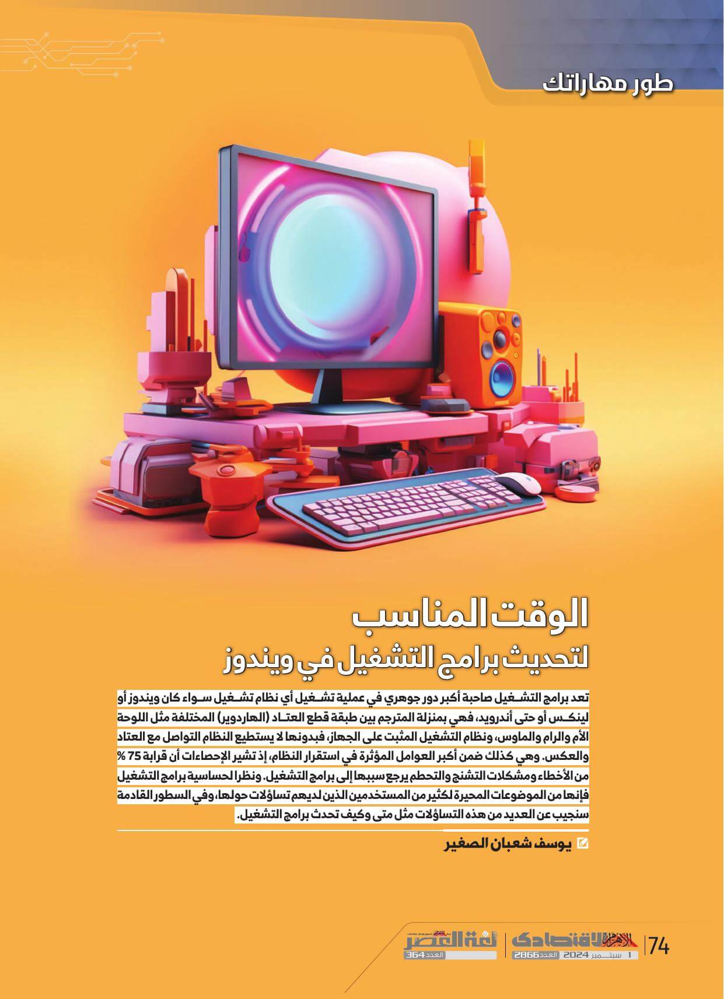

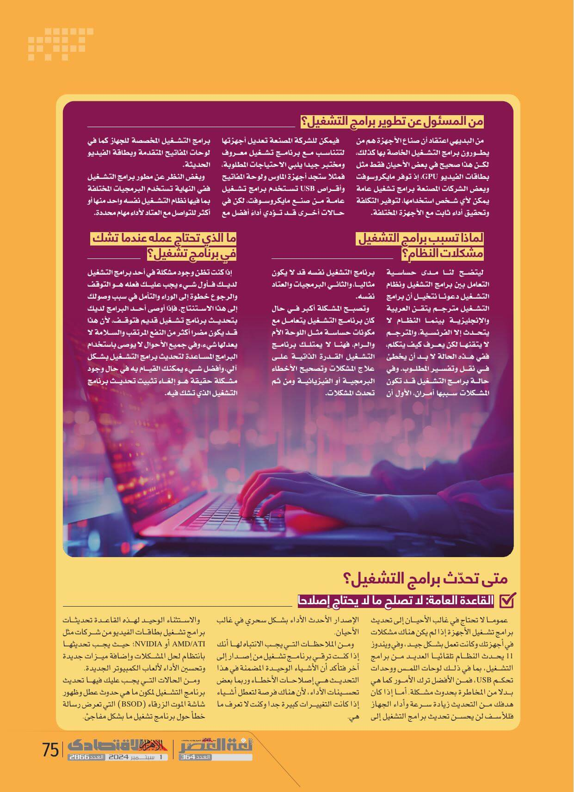

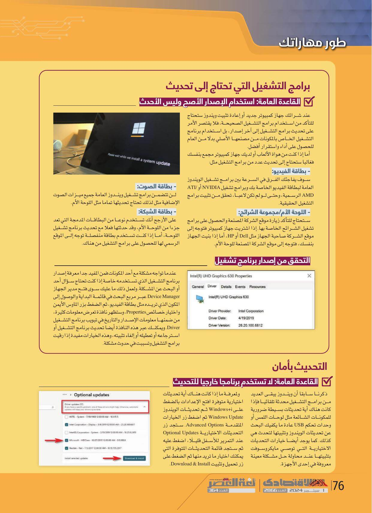

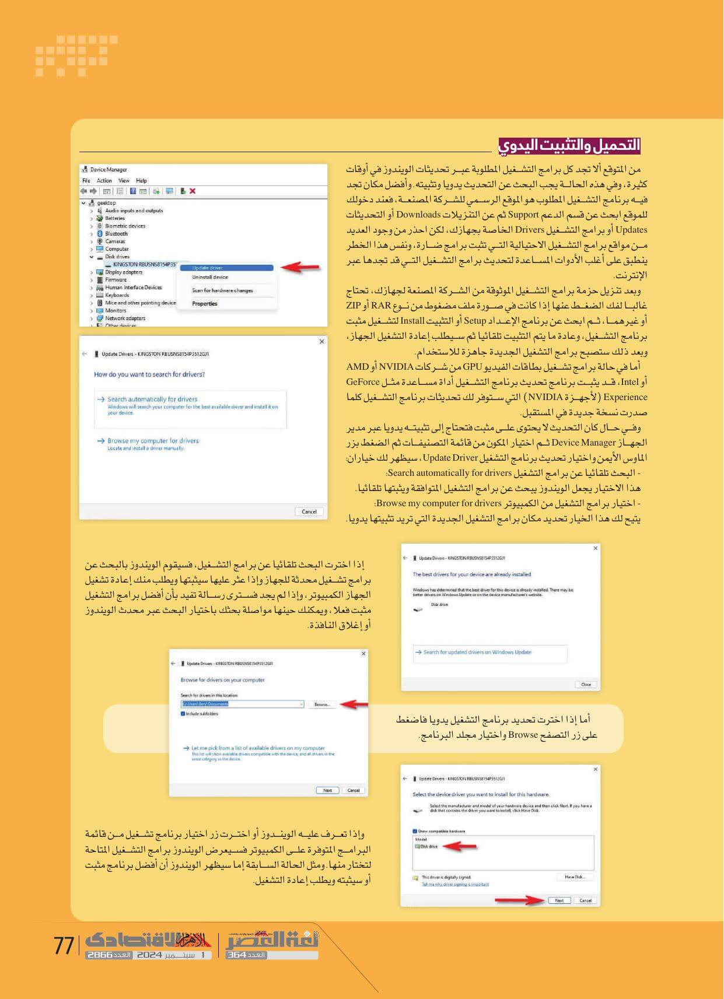