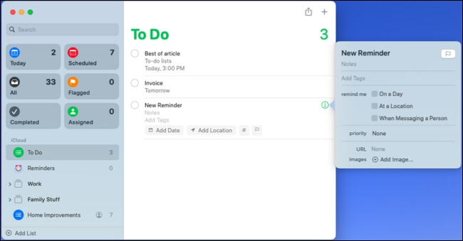
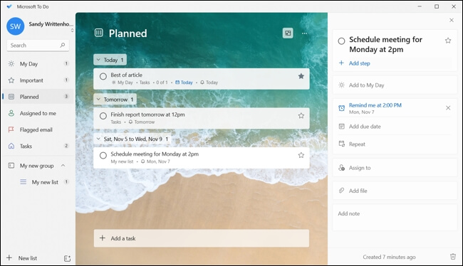
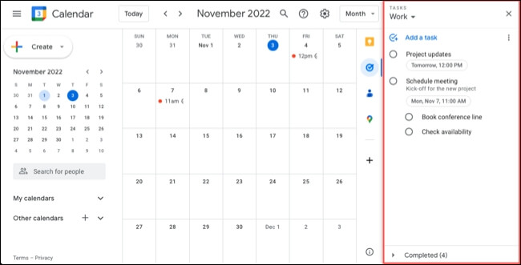
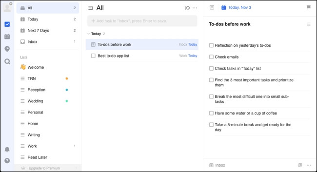
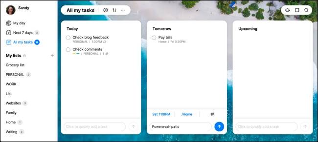
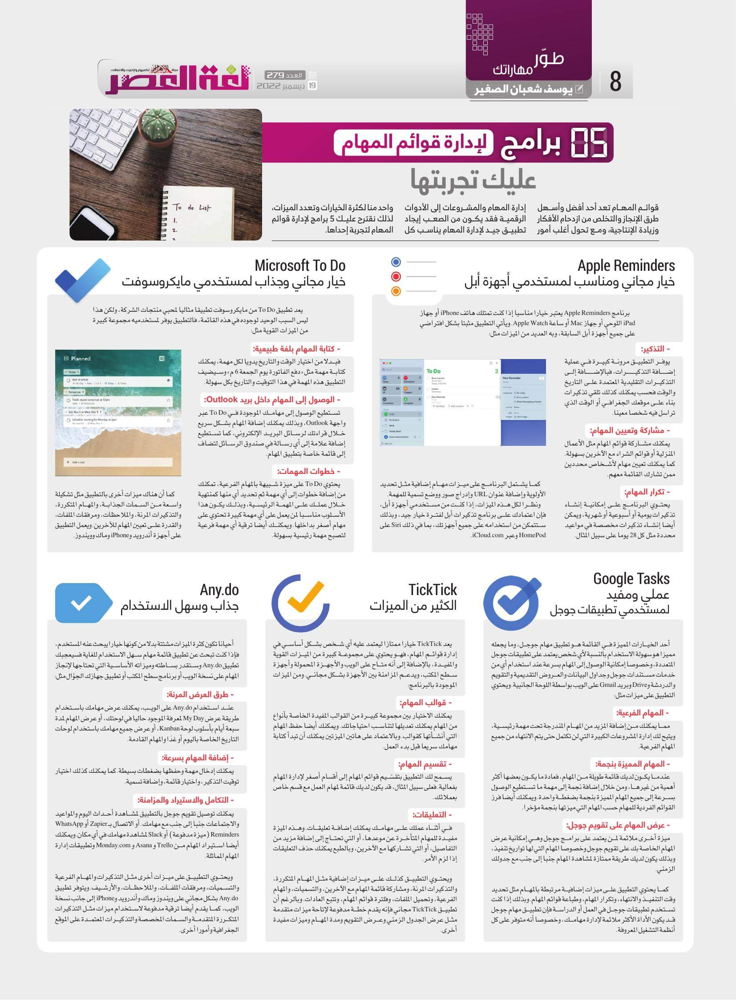

+++
title = "5 برامج ﻹدارة قوائم المهام عليك تجربتها"
date = "2022-12-19"
description = "قوائم المهام تعد أحد أفضل وأسهل طرق الإنجاز والتخلص من ازدحام الأفكار وزيادة الإنتاجية، ومع تحول أغلب أمور إدارة المهام والمشروعات إلى الأدوات الرقمية فقد يكون من الصعب إيجاد تطبيق جيد لإدارة المهام يناسب كل واحد منا لكثرة الخيارات وتعدد الميزات، لذلك نقترح عليك 5 برامج لإدارة قوائم المهام لتجربة إحداها."
categories = ["مهارات رقمية", "الإنتاجية",]
tags = ["مجلة لغة العصر"]

+++

قوائم المهام تعد أحد أفضل وأسهل طرق الإنجاز والتخلص من ازدحام الأفكار وزيادة الإنتاجية، ومع تحول أغلب أمور إدارة المهام والمشاريع إلى الأدوات الرقمية فقد يكون من الصعب إيجاد تطبيق جيد لإدارة المهام يناسب كل واحد منا لكثرة الخيارات وتعدد الميزات، لذلك نقترح عليك 5 برامج لإدارة قوائم المهام لتجربة إحداها.

## 1. Apple Reminders - خيار مجاني ومناسب لمستخدمي أجهزة أبل

برنامج Apple Reminders يعتبر خيارا مناسبا إذا كنت تمتلك هاتف iPhone أو جهاز iPad اللوحي أو جهاز Mac أو ساعة Apple Watch. ويأتي التطبيق مثبتًا بشكل افتراضي على جميع أجهزة أبل السابقة، وبه العديد من الميزات مثل:

- **التذكير**: يوفر التطبيق مرونة كبيرة في عملية إضافة التذكيرات، فبالإضافة إلى التذكيرات التقليدية المعتمدة على التاريخ والوقت فحسب يمكنك كذلك تلقي تذكيرات بناءًا على موقعك الجغرافي أو الوقت الذي تراسل فيه شخصًا معينًا.

- **مشاركة وتعيين المهام**: يمكنك مشاركة قوائم المهام مثل الأعمال المنزلية أو قوائم الشراء مع الآخرين بسهولة. كما يمكنك تعيين مهام لأشخاص محددين ممن تشارك القائمة معهم.

- **تكرار المهام**: يحتوي البرنامج على إمكانية إنشاء تذكيرات يومية أو أسبوعية أو شهرية، ويمكن أيضًا إنشاء تذكيرات مخصصة في مواعيد محددة مثل كل 28 يوم على سبيل المثال.

- كما يشتمل البرنامج على ميزات مهام إضافية مثل تحديد الأولوية وإضافة عنوان URL وإدراج صور ووضع تسمية للمهمة.

ونظرا لكل هذه الميزات، إذا كنت من مستخدمي أجهزة أبل، فإن اعتمادك على برنامج تذكيرات أبل لفترة خيار جيد، وبذلك ستتمكن من استخدامه على جميع أجهزتك، بما في ذلك Siri على HomePod وعبر iCloud.com.

## 2. Microsoft To Do - خيار مجاني وجذاب لمستخدمي مايكروسوفت

 

يعد تطبيق To Do من مايكروسوفت تطبيقًا مثاليًا لمحبي منتجات الشركة، ولكن هذا ليس السبب الوحيد لوجوده في هذه القائمة، فالتطبيق يوفر لمستخدميه مجموعة كبيرة من الميزات القوية مثل:

- **كتابة المهام بلغة طبيعية**: فبدلا من اختيار الوقت والتاريخ يدويا لكل مهمة، يمكنك كتابة مهمة مثل "دفع الفاتورة يوم الجمعة 6 م" وسيضيف التطبيق هذه المهمة في هذا التوقيت والتاريخ بكل سهولة.
- **الوصول إلى المهام داخل بريد Outlook**: تستطيع الوصول إلى مهامك الموجودة في To Do عبر واجهة Outlook، وبذلك يمكنك إضافة المهام بشكل سريع خلال قراءتك لرسائل البريد الإلكتروني، كما تستطيع إضافة علامة إلى أي رسالة في صندوق الرسائل لتضاف إلى قائمة خاصة بتطبيق المهام.
- **خطوات المهمات**: يحتوي To Do على ميزة شبيهة بالمهام الفرعية، تمكنك من إضافة خطوات إلى أي مهمة ثم تحديد أي منها كمنتهية خلال عملك على المهمة الرئيسية، وبذلك يكون هذا اﻷسلوب مناسبا لمن يعمل على أي مهمة كبيرة تحتوي على مهام أصغر بداخلها. ويمكنك أيضًا ترقية أي مهمة فرعية لتصبح مهمة رئيسية بسهولة.

كما أن هناك ميزات أخرى بالتطبيق مثل تشكيلة واسعة من السمات الجذابة، والمهام المتكررة، والتذكيرات المرنة، والملاحظات، ومرفقات الملفات، والقدرة على تعيين المهام للآخرين. ويعمل التطبيق على أجهزة أندرويد وiPhone وماك وويندوز.

## 3. Google Tasks - عملي ومفيد لمستخدمي تطبيقات جوجل

أحد الخيارات المميزة في القائمة هو تطبيق مهام جوجل، وما يجعله مميزا هو سهولة الاستخدام بالنسبة لأي شخص يعتمد على تطبيقات جوجل المتعددة، وخصوصا إمكانية الوصول إلى المهام بسرعة عند استخدام أي من خدمات مستندات جوجل وجداول البيانات والعروض التقديمية والتقويم والدردشة وDrive وبريد Gmail على الويب بواسطة اللوحة الجانبية. ويحتوي التطبيق على ميزات مثل:

- **المهام الفرعية**: مما يمكنك من إضافة المزيد من المهام المندرجة تحت مهمة رئيسية، ويتيح لك إدارة المشروعات الكبيرة التي لن تكتمل حتى يتم الانتهاء من جميع المهام الفرعية.
- **المهام المميزة بنجمة**: عندما يكون لديك قائمة طويلة من المهام، فعادة ما يكون بعضها أكثر أهمية من غيرها، ومن خلال إضافة نجمة إلى مهمة ما تستطيع الوصول بسرعة إلى جميع المهام المميزة بنجمة بضغطة واحدة. ويمكنك أيضًا فرز القوائم الفردية للمهام حسب المهام التي ميزتها بنجمة مؤخرًا.
- **عرض المهام على تقويم جوجل**: ميزة أخرى ملائمة لمن يعتمد على برامج جوجل وهي إمكانية عرض المهام الخاصة بك على تقويم جوجل وخصوصا المهام التي لها تواريخ تنفيذ، وبذلك يكون لديك طريقة ممتازة لمشاهدة المهام جنبًا إلى جنب مع جدولك الزمني.

كما يحتوي التطبيق على ميزات إضافية مرتبطة بالمهام مثل تحديد وقت التنفيذ والانتهاء، وتكرار المهام، وطباعة قوائم المهام. وبذلك إذا كنت تستخدم تطبيقات جوجل في العمل أو الدراسة فإن تطبيق مهام جوجل قد يكون الأداة الأكثر ملائمة لإدارة مهامك، وخصوصا أنه متوفر على كل أنظمة التشغيل المعروفة.

## 4. TickTick - الكثير من الميزات

يعد TickTick خيارًا ممتازًا ليعتمد عليه أي شخص بشكل أساسي في إدارة قوائم المهام، فهو يحتوي على مجموعة كبيرة من الميزات القوية والمفيدة، بالإضافة إلى أنه متاح على الويب والأجهزة المحمولة وأجهزة سطح المكتب، ويدعم المزامنة بين اﻷجهزة بشكل مجاني. ومن الميزات الموجودة بالبرنامج:

- **قوالب المهام**: يمكنك الاختيار بين مجموعة كبيرة من القوالب المفيدة الخاصة بأنواع من المهام يمكنك تعديلها لتناسب احتياجاتك. ويمكنك أيضًا حفظ المهام التي أنشأتها كقوالب. وبالاعتماد على هاتين الميزتين يمكنك أن تبدأ كتابة مهامك سريعًا قبل بدء العمل.
- **تقسيم المهام**: يسمح لك التطبيق بتقسّيم قوائم المهام إلى أقسام أصغر لإدارة المهام بفعالية. فعلى سبيل المثال، قد يكون لديك قائمة لمهام العمل مع قسم خاص بعملائك.
- **التعليقات**: في أثناء عملك على مهامك يمكنك إضافة تعليقات. وهذه الميزة مفيد للمهام المتأخرة عن موعدها، أو التي تحتاج إلى إضافة مزيد من التفاصيل، أو التي تشاركها مع الآخرين، وبالطبع يمكنك حذف التعليقات إذا لزم الأمر.

ويحتوي التطبيق كذلك على ميزات إضافية مثل المهام المتكررة، والتذكيرات المرنة، ومشاركة قائمة المهام مع الآخرين، والتسميات، والمهام الفرعية، وتحميل الملفات، وفلتره قوائم المهام، وتتبع العادات. وبالرغم أن تطبيق TickTick مجاني فإنه يقدم خطة مدفوعة لإتاحة ميزات متقدمة مثل لعناصر مثل عرض الجدول الزمني وعرض التقويم ومدة المهام وميزات مفيدة أخرى.

## 5. Any.do - جذاب وسهل الاستخدام

أحيانا تكون كثرة الميزات مشتتة بدلا من كونها خيارا يبحث عنه المستخدم، فإذا كنت تبحث عن تطبيق قائمة مهام سهل الاستخدام للغاية فسيعجبك تطبيق Any.do وستقدر بساطته وميزات الأساسية التي تحتاجها لإنجاز المهام على نسخة الويب أو برنامج سطح المكتب أو تطبيق هاتفك المحمول مثل:

- **طرق العرض المرنة**: عند استخدام Any.do على الويب، يمكنك عرض مهامك باستخدام طريقة عرض My Day لمعرفة الموجود حاليًا في لوحتك، أو عرض المهام لمدة سبع أيام بأسلوب لوحة Kanban، أو عرض جميع مهامك باستخدام لوحات التاريخ الخاصة باليوم أو غدًا والمهام القادمة.
- **إضافة المهام بسرعة**: يمكنك إدخال مهمة وحفظها بضغطات بسيطة. كما يمكنك كذلك اختيار توقيت التذكير، واختيار قائمة، وإضافة تسمية.
- **التكامل والاستيراد والمزامنة**: يمكنك توصيل تقويم جوجل بالتطبيق لمشاهدة أحداث اليوم والمواعيد والاجتماعات جنبًا إلى جنب مع مهامك. أو الاتصال بـ Zapier أو WhatsApp Reminders (ميزة مدفوعة) أو Slack لمشاهدة مهامك في أي مكان. ويمكنك أيضًا استيراد المهام من Trello و Asana و Monday.com وتطبيقات إدارة المهام المماثلة.

ويحتوي التطبيق على ميزات أخرى مثل التذكيرات والمهام الفرعية والتسميات، ومرفقات الملفات، والملاحظات، والأرشيف. ويتوفر تطبيق Any.do بشكل مجاني على ويندوز وماك وأندرويد وiPhone إلى جانب نسخة الويب، كما يقدم أيضًا ترقية مدفوعة لاستخدام ميزات مثل التذكيرات المتكررة المتقدمة والسمات المخصصة والتذكيرات المعتمدة على الموقع الجغرافية وأمورًا أخرى.

---

هذا الموضوع نُشر باﻷصل في مجلة لغة العصر العدد 279 شهر 12-2022 ويمكن الإطلاع عليه [هنا](https://drive.google.com/file/d/1eX0NStFAYQwrzRp2oAl6idZzSEOIrNtF/view?usp=share_link).

