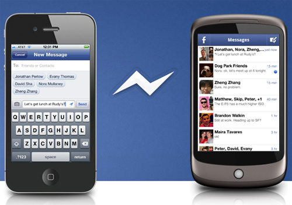

+++
title = "أفضل 5 تطبيقات بديله لواتساب"
date = "2015-06-23"
description = "تحدثنا في موضوع سابق عن 6 أسباب تدفعك للتخلي عن واتس اب، وكما أتضح في هذا الموضوع أن الواتس اب لا يحترم خصوصية مستخدميه وأنه غير مجاني بالكامل، نقترح عليك عزيزي القارئ أفضل 5 تطبيقات بديله للواتس اب"
categories = ["مهارات رقمية",]
tags = ["موقع لغة العصر"]
images = ["images/0.jpg"]

+++

تحدثنا في موضوع سابق عن 6 أسباب تدفعك للتخلي عن واتس اب، وكما اتضح في هذا الموضوع أن الواتس اب لا يحترم خصوصية مستخدميه وأنه غير مجاني بالكامل، نقترح عليك عزيزي القارئ أفضل 5 تطبيقات بديله للواتس اب.

### 1. Facebook Messenger:

تطبيق Facebook Messenger هو أحد أفضل بدائل الواتس اب حيث أنه يرتبط بحساب الفيس بوك الخاص بك ويمكنك من التواصل مع أصدقائك بسهولة، كما أنه مجاني بالكامل ويعمل على العديد من المنصات.

لتحميل التطبيق [iOS](https://itunes.apple.com/my/app/facebook-messenger/id454638411?mt=8) | [Android](https://play.google.com/store/apps/details?id=com.facebook.orca) | [BlackBerry](http://appworld.blackberry.com/webstore/content/136854/) | 

### 2. Line:

تطبيق Line يقوم بتسجيل رقمك في قواعد بياناته ثم يسمح لك باستخدام خدمته المجانية في ارسال الرسائل والمكالمات، من ضمن مميزات تطبيق line أنه يعمل على ال PC وال MAC، كما أنه يسمح لك بالتسجيل عن طريق البريد الإلكتروني بدلا من رقم الهاتف.

لتحميل التطبيق [iOS](https://itunes.apple.com/en/app/line/id443904275?ls=1&mt=8) | [Android](https://play.google.com/store/apps/details?id=jp.naver.line.android&hl=en) | [Windows Phone](http://www.windowsphone.com/en-us/store/app/line/a18daaa9.9a1c-4064.91dd-794644cd88e7) | [BlackBerry](http://appworld.blackberry.com/webstore/content/129864/)

### 3. Google Hangouts:

تطبيق Google Hangouts من أسهل تطبيقات التراسل الفوري وأفضلها في التصميم كما أنه تابع لجوجل لذا فهو دائم التحديث واضافة المميزات الجديدة، تستطيع التواصل مع أصدقائك عن طريق البريد الإلكتروني بالصوت أو بالفيديو أو حتى عن طريق الرسائل القصيرة.

لتحميل التطبيق [iOS](https://itunes.apple.com/us/app/hangouts/id643496868?mt=8) | [Android](https://play.google.com/store/apps/details?id=com.google.android.talk&hl=en) | [Chrome](https://chrome.google.com/webstore/detail/hangouts/nckgahadagoaajjgafhacjanaoiihapd?hl=en) 

### 4. Viber:

تطبيق Viber هو أقرب البدائل الى الواتس أي في الشكل والمميزات، فهو يستخدم رقم الهاتف للتسجيل تماما مثل Whatsapp بعد ذلك يقوم بالوصول الى جهات الاتصال الخاصة بك ليمكنك من التواصل معهم فوريا.

لتحميل التطبيق [iOS](https://itunes.apple.com/app/viber-free-phone-calls/id382617920?mt=8) | [Android](https://play.google.com/store/apps/details?id=com.viber.voip) | [Windows Phone](http://www.windowsphone.com/en-us/store/app/viber-messenger/f4631757.d1f6.4727.bd65.e6bc6c8e35da) | [BlackBerry](http://appworld.blackberry.com/webstore/content/85455/) | [Nokia](http://viber.com/products/nokia/) | [Bada](http://viber.com/products/bada/)

### 5. WeChat:

تطبيق WeChat من أكبر التطبيقات شعبية في الصين والتسجيل فيه يشبه الواتس اب الى حد كبير، كما أنه يستطيع الارتباط مع الفيسبوك أو البريد الإلكتروني لتجد أصدقائك بسهولة.

لتحميل التطبيق [iOS](https://itunes.apple.com/app/id414478124?mt=8&ls=1) | [Android](https://play.google.com/store/apps/details?id=com.tencent.mm) | [Windows Phone](http://www.windowsphone.com/en-us/store/app/wechat/23e1505b-9383.4ed4.9195.da23a3442820) | [BlackBerry](http://www.wechat.com/en/download.html) | [Nokia](http://www.wechat.com/en/download.html)

---
هذا الموضوع نٌشر باﻷصل على موقع مجلة لغة العصر.

http://aitmag.ahram.org.eg/News/17963.aspx