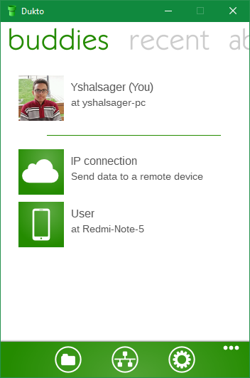

+++
title = "أفضل برامج نقل الملفات بين أجهزة الكمبيوتر عبر الشبكة المحلية"
date = "2018-12-06"
description = "كم من المرات احتجت إلى نقل ملفات بين أجهزة الكمبيوتر الموجودة في المنزل أو العمل؟ دائما ما نلجأ في هذا الموقف إلى استخدام وحدات التخزين المختلفة سواء مفاتيح USB أو الأقراص الصلبة المحمولة. لكن مع وجود هذه الأجهزة على نفس الشبكة المحلية سواء سلكيا أو عبر الواي فاي، يمكنك استعمال عدة طرق إرسال واستقبال الملفات بين الأجهزة المختلفة، وبغض النظر عن نظام التشغيل الموجود عليها!"
categories = ["مهارات رقمية",]
tags = ["مجلة لغة العصر"]
images = ["images/n1.png"]

+++
كم من المرات احتجت إلى نقل ملفات بين أجهزة الكمبيوتر الموجودة في المنزل أو العمل؟ دائما ما نلجأ في هذا الموقف إلى استخدام وحدات التخزين المختلفة سواء مفاتيح USB أو الأقراص الصلبة المحمولة. لكن مع وجود هذه الأجهزة على نفس الشبكة المحلية سواء سلكيا أو عبر الواي فاي، يمكنك استعمال عدة طرق إرسال واستقبال الملفات بين الأجهزة المختلفة، وبغض النظر عن نظام التشغيل الموجود عليها!

## برنامج LAN Share

LAN Share هو برنامج مجاني مفتوح المصدر، مكتوب بلغةC++ - Qt. يعمل على ويندوز ولينكس، ويتيح لك إرسال الملفات والمجلدات بسرعة كبيرة بين الأجهزة، وتتم عمليات نقل الملفات مباشرة من جهاز كمبيوتر إلى آخر، عبر الشبكة المحلية أو شبكة الواي فاي، دون الحاجة لإجراء أي إعدادات معقدة، أو التعامل مع أذونات غامضة. فهو يدعم نقل الملفات:
  • من ويندوز إلى لينكس، والعكس.
  • من ويندوز إلى ويندوز.
  • من لينكس إلى لينكس.
والمميز في هذا البرنامج أنه لا يستخدم خوادم تابعة لجهات خارجية، أو خدمات سحابية، ولا توجد ترتيبات بروتوكول معقدة. فالمتطلب الوحيد لعمل البرنامج هو أن يكون كلا الجهازين على نفس الشبكة المحلية أو اتصال الواي فاي. كما أنه لا توجد أي قيود على عملية النقل سواء أنواع الملفات أو حجمها، إلى جانب إمكانية النقل لأكثر من جهاز في نفس الوقت.

### كيفية تثبيت البرنامج

ويندوز: قم بالتحميل من هذا الرابط https://github.com/abdularis/LAN-Share/releases/latest (يعمل على نسخ 64-بت فقط) ثم التثبيت بالطريقة التقليدية.

لينكس: قم بتحميل الحزمة الموجودة في الرابط السابق وتثبيته عن طريق الأمر التالي إذا كنت من مستخدمي أوبنتو: `sudo dpkg -i ./lanshare_1.2.1-1_amd64.deb`

أو يمكنك تحميل نسخة AppImage من البرنامج من الرابط https://github.com/abdularis/LAN-Share/releases/tag/continuous
ثم فتحها مباشرة لتعمل على أي توزيعة لينكس.

### كيفية الاستخدام

بمجرد فتح البرنامج تظهر واجهته كما بالصورة:

تتكون الشاشة الرئيسية البسيطة من أزرار الإرسال والإعدادات، وفى المنتصف لوحة البيانات القسم العلوي للملفات "المرسلة" والملفات "المستلمة" في النصف السفلي. وتعرض أشرطة التقدم وبيانات الملفات التي يتم نقلها في الوقت الفعلي.

عند الضغط على Send يمكنك الاختيار بين إرسال ملف واحد أو إرسال مجلد، وبعدها تظهر نافذة اختيار المستلم.

ومن ثم تبدأ عملية النقل

إذا كان هناك أي شيء يفتقر له هذا البرنامج، فهي ميزات وإعدادات الأمان المتقدمة – لكنه مناسب للاستخدام على شبكة المنزل المحلية دون القلق من أي شيء.

## برنامج Nitroshare

مثل سابقه، Nitroshare هو أيضا برنامج مجاني مفتوح المصدر، لكنه يعمل على ويندوز ولينكس وماك، ومكتوب بلغة Qt 5. ويتميز عن LAN Share بدعم التشفير وعرض الإشعارات وإمكانية رؤية سجل عمليات النقل.

### كيفية تثبيت البرنامج

قم بالدخول إلى الموقع https://nitroshare.net/ ثم اختر نسخة البرنامج المناسبة لنظامك سواء ويندوز أو ماك، أما بالنسبة لمستخدمي لينكس بتوزيعاته المختلفة فيجب أن يقوموا بالتثبيت من خلال سطر الأوامر من خلال تعليمات التثبيت الموجودة على الموقع.

ولمستخدمي هواتف أندرويد يمكن تثبيت التطبيق من متجر بلاي: https://play.google.com/store/apps/details?id=net.nitroshare.android

### كيفية الاستخدام

بمجرد تثبيت البرنامج وفتحه فإنه يتكامل مع النظام، وتظهر الأيقونة الخاصة به على شريط المهام أو ال tray، ولإرسال الملفات، تأكد أولا من فتح البرنامج على كلا الجهازين ثم اضغط بزر الماوس الأيمن على أيقونة البرنامج واختر Send Files أو Send Directory إذا كنت تريد إرسال مجلد.

ثم قم باختيار الجهاز الذي تريد إرسال الملفات إليه.
بعد ذلك سيقوم البرنامج بحساب أقصى قدرة لأداء الشبكة، ثم إرسال الملف، وبمجرد انتهاء عملية النقل سيظهر إشعار بالاكتمال.

ويمكنك عرض سجل عمليات النقل من خلال View Transfers.

كما أن البرنامج سيقوم بعرض إشعارات في حالة دخول أي جهاز إلى الشبكة أو الخروج منها، وهي ميزة جيدة.

## برنامج Dukto

أداة مشاركة ملفات مفتوحة المصدر تتميز ببساطة واجهة المستخدم وسهولة الاستخدام دون تعقيد، ويعمل على عدد كبير من المنصات منها ويندوز وماك ولينكس وأندرويد وiOS، يختلف عن سابقه في عدم وجود ميزات الأمان والتشفير، وبالتالي يُفضل استخدم هذه الأداة مع الشبكة الموثوقة فقط لتجنب أي مشاكل غير مرغوب فيها.

### كيفية تثبيت البرنامج

قم بالدخول إلى الموقع http://www.msec.it/blog/?page_id=11 وحمل النسخة المناسبة لجهازك، ستجد صفحة منفصلة لتحميل نسخة لينكس.

لمستخدمي ويندوز 10 يمكن الحصول على البرنامج من متجر التطبيقات أو هذا الرابط: https://www.microsoft.com/store/apps/9WZDNCRDD007

ومستخدمي أندرويد أيضا، يتوفر التطبيق على متجر بلاي: https://play.google.com/store/apps/details?id=it.msec.dukto&hl=ar

وكذلك مستخدمي iOS: https://itunes.apple.com/us/app/dukto/id588663167

### كيفية الاستخدام

قم تثبيت البرنامج بالطريقة العادية وفتحه، ستظهر لك الواجهة كما بالصورة:

ستجد اسم الجهاز الخاص بك والأجهزة المتصلة معك على البرنامج، لإرسال ملف تحتاج إلى الضغط على جهاز ثم تحديد بعض الملفات وستبدأ عملية النقل.

وبعد اكتمال العملية ستظهر لك الملف في قائمة الملفات المرسلة.

من ضمن ما يميز برنامج Dukto هو دعمه لإرسال النصوص عبر الأجهزة، وهي ميزة مفيدة للغاية عندما تريد إرسال الروابط إلى أحد الأجهزة.

يوجد العديد من الطرق الأخرى لمشاركة الملفات عبر الشبكة المحلية، مثل المشاركة من خلال الويندوز، أو برنامج Teleport لأجهزة لينكس، أو موقع https://www.sharedrop.io/ أو برنامج ShareIt أو حتى الطرق التقليدية مثل Samba sharesو SSH وsFTP. لكن تظل هذه البرامج التي نرشحها لك هي الأفضل والأبسط، إضافة إلى أنها مفتوحة المصدر وتحترم الخصوصية ولا تحتوي على إعلانات مزعجة.

---

هذا الموضوع نُشر باﻷصل في مجلة لغة العصر العدد 216 شهر 12-2018 ويمكن الإطلاع عليه [هنا](https://drive.google.com/file/d/18TzxpJ64gqA7SWZsUk-s9GLsvVYcz0sc/view?usp=sharing).

