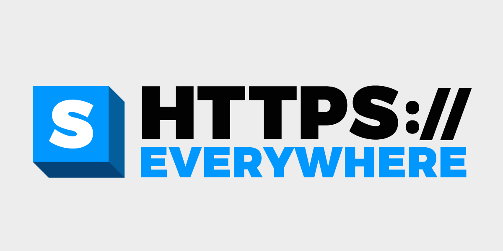
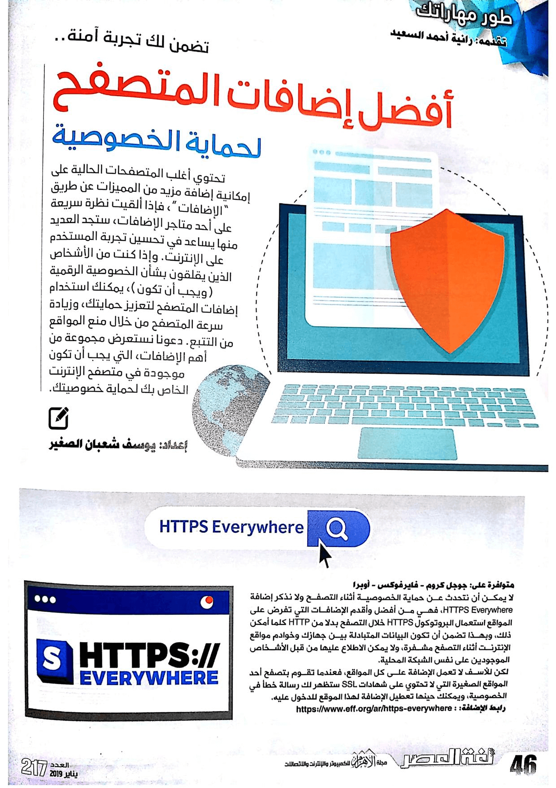
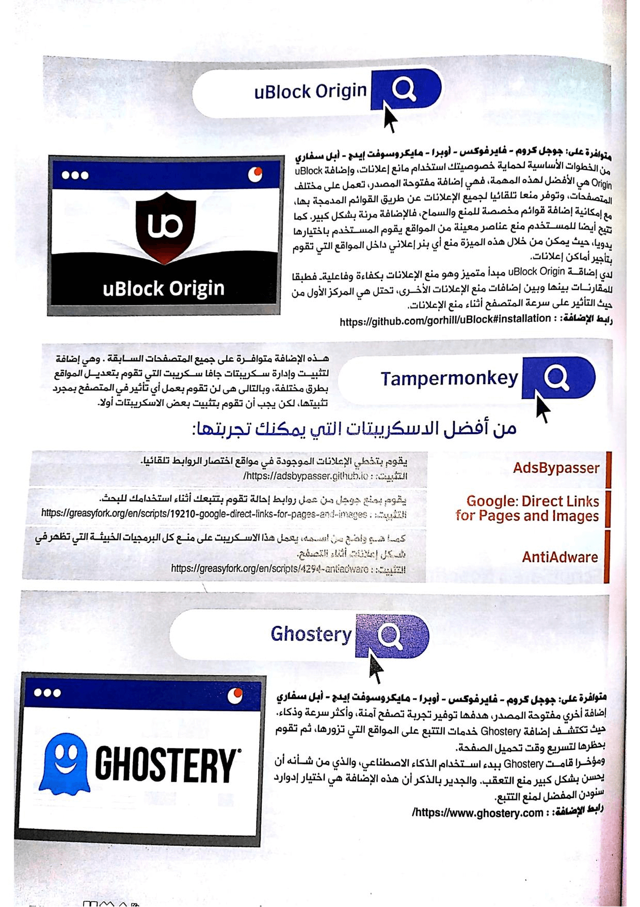
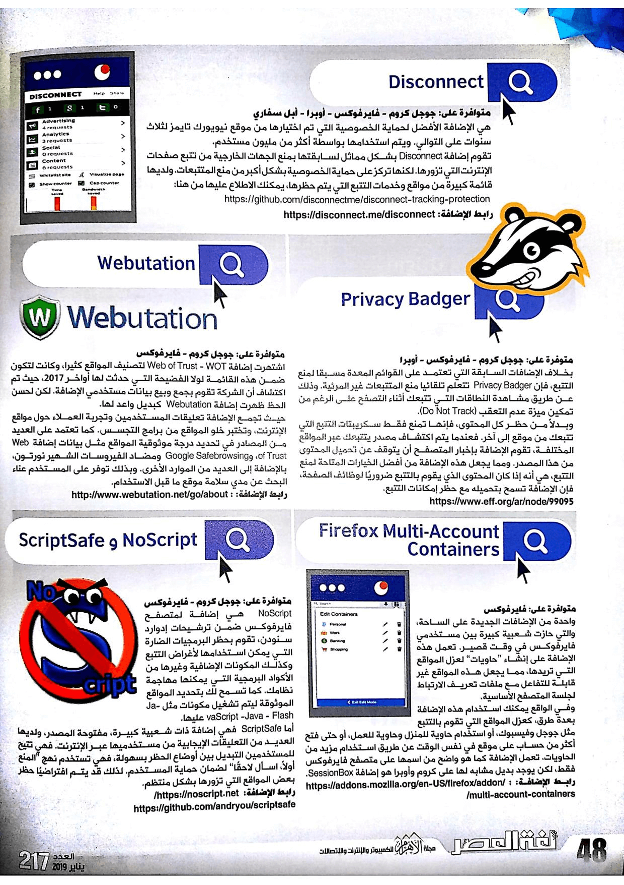

+++
title = "أفضل إضافات المتصفح لحماية الخصوصية"
date = "2019-01-01"
description = "تحتوي أغلب المتصفحات الحالية على إمكانية إضافة مزيد من المميزات عن طريق \"الإضافات\"، فإذا ألقيت نظرة سريعة على أحد متاجر الإضافات، ستجد العديد منها يساعد في تحسين تجربة المستخدم على الإنترنت. وإذا كنت من الأشخاص الذين يقلقون بشأن الخصوصية الرقمية (ويجب أن تكون)، يمكنك استخدام إضافات المتصفح لتعزيز حمايتك، وزيادة سرعة المتصفح من خلال منع المواقع من التتبع. دعونا نستعرض مجموعة من أهم الإضافات التي يجب أن تكون موجودة في متصفح الإنترنت الخاص بك لحماية خصوصيتك."
categories = ["الخصوصية",]
tags = ["مجلة لغة العصر"]

+++

تحتوي أغلب المتصفحات الحالية على إمكانية إضافة مزيد من المميزات عن طريق "الإضافات"، فإذا ألقيت نظرة سريعة على أحد متاجر الإضافات، ستجد العديد منها يساعد في تحسين تجربة المستخدم على الإنترنت. وإذا كنت من الأشخاص الذين يقلقون بشأن الخصوصية الرقمية (ويجب أن تكون)، يمكنك استخدام إضافات المتصفح لتعزيز حمايتك، وزيادة سرعة المتصفح من خلال منع المواقع من التتبع. دعونا نستعرض مجموعة من أهم الإضافات التي يجب أن تكون موجودة في متصفح الإنترنت الخاص بك لحماية خصوصيتك.

تحتوي أغلب المتصفحات الحالية على إمكانية إضافة مزيد من المميزات عن طريق "الإضافات"، فإذا ألقيت نظرة سريعة على أحد متاجر الإضافات، ستجد العديد منها يساعد في تحسين تجربة المستخدم على الإنترنت. وإذا كنت من الأشخاص الذين يقلقون بشأن الخصوصية الرقمية (ويجب أن تكون)، يمكنك استخدام إضافات المتصفح لتعزيز حمايتك، وزيادة سرعة المتصفح من خلال منع المواقع من التتبع. دعونا نستعرض مجموعة من أهم الإضافات التي يجب أن تكون موجودة في متصفح الإنترنت الخاص بك لحماية خصوصيتك.

## 1- HTTPS Everywhere

متوفرة على: جوجل كروم - فايرفوكس - أوبيرا
لا يمكن أن نتحدث عن حماية الخصوصية أثناء التصفح ولا نذكر إضافة HTTPS Everywhere، فهي من أفضل وأقدم الإضافات التي تفرض على المواقع استعمال البروتوكول HTTPS خلال التصفح بدلا من HTTP كلما أمكن ذلك، وبهذا تضمن أن تكون البيانات المتبادلة بين جهازك وخوادم مواقع الإنترنت أثناء التصفح مشفرة، ولا يمكن الاطلاع عليها من قبل الأشخاص الموجودين على نفس الشبكة المحلية.
لكن للأسف لا تعمل الإضافة على كل المواقع، فعندما تقوم بتصفح أحد المواقع الصغيرة التي لا تحتوي على شهادات SSL سيظهر لك رسالة خطأ في الخصوصية، ويمكنك حينها تعطيل الإضافة لهذا الموقع للدخول عليه.
رابط الإضافة: https://www.eff.org/ar/https-everywhere

## 2- uBlock Origin

متوفرة على: جوجل كروم - فايرفوكس - أوبيرا - مايكروسوفت إيدج - أبل سفاري
من الخطوات الأساسية لحماية خصوصيتك استخدام مانع إعلانات، وإضافة uBlock Origin هي الأفضل لهذه المهمة، فهي إضافة مفتوحة المصدر، تعمل على مختلف المتصفحات، وتوفر منع تلقائي لجميع الإعلانات عن طريق القوائم المدمجة بها، مع إمكانية إضافة قوائم مخصصة للمنع والسماح، فالإضافة مرنة بشكل كبير. كما تتيح أيضا للمستخدم منع عناصر معينة من المواقع يقوم المستخدم باختيارها يدويا، حيث يمكن من خلال هذه الميزة منع أي بنر إعلاني داخل المواقع التي تقوم بتأجير أماكن إعلانات.
لدي إضافة uBlock Origin مبدأ متميز وهو من الإعلانات بكفاءة وفاعليةـ فطبقا للمقارنات بينها وبين إضافات منع الإعلانات الأخرى، تحتل هي المركز الأول من حيث التأثير على سرعة المتصفح أثناء منع الإعلانات.
رابط الإضافة: https://github.com/gorhill/uBlock#installation

## 3- Tampermonkey

متوفرة على: جوجل كروم - فايرفوكس - أوبيرا - مايكروسوفت إيدج - أبل سفاري
Tampermonkey هي إضافة لتثبيت وإدارة سكريبتات جافا سكريبت التي تقوم بتعديل المواقع بطرق مختلفة، وبالتالي هي لن تقوم بعمل أي تأثير في المتصفح بمجرد تثبيتها، لكن يجب أن تقوم بتثبيت بعض الاسكريبتات أولا.
من أفضل الاسكربيتات التي يمكنك تجربتها:

-   AdsBypasser: يقوم بتخطي الإعلانات الموجودة في مواقع اختصار الروابط تلقائيا.
    التثبيت: https://adsbypasser.github.io/
-   Google: Direct Links for Pages and Images: يقوم بمنع جوجل من عمل روابط إحالة تقوم بتتبعك أثناء استخدامك للبحث.
    التثبيت: https://greasyfork.org/en/scripts/19210-google-direct-links-for-pages-and-images
-   AntiAdware: كما هو واضح من اسمه، يعمل هذا الاسكريبت على منع كل البرمجيات الخبيثة التي تظهر في شكل إعلانات أثناء التصفح.
    التثبيت: https://greasyfork.org/en/scripts/4294-antiadware
    رابط الإضافة: https://tampermonkey.net/

## 4- Ghostery

متوفرة على: جوجل كروم - فايرفوكس - أوبيرا - مايكروسوفت إيدج - أبل سفاري
إضافة أخري مفتوحة المصدر، هدفها توفير تجربة تصفح أمنة، وأكثر سرعة وذكاء. حيث تكتشف إضافة Ghostery خدمات التتبع على المواقع التي تزورها، ثم تقوم بحظرها لتسريع وقت تحميل الصفحة.
ومؤخرا قامت Ghostery ببدء استخدام ذكاء اصطناعي، والذي من شأنه أن يحسن بشكل كبير منع التعقب. والجدير بالذكر أن هذه الإضافة هي اختيار إدوارد سنودن المفضل لمنع التتبع.
رابط الإضافة: https://www.ghostery.com/

## 5- Disconnect

متوفرة على: جوجل كروم - فايرفوكس - أوبيرا - أبل سفاري
هي الإضافة الأفضل لحماية الخصوصية التي تم اختيارها من موقع نيويورك تايمز لثلاثة سنوات على التوالي. ويتم استخدامها بواسطة أكثر من مليون مستخدم.
تقوم إضافة Disconnect بشكل مماثل لسابقتها بمنع الجهات الخارجية من تتبع صفحات الإنترنت التي تزورها. لكنها تركز على حماية الخصوصية بشكل أكبر من منع المتتبعات. ولديها قائمة كبيرة من مواقع وخدمات التتبع التي يتم حظرها، يمكنك الاطلاع عليها من [هنا](https://github.com/disconnectme/disconnect-tracking-protection).
رابط الإضافة: https://disconnect.me/disconnect

## 6- Privacy Badger

متوفرة على: جوجل كروم - فايرفوكس - أوبيرا
بخلاف الإضافات السابقة التي تعتمد على القوائم المعدة مسبقا لمنع التتبع، فإن Privacy Badger تتعلم تلقائيا منع المتتبعات الغير مرئية. وذلك عن طريق مشاهدة النطاقات التي تتبعك أثناء التصفح على الرغم من تمكين ميزة عدم التعقب (Do Not Track).
وبدلاً من حظر كل المحتوى، فإنها تمنع فقط سكريبتات التتبع التي تتبعك من موقع إلى آخر. فعندما يتم اكتشاف مصدر يتتبعك عبر المواقع المختلفة، تقوم الإضافة بإخبار المتصفح أن يتوقف عن تحميل المحتوى من هذا المصدر. ومما يجعل هذه الإضافة من أفضل الخيارات المتاحة لمنع التتبع، هي أنه إذا كان المحتوى الذي يقوم بالتتبع ضروريًا لوظائف الصفحة، فإن الإضافة تسمح بتحميله مع حظر إمكانات التتبع.
https://www.eff.org/ar/node/99095

## 7- Webutation

متوفرة على: جوجل كروم - فايرفوكس
اشتهرت إضافة Web of Trust (WOT) لتصنيف المواقع كثيرا، وكانت لتكون ضمن هذه القائمة لولا الفضيحة التي حدثت لها أواخر 2017، حيث تم اكتشاف أن الشركة تقوم بجمع وبيع بيانات مستخدمي الإضافة. لكن لحسن الحظ ظهرت إضافة Webutation كبديل واعد لها.
حيث تجمع الإضافة تعليقات المستخدمين وتجربة العملاء حول مواقع الإنترنت، وتختبر خلو المواقع من برامج التجسس، كما تعتمد على العديد من المصادر في تحديد درجة موثوقية المواقع مثل بيانات إضافة Web of Trust، وGoogle Safebrowsing ومضاد الفيروسات الشهير نورتون، بالإضافة إلى العديد من الموارد الأخرى. وبذلك توفر على المستخدم عناء البحث عن مدي سلامة موقع ما قبل الاستخدام.
رابط الإضافة: http://www.webutation.net/go/about

## 8- Firefox Multi-Account Containers

متوفرة على: فايرفوكس
واحدة من الإضافات الجديدة على الساحة، والتي كسبت شعبية كبيرة بين مستخدمي فايرفوكس في وقت قصير. تعمل هذه الإضافة على إنشاء "حاويات" لعزل المواقع التي تريدها، مما يجعل هذه المواقع غير قابلة للتفاعل مع ملفات تعريف الارتباط لجلسة المتصفح الأساسية.
وفي الواقع يمكنك استخدام هذه الإضافة بعدة طرق، مثل عزل المواقع التي تقوم بالتتبع مثل جوجل وفيسبوك، أو استخدام حاوية للمنزل وحاوية للعمل، أو حتى فتح أكثر من حساب على موقع في نفس الوقت عن طريق استخدام مزيد من الحاويات.

تعمل الإضافة كما هو واضح من اسمها على متصفح فايرفوكس فقط، لكن يوجد بديل مشابهة لها على كروم وأوبيرا هو إضافة SessionBox.
رابط الإضافة: https://addons.mozilla.org/en-US/firefox/addon/multi-account-containers/

## 9- NoScript وScriptSafe

متوفرة على: جوجل كروم - فايرفوكس
NoScript هي إضافة لمتصفح فايرفوكس ضمن ترشيحات إدوارد سنودن، تقوم بحظر البرمجيات الضارة التي يمكن استخدامها لأغراض التتبع وكذلك المكونات الإضافية وغيرها من الأكواد البرمجية التي يمكنها مهاجمة نظامك. كما تسمح لك بتحديد المواقع الموثوقة ليتم تشغيل مكونات مثل JavaScript -Java - Flash عليها.
أما ScriptSafe فهي إضافة ذات شعبية كبيرة، مفتوحة المصدر، ولديها العديد من التعليقات إيجابية من مستخدميها عبر الإنترنت. فهي تتيح للمستخدمين التبديل بين أوضاع الحظر بسهولة، فهي تستخدم نهج "امنع أولاً، اسأل لاحقًا" لضمان حماية المستخدم. لذلك قد يتم افتراضيًا حظر بعض المواقع التي تزورها بشكل منتظم.
رابط الإضافة:
https://noscript.net/
https://github.com/andryou/scriptsafe

---

هذا الموضوع نُشر باﻷصل في مجلة لغة العصر العدد 217 شهر 01-2019 ويمكن الإطلاع عليه [هنا](https://drive.google.com/file/d/16gCFQqQx40lHCnO2EPdlYhdkvYSWv_xh/view?usp=sharing).

