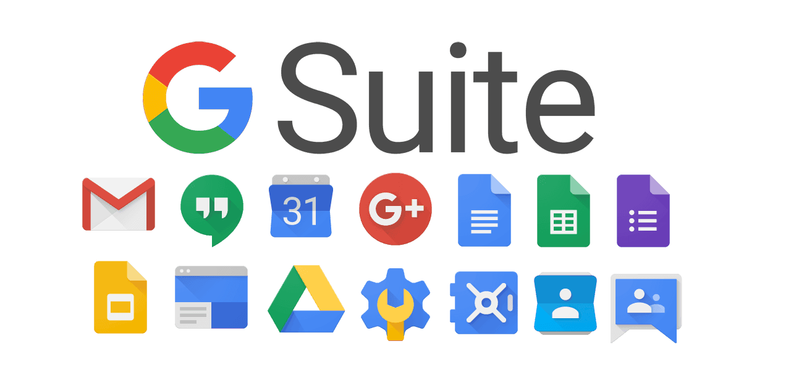
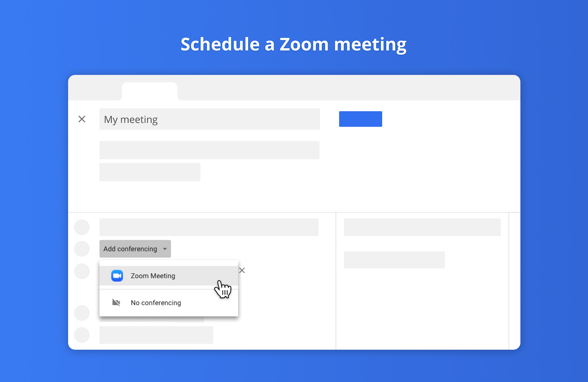
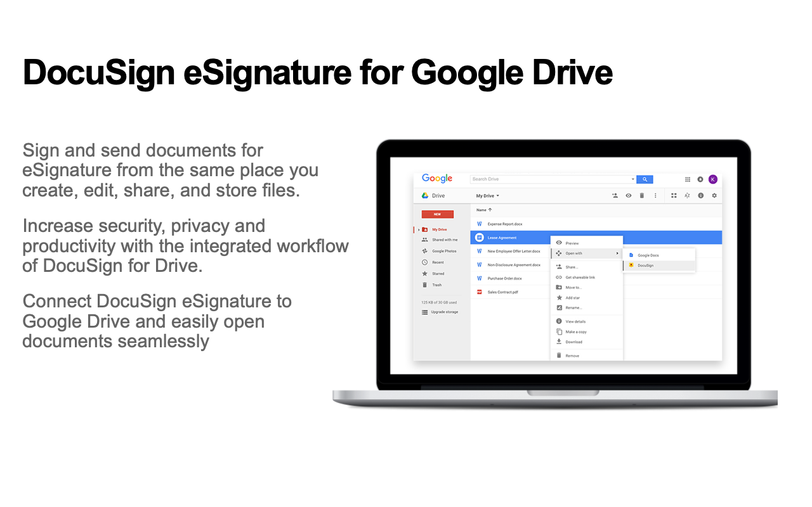
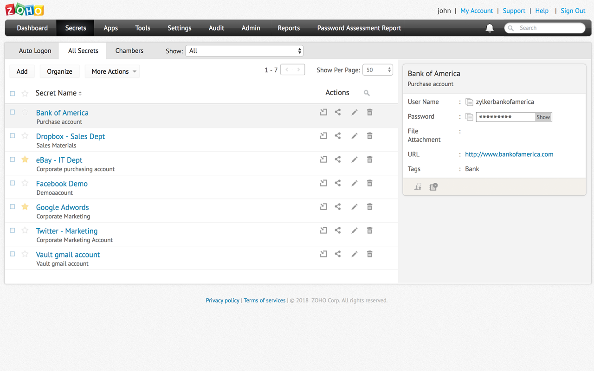
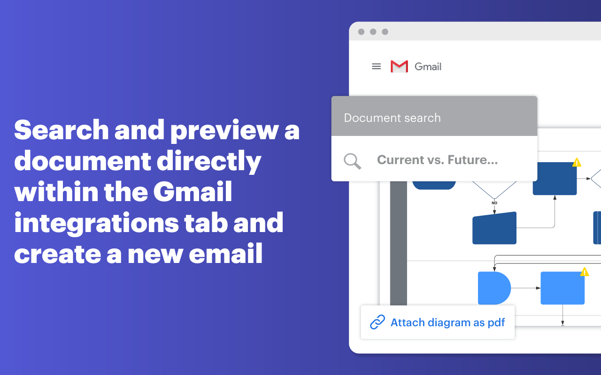
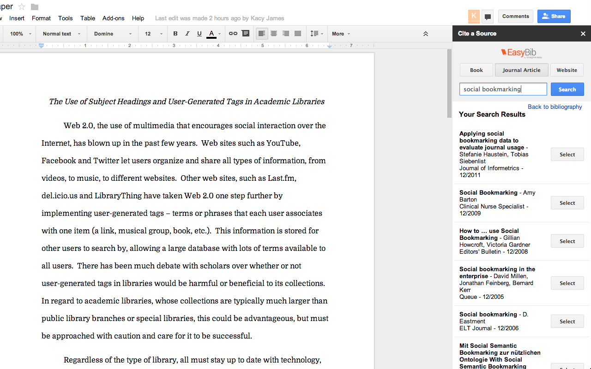
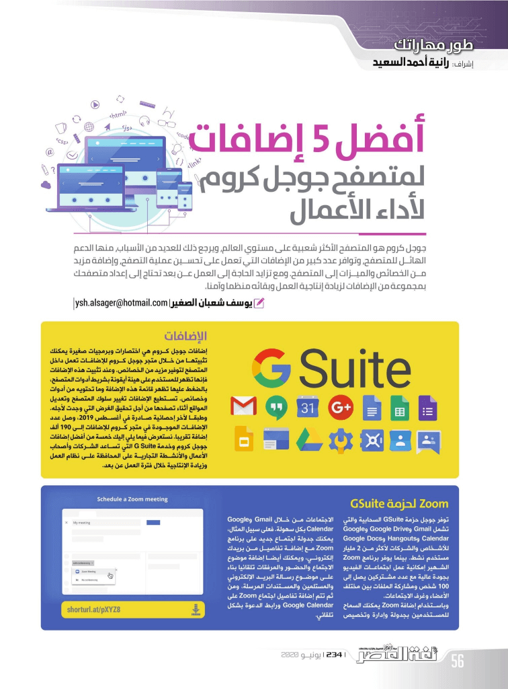
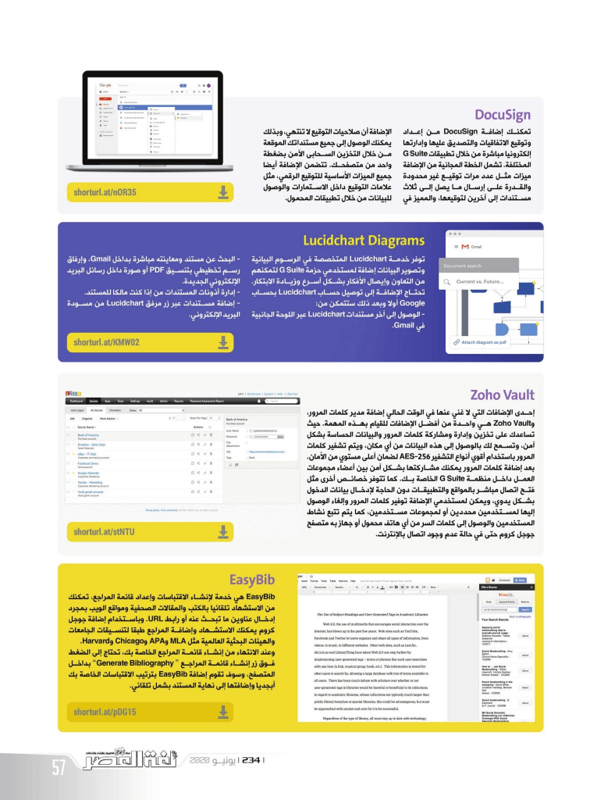

+++
title = "أفضل 5 إضافات لمتصفح جوجل كروم لأداء الأعمال"
date = "2020-06-01"
description = "جوجل كروم هو المتصفح الأكثر شعبية على مستوي العالم، ويرجع ذلك للعديد من الأسباب، منها الدعم الهائل للمتصفح وتوفر عدد كبير من الإضافات التي تعمل على تحسين عملية التصفح وإضافة مزيد من الخصائص والميزات إلى المتصفح. ومع تزايد الحاجة إلى العمل عن بعد تحتاج إلى إعداد متصفحك بمجموعة من الإضافات لزيادة إنتاجية العمل وبقاءه منظمنا وآمنا."
categories = ["مهارات رقمية",]
tags = ["مجلة لغة العصر"]

+++

جوجل كروم هو المتصفح الأكثر شعبية على مستوي العالم، ويرجع ذلك للعديد من الأسباب، منها الدعم الهائل للمتصفح توفر عدد كبير من الإضافات التي تعمل على تحسين عملية التصفح وإضافة مزيد من الخصائص والميزات إلى المتصفح. ومع تزايد الحاجة إلى العمل عن بعد تحتاج إلى إعداد متصفحك بمجموعة من الإضافات لزيادة إنتاجية العمل وبقاءه منظمنا وآمنا.

## اﻹضافات

إضافات جوجل كروم هي اختصارات وبرمجيات صغيرة يمكنك تثبيتها من خلال متجر جوجل كروم للإضافات تعمل داخل المتصفح لتوفير مزيد من الخصائص. وعند تثبيت هذه الإضافات فإنها تظهر للمستخدم على هيئة أيقونة بشريط أدوات المتصفح، بالضغط عليها تظهر قائمة هذه الإضافة وما تحتويه من أدوات وخصائص. تستطيع الإضافات تغيير سلوك المتصفح وتعديل المواقع أثناء تصفحها من أجل تحقيق الغرض التي وجدت لأجله.

وطبقا لآخر إحصائية صادرة في أغسطس 2019، وصل عدد الإضافات الموجودة في متجر كروم للإضافات إلى 190 ألف إضافة تقريبا. نستعرض فيما يلي إليك خمسة من أفضل إضافات جوجل كروم وخدمة G Suite التي تساعد الشركات وأصحاب الأعمال والأنشطة التجارية على المحافظة على نظام العمل وزيادة الإنتاجية خلال فترة العمل عن بعد.

## إضافة Zoom لحزمة GSuite

توفر جوجل حزمة GSuite السحابية والتي تشمل Gmail وGoogle Drive وGoogle Calendar وHangouts وGoogle Docs للأشخاص والشركات لأكثر من 2 مليار مستخدم نشط. بينما يوفر برنامج Zoom الشهير إمكانية عمل اجتماعات الفيديو بجودة عالية مع عدد مشتركين يصل إلى 100 شخص ومشاركة الملفات بين مختلف الأعضاء وغرف الاجتماعات.

وباستخدام إضافة Zoom يمكنك السماح للمستخدمين بجدولة وإدارة وتخصيص الاجتماعات من خلال Gmail وGoogle Calendar بكل سهولة. فعلى سبيل المثال يمكنك جدولة اجتماع جديد على برنامج Zoom مع إضافة تفاصيل من بريدك إلكتروني، ويمكنك أيضا إضافة موضوع الاجتماع والحضور والمرفقات تلقائيًا بناءً على موضوع رسالة البريد الإلكتروني والمستلمين والمستندات المرسلة، ومن ثم يتم إضافة تفاصيل اجتماع Zoom على Google Calendar ورابط الدعوة بشكل تلقائي.

https://gsuite.google.com/marketplace/app/zoom_for_gsuite/364750910244

## DocuSign

تمكنك إضافة DocuSign من إعداد وتوقيع الاتفاقيات والتصديق عليها وإدارتها إلكترونيًا مباشرة من خلال تطبيقات G Suite المختلفة. تشمل الخطة المجانية من الإضافة ميزات مثل عدد مرات توقيع غير محدودة والقدرة على إرسال ما يصل إلى ثلاث مستندات إلى آخرين لتوقيعها، والمميز في الإضافة أن صلاحيات التوقيع لا تنتهي، وبذلك يمكنك الوصول إلى جميع مستنداتك الموقعة من خلال التخزين السحابى الآمن بضغطة واحد من متصفحك. تتضمن الإضافة أيضًا جميع الميزات أساسيات للتوقيع الرقمي، مثل علامات التوقيع داخل الاستمارات والوصول للبيانات من خلال تطبيقات المحمول.
https://gsuite.google.com/u/0/marketplace/app/docusign_esignature/66351547828

## Zoho Vault

أحد الإضافات التي لا غني عنها في الوقت الحالي إضافة مدير كلمات المرور، وZoho Vault هي واحدة من أفضل الإضافات للقيام بهذه المهمة. حيث تساعدك على تخزين وإدارة ومشاركة كلمات المرور والبيانات الحساسة بشكل آمن، وتسمح لك بالوصول إلى هذه البيانات من أي مكان، ويتم تشفير كلمات المرور باستخدام أقوي أنواع التشفير AES-256 لضمان أعلى مستوي من الأمان.

بعد إضافة كلمات المرور يمكنك مشاركتها بشكل آمن بين أعضاء مجموعات العمل داخل منظمة G Suite الخاصة بك. كما تتوفر خصائص أخرى مثل فتح اتصال مباشر بالمواقع والتطبيقات دون الحاجة لإدخال بيانات الدخول بشكل يدوي، ويمكن لمستخدمي الإضافة توفير كلمات المرور وإلغاء الوصول إليها لمستخدمين محددين أو لمجموعات مستخدمين، كما يتم تتبع نشاط المستخدمين والوصول إلى كلمات السر من أي هاتف محمول أو جهاز به متصفح جوجل كروم حتى في حالة عدم وجود اتصال بالإنترنت.

https://gsuite.google.com/u/0/marketplace/app/zoho_vault/1093594190208

## Lucidchart Diagrams

توفر خدمة Lucidchart المتخصصة في الرسوم البيانية وتصوير البيانات إضافة لمستخدمي حزمة G Suite لتمكنهم من التعاون وإيصال الأفكار بشكل أسرع وزيادة الابتكار. تحتاج الإضافة إلى توصيل حساب Lucidchart بحساب Google أولا وبعد ذلك ستتمكن من:

-   الوصول إلى آخر مستندات Lucidchart عبر اللوحة الجانبية في Gmail.
-   البحث عن مستند ومعاينته مباشرةً بداخل Gmail، وإرفاق رسم تخطيطي بتنسيق PDF أو صورة داخل رسائل البريد الإلكتروني الجديدة.
-   إدارة أذونات المستندات من إذا كنت مالكًا للمستند.
-   إضافة مستندات عبر زر مرفق Lucidchart من مسودة البريد الإلكتروني.
    https://gsuite.google.com/u/0/marketplace/app/lucidchart_diagrams_for_gmail/642736374576

## EasyBib

EasyBib هي خدمة لإنشاء الاقتباسات وإعداد قائمة المراجع، تمكنك من الاستشهاد تلقائيًا بالكتب والمقالات الصحفية ومواقع الويب بمجرد إدخال عناوين ما تبحث عنه أو رابط URL. وباستخدام إضافة جوجل كروم يمكنك الاستشهاد وإضافة المراجع طبقا لتنسيقات الجامعات والهيئات البحثية العالمية مثل MLA وAPA وChicago وHarvard.

وعند الانتهاء من إنشاء قائمة المراجع الخاصة بك، تحتاج إلى الضغط فوق زر إنشاء قائمة المراجع " Generate Bibliography" بداخل المتصفح، وسوف تقوم إضافة EasyBib بترتيب الاقتباسات الخاصة بك أبجديًا وإضافتها إلى نهاية المستند بشمل تلقائي.
https://gsuite.google.com/u/0/marketplace/app/easybib_bibliography_creator/351103992693

---

هذا الموضوع نُشر باﻷصل في مجلة لغة العصر العدد 234 شهر 06-2020 ويمكن الإطلاع عليه [هنا](https://drive.google.com/file/d/13i7pxRXJA4Jngu5SAuP2_c3D7V0ZSuaA/view?usp=sharing).

