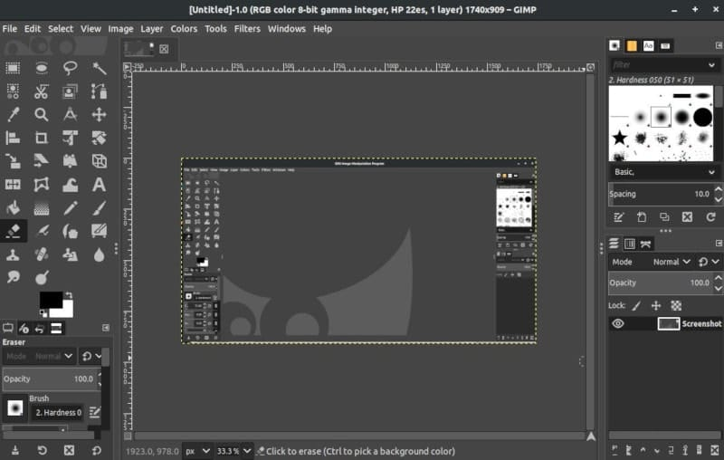
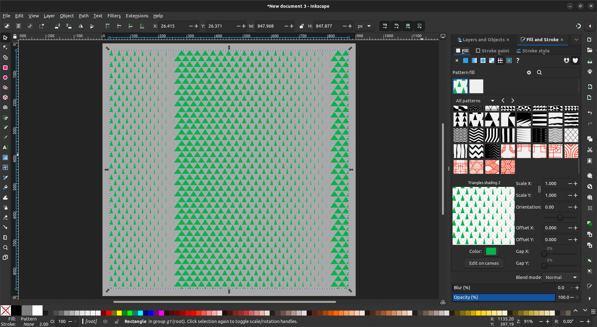
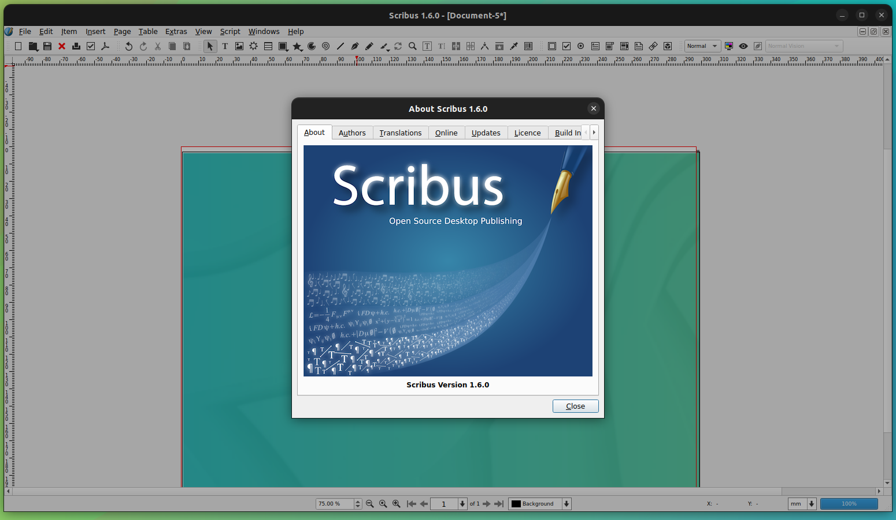
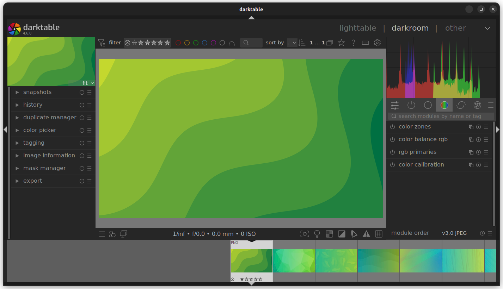
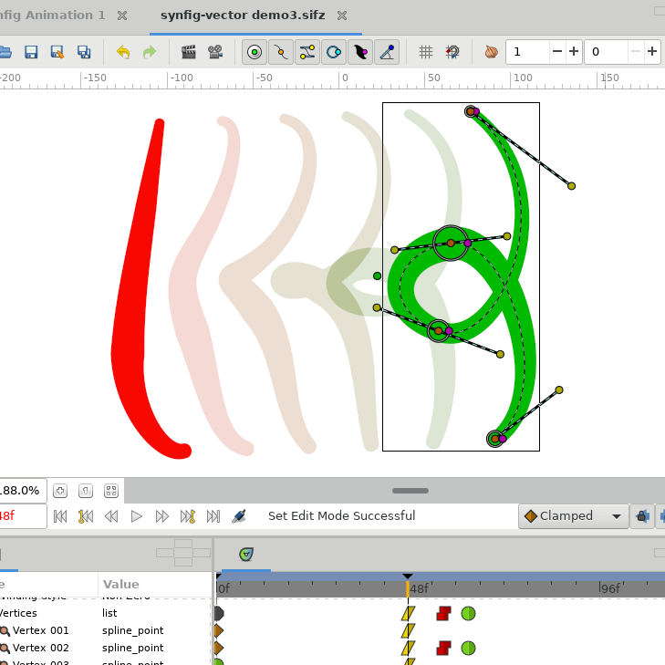

+++
title = "أفضل بدائل مجانية لمجموعة برامج أدوبي الإبداعية"
date = "2024-11-19"
description = "حدّثت شركة أدوبي مؤخرًا اتفاقية الخصوصية الخاصة ببرامجها ليصبح من الممكن لموظفيها الوصول اليدوي أو المؤتمت إلى محتوى المستخدم على مستوى الخدمات المختلفة، إلى جانب استخدامها محتوى المستخدمين في تدريب نماذج الذكاء الاصطناعي مع عدم توفر طريقة لمنع ذلك حتى مع الاشتراك المدفوع ذو التكلفة المرتفعة، لذلك يبحث العديد من المستخدمين عن بدائل لهذه البرامج، ونقترح عليك قائمة من البدائل المميزة لتجربتها وإطلاق العنان لإبداعك دون إنفاق الكثير مع الحفاظ على خصوصية ملفاتك وملفات عملائك."
images = ["images/featured.avif"]
categories = ["مهارات رقمية",]
tags = ["مجلة لغة العصر"]

+++

# أفضل بدائل مجانية لمجموعة برامج أدوبي الإبداعية

حدّثت شركة أدوبي مؤخرًا اتفاقية الخصوصية الخاصة ببرامجها ليصبح من الممكن لموظفيها الوصول اليدوي أو المؤتمت إلى محتوى المستخدم على مستوى الخدمات المختلفة، إلى جانب استخدامها محتوى المستخدمين في تدريب نماذج الذكاء الاصطناعي مع عدم توفر طريقة لمنع ذلك حتى مع الاشتراك المدفوع ذو التكلفة المرتفعة، لذلك يبحث العديد من المستخدمين عن بدائل لهذه البرامج، ونقترح عليك قائمة من البدائل المميزة لتجربتها وإطلاق العنان لإبداعك دون إنفاق الكثير مع الحفاظ على خصوصية ملفاتك وملفات عملائك.

## GIMP - بديل Photoshop

Adobe Photoshop هو برنامج معالجة الصور وتحرير الرسومات الأكثر شهرة واستخدامًا، سواء للمستخدمين العاديين أو المحترفين.

أما GIMP فهو محرر صور مجاني ومفتوح المصدر متاح لأنظمة تشغيل GNU/Linux، و Mac، و Windows، وأنظمة تشغيل أخرى ويوفر مجموعة من الأدوات المتطورة التي تُسهّل عمل مصممي الجرافيك والمصورين في معالجة الصور عالية الجودة وإنشاء الأعمال الفنية الأصلية وتصميم الأيقونات، وعناصر التصميم الجرافيكي، وإدارة الألوان. كما يحتوي على خيارات تخصيص ونظام إضافات يجعل عملك أسهل بكثير.

https://www.gimp.org

| ميزات Photoshop                              | الوصف                                                | التوافق مع GIMP                                |
| -------------------------------------------- | ---------------------------------------------------- | ---------------------------------------------- |
| **أدوات التحديد المدعومة بالذكاء الاصطناعي** | أدوات لتحديد الكائنات تلقائيًا باستخدام التعلم الآلي. | مدعوم جزئيًا ويفتقر إلى قدرات الذكاء الاصطناعي. |
| **الملء المدرك للمحتوى**                     | يملأ المناطق المحددة بمحتوى يمتزج بسلاسة.            | مدعوم جزئيًا وأقل تطورًا.                        |
| **طبقات التعديل**                            | أدوات غير مدمرة لتعديلات الألوان والنغمات.           | مدعوم جزئيًا بواسطة GIMP 2.99.18.               |
| **الطبقات**                                  | يسمح بتكديس التعديلات دون تغيير الصورة الأصلية.      | مدعوم.                                         |
| **فرشاة المعالجة**                           | تصلح العيوب عن طريق مزجها مع المناطق المحيطة.        | مدعوم جزئيًا وتحكم أقل.                         |
| **القناع**                                   | يخفي أو يكشف أجزاء من الصورة دون حذفها.              | مدعوم.                                         |

## Inkscape - بديل Illustrator

Inkscape هو منافس شرس وبديل مجاني ومفتوح المصدر لبرنامج Illustrator. فهو محرر رسومات متجهة يحتوي على أدوات رسم مرنة وتوافق كبير لتنسيقات الملفات وأدوات نصية قوية وميزات الرسومات المتجهة المتقدمة القابلة للتطوير مثل الاستنساخ والمزج.

https://inkscape.org

| ميزات Adobe Illustrator          | الوصف                                                        | توافق ميزات Inkscape                     |
| -------------------------------- | ------------------------------------------------------------ | ---------------------------------------- |
| **إعادة التلوين التوليدي**       | أداة ذكاء اصطناعي لتوليد أشكال مختلفة من الألوان للأعمال الفنية المتجهة. | غير مدعوم ويمكن إعادة التلوين اليدوي فقط |
| **شريط التمرير السلس**           | يضبط نعومة الخط يدويًا لتحسين الرسومات.                       | مدعوم جزئيًا وذو تحكم محدود               |
| **منتقي الأنماط**                | يستخرج الأنماط والألوان من الصور ويطبقها.                    | مدعوم جزئيًا ويستنسخ الألوان فقط          |
| **تحويل النص إلى رسوميات متجهة** | يحول النص إلى رسومات متجهة باستخدام الذكاء الاصطناعي.        | مدعوم جزئيًا، المتجهات اليدوية فقط        |
| **تحسينات توافق SVG**            | دعم محسن لملفات SVG لتحقيق توافق أفضل مع معايير الويب.       | مدعوم                                    |
| **أدوات الرسم المنظوري**         | أدوات لإنشاء رسومات منظورية دقيقة وتأثيرات ثلاثية الأبعاد.   | مدعوم جزئيًا، فقط الأدوات الأساسية        |

## Scribus - بديل InDesign

InDesign هو برنامج للنشر المكتبي يستخدم بشكل أساسي لإنشاء الملصقات، والنشرات الإعلانية، والكتيبات، والمجلات، والصحف، والكتب، وما إلى ذلك، كما يدعم تصدير الملفات بتنسيق EPUB لإنشاء الكتب الإلكترونية.

أما Scribus فهو برنامج مجاني ومفتوح المصدر متاح لجميع أنظمة التشغيل الرئيسية ويعتمد على مجموعة أدوات Qt المجانية. يمكن استخدامه في إنشاء التخطيطات، وعروض PDF التقديمية والنماذج المتحركة والتفاعلية، وكتابة الصحف والكتيبات والنشرات الإخبارية والملصقات والكتب، كما يدعم العديد من ميزات النشر الاحترافية مثل ألوان CMYK والفصل وإدارة ألوان ICC.

https://www.scribus.net

| ميزات InDesign                                    | الوصف                                                        | توافق ميزات Scribus        |
| ------------------------------------------------- | ------------------------------------------------------------ | -------------------------- |
| **أنماط الفقرات والحروف**                         | ضروري لتنسيق النص المتسق عبر مختلف المشاريع الشخصية.         | مدعوم جزئيًا وتحكم محدود    |
| **أنماط الكائن**                                  | مفيد لتطبيق أنماط متسقة على الكائنات مثل الصور والإطارات في المشاريع الإبداعية. | مدعوم جزئيًا                |
| **الأحرف الاستهلالية الكبيرة والأنماط المتداخلة** | يعزز الجاذبية البصرية للمستندات، وهو مهم للتخطيطات الإبداعية. | مدعوم جزئيًا ووظائف محدودة  |
| **إنشاء وإدارة الجداول**                          | تنظيم المعلومات بشكل مرتب، ويمكن تطبيقه في العديد من المشاريع الشخصية. | مدعوم جزئيًا                |
| **إدارة الألوان**                                 | مهم للتأكد من ظهور الألوان في المشاريع الشخصية كما هو مقصود. | مدعوم جزئيًا لكن أقل سهولة  |
| **إدارة الخطوط**                                  | اختيار وإدارة أفضل للخطوط، مما يعزز جماليات المستندات.       | مدعوم جزئيًا وخيارات أساسية |

## DaVinci Resolve - بديل Premiere Pro

يتوفر لبرنامج DaVinci Resolve نسخة مجانية وأخرى مدفوعة، وعلى الرغم من كون الكلام هنا عن النسخة المجانية، إلا أن النسخة المدفوعة تستحق التفكير في شرائها خصوصًا أن البرنامج يعتمد نظام الدفع لمرة واحدة مما يجعلها أقل تكلفة وأكثر فعالية على المدى الطويل من نظام الاشتراكات.

وتعد النسخة المجانية من DaVinci Resolve بديلًا ممتازًا لـ Premiere Pro، خاصةً ميزات تدرج الألوان وتحرير الفيديو غير الخطي.

https://www.blackmagicdesign.com/products/davinciresolve

| ميزات Premiere Pro          | الوصف                                                       | توافق DaVinci Resolve (النسخة المجانية) |
| --------------------------- | ----------------------------------------------------------- | --------------------------------------- |
| **إعادة التأطير التلقائي**  | يضبط الفيديو تلقائيًا لنسب عرض إلى ارتفاع مختلفة.            | مدعوم جزئيًا لكن الإعداد اليدوي ضروري    |
| **Lumetri Color**           | تصحيح ألوان بسيط ولكنه قوي، وهو ضروري لتحسين مقاطع الفيديو. | مدعوم باستخدام أدواته الخاصة            |
| **الرسومات الأساسية**       | يتيح إنشاء الرسومات وتخصيصها بسهولة.                        | مدعوم جزئيًا، قائم على نظام العقد        |
| **سير عمل Proxy**           | يتيح التحرير على الأنظمة الأقل قوة.                         | مدعوم                                   |
| **اللون التلقائي**          | طريقة سريعة لتصحيح الألوان، مفيدة للمبتدئين.                | مدعوم جزئيًا ويحتاج إلى إدخال يدوي       |
| **قوالب الرسومات المتحركة** | قوالب مصممة مسبقًا لتحسين مقاطع الفيديو.                     | مدعوم جزئيًا باستخدام أداة Fusion        |
| **التحرير متعدد الكاميرات** | مفيد لإنشاء محتوى بزوايا كاميرا متعددة.                     | مدعوم                                   |

وهناك بدائل أخرى تستحق التجربة مثل OpenShot وKdenlive وكلاهما مجاني ومفتوح المصدر.

## Blender - بديل After Effects

Blender بديل مجاني قوي لبرنامج After Effects المتخصص في الرسوم المتحركة ثلاثية الأبعاد والمؤثرات البصرية. ويدعم البرنامج 3D pipeline - النمذجة، والمحاكاة، والتجسيد، والتجميع، وتتبع الحركة.

https://www.blender.org

| ميزات After Effects          | الوصف                                                        | توافق ميزات Blender                 |
| :--------------------------: | :----------------------------------------------------------: | :---------------------------------: |
| **الملء المدرك للمحتوى**     | يملأ الخلفيات تلقائيًا عندما تتم إزالة العناصر من مقاطع الفيديو. | مدعوم جزئيًا عبر الاستنساخ والإصلاح |
| **Roto Brush 3**             | يستخدم الذكاء الاصطناعي لفصل المقدمات عن الخلفيات بسرعة، مما يساعد في التجميع. | مدعوم جزئيًا عبر ميزة القناع       |
| **أداة Puppet**              | يحول الصور الثابتة إلى شخصيات متحركة عن طريق تحديد نقاط الحركة. | مدعوم عبر قلم الشحوم                |
| **المؤثرات المدعومة بواسطة GPU** | يستفيد من GPU لمعالجة وتجسيد أسرع للمؤثرات.                  | مدعوم عبر Cycles، Eevee |
| **متتبع الكاميرا ثلاثية الأبعاد** | يتتبع حركة الكاميرا ثلاثية الأبعاد في اللقطات ثنائية الأبعاد لدمج العناصر ثلاثية الأبعاد. | مدعوم عبر تتبع الكاميرا |

ومن البدائل الجديرة بالإشادة كذلك برنامج Natron الذي يدعم ميزات مثل تحرير الحركة وسير العمل متعدد العروض ويوفر  واجهة مستخدم بديهية وعرض سريع يمكنك من العمل مع الإطارات الرئيسية key frames باستخدام محرر دقيق للغاية.

## Audacity - بديل Audition

Audacity هو بديل مجاني ومفتوح المصدر ذو خصائص قوية لـ Audition وهو أحد أقدم وأفضل برامج تحرير الصوت متعدد المسارات والتسجيل المتوفرة حاليًا.

| ميزات Audition             | الوصف                                         | توافق Audacity                     |
| -------------------------- | --------------------------------------------- | ---------------------------------- |
| **التحرير متعدد المسارات** | يدعم تحريرًا متعدد المسارات معقدًا ومتزامنًا.    | مدعوم جزئيًا وأقل مرونة             |
| **تحرير شكل الموجة**       | التمثيل البصري يساعد في التحريرات الدقيقة.    | مدعوم جزئيًا وأقل دقة               |
| **رف المؤثرات**            | لوحة قابلة للتخصيص لإدارة مؤثرات متعددة.      | مدعوم جزئيًا يوفر إدارة أساسية      |
| **عرض التردد الطيفي**      | عرض طيفي مفصل لتقليل الضوضاء وعزل الصوت بدقة. | مدعوم جزئيًا وأقل تفصيلاً            |
| **استعادة الصوت**          | أدوات متقدمة لاستعادة وإصلاح الصوت.           | مدعوم جزئيًا وأقل تطورًا             |
| **المعالجة المتعددة**      | أتمتة المهام المتكررة لملفات متعددة بكفاءة.   | مدعوم جزئيًا في نطاق محدود          |
| **قياس الصوت**             | أدوات لمراقبة وضبط الصوت وفقًا لمعايير البث.   | مدعوم جزئيًا فقط المستويات الأساسية |

ويوجد كذلك بديل آخر هو برنامج Ardor المجاني ومفتوح المصدر لتسجيل وتحرير ومزج الملفات الصوتية المختلفة بسهولة.

## Darktable - بديل Lightroom

Darktable هو بديل مجاني متقدم لـ Lightroom، موجه للمصورين الذين يعملون مع الصور الخام ويوفر ميزات عرض وتحرير وتحسين هذه الصور.

https://www.darktable.org

| ميزات Lightroom       | الوصف                                                        | توافق ميزات Darktable             |
| --------------------- | ------------------------------------------------------------ | --------------------------------- |
| **الإعدادات المسبقة** | يسمح للهواة بتطبيق الإعدادات المفضلة بسرعة واستكشاف الخيارات الإبداعية. | مدعوم عبر الأنماط                 |
| **التعديلات المحلية** | ضرورية لتحسين أجزاء معينة من الصورة، مما يعزز دقة التحرير بشكل كبير. | مدعوم عبر الوحدات                 |
| **إخراج HDR**         | مهم للهواة المهتمين بالمناظر الطبيعية والمشاهد ذات النطاق الديناميكي العالي. | مدعوم عبر Filmic RGB              |
| **Tone Curve**        | يوفر التحكم في نطاق ألوان الصورة، وهو أمر بالغ الأهمية لتحسين الصورة بالتفصيل. | مدعوم                             |
| **تشويش العدسة**      | يضيف تأثيرات فنية على الصور، محاكاة عمق المجال والبوكيه.     | مدعوم جزئيًا (محدود بقدرات الوحدة) |
| **إزالة البقع**       | مفيد لتنظيف الصور عن طريق إزالة العناصر غير المرغوب فيها.    | مدعوم                             |
| **تحسين التفاصيل**    | يشمل شحذ وتقليل الضوضاء، وهو أمر مهم لوضوح الصورة.           | مدعوم                             |

## Synfig Studio - بديل Animate

Synfig Studio هو برنامج مجاني ومفتوح المصدر لرسومات المتجهات ثنائية الأبعاد والرسوم المتحركة، والتصميم والتجسيد. هدف التطبيق تصميم رسوم متحركة عالية الجودة بموارد أقل، وتوفير ميزة الإطارات البينية اليدوية، مما يوفر عليك عناء رسم كل إطار على حدة. يمكن للبرنامج أيضًا محاكاة التظليل الناعم باستخدام التدرجات المنحنية ويوفر مجموعة واسعة من التأثيرات التي يمكن تطبيقها على طبقة واحدة أو مجموعة من الطبقات، والتحكم في عرض الخطوط وتحريكها وربط أي بيانات ذات صلة من كائن إلى آخر.

https://www.synfig.org

## خاتمة

تقدم أدوبي مجموعة من البرامج القوية ذات الميزات المتقدمة، لكن مشاكل الخصوصية والتكلفة مشكلة كبيرة بالنسبة للعديد من المستخدمين. ولحسن الحظ تقدم هذه البدائل المجانية جميع الميزات الأساسية تقريبًا وبعض الميزات المتقدمة لتمكينك من إطلاق العنان لإبداعك على المستوى الشخصي وفي كثير من الأحيان المستوى العملي الاحترافي كذلك.
