+++
title = "طرق مميزة لاستخراج النصوص من الصور والمستندات"
date = "2024-04-28"
description = "من الأمور التي كثيرًا ما نحتاج إليها في مهامنا اليومية على الكمبيوتر نسخ النصوص من الصور لأغراض مختلفة، سواء كانت النصوص في مستند ممسوح ضوئيًا PDF، أو لقطة شاشة، أو ملاحظة مكتوبة بخط اليد. وهذه العملية عادةً ما تكون شاقة ومملة خصوصًا إذا كان النص كبيرًا ويحتاج وقتًا طويلًا لكتابته. لذلك نقترح عليك مجموعة من أفضل الأدوات والطرق لاستخراج النصوص من الصور والمستندات على أنظمة تشغيل ويندوز ولينكس وماك ومنصات الويب."
categories = ["مهارات رقمية",]
tags = ["مجلة لغة العصر"]

+++

## مقدمة

من الأمور التي كثيرًا ما نحتاج إليها في مهامنا اليومية على الحاسوب نسخ النصوص من الصور لأغراض مختلفة، سواء كانت النصوص في مستند ممسوح ضوئيًا PDF، أو لقطة شاشة، أو ملاحظة مكتوبة بخط اليد. وهذه العملية عادةً ما تكون شاقة ومملة خصوصًا إذا كان النص كبيرًا ويحتاج وقتًا طويلًا لكتابته. لذلك نقترح عليك مجموعة من أفضل الأدوات والطرق لاستخراج النصوص من الصور والمستندات على أنظمة تشغيل ويندوز ولينكس وماك ومنصات الويب.

## ويندوز

### أداة PowerToys

أدوات PowerToys هي حُزْمَة أدوات مساعدة لمستخدمي ويندوز من مايكروسوفت، وتتضمن أدوات متنوعة هدفها تحسين تجرِبة استخدام نظام التشغيل. ومن بين هذه الأدوات، أداة استخراج النص (Text Extractor) التي تتيح للمستخدم نسخ النص من أي مكان على الشاشة، بما في ذلك داخل الصور ومقاطع الفيديو.

تستخدم أداة استخراج النص تقنية التعرف الضوئي على الحروف (OCR) لتحويل الكلمات الموجودة في الصور أو لقطات الشاشة إلى نص قابل للنسخ والتعديل. وعلى الرغم من أن النتائج قد لا تكون دقيقة بنسبة 100% في كل مرة إلا أنها لا تزال أداة ذكية صغيرة تساعدك على تجنب الحاجة إلى نسخ النص يدويًا.

لتحميل أداة PowerToys افتح متجر التطبيقات ثم ابحث عن اسم الأداة أو عبر [الرابط](https://apps.microsoft.com/store/detail/microsoft-powertoys/XP89DCGQ3K6VLD)، ثم اضغط تثبيت.

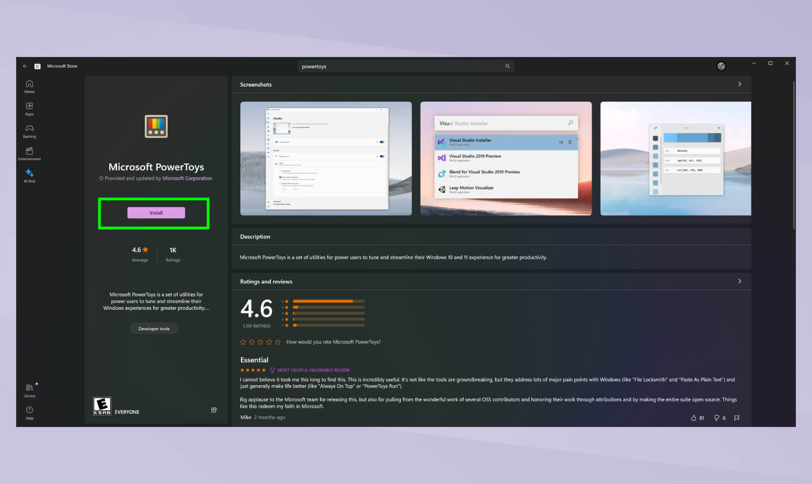

بعد ذلك افتح الأداة وادخل إلى قسم Text Extractor لتفعيلها، ثم افتح الصورة أو صفحة الويب التي تريد استخراج النص منها، وفعّل أداة استخراج النصوص باستخدام الاختصار (Windows + Shift + T).

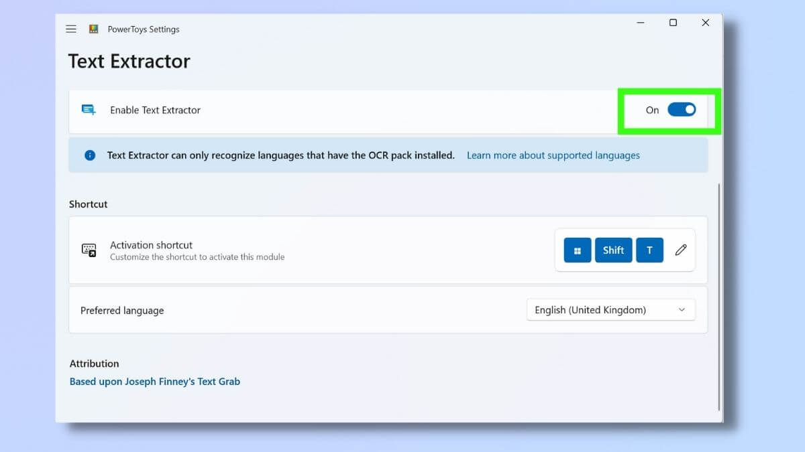

ستجد مجموعة من الاختيارات مثل لغة النص أو طريقة عرض النص المستخرج، عدلها كما تريد ثم حدد جزء الصورة الذي يحتوي على النص وسينسخ النص إلى الحافظة وتستطيع لصقه في أي مستند أو مكان تريد.

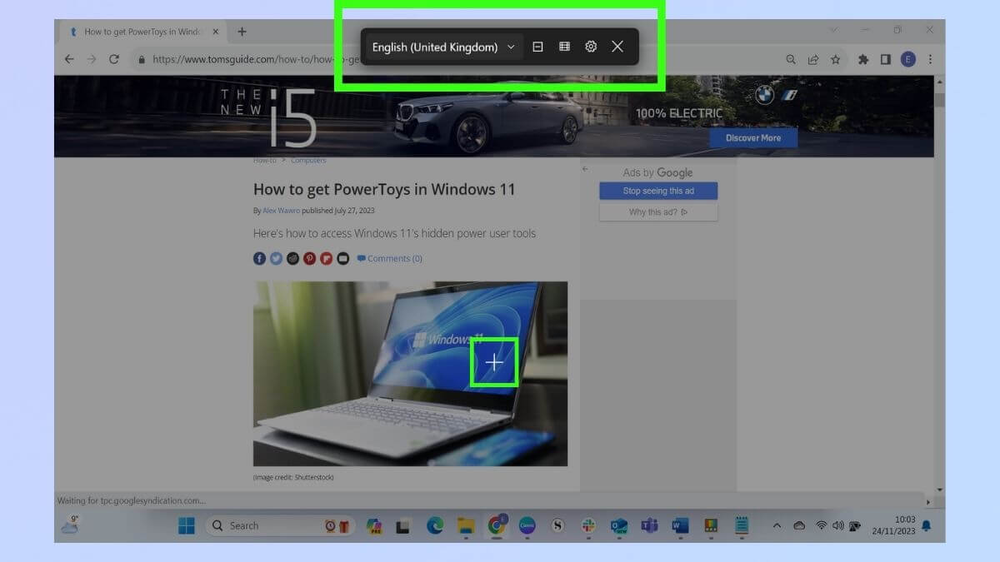

### أداة قص الصور

من الإضافات المميزة التي كانت مايكروسوفت تعمل على دمجها بنظام ويندوز وأضيفت في أواخر 2023 في تحديث 22403 مِيزة نسخ النص من الصور داخل أداة قص الصور Snipping Tool الإصدار 11.2308.33.0.

لاستخدام المِيزة الجديدة، افتح أداة قص الصور عبر قائمة البداية أو اختصار Win+Shift+S وخذ لقطة من الشاشة أو جزء منها ثم ستجد زر "إجراءات النص" في شريط أدوات بجانب أداة القطع، اضغط عليه لعرض النص القابل للتحديد، ثم حدد النص وانسخه باستخدام الفأرة. كما يمكنك تحديد النص ونسخه باستخدام زر "نسخ كل النص" الموجود في شريط الأدوات أو اختصارات لوحة المفاتيح مثل Ctrl+A وCtrl+C.

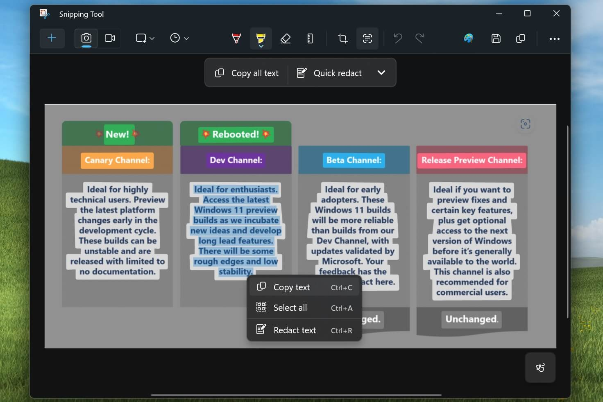

### برنامَج OneNote من مايكروسوفت

يمكن كذلك في نظام ويندوز استخدام برنامَج OneNote لاستخراج النصوص الموجودة داخل الصور أو مستند، وذلك عبر الضغط بزر الفأرة الأيمن على الصورة داخل OneNote واختيار النسخ النص من الصورة (Copy Text from Picture) وإذا لم تظهر لك هذه القائمة فذلك لأن OneNote لا يزال يعالج الصورة، حينها انتظر قليلًا وحاول مرة أخرى، وقد تستغرق العملية بين 24-48 ساعة حسب مايكروسوفت حتى يصبح النص قابل للنسخ.

أما لاستخراج النص من صور مستند مُطبوع متعدد الصفحات: اضغط بزر الفأرة الأيمن على أي صورة في المستند ثم اختر إما نسخ النص من هذه الصفحة (Copy Text from this Page of the Printout) لاستخراج النص من الصفحة المحددة فقط، أو نسخ النص من جميع الصفحات (Copy Text from All the Pages of the Printout) لاستخراج النص من جميع الصور في المستند.

## لينكس

بالنسبة لمستخدمي لينكس فلا يوجد طريقة مدمجة بالنظام لاستخراج النصوص وذلك لطبيعة التنوع في لينكس حيث لا يوجد نظام واحد، لكن يمكن استخدام برامج خارجية مثل [dpScreenOCR](https://danpla.github.io/dpscreenocr/) أو [NormCap](https://dynobo.github.io/normcap/)، وكلامها مجاني ومفتوح المصدر، ويعمل دون إنترنت عبر محرك Tesseract من تطوير جوجل، الذي يدعم أكثر من 100 لغة ضمنها العربية.

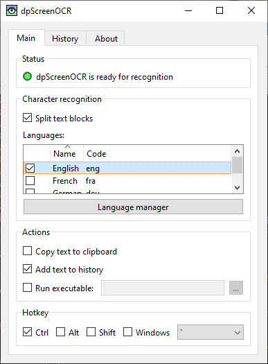

يتوفر dpScreenOCR لأنظمة لينكس وويندوز فقط، كما يدعم إصدارات ويندوز القديمة مثل ويندوز 7، في حين يتوفر NormCap لأنظمة ويندوز ولينكس وماك، كما يدعم أجهزة ماك التي تدعم بمعالجات M.

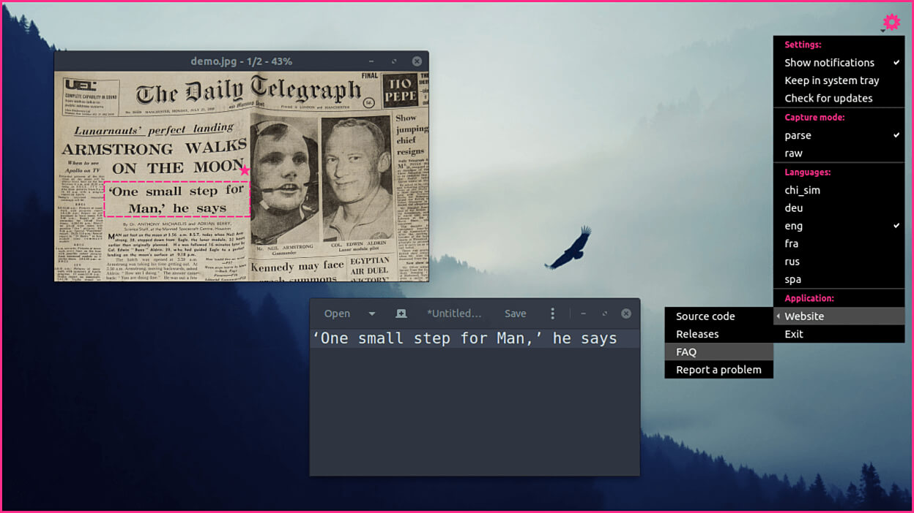

طريقة استخدام كلاهما سهلة للغاية، حيث تحتاج لتثبيت البرنامَج ثم فتحه وضبط اختصار التشغيل ثم استخدام الاختصار في أي وقت وتحديد الجزء الذي تريد من الشاشة وسينسخ النص إلى الحافظة.

وهناك برامج أخرى مثل [gImageReader](https://github.com/manisandro/gImageReader) الذي يمكنك من استخراج النصوص من مستندات PDF، و [OCRmyPDF](https://github.com/ocrmypdf/OCRmyPDF) الذي يتيح تعديل أي مِلَفّ PDF وإضافة طبقة نصوص فوقه ليصبح النص داخله قابل للنسخ.

## ماك

يحتوى نظام ماك على مِيزة التعرف على النصوص داخل المستندات وذلك في تطبيقي المعاينة والمستندات، فيمكنك فتح أي مستند وفي حال تعرف النظام على النصوص الموجودة فيه ستستطيع النسخ واللصق منها دون تعقيد.

كما يمكن لمستخدمي أجهزة ماك الاعتماد على برنامَج NormCap كذلك أو Raycast مع إضافة [EasyOCR](https://www.raycast.com/Rafo94/easy-ocr) التي تستخدم محرك Tesseract أو Google Cloud Vision لاستخراج النصوص من الصور.

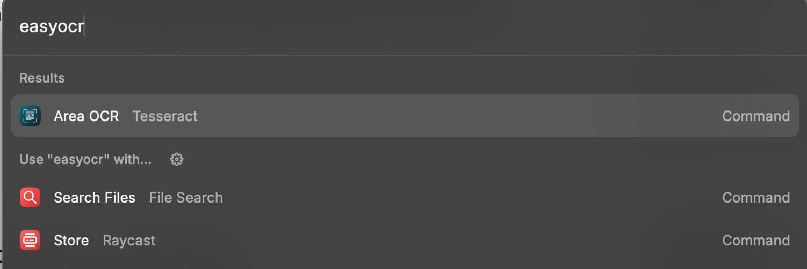

## خِدْمَات الويب

هناك العديد من الخِدْمَات المتوفرة على الويب لتحويل الصور إلى نصوص، ما بين خِدْمَات مجانية وأخرى ومدفوعة تتفاوت في الجودة والسرعة وسهولة الاستخدام. وفي العموم لا ننصح باستخدام أي من خِدْمَات الويب في تحويل المستندات والصور الخاصة أو البيانات الحساسة.

### مستندات جوجل Google Docs

أحد أفضل الطرق لاستخراج النصوص من الصور عبر الويب هي خِدْمَات جوجل Drive والمستندات، حيث توفر أعلى جودة تحويل في كل الطرق المذكورة، وتستطيع من خلالها تحويل المستندات كذلك.

تحتاج أولًا إلى رفع الصورة أو المِلَفّ إلى [سحابة جوجل Google Drive](https://drive.google.com/)، ثم اضغط على زر (My Drive)، ثم اختر رفع ملفات (Upload files) وارفع الصورة أو المِلَفّ الذي تريد استخراج النص منه.

بعد ذلك افتح المِلَفّ باستخدام [مستندات جوجل Google Docs](https://docs.google.com/document/) عبر الضغط بزر الفأرة الأيمن على المِلَفّ الذي رفعته واختيار فتح باستخدام > Google Docs.

انتظر قليلًا، وستظهر لك نسخة نصية من المِلَفّ في مستند جديد، افتح هذا المستند لتستطيع مراجعة النص المستخرج وتعديله حسب الحاجة.

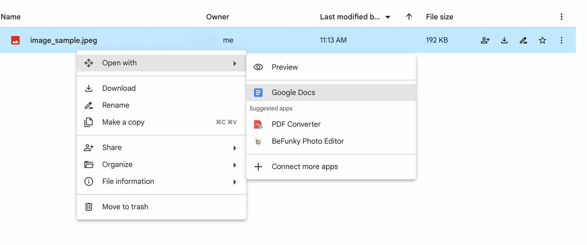

### GoOCR

يقدم موقع [GoOCR](https://goocr.blogspot.com/) طريقة سهلة لاستخراج النصوص بالاعتماد على خدمة جوجل Drive. وما يميز هذا الموقع أنه مجاني وسهل الاستخدام مقارنة بواجهة مستندات جوجل، كما يتيح لك إمكانية اختيار لغة المستند عبر الخيارات المتقدمة.

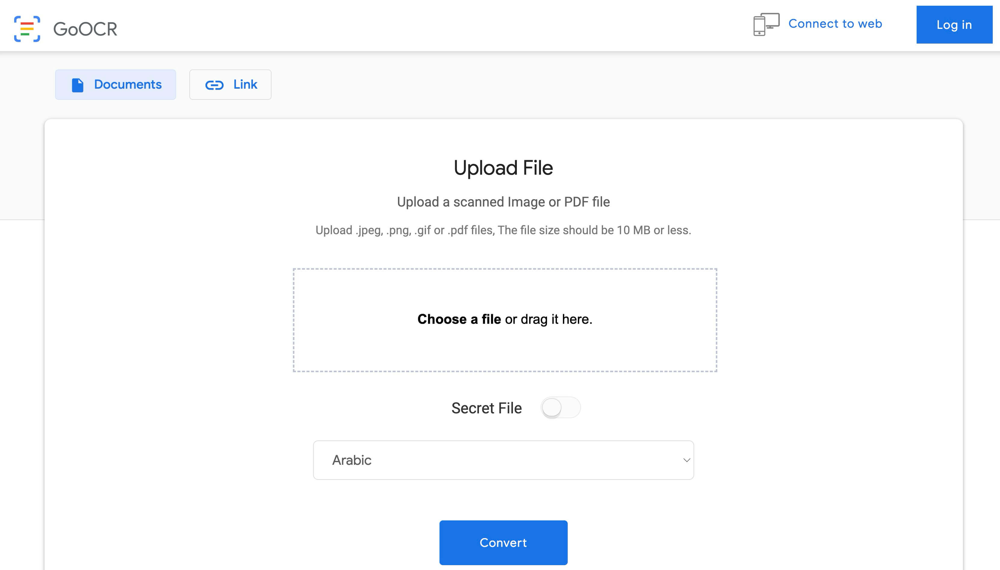

### ocr.space

يعد موقع [ocr.space](https://ocr.space/) أحد أقدم مواقع استخراج النصوص من الصور على الإنترنت ويتميز بدعم أنماط معقدة من المستندات والصور مثل الجداول، والتعامل مع الصور المقلوبة، وإمكانية الاختيار من عدة محركات تعرف على الحروف ذات جودات مختلفة، وإنشاء مستند PDF قابل للبحث، مع دعم مجموعة كبيرة من اللغات.

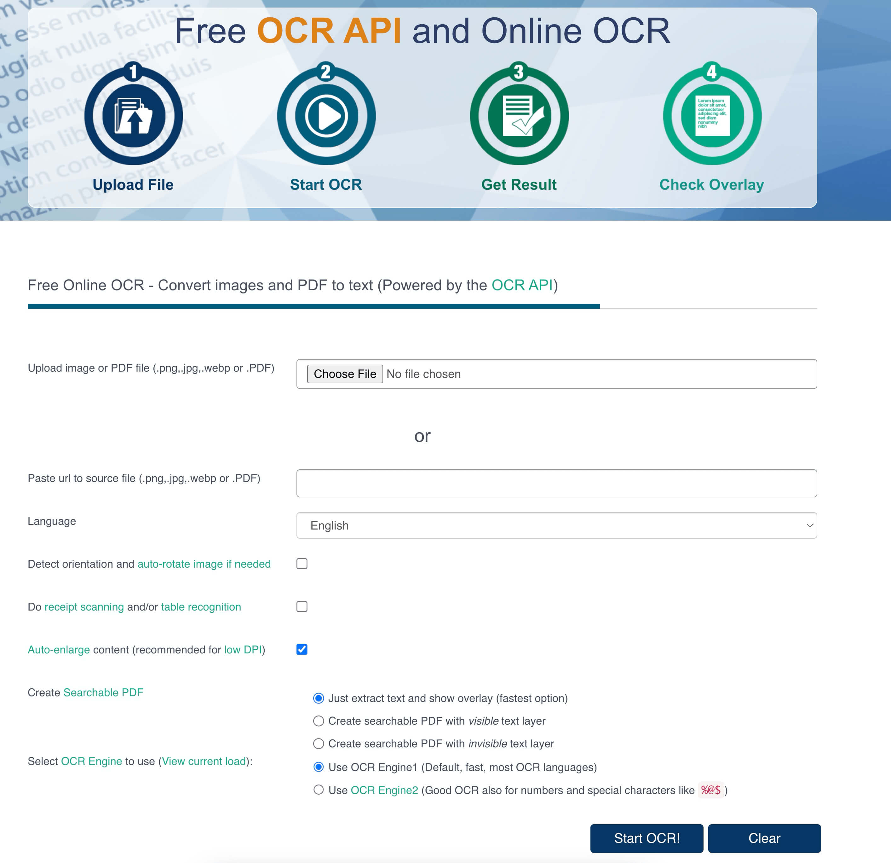

---

هذا الموضوع نُشر باﻷصل في مجلة لغة العصر العدد 347 شهر 04-2024 ويمكن الاطّلاع عليه [هنا](https://drive.google.com/file/d/1mL4JHpYVT0gQ9rdduG3Y6r5muoF9hDA2/view?usp=drive_link).

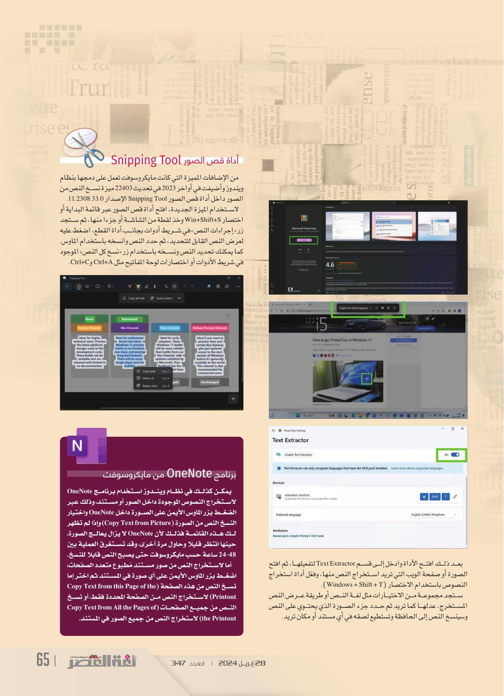

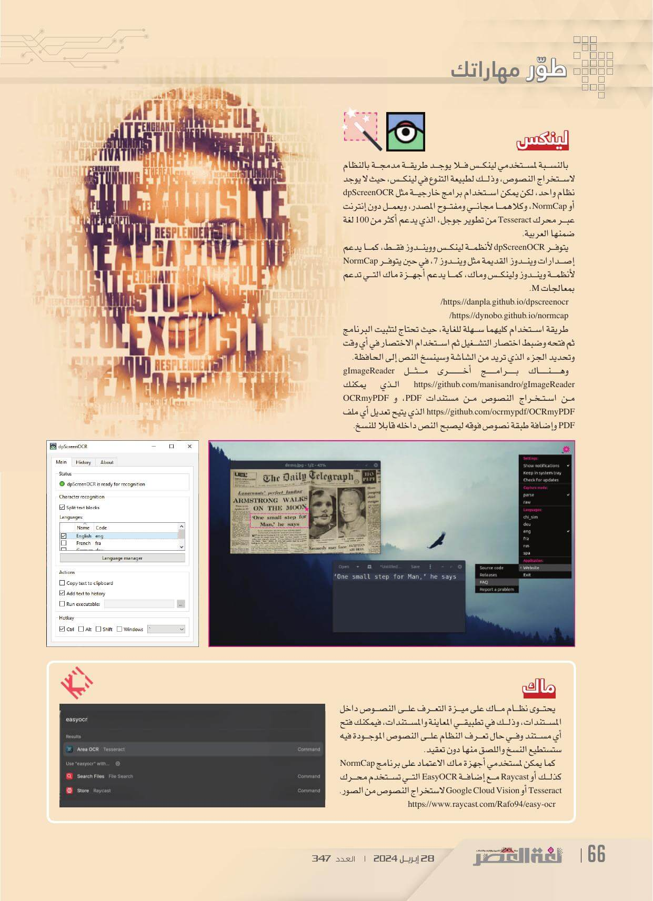

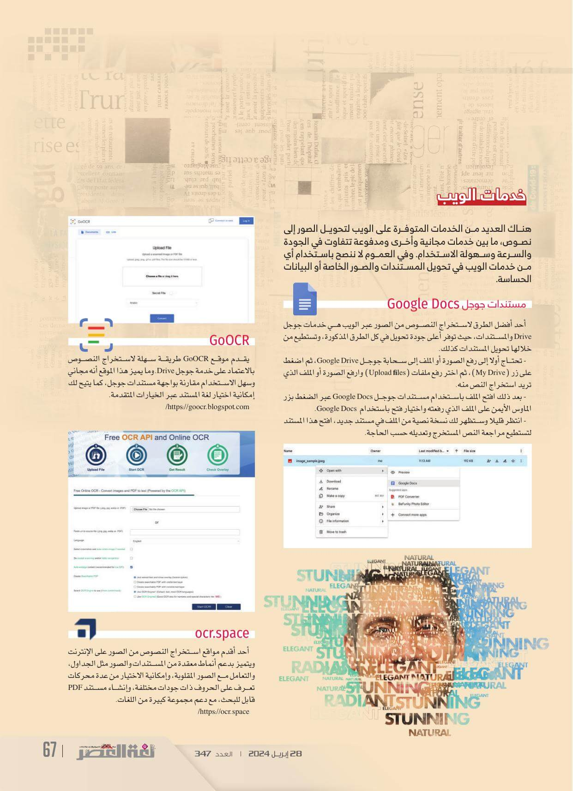
