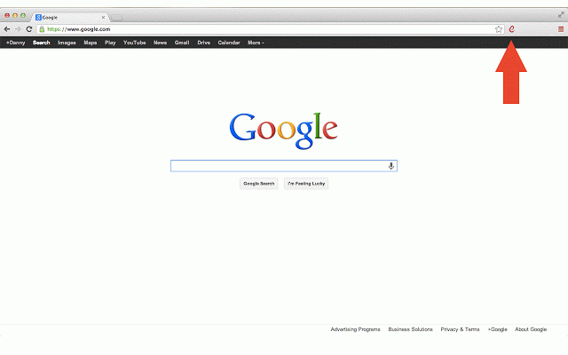

+++
title = "طريقة تصفح أي موقع لا يعمل"
date = "2015-05-31"
description = "قد تحتاج في بعض الأحيان إلى الدخول إلى موقع ما ثم تجده مغلقا أو خارجا عن الخدمة، ولكن بفضل خدمات أرشفة الانترنت يمكنك تصفح أي موقع، اليك عزيزي القارئ الطريقة."
categories = ["مهارات رقمية",]
tags = ["موقع لغة العصر"]

+++

قد تحتاج في بعض الأحيان إلى الدخول إلى موقع ما ثم تجده مغلقا أو خارجا عن الخدمة، ولكن بفضل خدمات أرشفة الانترنت يمكنك تصفح أي موقع، اليك عزيزي القارئ الطريقة.

**الطريقة الأولى:**

عندما تجد ان رابط موقع لا يعمل، قم بإضافة هذه العبارة cache: قبل الرابط على هذا الشكل:

cache:http://www.aitmag.ahram.org.eg

وستلاحظ ان الصفحة تظهر حتى وإن كان الموقع لا يعمل.

**الطريقة الثانية:**

باستخدام موقع [cachedpages](http://www.cachedpages.com/):

قم بالدخول الى الموقع ستجد أمامك مربع لكتابة العنوان، قم بكتابة عنوان الصفحة التي لا تعمل، ثم اضغط على زر Google Cache أو Archive.org.

سيقوم الموقع بنقلك الى الصفحة التي لا تعمل.

**الطريقة الثالثة:**
عن طريق إضافة [Web Cache](https://chrome.google.com/webstore/detail/webcache/cmmlgikpahieigpcclckfmhnchdlfnjd) لمتصفح جوجل كروم:

تقوم هذه الإضافة بالبحث في خدمات Google Cache, Wayback Machine, Coral CDN, cache حتى تجد الصفحة المطلوبة.

بعد تثبيت الإضافة قم بالضغط على الزر الخاص بها ليتم نقلك الى الصفحة المطلوبة.

---

هذا الموضوع نٌشر باﻷصل على موقع مجلة لغة العصر.
