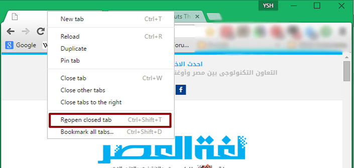
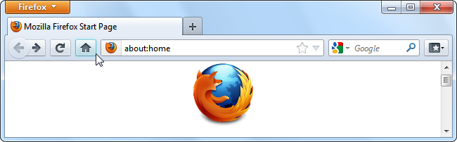
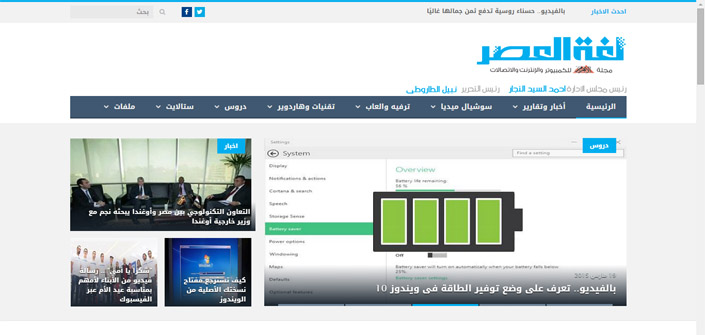
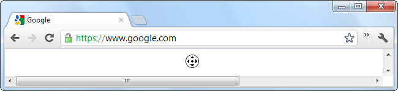
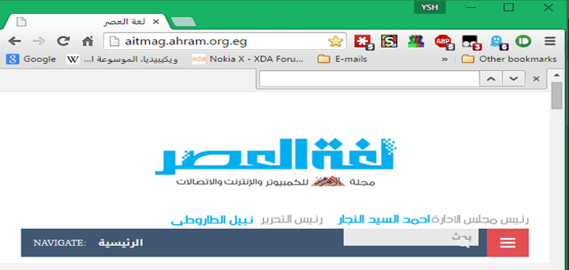
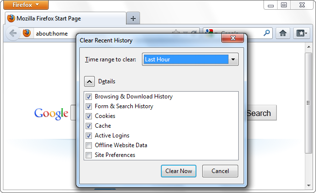

+++
title = "اختصارات لوحة المفاتيح التي تعمل مع جميع المتصفحات"
date = "2015-03-24"
description = "لدى كل متصفح عدد ضخم من اختصارات لوحة المفاتيح الشائعة، ولكن بالطبع تختلف من متصفح لآخر فإذا كنت تستخدم جوجل كروم سيختلف عن فايرفوكس أو انترنت اكسبلورر، في هذا الموضوع نقدم لك كل اختصارات لوحة المفاتيح التي تعمل مع جميع المتصفحات"
categories = ["مهارات رقمية",]
tags = ["موقع لغة العصر"]
+++

لدى كل متصفح عدد ضخم من اختصارات لوحة المفاتيح الشائعة، ولكن بالطبع تختلف من متصفح لآخر فإذا كنت تستخدم جوجل كروم سيختلف عن فايرفوكس أو انترنت اكسبلورر، في هذا الموضوع نقدم لك كل اختصارات لوحة المفاتيح التي تعمل مع جميع المتصفحات.

## **أولا: اختصارات التبويبات**

**Ctrl+1-8** التبديل بين التبويبات المفتوحة، العد يكون من اليسار لليمين.

**Ctrl+9** الانتقال الى التبويب الأخير.

**Ctrl+Tab** الانتقال الى التبويب التالي.

**Ctrl+Shift+Tab** الانتقال الى التبويب السابق، (يمكن استخدام **Ctrl+Page Down** **ولكن لا تعمل مع انترنت اكسبلورر**).

**Ctrl+W**, **Ctrl+F4** اغلاق التبويب الحالي.

**Ctrl+Shift+T** إعادة فتح آخر تبويب مفتوح.

**Ctrl+T** فتح تبويب جديد.

**Ctrl+N** فتح نافذة تصفح جديدة.

**Alt+F4** إغلاق المتصفح.

## ثانيا: اختصارات التنقل

**Alt+Left Arrow, Backspace** الرجوع للخلف.

**Alt+Right Arrow, Shift+Backspace** الانتقال الى الأمام.

**F5** إعادة تحميل الصفحة الحالية.

**Ctrl+F5** إعادة تحميل الصفحة الحالية مع تخطى ملفات الكاش (الملفات المؤقتة).
**Escape** إيقاف.

**Alt+Home** فتح الصفحة الرئيسية.

## ثالثا: اختصارات التكبير والتصغير

**Ctrl** + **+** أو **Ctrl** + **عجلة الماوس لأعلى**- التكبير

**-** أو **Ctrl** + **عجلة الماوس لأسفل-**التصغير.

**Ctrl+0** ارجاع الشاشة للحجم الطبيعي.

**F11** وضعية الشاشة الكاملة.

## **رابعا: اختصارات التحرك داخل الصفحات** Scrolling

**Space**, **Page Down** النزول لأسفل مقطع كامل.

**Shift+Space, Page Up** الصعود لأعلى مقطع كامل.

**Home** الانتقال لأعلى الصفحة.

**End** الانتقال لأخر الصفحة.

**Middle Click** التحرك باستخدام الماوس (في نظام الويندوز فقط).

## خامسا: اختصارات شريط العنوان

**Ctrl+L**, **Alt+D**, **F6** الانتقال الى شريط العنوان.

**Ctrl+Enter** بعد كتابة اسم الموقع يضيف هذا الاختصار www. و .com

**Alt+Enter** فتح الموقع المكتوب في تبويب جديد.

## سادسا: اختصارات البحث

**Ctrl+K**, **Ctrl+E** الانتقال الى شريط البحث (الاختصار الثاني لا يعمل في انترنت اكسبلورر).

**Ctrl+F**, **F3** **البحث داخل الصفحة المفتوحة.**
**Ctrl+G**, **F3** الانتقال الى نتيجة البحث التالية (في البحث داخل الصفحة).

**Ctrl+Shift+G**, **Shift+F3** الانتقال الى نتيجة البحث السابقة (في البحث داخل الصفحة).

## سابعا: اختصارات السجل والمفضلات

**Ctrl+H** فتح السجل.

**Ctrl+J** فتح سجل التحميلات.

**Ctrl+D** إضافة الموقع الحالي للمفضلات.

**Ctrl+Shift+Del** فتح نافذة محو بيانات التصفح,

## ثامنا: اختصارات أخرى

**Ctrl+P** طباعة الصفحة الحالية.

**Ctrl+S** حفظ الصفحة الحالية الى الجهاز.

**Ctrl+U** عرض مصدر الصفحة (لا تعمل في انترنت اكسبلورر).

**F12** فتح أدوات المطور (تتطلب إضافة Firebug في الفايرفوكس).

---
هذا الموضوع نٌشر باﻷصل على موقع مجلة لغة العصر.

http://aitmag.ahram.org.eg/News/7918.aspx