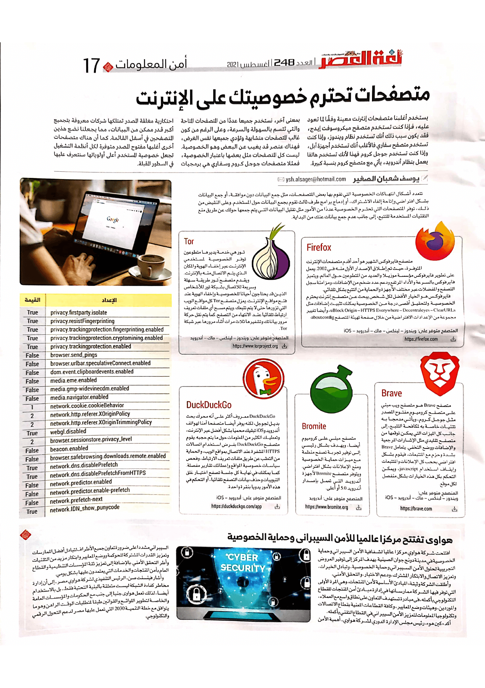

+++
title = "متصفحات تحترم خصوصيتك على اﻹنترنت"
date = "2021-08-01"
description = "يستخدم أغلبنا متصفحات إنترنت معينة وفقًا لما تعود عليه، فإذا كنت تستخدم متصفح مايكروسوفت إيدج فقد يكون سبب ذلك أنك تستخدم نظام ويندوز، وإذا كنت تستخدم متصفح سفاري فالأغلب أنك مستخدم لأجهزة أبل، وإذا كنت تستخدم جوجل كروم فهذا لأنك تستخدم هاتف يعمل بنظام أندرويد يأتي مع متصفح كروم بنسبة كبيرة. وبمعنى آخر، يستخدم جميعا عددًا من المتصفحات المتاحة والتي تتسم بالسهولة والسرعة، وعلى الرغم من كون غالب المتصفحات متشابهة وتؤدي جميعها نفس الغرض فهناك عنصر قد يغيب عن البعض وهو الخصوصية. ليست كل المتصفحات مثل بعضها باعتبار الخصوصية، فمثلا متصفحات جوجل كروم وسفاري هي برمجيات احتكارية مغلقة المصدر تمتلكها شركات معروفة بتجميع أكبر قدر ممكن من البيانات، مما يجعلنا نضع هذان المتصفحان في أسفل القائمة. كما أن هناك متصفحات أخرى أغلبها مفتوح المصدر متوفرة لكل أنظمة التشغيل تجعل خصوصية المستخدم أعلى أولوياتها سنتعرف عليها في السطور القادمة."
categories = ["الخصوصية",]
tags = ["مجلة لغة العصر"]

+++
يستخدم أغلبنا متصفحات إنترنت معينة وفقًا لما تعود عليه، فإذا كنت تستخدم متصفح مايكروسوفت إيدج فقد يكون سبب ذلك أنك تستخدم نظام ويندوز، وإذا كنت تستخدم متصفح سفاري فالأغلب أنك مستخدم لأجهزة أبل، وإذا كنت تستخدم جوجل كروم فهذا لأنك تستخدم هاتف يعمل بنظام أندرويد يأتي مع متصفح كروم بنسبة كبيرة. وبمعنى آخر، يستخدم جميعا عددًا من المتصفحات المتاحة والتي تتسم بالسهولة والسرعة، وعلى الرغم من كون غالب المتصفحات متشابهة وتؤدي جميعها نفس الغرض فهناك عنصر قد يغيب عن البعض وهو الخصوصية. ليست كل المتصفحات مثل بعضها باعتبار الخصوصية، فمثلا متصفحات جوجل كروم وسفاري هي برمجيات احتكارية مغلقة المصدر تمتلكها شركات معروفة بتجميع أكبر قدر ممكن من البيانات، مما يجعلنا نضع هذان المتصفحان في أسفل القائمة. كما أن هناك متصفحات أخرى أغلبها مفتوح المصدر متوفرة لكل أنظمة التشغيل تجعل خصوصية المستخدم أعلى أولوياتها سنتعرف عليها في السطور القادمة.

تتعد أشكال انتهاكات الخصوصية التي تقوم بها بعض المتصفحات، مثل جمع البيانات دون موافقة، أو جمع البيانات بشكل افتراضي وإتاحة إلغاء الاشتراك، أو إدماج برامج طرف ثالث تقوم بجمع البيانات حول المستخدم. وعلى النقيض من ذلك، توفر المتصفحات التي تحترم الخصوصية عددًا من الأمور مثل تقليل البيانات التي يتم جمعها حولك عن طريق منع التقنيات المستخدمة للتتبع، إلى جانب عدم جمع بيانات عنك من البداية.

## Firefox

متصفح فايرفوكس الشهير هو أحد أقدم متصفحات الإنترنت المتوفرة، حيث تم إطلاق الإصدار الأول منه في 2002. يعمل على تطوير فايرفوكس مؤسسة موزيلا والعديد من المتطوعين حول العالم. ويتميز فايرفوكس بالسرعة والأداء المرتفع ودعم عدد ضخم من الإضافات، ومزامنة سجل التصفح والمفضلات عبر مختلف الأجهزة والحماية من التتبع بشكل تلقائي.

فايرفوكس هو الخيار الأفضل لكل شخص يبحث عن متصفح انترنت يحترم الخصوصية. ولتحقيق أقصى درجة من الخصوصية يمكنك تثبيت إضافات مثل uBlock Origin – HTTPS Everywhere – Decentraleyes – ClearURLs، وأيضا تغيير مجموعة من الإعدادات الافتراضية من خلال صفحة تهيئة المتصفح about:config:

| **الإعداد** | **القيمة** |
| :-----------------------------------------------: | :--------: |
| privacy.firstparty.isolate | true |
| privacy.resistFingerprinting | true |
| privacy.trackingprotection.fingerprinting.enabled | true |
| privacy.trackingprotection.cryptomining.enabled | true |
| privacy.trackingprotection.enabled | true |
| browser.send_pings | false |
| browser.urlbar.speculativeConnect.enabled | false |
| dom.event.clipboardevents.enabled | false |
| media.eme.enabled | false |
| media.gmp-widevinecdm.enabled | false |
| media.navigator.enabled | false |
| network.cookie.cookieBehavior | 1 |
| network.http.referer.XOriginPolicy | 2 |
| network.http.referer.XOriginTrimmingPolicy | 2 |
| webgl.disabled | true |
| browser.sessionstore.privacy_level | 2 |
| beacon.enabled | false |
| browser.safebrowsing.downloads.remote.enabled | false |
| network.dns.disablePrefetch | true |
| network.dns.disablePrefetchFromHTTPS | true |
| network.predictor.enabled | false |
| network.predictor.enable-prefetch | false |
| network.prefetch-next | false |
| network.IDN_show_punycode | true |

المتصفح متوفر على: ويندوز – لينكس – ماك – أندرويد – iOS.

https://firefox.com

## متصفح Tor

تور هي خدمة يديرها متطوعون توفر الخصوصية لمستخدمي الإنترنت عبر إخفاء الهوية والمكان الذي يتم الاتصال منه بالإنترنت. ويقدم متصفح تور طريقة سهلة وسريعة للاتصال بشبكة تور للأشخاص الذين قد يحتاجون أحياناً للخصوصية وإخفاء الهوية عند فتح مواقع الإنترنت.

يعزل متصفح Tor كل مواقع الويب التي تزورها حتى لا يتم تتبعك. ويتم مسح أي ملفات تعريف ارتباط تلقائيا عند الانتهاء من التصفح. كما يتم نقل حركة مرور بياناتك وتشفيرها ثلاث مرات أثناء مرورها عبر شبكة Tor.
المتصفح متوفر على: ويندوز – لينكس – ماك – أندرويد.

https://www.torproject.org

## Brave

متصفح Brave هو متصفح ويب مبني على متصفح كروميوم مفتوح المصدر مثل جوجل كروم، ويأتي مدمجًا به تقنيات خاصة به لمكافحة التتبع، إلى جانب كل الميزات التي يمكن توقعها من متصفح تقليدي مثل الإشارات المرجعية والإضافات ووضع التخفي.
يتعامل Brave بشدة وحزم مع المتتبعات، فيقوم بشكل افتراضي بحجب كل الإعلانات والمتتبعات وإيقاف استخدام javascript، ويمكن التحكم بكل هذه الخيارات بشكل منفصل لكل موقع.

المتصفح متوفر على: ويندوز – لينكس – ماك – أندرويد – iOS.

https://brave.com	

## Bromite

متصفح مبني على كروميوم أيضًا، ويهدف بشكل رئيسي إلى توفير تجربة تصفح منظمة مع ميزات حماية الخصوصية ومنع الإعلانات بشكل افتراضي. ويتوفر متصفح Bromite لأجهزة أندرويد التي تعمل بإصدار أندرويد 5.0 أو أعلى.

المتصفح متوفر على: أندرويد.

https://www.bromite.org

## DuckDuckGo

DuckDuckGo معروف أكثر على أنه محرك بحث بديل لجوجل، لكنه يوفر أيضًا متصفح آمن لهواتف أندرويد وiOS تبقيك محميًا بشكل أفضل عبر الإنترنت، وتعطيك الكثير من المعلومات حول ما يتم حجبه. يقوم متصفح DuckDuckGo بفرض استخدام اتصالات HTTPS المشفرة عند الاتصال بمواقع الويب، والحماية من التعقب عن طريق ملفات تعريف الارتباط، وفحص سياسات خصوصية المواقع وإعطاءك تقارير مفصلة. كما يمكنك في نهاية كل جلسة تصفح اختيار غلق التبويبات وحذف بيانات التصفح تلقائيا، أو التحكم في هذه الأمور يدويًا بنقرة واحدة.

المتصفح متوفر على: أندرويد – iOS.

https://duckduckgo.com/app

---

هذا الموضوع نُشر باﻷصل في مجلة لغة العصر العدد 248 شهر 08-2021 ويمكن الإطلاع عليه [هنا](https://drive.google.com/file/d/1AG4qLL_v4pSmkmJfCoh5ZSyP9zYyN96s/view?usp=sharing).

