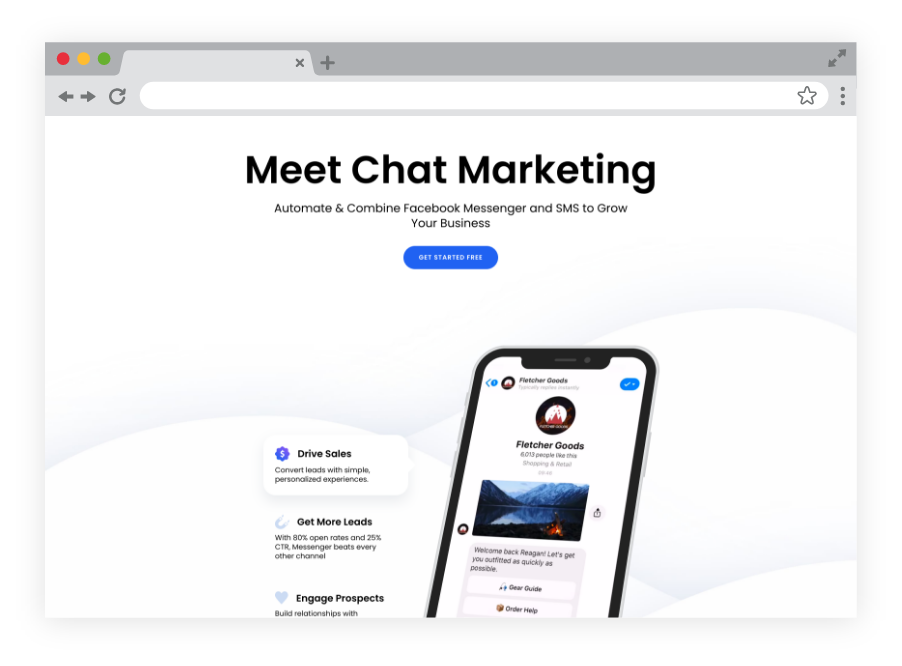
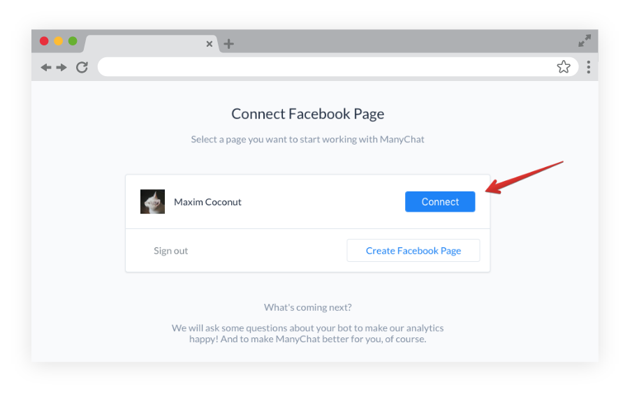
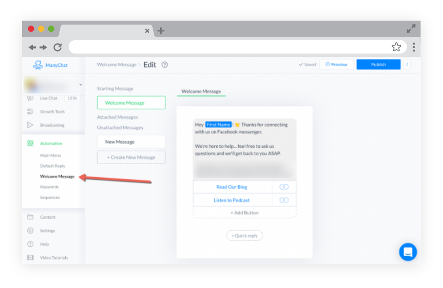
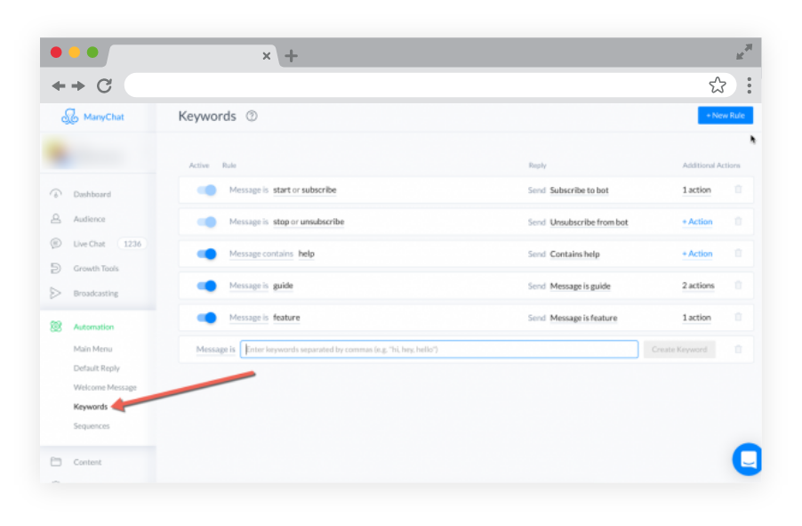
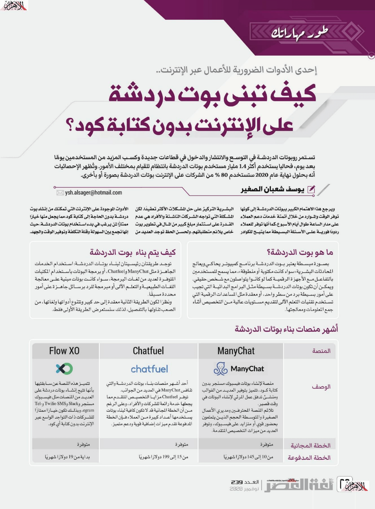
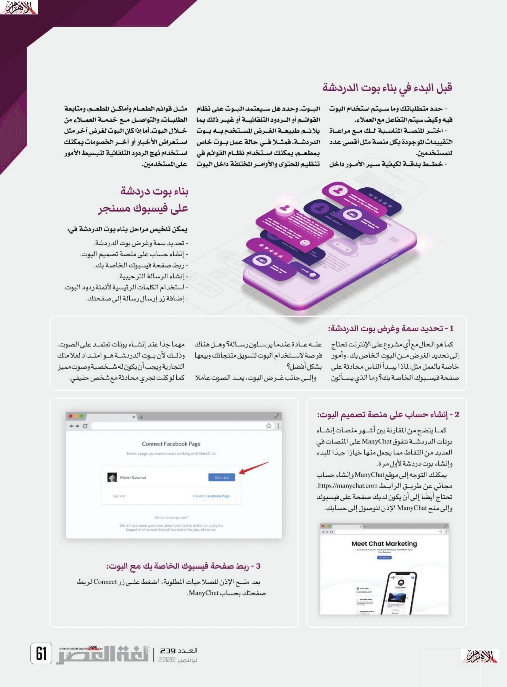
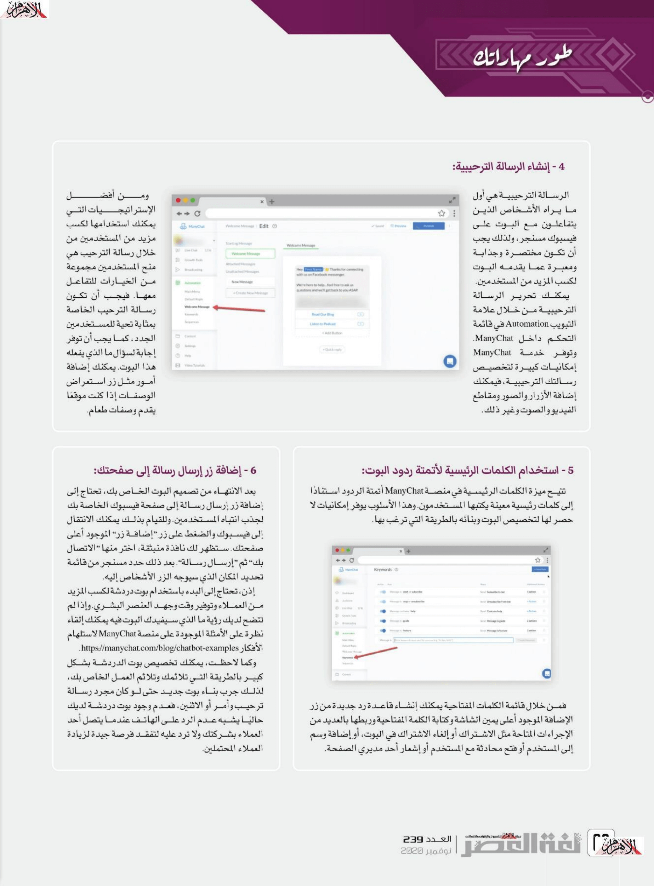

+++
title = "كيف تبني بوت دردشة على الإنترنت بدون كتابة كود؟"
date = "2020-11-01"
description = "تستمر روبوتات الدردشة في التوسع والانتشار والدخول في قطاعات جديدة وكسب المزيد من المستخدمين يومًا بعد يوم، فحاليا يستخدم أكثر 1.4 مليار مستخدم بوتات الدردشة بانتظام للقيام بمختلف الأمور. وتُظهر الإحصائيات أنه بحلول نهاية عام 2020 ستستخدم 80٪ من الشركات على الإنترنت بوتات الدردشة بصورة أو أخرى. ويرجع هذا الاهتمام الكبير ببوتات الدردشة إلى كونها توفر الوقت والموارد من خلال أتمتة خدمات دعم العملاء على مدار الساعة طوال أيام الأسبوع. كما أنها توفر للعملاء ردودًا فورية على الأسئلة البسيطة مما يتيح للكوادر البشرية التركيز على حل المشكلات الأكثر تعقيدًا. لكن المشكلة التي تواجهه الشركات الناشئة والأفراد هي عدم القدرة على استثمار مبلغ كبير من المال في تطوير بوت خاص يلائم متطلباتهم. ولحسن الحظ توجد العديد من الأدوات الموجودة على الإنترنت التي تمكنك من إنشاء بوت دردشة بدون الحاجة إلى كتابة كود مما يجعل منها خيارًا ممتازًا لمن يرغب في بدء استخدام بوتات الدردشة حيث إنها تجمع بين السهولة وقلة التكلفة وتوفير الوقت والجهد."
categories = ["مهارات رقمية",]
tags = ["مجلة لغة العصر"]
images = ["images/manychat-1.png"]

+++
تستمر روبوتات الدردشة في التوسع والانتشار والدخول في قطاعات جديدة وكسب المزيد من المستخدمين يومًا بعد يوم، فحاليا يستخدم أكثر 1.4 مليار مستخدم بوتات الدردشة بانتظام للقيام بمختلف الأمور. وتُظهر الإحصائيات أنه بحلول نهاية عام 2020 ستستخدم 80٪ من الشركات على الإنترنت بوتات الدردشة بصورة أو أخرى. ويرجع هذا الاهتمام الكبير ببوتات الدردشة إلى كونها توفر الوقت والموارد من خلال أتمتة خدمات دعم العملاء على مدار الساعة طوال أيام الأسبوع. كما أنها توفر للعملاء ردودًا فورية على الأسئلة البسيطة مما يتيح للكوادر البشرية التركيز على حل المشكلات الأكثر تعقيدًا. لكن المشكلة التي تواجهه الشركات الناشئة والأفراد هي عدم القدرة على استثمار مبلغ كبير من المال في تطوير بوت خاص يلائم متطلباتهم. ولحسن الحظ توجد العديد من الأدوات الموجودة على الإنترنت التي تمكنك من إنشاء بوت دردشة بدون الحاجة إلى كتابة كود مما يجعل منها خيارًا ممتازًا لمن يرغب في بدء استخدام بوتات الدردشة حيث إنها تجمع بين السهولة وقلة التكلفة وتوفير الوقت والجهد. 

## ما هو بوت الدردشة؟

بصورة مبسطة يعتبر بوت الدردشة برنامج كمبيوتر يحاكي ويعالج المحادثات البشرية (سواء كانت مكتوبة أو منطوقة)، مما يسمح للمستخدمين بالتفاعل مع الأجهزة الرقمية كما لو كانوا يتواصلون مع شخص حقيقي. ويمكن أن تكون بوتات الدردشة بسيطة مثل البرامج البدائية التي تجيب على أمور بسيطة برد من سطر واحد، أو معقدة مثل المساعدات الرقمية التي تستخدم تقنيات التعلم الألى لتقديم مستويات عالية من التخصيص أثناء جمع المعلومات ومعالجتها.

## كيف يتم بناء بوت الدردشة؟

توجد طريقتان رئيسيتان لبناء بوتات الدردشة: استخدام الخدمات الجاهزة مثل ManyChat وChatfuel، أو برمجة البوتات باستخدام المكتبات المتوفرة لعديد من لغات البرمجة، سواء كانت بوتات مبنية على معالجة اللغات الطبيعية والتعلم الألى أو مبرمجة للرد برسائل جاهزة على أمور محددة مسبقًا.

ونظرًا لكون الطريقة الثانية معقدة إلى حد كبير وتنوع أدواتها ولغاتها، من الصعب تناولها بالتفصيل، لذلك سنستعرض الطريقة الأولى فقط.

## أشهر منصات بناء بوتات الدردشة

| المنصة | ManyChat | Chatfuel | Flow XO |
| :--------------------: | :----------------------------------------------------------: | :----------------------------------------------------------: | :----------------------------------------------------------: |
|  |  |  |  |
| **الوصف** | منصة لإنشاء بوتات فيسبوك ماسنجر بدون كتابة كود، تتميز بتوفير العديد من القوالب ومنشئ تدفق عمل المرئي لإنشاء البوتات في وقت قصير. تلائم المنصة المحترفين ومديري الأعمال الصغيرة والمتوسطة الحجم الذين يتمتعون بحضور قوي أو متزايد على فيسبوك، وتوفر العديد من ميزات التخصيص المتقدمة. | أحد أشهر منصات بناء بوتات الدردشة والتي تنافس ManyChat في العديد من الجوانب. توفر Chatfuel مزايا التخصيص المتقدم مما يجعلها خدمة رائعًة للشركات والأفراد، وعلى الرغم من أن الخطة المجانية قد لا تكون كافية لبناء بوتات يستخدمها أعداد كبيرة من العملاء فإن الخطة المدفوعة تقدم ميزات إضافية قوية ودعم متميز. | تتميز هذه المنصة عن سابقتيها بأنها تتيح إنشاء بوتات دردشة على العديد من المنصات مثل:  فيسبوك ماسنجر وSlack وTwilio SMS وTelegram، وبذلك تكون خيارًا ممتازًا للشركات ذات التواجد الواسع عبر الإنترنت بدون كتابة أي كود. |
| **الخطة المجانية** | متوفرة | متوفرة | متوفرة |
| **الخطة المدفوعة** | من 10 إلى 145 دولار شهريًا | من 15 إلى 199 دولار شهريًا | بداية من 19 دولار شهريًا |

##  قبل البدء في بناء بوت الدردشة

- حدد متطلباتك وما سيتم استخدام البوت فيه وكيف سيتم التفاعل مع العملاء.

- اختر المنصة المناسبة لك مع مراعاة التقييدات الموجودة بكل منصة مثل أقصى عدد للمستخدمين.

- خطط بدقة لكيفية سير الأمور داخل البوت. وحدد هل سيعتمد البوت على نظام القوائم أو الردود التلقائية أو غير ذلك بما يلائم طبيعة الغرض المستخدم به بوت الدردشة. فمثلا في حالة عمل بوت خاص بمطعم، يمكنك استخدام نظام القوائم في تنظيم المحتوى والأوامر المختلفة داخل البوت مثل قوائم الطعام وأماكن المطعم، ومتابعة الطلبات، والتواصل مع خدمة العملاء من خلال البوت. أما إذا كان البوت لغرض آخر مثل استعراض الأخبار أو آخر الخصومات يمكنك استخدام نهج الردود التلقائية لتبسيط الأمور على المستخدمين.

## بناء بوت دردشة على فيسبوك ماسنجر

يمكن تلخيص مراحل بناء بوت الدردشة في:

- تحديد سمة وغرض بوت الدردشة.
- إنشاء حساب على منصة تصميم البوت.
- ​	ربط صفحة الفيسبوك الخاصة بك.
- ​	إنشاء الرسالة الترحيبية.
- ​	استخدام الكلمات الرئيسية لأتمتة ردود البوت.
- ​	إضافة زر إرسال رسالة إلى صفحتك.

### 1- تحديد سمة وغرض بوت الدردشة

كما هو الحال مع أي مشروع على الإنترنت تحتاج إلى تحديد الغرض من البوت الخاص بك، وأمور خاصة بالعمل مثل: لماذا يبدأ الناس محادثة على صفحة فيس بوك الخاصة بك؟ وما الذي يسألون عنه عادة عندما يرسلون رسالة؟ وهل هناك فرصة لاستخدام البوت لتسويق منتجاتك وبيعها بشكل أفضل؟

وإلى جانب غرض البوت، يعد الصوت عامل مهم جدًا عند إنشاء بوتات تعتمد على الصوت، وذلك لأن بوت الدردشة هو امتداد لعلامتك التجارية ويجب أن يكون له شخصية وصوت مميز كما لو كنت تجري محادثة مع شخص حقيقي.

### 2- إنشاء حساب على منصة تصميم البوت

كما يتضح من المقارنة بين أشهر منصات إنشاء بوتات الدردشة تتفوق ManyChat على المنصات في العديد من النقاط مما يجعل منها خيارًا جيدًا للبدء وإنشاء بوت دردشة لأول مرة.

يمكنك التوجه إلى موقع ManyChat وإنشاء حساب مجاني عن طريق الرابط [https://manychat.com](https://manychat.com/). تحتاج أيضًا إلى أن يكون لديك صفحة على الفيس بوك وإلى منح ManyChat الإذن للوصول إلى حسابك.

### 3- ربط صفحة الفيسبوك الخاصة بك مع البوت

بعد منح الإذن للصلاحيات المطلوبة، اضغط على زر Connect لربط صفحتك بحساب ManyChat.

### 4- إنشاء الرسالة الترحيبية

الرسالة الترحيبية هي أول ما يراه الأشخاص الذين يتفاعلون مع البوت على فيس بوك ماسنجر، ولذلك يجب أن تكون مختصرة وجذابة ومعبرة عما يقدمه البوت لكسب المزيد من المستخدمين.

يمكنك تحرير الرسالة الترحيبية من خلال علامة التبويب Automation في قائمة التحكم داخل ManyChat. وتوفر خدمة ManyChat إمكانيات كبيرة لتخصيص رسالتك الترحيبية، فيمكنك إضافة الأزرار والصور ومقاطع الفيديو والصوت وغير ذلك.

ومن أفضل الإستراتيجيات التي يمكنك استخدامها لكسب مزيد من المستخدمين من خلال رسالة الترحيب هي منح المستخدمين مجموعة من الخيارات للتفاعل معها. فيجب أن تكون رسالة الترحيب الخاصة بمثابة تحية للمستخدمين الجدد، كما يجب أن توفر إجابة لسؤال ما الذي يفعله هذا البوت. يمكنك إضافة أمور مثل زر استعراض الوصفات إذا كنت موقع يقدم وصفات طعام.

### 5- استخدام الكلمات الرئيسية لأتمتة ردود البوت

تتيح ميزة الكلمات الرئيسية في منصة ManyChat أتمتة الردود استنادًا إلى كلمات رئيسية معينة يكتبها المستخدمون. وهذا الأسلوب يوفر إمكانيات لا حصر لها لتخصيص البوت وبناءه بالطريقة التي ترغب بها.

فمن خلال قائمة الكلمات المفتاحية يمكنك إنشاء قاعدة رد جديدة من زر الإضافة الموجود أعلى يمين الشاشة وكتابة الكلمة المفتاحية وربطها بالعديد من الإجراءات المتاحة مثل الاشتراك أو إلغاء الاشتراك في البوت، أو إضافة وسم إلى المستخدم أو فتح محادثة مع المستخدم أو إشعار أحد مدراء الصفحة.

### 6- إضافة زر إرسال رسالة إلى صفحتك

بعد الانتهاء من تصميم البوت الخاص بك، تحتاج إلى إضافة زر إرسال رسالة إلى صفحة الفيس بوك الخاصة بك لجذب انتباه المستخدمين. وللقيام بذلك يمكنك الانتقال إلى الفيس بوك والضغط على زر "إضافة زر" الموجود أعلى صفحتك. ستظهر لك نافذة منبثقة، اختر منها "الاتصال بك" ثم "إرسال رسالة". بعد ذلك حدد ماسنجر من قائمة تحديد المكان الذي سيوجه الزر الأشخاص إليه.

## خاتمة 

إذن، تحتاج إلى البدء باستخدام بوت دردشة لكسب المزيد من العملاء وتوفير وقت وجهد العنصر البشري. وإذا لم تتضح لديك رؤية ما الذي سيفيدك البوت فيه يمكنك إلقاء نظرة على الأمثلة الموجودة على منصة ManyChat لاستلهام الأفكار https://manychat.com/blog/chatbot-examples.

وكما لاحظت، يمكنك تخصيص بوت الدردشة بشكل كبير بالطريقة التي تلائمك وتلائم العمل الخاص بك. لذلك جرب بناء بوت جديد حتى لو كان مجرد رسالة ترحيب وأمر أو اثنين، فعدم وجود بوت دردشة لديك حاليًا يشبه عدم الرد على الهاتف عندما يتصل أحد العملاء بشركتك ولا ترد عليه لتفقد فرصة جيدة لزيادة العملاء المحتملين.

---

هذا الموضوع نُشر باﻷصل في مجلة لغة العصر العدد 239 شهر 11-2020 ويمكن الإطلاع عليه [هنا](https://drive.google.com/file/d/18pHyhwDTp22NEEDfoZrRyg-Ha3f18wog/view?usp=sharing).

