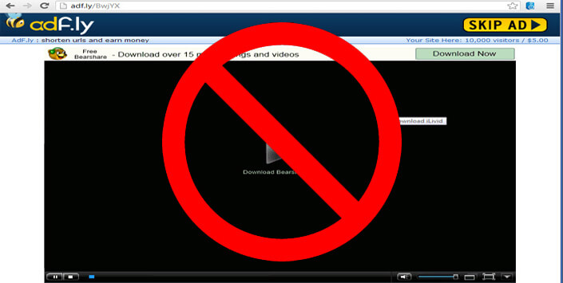
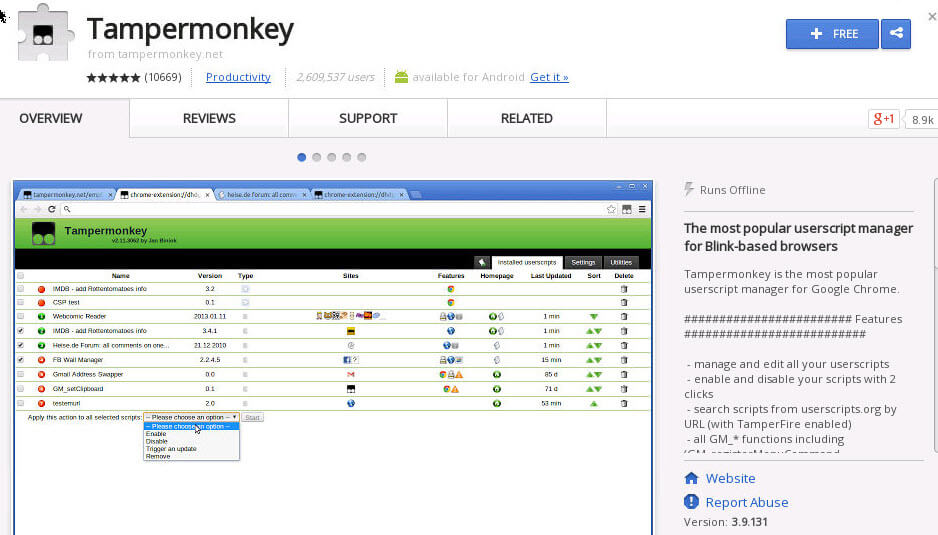
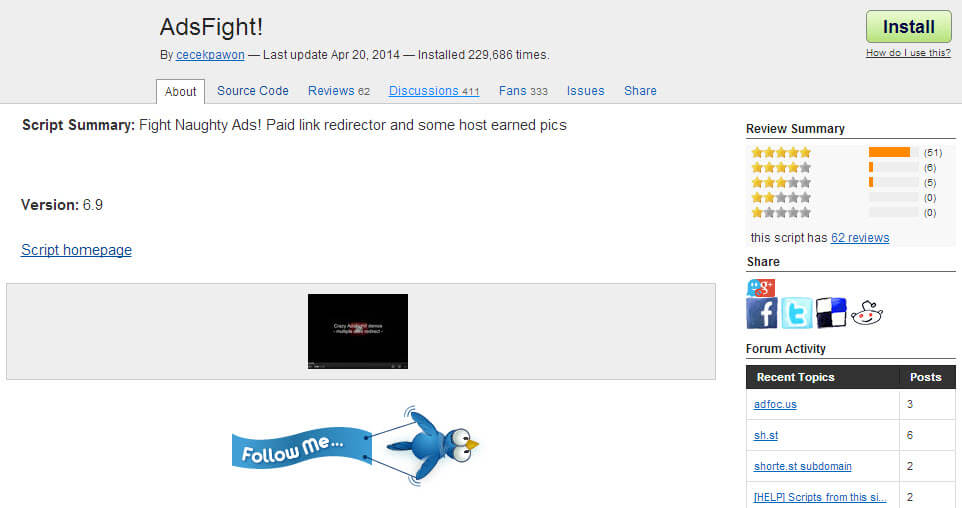
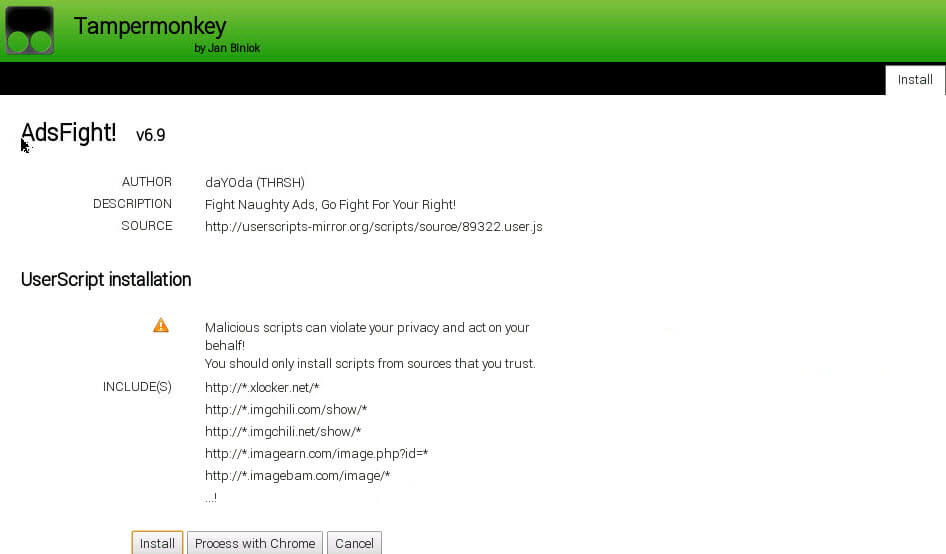
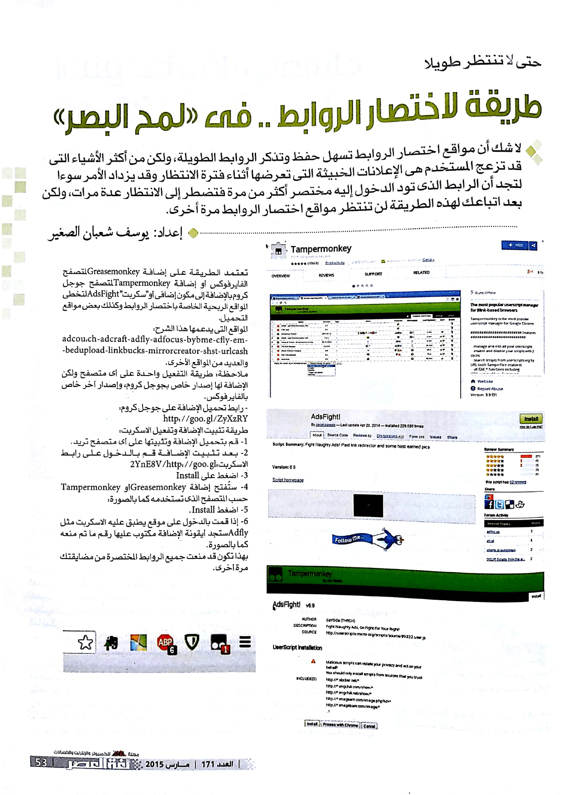

+++
title = "طريقة تخطى مواقع اختصار الروابط"
date = "2015-03-01"
description = "مما لا شك فيه أن مواقع اختصار الروابط من أكثر الأشياء التي تضايق مستخدم الإنترنت نظرا للإعلانات الخبيثة التي تعرضها أثناء فترة الانتظار وقد يزداد الأمر سوءا لتجد أن الرابط الذي تود الدخول إليه مختصر أكثر من مرة فتضطر إلى الانتظار مرات ومرات ولكن بعد تطبيقك لهذه الطريقة لن تنتظر مواقع اختصار الروابط مرة أخرى."
categories = ["مهارات رقمية",]
tags = ["مجلة لغة العصر"]
+++

مما لا شك فيه أن مواقع اختصار الروابط من أكثر الأشياء التي تضايق مستخدم الإنترنت نظرا للإعلانات الخبيثة التي تعرضها أثناء فترة الانتظار وقد يزداد الأمر سوءا لتجد أن الرابط الذي تود الدخول إليه مختصر أكثر من مرة فتضطر إلى الانتظار مرات ومرات ولكن بعد تطبيقك لهذه الطريقة لن تنتظر مواقع اختصار الروابط مرة أخرى.

تعتمد الطريقة على إضافة Greasemonkey لمتصفح فايرفوكس أو إضافة Tampermonkey لمتصفح جوجل كروم بالإضافة إلى مكون إضافي (سكربت) AdsFight لتخطى المواقع الربحية الخاصة باختصار الروابط وكذلك بعض مواقع التحميل.

المواقع التي يدعمها هذا الاسكربت:

adcou_ch-adcraft-adfly-adfocus-bybme-cfly-embedupload-linkbucks-mirrorcreator-shst-urlcash- والعديد من المواقع الأخرى.

ملاحظة: طريقة التفعيل واحدة على أي متصفح ولكن الإضافة لها إصدار خاص بجوجل كروم، وإصدار آخر خاص بالفيرفوكس.

- ​	رابط تحميل الإضافة على جوجل كروم: http://goo.gl/ZyXzRY
- ​	رابط تحميل الإضافة على فايرفوكس:

 طريقة تثبيت الإضافة وتفعيل الاسكربت:

1. ​	قم بتحميل الإضافة وتثبيتها على أي متصفح تريد.  

2. بعد تثبيت الإضافة قم بالدخول على رابط الاسكربت: http://goo.gl/2YnE8V

3. اضغط على Install.

   

4. ستُفتح إضافة Greasemonkey أو Tampermonkey حسب المتصفح الذي تستخدمه كما بالصورة:

   

5. اضغط Install.

6. إذا قمت بالدخول على موقع يطبق عليه الاسكربت مثل Adfly ستجد أيقونة الإضافة مكتوب عليها رقم ما تم منعه كما بالصورة.

   

بهذا تكون قد منعت جميع الروابط المختصرة من مضايقتك مرة أخرى.

---

هذا الموضوع نشر باﻷصل في مجلة لغة العصر العدد 171 شهر 03-2015 ويمكن الإطلاع عليه [هنا](https://drive.google.com/file/d/1gRouyrKNYC5Yetpry84oCnDCF4FyMsio/view?usp=sharing).

