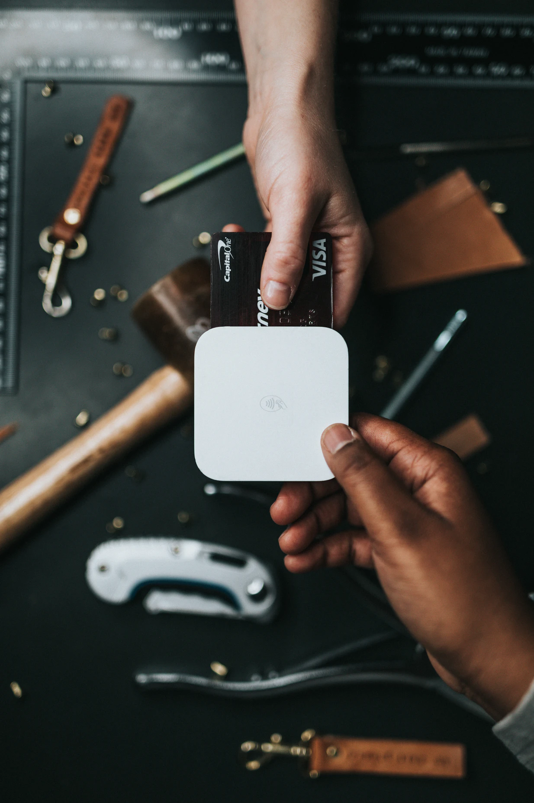
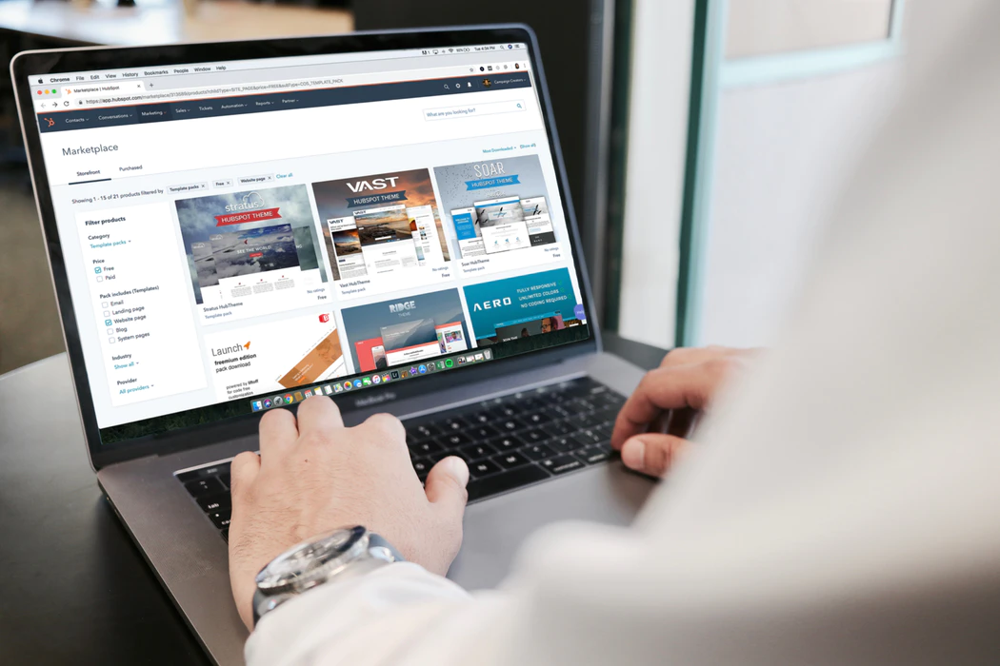
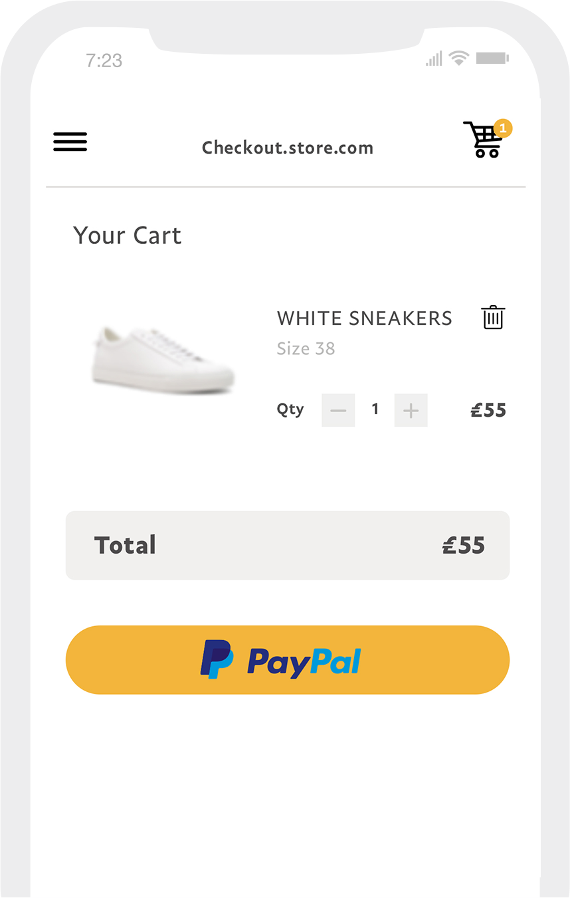
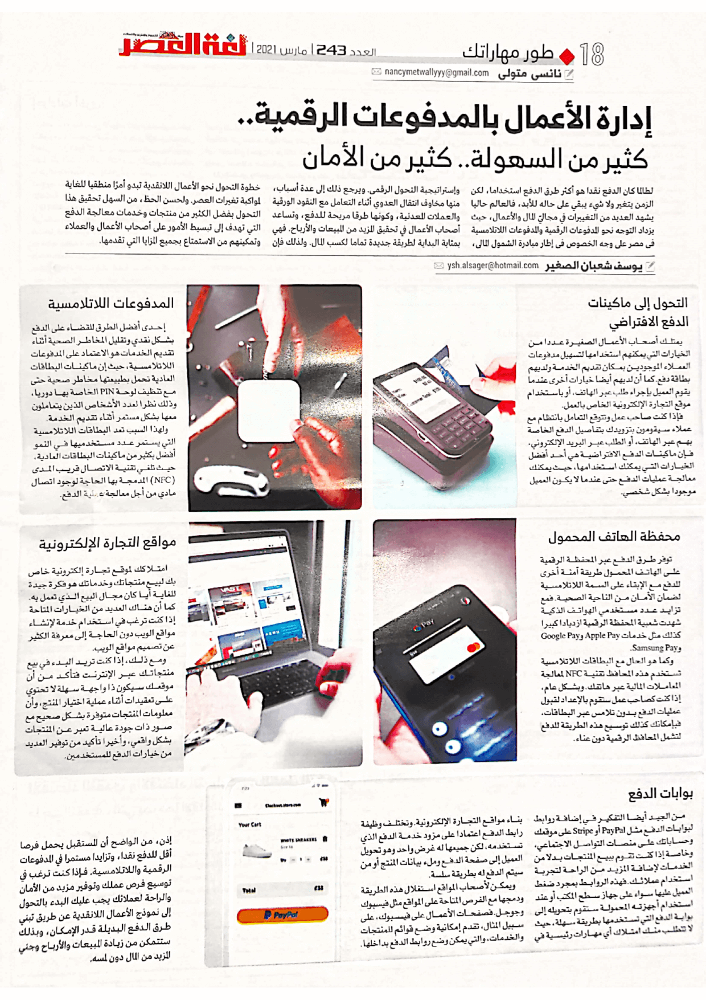

+++
title = "إدارة اﻷعمال بالمدفوعات الرقمية.. كثير من السهولة واﻷمان"
date = "2021-03-01"
description = "لطالما كان الدفع نقدًا هو أكثر طرق الدفع استخدامًا، لكن الزمن يتغير ولا شيء يبقي على حاله للأبد، فالعالم حاليًا يشهد العديد من التغييرات في مجاليّ المال والأعمال، حيث يزداد التوجه نحو المدفوعات الرقمية والمدفوعات اللاتلامسية. ويرجع ذلك إلى عدة أسباب، مثل مخاوف انتقال العدوي أثناء التعامل مع النقود الورقية والعملات المعدنية، وكونها طرق مريحة للدفع، وتساعد أصحاب الأعمال في تحقيق المزيد من المبيعات والأرباح. فهي بمثابة البداية لطريقة جديدة تمامًا لكسب المال. ولذلك فإن خطوة التحول نحو الأعمال اللانقدية بداية من الآن تبدو أمر منطقيًا للغاية لمواكبة تغيرات العصر. ولحسن الحظ، من السهل تحقيق هذا التحول بفضل الكثير من منتجات وخدمات معالجة الدفع التي تهدف إلى تبسيط الأمور على أصحاب الأعمال والعملاء وتمكينهم من الاستمتاع بجميع المزايا التي تقدمها."
categories = ["تقارير",]
tags = ["مجلة لغة العصر"]

+++

لطالما كان الدفع نقدًا هو أكثر طرق الدفع استخدامًا، لكن الزمن يتغير ولا شيء يبقي على حاله للأبد، فالعالم حاليًا يشهد العديد من التغييرات في مجاليّ المال والأعمال، حيث يزداد التوجه نحو المدفوعات الرقمية والمدفوعات اللاتلامسية. ويرجع ذلك إلى عدة أسباب، مثل مخاوف انتقال العدوي أثناء التعامل مع النقود الورقية والعملات المعدنية، وكونها طرق مريحة للدفع، وتساعد أصحاب الأعمال في تحقيق المزيد من المبيعات والأرباح. فهي بمثابة البداية لطريقة جديدة تمامًا لكسب المال. ولذلك فإن خطوة التحول نحو الأعمال اللانقدية بداية من الآن تبدو أمر منطقيًا للغاية لمواكبة تغيرات العصر. ولحسن الحظ، من السهل تحقيق هذا التحول بفضل الكثير من منتجات وخدمات معالجة الدفع التي تهدف إلى تبسيط الأمور على أصحاب الأعمال والعملاء وتمكينهم من الاستمتاع بجميع المزايا التي تقدمها.

## التحول إلى ماكينات الدفع الافتراضية

يمتلك أصحاب الأعمال الصغيرة عددًا من الخيارات التي يمكنهم استخدامها لتسهيل مدفوعات العملاء الموجودين بمكان تقديم الخدمة ولديهم بطاقة دفع. كما أن لديهم أيضًا خيارات أخرى عندما يقوم العميل بإجراء طلب عبر الهاتف، أو باستخدام موقع التجارة الإلكترونية الخاص بالعمل.

فإذا كنت صاحب عمل وتتوقع التعامل بانتظام مع عملاء سيقومون بتزويدك بتفاصيل الدفع الخاصة بهم عبر الهاتف، أو الطلب عبر البريد الإلكتروني، فإن ماكينات الدفع الافتراضية هي أحد أفضل الخيارات التي يمكنك استخدامها، حيث يمكنك معالجة عمليات الدفع حتى عندما لا يكون العميل موجودًا بشكل شخصي.

## المدفوعات اللاتلامسية

إحدى أفضل الطرق للقضاء على الدفع بشكل نقدي وتقليل المخاطر الصحية أثناء تقديم الخدمات هو الاعتماد على المدفوعات اللاتلامسية، حيث إن ماكينات البطاقات العادية تحمل بطبيعتها مخاطر صحية حتى مع تنظيف لوحة PIN الخاصة بها دوريًا وذلك نظرًا لعدد الأشخاص الذين يتعاملون معها بشكل مستمر أثناء تقديم الخدمة.

ولهذا السبب تعد البطاقات اللاتلامسية التي يستمر عدد مستخدميها في النمو أفضل بكثير من ماكينات البطاقات العادية، حيث تلغي تقنية الاتصال قريب المدى (NFC) المدمجة بها الحاجة لوجود اتصال مادي من أجل معالجة عملية الدفع.

## محفظة الهاتف المحمول

توفر طرق الدفع عبر المحفظة الرقمية على الهاتف المحمول طريقة آمنة أخرى للدفع مع الإبقاء على السمة اللاتلامسية لضمان الأمان من الناحية الصحية. فمع تزايد عدد مستخدمي الهواتف الذكية شهدت شعبية المحفظة الرقمية ازديادًا كبيرا كذلك مثل خدمات Apple Pay وGoogle Pay وSamsung Pay.

وكما هو الحال مع البطاقات اللاتلامسية، تستخدم هذه المحافظ تقنية NFC لمعالجة المعاملات المالية عبر هاتفك. وبشكل عام، إذا كنت كصاحب عمل ستقوم بالإعداد لقبول عمليات الدفع بدون تلامس عبر البطاقات، فبإمكانك كذلك توسيع هذه الطريقة للدفع لتشمل المحافظ الرقمية دون عناء.

## مواقع التجارة الإلكترونية

امتلاكك لموقع تجارة إلكترونية خاص بك لبيع منتجاتك وخدماتك هو فكرة جيدة للغاية أيًا مجال البيع الذي تعمل به. كما أن هناك العديد من الخيارات المتاحة إذا كنت ترغب في استخدام خدمة لإنشاء مواقع الويب دون الحاجة إلى معرفة الكثير عن تصميم مواقع الويب.

ومع ذلك، إذا كنت تريد البدء في بيع منتجاتك عبر الإنترنت فتأكد من أن موقعك سيكون ذو واجهة سهلة لا تحتوي على تعقيدات أثناء عملية اختيار المنتج، وأن معلومات المنتجات متوفرة بشكل صحيح مع صور ذات جودة عالية تعبر عن المنتجات بشكل واقعي، وأخيرا تأكيد من توفير العديد من خيارات الدفع للمستخدمين.

## بوابات الدفع

من الجيد أيضًا التفكير في إضافة روابط لبوابات الدفع مثل PayPal وStripe على موقعك وحساباتك على منصات التواصل الاجتماعي، وخاصة إذا كنت تقوم ببيع المنتجات بدلًا من الخدمات لإضافة المزيد من الراحة لتجربة استخدام عملائك. فهذه الروابط بمجرد ضغط العميل عليها سواء على جهاز سطح المكتب أو عند استخدام أجهزته المحمولة ستقوم بتحويله إلى بوابة الدفع التي تستخدمها بطريقة سهلة، حيث لا تتطلب منك امتلاك أي مهارات رئيسية في بناء مواقع التجارة الإلكترونية. وتختلف وظيفة رابط الدفع اعتمادًا على مزود خدمة الدفع الذي تستخدمه، لكن جميعها له غرض واحد وهو تحويل العميل إلى صفحة الدفع وملء بيانات المنتج أو من سيتم الدفع له بطريقة سلسلة.

ويمكن لأصحاب المواقع استغلال هذه الطريقة ودمجها مع الفرص المتاحة على المواقع مثل الفيس بوك وجوجل. فصفحات الأعمال على الفيس بوك، على سبيل المثال تقدم إمكانية وضع قوائم للمنتجات والخدمات، والتي يمكن وضع روابط الدفع بداخلها.

## خاتمة

إذن، من الواضح أن المستقبل يحمل فرصًا أقل للدفع نقدًا، وتزايدا مستمرا في المدفوعات الرقمية واللاتلامسية. فإذا كنت ترغب في توسيع فرص عملك وتوفير مزيد من الأمان والراحة لعملائك يجب عليك البدء بالتحول إلى نموذج الأعمال اللا نقدية عن طريق تبني طرق الدفع البديلة قدر الإمكان، وبذلك ستتمكن من زيادة المبيعات والأرباح وجني المزيد من المال دون لمسه.

---

هذا الموضوع نُشر باﻷصل في مجلة لغة العصر العدد 243 شهر 03-2021 ويمكن الإطلاع عليه [هنا](https://drive.google.com/file/d/1TgLMN-xxxN60ASG7Vqyr8ZZltasb_oM_/view?usp=sharing) أو [هنا](https://gate.ahram.org.eg/News/2692168.aspx).

