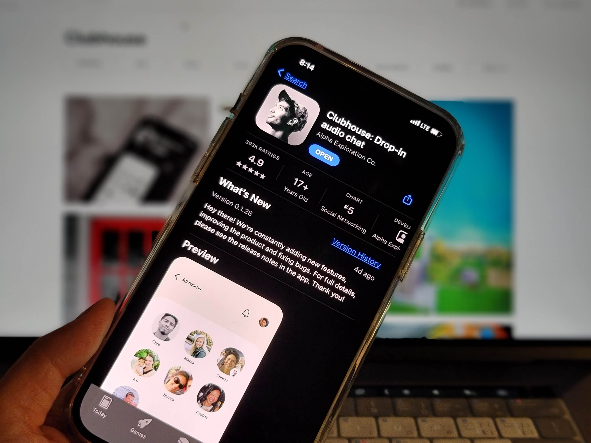
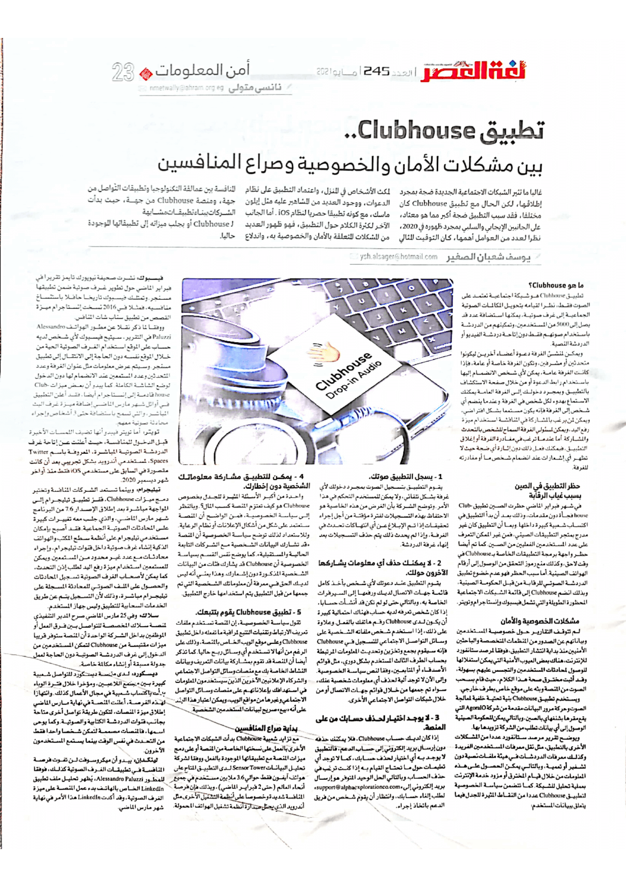

+++
title = "تطبيق Clubhouse.. بين مشاكل الأمان والخصوصية وصراع المنافسين"
date = "2021-05-01"
description = "غالبا لا تثير الشبكات الاجتماعية الجديدة ضجة بمجرد إطلاقها، لكن تطبيق Clubhouse مختلف. فقد سبب التطبيق ضجة كبيرة على الجانبين الإيجابي والسلبي بمجرد ظهوره في 2020 والذي كان توقيتًا مثاليًا لوجود أكثر الأشخاص في المنزل، وبسبب اعتماد التطبيق على نظام الدعوات، وتواجد العديد من المشاهير عليه مثل إيلون ماسك، وكونه تطبيقًا حصريًا لنظام iOS فقد جلب مزيدًا من الاهتمام نحوه. أما الجانب الآخر لكثره الكلام حول التطبيق فهو ظهور العديد من المشاكل المتعلقة بالأمان والخصوصية به، واندلاع المنافسة بين عمالقة التكنولوجيا وتطبيقات التواصل من جهة، ومنصة Clubhouse من جهة، حيث بدأت الشركات ببناء تطبيقات مشابهة ل Clubhouse أو بجلب ميزاته إلى تطبيقاتها الموجودة حاليا."
categories = ["تقارير",]
tags = ["مجلة لغة العصر"]

+++
غالبا لا تثير الشبكات الاجتماعية الجديدة ضجة بمجرد إطلاقها، لكن تطبيق Clubhouse مختلف. فقد سبب التطبيق ضجة كبيرة على الجانبين الإيجابي والسلبي بمجرد ظهوره في 2020 والذي كان توقيتًا مثاليًا لوجود أكثر الأشخاص في المنزل، وبسبب اعتماد التطبيق على نظام الدعوات، وتواجد العديد من المشاهير عليه مثل إيلون ماسك، وكونه تطبيقًا حصريًا لنظام iOS فقد جلب مزيدًا من الاهتمام نحوه. أما الجانب الآخر لكثره الكلام حول التطبيق فهو ظهور العديد من المشاكل المتعلقة بالأمان والخصوصية به، واندلاع المنافسة بين عمالقة التكنولوجيا وتطبيقات التواصل من جهة، ومنصة Clubhouse من جهة، حيث بدأت الشركات ببناء تطبيقات مشابهة ل Clubhouse أو بجلب ميزاته إلى تطبيقاتها الموجودة حاليا.

## ما هو Clubhouse؟

تطبيق Clubhouse هو شبكة اجتماعية تعتمد على الصوت فقط، فهو يحول المكالمات الصوتية الجماعية إلى غرف صوتية يمكنها استضافة عدد يصل إلى 5000 من المستخدمين وتمكينهم من الدردشة باستخدام صوتهم فقط دون إتاحة دردشة الفيديو أو الدردشة النصية.

ويمكن لمنشئ الغرفة دعوة أعضاء آخرين ليكونوا متحدثين أو مشرفين، ويمكن أن تكون الغرفة خاصة أو عامة، فإذا كانت الغرفة عامة، يمكن لأي شخص الانضمام إليها باستخدام رابط الدعوة أو من خلال صفحة الاستكشاف بالتطبيق. وبمجرد دخولك إلى الغرفة العامة، يمكنك الاستماع بهدوء لكل شخص في الغرفة. وعندما ينضم أي شخص إلى الغرفة فإنه يكون مستمعًا بشكل افتراضي، ويمكن لمن يرغب بالمشاركة في المناقشة استخدام ميزة رفع اليد، ويمكن لمسؤولي الغرفة السماح للشخص بالتحدث والمشاركة. أما عندما ترغب في مغادرة الغرفة أو إغلاق التطبيق، فيمكنك فعل ذلك دون إثارة أي ضجة حيث لا تظهر أي إشعارات عند انضمام شخص ما أو مغادرته للغرفة.

## حظر التطبيق في الصين بسبب غياب الرقابة

وفي شهر فبراير الماضي حظرت الصين تطبيق Clubhouse فجأة دون مقدمات، وذلك بعد أن بدأ التطبيق في اكتساب شعبية كبيرة داخل الصين. وبما أن التطبيق كان غير مدرج بمتجر التطبيقات الصيني، فمن غير الممكن التعرف على عدد المستخدمين الفعليين من الصين. كما تم أيضا حظر واجهة برمجة التطبيقات الخاصة ب Clubhouse في وقت لاحق وكذلك منع رموز التحقق من الوصول إلى أرقام الهواتف الصينية. أما سبب الحظر فهو عدم خضوع تطبيق الدردشة الصوتي للرقابة من قبل الحكومة الصينية، وبذلك انضم Clubhouse إلى قائمة الشبكات الاجتماعية المحظورة الطويلة والتي تشمل فيسبوك وإنستاجرام وتويتر.

## مشاكل الخصوصية والأمان

لم تتوقف التقارير حول خصوصية المستخدمين وبياناتهم عن الصدور من المنظمات المتخصصة والباحثين الأمنيين منذ بداية انتشار التطبيق. فوفقًا لمرصد ستانفورد للإنترنت، هناك بعض العيوب الأمنية التي يمكن استغلالها للوصول لمحادثات المستخدمين والتجسس عليهم بسهولة، وقد أثبت مخترق صحة هذا الكلام حيث قام بسحب الصوت من المنصة وبثه على موقع خاص بطرف خارجي.

ويستخدم تطبيق Clubhouse بنية تحتية خلفية لمعالجة الصوت وحركة مرور البيانات مقدمة من شركة AgoraIO التي يقع مقرها بشنغهاي بالصين، وبالتالي يمكن للحكومة الصينية الوصول إلى أي بيانات تطلب من الشركة تزويدها بها.

ويوضح تقرير مرصد ستانفورد عددًا من المشاكل الأخرى بالتطبيق، مثل نقل معرفات المستخدمين الفريدة وكذلك معرفات الدردشات في هيئة ملفات نصية دون تشفير أو تعمية، وبالتالي يمكن الحصول على هذه المعلومات من خلال قيام المخترق أو مزود خدمة الإنترنت بعملية تحليل للشبكة.

كما تتضمن سياسة الخصوصية لتطبيق Clubhouse عددًا من النقاط المثيرة للجدل فيما يتعلق ببيانات المستخدم

1. ### يسجل التطبيق صوتك.

   يقوم التطبيق بتسجيل الصوت بمجرد دخولك لأي غرفة بشكل تلقائي، ولا يمكن للمستخدم التحكم في هذا الأمر. وتوضح الشركة بأن الغرض من هذه الخاصية هو الاحتفاظ بهذه التسجيلات لفترة مؤقتة من أجل إجراء تحقيقات إذا تم الإبلاغ عن أي انتهاكات تحدث في الغرفة، وإذا لم يحدث ذلك يتم حذف التسجيلات بعد إنهاء غرفة الدردشة.

2. ### لا يمكنك حذف أي معلومات يشاركها الآخرين حولك.

   يقوم التطبيق عند دعوتك لأي شخص بأخذ كامل قائمة جهات الاتصال لديك ورفعها إلى السيرفرات الخاصة به، وبالتالي، حتى لو لم تكن قد أنشأت حسابًا، إذا كان شخص تعرفه لديه حساب فهناك احتماليه كبيرة أن يكون لدى Clubhouse رقم هاتفك بالفعل. وعلاوة على ذلك، إذا استخدم شخص ملفاته الشخصية على وسائل التواصل الاجتماعي للتسجيل في Clubhouse فإنه سيقوم بجمع وتخزين وتحديث المعلومات المرتبطة بحساب الطرف الثالث المستخدم بشكل دوري، مثل قوائم الأصدقاء أو المتابعين، وفقًا لنص سياسة الخصوصية. وإلى الآن لا توجد آلية لحذف أي معلومات شخصية عنك، سواء تم جمعها من خلال قوائم جهات الاتصال أو من خلال شبكات التواصل الاجتماعي الأخرى.

3. ### لا يوجد اختيار لحذف حسابك من على المنصة.

   إذا كان لديك حساب Clubhouse، فلا يمكنك حذفه دون إرسال بريد إلكتروني إلى حساب الدعم، فالتطبيق لا يوجد به أي اختيار لحذف حسابك، كما لا توجد أي تعليمات حول ما تحتاج للقيام به إذا كنت ترغب في حذف الحساب. وبالتالي الحل الوحيد المتوفر هو إرسال بريد إلكتروني إلى "support@alphaexplorationco.com" لطلب إلغاء حسابك، وانتظار أن يقوم شخص من فريق الدعم باتخاذ إجراء.

4. ### يمكن للتطبيق مشاركة معلوماتك الشخصية دون إخطارك.

   واحدة من أكبر الأسئلة المثيرة للجدل بخصوص Clubhouse هو كيف تعتزم المنصة كسب المال. وبالنظر إلى سياسة الخصوصية، فمن الواضح أن المنصة ستعتمد على شكل من أشكال الإعلانات أو نظام الرعاية. وللاستعداد لذلك توضح سياسة الخصوصية أن المنصة "قد تشارك البيانات الشخصية مع الشركات التابعة الحالية والمستقبلية". كما يوضح نفس القسم بسياسة الخصوصية أن Clubhouse قد يشارك فئات من البيانات الشخصية المذكورة دون إشعارك. وهذا يعني أنه ليس لديك الحق في معرفة أن معلوماتك الشخصية التي تم جمعها من قبل التطبيق يتم استخدامها خارج التطبيق.

5. ### تطبيق Clubhouse يقوم بتتبعك.

   تقول سياسة الخصوصية أن المنصة تستخدم ملفات تعريف الارتباط وتقنيات التتبع لمراقبة ما تفعله داخل تطبيق Clubhouse وعلى موقع الويب الخاص بالمنصة، وذلك على الرغم من أنها لا تستخدم أي وسائل ربح حاليًا. كما تذكر أيضًا أن المنصة قد تقوم بمشاركة بيانات التعريف وبيانات النشاط الخاصة بك مع منصات وسائل التواصل الاجتماعي والشركاء الإعلانيين الآخرين الذين سيستخدمون المعلومات في استهدافك بإعلاناتهم على منصات وسائل التواصل الاجتماعي وغيرها من مواقع الويب، ويمكن اعتبار هذا البند على أنه "بيع" صريح لبيانات المستخدمين الشخصية.

## بداية صراع المنافسين

مع تزايد شعبية Clubhouse بدأت الشبكات الاجتماعية الأخرى بالعمل على نسختها الخاصة من المنصة أو على دمج ميزات المنصة مع تطبيقاتها الموجودة بالفعل. ووفقًا لشركة تحليل البيانات Sensor Tower لدى التطبيق المتاح على هواتف آيفون فقط حوالي 3.6 ملايين مستخدم في جميع أنحاء العالم (حتى 2 فبراير الماضي)، وبذلك فإن فرصة المنافسة شديدة وخصوصًا على أنظمة التشغيل الأخرى مثل أندرويد الذي يحتل صدارة أنظمة تشغيل الهواتف المحمولة.

### فيسبوك

نشرت صحيفة نيويورك تايمز تقريرًا في فبراير الماضي حول تطوير غرف صوتية ضمن تطبيقها ماسنجر. وتمتلك فيسبوك تاريخًا حافلًا باستنساخ منافسيه، فمثلا في 2016 نسخت إنستاجرام ميزة القصص من تطبيق سناب شات المنافس.

ووفقًا لما ذكر نقلاً عن مطور الهواتف Alessandro Paluzzi في التقرير، سيتيح الفيسبوك لأي شخص لديه حساب على الموقع استخدام الغرف الصوتية الحية من خلال الموقع نفسه دون الحاجة إلى الانتقال إلى تطبيق ماسنجر. وسيتم عرض معلومات مثل عنوان الغرفة وعدد المتحدثين وعدد المستمعين عند الانضمام لها دون الدخول لوضع الشاشة الكاملة.

كما يبدو أن بعض ميزات Clubhouse قادمة إلى إنستاجرام أيضًا، فقد أعلن التطبيق في أوائل شهر مارس الماضي إضافة ميزة غرف البث المباشر، والتي تسمح باستضافة حتى 3 أشخاص وإجراء محادثة صوتية معهم.

### تويتر

أما تويتر فيبدو أنها تضيف اللمسات الأخيرة قبل الدخول للمنافسة، حيث أعلنت عن إتاحة غرف الدردشة الصوتية المباشرة، المعروفة باسم Twitter Spaces، لمستخدمي أندرويد بشكل تجريبي بعد أن كانت مقصورة في السابق على مستخدمي iOS فقط منذ أواخر شهر ديسمبر 2020.

### تيليجرام

وبينما تستعد الشركات المنافسة وتختبر دمج ميزات Clubhouse، قفز تطبيق تيليجرام إلى المواجهة مباشرة بعد إطلاق الإصدار 7.6 من البرنامج شهر مارس الماضي والذي جلب معه تغييرات كبيرة على المحادثات الصوتية الجماعية. فقد أصبح بإمكان مستخدمي تيليجرام على أنظمة سطح المكتب والهواتف الذكية إنشاء غرف صوتية داخل قنوات تيليجرام، وإجراء محادثات مع عدد غير محدود من المستمعين. ويمكن للمستمعين استخدام ميزة رفع اليد لطلب إذن التحدث، كما يمكن لأصحاب الغرف الصوتية تسجيل المحادثات والحصول على الملف الصوتي للمحادثة المسجلة على تيليجرام مباشرة وذلك لأن التسجيل يتم عن طريق الخدمات السحابية للتطبيق وليس جهاز المستخدم.

### سلاك

وفي 25 مارس الماضي صرح المدير التنفيذي لمنصة سلاك المخصصة للتواصل بين فرق العمل أو الموظفين بداخل الشركة الواحدة أن المنصة ستوفر قريبًا ميزات مقتبسة من Clubhouse لتمكن المستخدمين من الدخول إلى غرف الدردشة الصوتية دون الحاجة لعمل جدولة مسبقة أو إنشاء مكالمة خاصة.

### ديسكود

لدى منصة ديسكورد للتواصل شعبية كبيرة بين مجتمع اللاعبين، ومؤخرًا خلال فترة الوباء بدأت باكتساب شعبية في مجال الأعمال كذلك. وانتهازا لهذه الفرصة، أعلنت المنصة في نهاية مارس الماضي إطلاق ميزة المنصات، لتكون طريقة تواصل أخرى متاحة بجانب قنوات الدردشة الكتابية والصوتية. وكما يوحى اسمها، فالمنصات مصممة لتمكن شخص واحد فقط من التحدث في نفس الوقت بينما يستمع المستخدمون الآخرون.

### لينكد إن

يبدو أن مايكروسوفت لن تفوت فرصة المنافسة في تطبيقات الغرف الصوتية كذلك. فوفقًا للمطور Alessandro Paluzzi، يُظهر تحليل ملف تطبيق LinkedIn الخاص بالهاتف بدء عمل المنصة على ميزة الغرف الصوتية، وقد أكدت LinkedIn هذا الأمر في نهاية شهر مارس الماضي.

---

هذا الموضوع نُشر باﻷصل في مجلة لغة العصر العدد 245 شهر 05-2021 ويمكن الإطلاع عليه [هنا](https://drive.google.com/file/d/1bC5SA5HsT9uT2dV1xABtJpMGRzB44Fr7/view?usp=sharing) أو [هنا](https://gate.ahram.org.eg/News/2802513.aspx).

