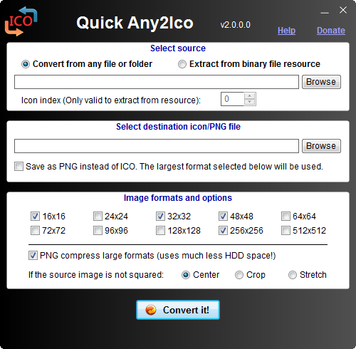
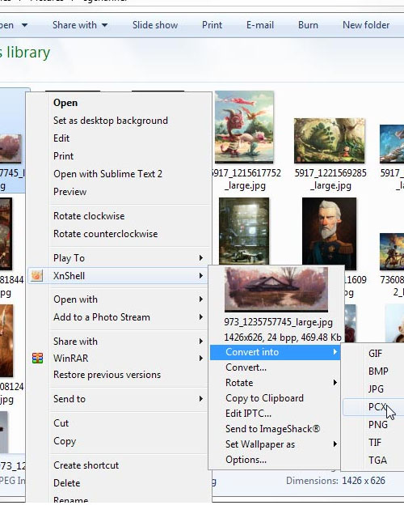

+++
title = "أفضل طرق تحويل الصور لأيقونات"
date = "2015-03-27"
description = "قد نحتاج في بعض الأحيان إلى انشاء أيقونات خاصة بنا، أو نرغب في تحويل صورنا الى أيقونات، بالطبع تتعدد الطرق وتختلف البرامج المستخدمة، لذا حاولت عزيزي القارئ أن أقدم الملخص لأفضل طرق تحويل الصور لأيقونات"
categories = ["مهارات رقمية",]
tags = ["موقع لغة العصر"]
images = ["images/2015-635630855493938316-393.png"]

+++

قد نحتاج في بعض الأحيان الى انشاء أيقونات خاصة بنا، أو نرغب في تحويل صورنا الى أيقونات، بالطبع تتعدد الطرق وتختلف البرامج المستخدمة، لذا حاولت عزيزي القارئ أن أقدم الملخص لأفضل طرق صور لأيقونات.

## أولا: عن طريق برنامج Quick Any2Ico

هو برنامج صغير وسهل الاستخدام فضلا أنه لا يحتاج إلى التثبيت، سوف يفيدك كثيرا كلما احتجت إلى تحويل صورك الخاصة إلى أيقونات، ويسمح لك بالحصول على الصور الموجودة داخل البرامج والألعاب.

قم بتحميل البرنامج من [موقعه الرسمي من هنا](http://www.carifred.com/quick_any2ico/).

قم باختيار الايقونة من Select destination icon ثم حدد الدقة التي تريدها واضغط Convert It.

## ثانيا: عن طريق زر الفأرة الأيمن وبرنامج XnShellEx:

هو برنامج صغير الحجم كبير الإمكانيات مصمم خصيصا لعرض أي نوع من الصور وتحويل صيغ الصور المختلفة، كما يسمح بتحرير الصور (اقتصاص، التناوب، وإعادة تلوين، الخ) وكل هذا عن طريق القائمة الخاصة به التي تستطيع الوصول اليها من قائمة زر الفأرة الأيمن بعد تثبيت البرنامج.

قم بتحميل البرنامج من [موقعه الرسمي من هنا](http://www.xnview.com/en/xnshell/).

قم بالضغط بزر الفأرة الأيمن على الصورة المراد تحويلها، قف على قائمة البرنامج، اختر Convert قم باختيار الصيغة التي تود التحويل اليها (.ico) ثم اختر Convert.

## ثالثا: عن طريق خدمات تحويل الصيغ على الانترنت:

توجد العديد من المواقع التي تقدم لك خدمة تحويل الصور الى أيقونات، ولك أقدم لك أفضلها.

1. موقع [online-convert.com](http://image.online-convert.com/convert-to-ico).
2. موقع [icoconverter](http://www.icoconverter.com/).
3. موقع [icoconvert.com](http://icoconvert.com/).
4. موقع [convertico.com](http://convertico.com/).

---
هذا الموضوع نٌشر باﻷصل على موقع مجلة لغة العصر.

http://aitmag.ahram.org.eg/News/8205.aspx